# Rappel à propos d'android studio
Android studio est un framework qui permet le développement d'application Android aussi bien pour mobile, tv ou encore montre connectées.

Android permet d'émuler ou de brancher un telephone android pour pouvoir tester en temps réel notre application.

Chaque application android est un processus linux unique qui peut posséder plusieurs composants.
> Un process linux est un simple programme qui tourne sur l'OS. Pensez au processus du gestionnaire de taches Windows, c'est la même logique.

Un composants est un bloc d'une application android, il en existent 4 types : 
- Activity, une page de notre application.
- Service, la logique non-UI de notre application.
- BroadcastReceiver 
- ???

La spécificité des applications Android c'est leurs capacité à rendre accessible leurs composants aux autres applications android présente sur le téléphone.
Pensez par exemple au partage d'une vidéo sur l'application youtube par mail qui ouvre une fenetre *Ouvrir avec*.

Si l'utlisateur à l'intention d'envoyer un mail depuis une application le systeme endroit va rechercher des applications qui sont capable de repondre à cette intention. On appel cette méchanique les ***intents*** (intention).

Un exemple basique d'intention c'est l'intention LAUNCHER que l'utilisteur provoque lorsqu'il touche l'icone d'une application. Nous allons pouvoir définir une activiy à lancez lorsque cette intention se produit. C'est comme ça que l'on défini d'ailleurs le point d'entrée d'une application android.

## Un application android au minimum c'est quoi ?
Au minimum une application android c'est un processus linux qui a pris une Activity comme point de démarrage.

Pour créer une application Android il faut donc :
1. Créer un projet vide avec Android studi
2. Créer une activity vierge
3. Définir cette activité comme point de démarrage de notre application.

## Créer un projet android vierge
### Nouveau projet
Dans android studio on peut choisir le layout *No activity* qui permet d'avoir un projet vide sans ancune activity.
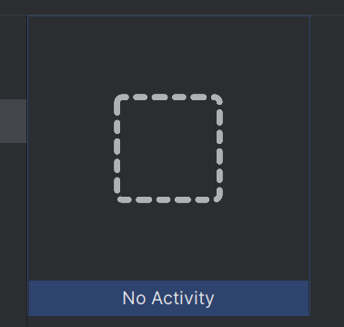
> Vous pouvez également prendre un layout déjà établit pour partir d'un sequelette d'application plus avancez.

Donnez un nom à votre application
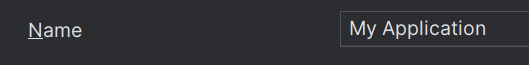
Définissez le langage de programmation utilisez
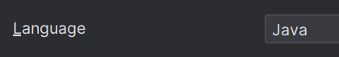
Ainsi que le builder
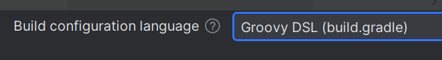
### Interface d'android studio
Une fois le projet crée vous arrivez sur l'interface d'android studio.

Vous y trouvez vos fichiers :
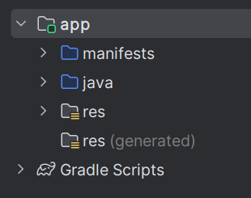
- manifests, défini les activity du projets (les pages)
- java, contient le code source de nos composants (activity et autres).
- res, contiendra les vues xml de nos activity.

### Démarrer l'application
Si vous cliquez sur play l'application va tentez de démarrer et un message d'erreur apparaitera.

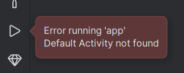
*Error running 'app'. Default activity not found*
Cela veut simplement dire que notre application n'à pas sur quelle activity lancer au démarrage. Et c'est bien normal notre projet n'en contient aucune.

### Créer une activity
Les activity se trouvent dans le package principale de votre application.
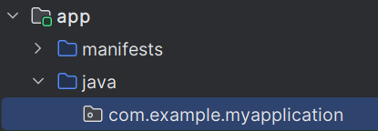
Pour créer une activity il suffit d'effectuer un clic droit sur le package et selectionner *Empty View Activity*.
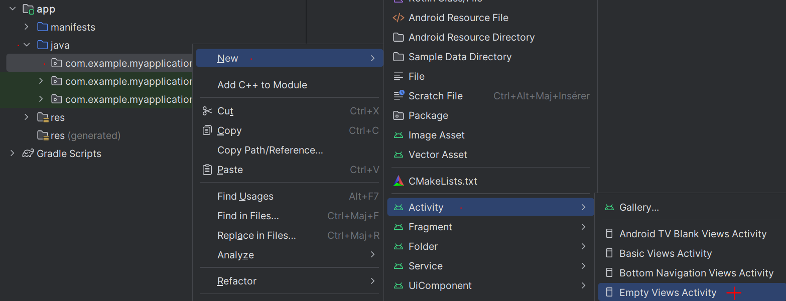

Si je lance à nouveau mon application.
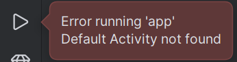
Je reçois toujours la même erreur.
Une activity a bien été crée mais elle na jamais été définir comme point d'entrée de l'application.

### Définir l'activity comme point d'entrée de l'application.

Pour définir l'activity comme point d'entrée de l'application il faut modifier le ficheir manifest.xml.

1. Définir un intent-filter qui va écouter la catégorie d'intention LAUNCHER, c'est à dire l'intention du client de lancer notre application.
2. Ensuite définir une action MAIN dans cette intent-filter qui défini l'activity nouvellement crée comme le point d'entrée de l'application.

> Une fois le point d'entrée défini l'OS Android va pouvoir crée un nouveau processus linux et ainsi lancer notre appli.

#### intent-filter
Dans manifest.xml vous devrier avoir quelque chose comme ceci :
```xml
<?xml version="1.0" encoding="utf-8"?>
<manifest xmlns:android="http://schemas.android.com/apk/res/android"
    xmlns:tools="http://schemas.android.com/tools">

    <application
        android:allowBackup="true"
        android:dataExtractionRules="@xml/data_extraction_rules"
        android:fullBackupContent="@xml/backup_rules"
        android:icon="@mipmap/ic_launcher"
        android:label="@string/app_name"
        android:roundIcon="@mipmap/ic_launcher_round"
        android:supportsRtl="true"
        android:theme="@style/Theme.MyApplication"
        tools:targetApi="31">
        <activity
            android:name=".MainActivity"
            android:exported="false" />
    </application>

</manifest>
```
On peut voir que dans la balise application se trouve une balise activity.
C'est dans cette balise activity que l'on va pouvoir ajouter un intent-filter et ainsi définir le point d'entrée de l'application.

1. Ouvrez la balise activity et exportez l'activity pour quelle soit visible de l'OS.
```xml
<activity
            android:name=".MainActivity"
            android:exported="true"
            >

</activity>
```
2. Dans la balise activity ajouter un intent-filter qui va filter les intentions system qui permettent de lancer cette activity.
```xml
<activity
            android:name=".MainActivity"
            android:exported="true"
            >
            <intent-filter>
                <category android:name="android.intent.category.LAUNCHER" />
                <action android:name="android.intent.action.MAIN" />
            </intent-filter>
        </activity>
```
la balise category permet de définir à quelle intention correspond l'activity. LAUNCHER correspond à l'intention de lancer l'application (touche sur l'icone de l'appli).
```xml
<category android:name="android.intent.category.LAUNCHER" />
```
La balise action défini l'action à executer. ACTION_MAIN permet de lancer une nouvelle appli avec comme point d'entrée l'activity.
```xml
<action android:name="android.intent.action.MAIN" />
```

#### Lancement de l'application.
Voilà maintenant que :
- Une activity est crée
- Qu'un intent-filter défini l'activity comme point d'entrée

L'application va enfin démarrer.
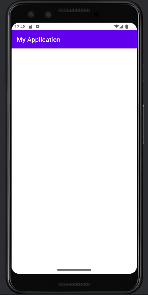

## Ajouter un élément d'UI et le remplir avec un variable
### TextView


### get TextView by id

### view.setValue()

## Effectuer une requete HTTP sur un back-end
### Effectuer une requete http
Il y a plusieurs manière d'effectuer une requete Http en Java.
Celle que je vous propose consiste à :
1. Créer une objet HttpURLConnection a partir d'un objet URL
2. Recupérer la réponse sous la d'un flux de donnée binaire (InputStream)
3. Transformer ce stream en objet Java grâce au package Jackson.

Nous allons placer nos requêtes dans une classe séparée, ce n'est pas obligatoire mais ça permet de voir clair dans notre code et éviter la duplication de code.

## Créer la class Api
Pour créer une nouveau class Java il suffit de faire un clic droit sur le package de notre activity et créer une nouvelle classe.
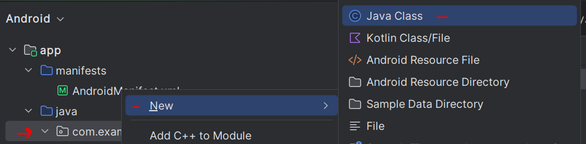

> Attention, si vous ne créez pas la classe dans le même package que l'Activity, elle lui sera inaccesible. En effet deux classes Java sont accessible l'une de l'autre lorsqu'elle se trouve dans le même package.

La classe Api devrait ressemblez à ça :
```java
package com.example.myapplication;

public class Api {
}
```

Chaque route de l'api corre

## Créer une requete HTTP avec HttpURLConnection
```java
URL url = new URL("https://pokebuildapi.fr/api/v1/pokemon/pikachu");
HttpURLConnection connection = (HttpURLConnection) url.openConnection();
```
- La classe URL prend en paramètre une string, notre url.
- l'url peut ensuite ouvrir une connexion et renvoyer un objet HttpURLConnection. Le compilateur Java à besoin que l'on transtype la valeur de retour de url.openConnection() en un objet de la classe HttpURLConnection.

Une requete est donc créer, **mais la requete n'est pas encore envoyée** sur le réseau.

## Envoyer la requete et récupérer la réponse.
```java
InputStream responseStream = connection.getInputStream();
```
La méthode getInputStream() renvoi un flux de donnée binaire, aussi appelé *Stream*.
Ces données sont en binaire et accessible via la méthode `responseStream.read()`.

Il est possible de lire les données binaire et de les convertir en string octet après octet mais cette opération est plutot fastidieuse.
Nous allons plutôt utiliser un bibliotèque Java pour faire ça à notre place.

## Récupérer le body sous la forme d'un objet Java
L'api renvoi une string JSON qui est pour le moment sous la forme de flux binaire dans la variable ``responseStream`. Il nous faut un moyen de lire le `responseStream` en tant que JSON et de le transformer en Objet Java.

Pour ceci nous allons avoir besoin d'une classe qui acceuillera l'objet renvoyé par l'api.
### La classe Pokemon pour le body
Cette API renvoi un Pokemon, créons donc une classe nommée Pokemon.
```java
public class Pokemon {
    public String name;
    public int id;
}
```
> Attention vérifiez bien que les attributs public de cette classe soient correctement orthographiés par rapport au résultat JSON de l'API.

> Attention cette classe doit être dans le même package java que la classe ApiFacade et MainActivity.

### Instancier un Pokemon a partir de responseStream
```java
// Créer un mapper Jackson pour mapper un flux et une classe
ObjectMapper mapper = new ObjectMapper();
// Ignorer les champs inconnu de l'objet JSON, seul id et name nous intéressent.
mapper.configure(DeserializationFeature.FAIL_ON_UNKNOWN_PROPERTIES, false);

// Transforme le stream en instance de la classe Pokemon
Pokemon pokemon = mapper.readValue(responseStream, Pokemon.class);
```

> Pour accomplir ce miracle jackson va effectuer se que l'on appelle en Java une reflexion. C'est à dire qu'il va lire les attributs de la classe et les remplir si il correspondent à un attribut de l'objet de l'objet JSON.

Voilà ! On à maintenant un beau pokemon !
On peut donc le return dans notre méthode.

```java
public static Pokemon getPokemon(String name){
        try {
            // Making a Http Request
            URL url = new URL("https://pokebuildapi.fr/api/v1/pokemon/"+name);
            HttpURLConnection connection = (HttpURLConnection) url.openConnection();
            InputStream responseStream = connection.getInputStream();

            // Transform binary body to Pokemon class with Jackson
            ObjectMapper mapper = new ObjectMapper();
            mapper.configure(DeserializationFeature.FAIL_ON_UNKNOWN_PROPERTIES, false);

            Pokemon pokemon = mapper.readValue(responseStream, Pokemon.class);

            return pokemon;
        } catch (IOException e) {
            throw new RuntimeException(e);
        }
    }
```

### Le multi-threading

```java

new Thread(()->{
    Pokemon.getPokemon("Pikachu")
}).start()
```

### L'encapsulation dans une class Facade.