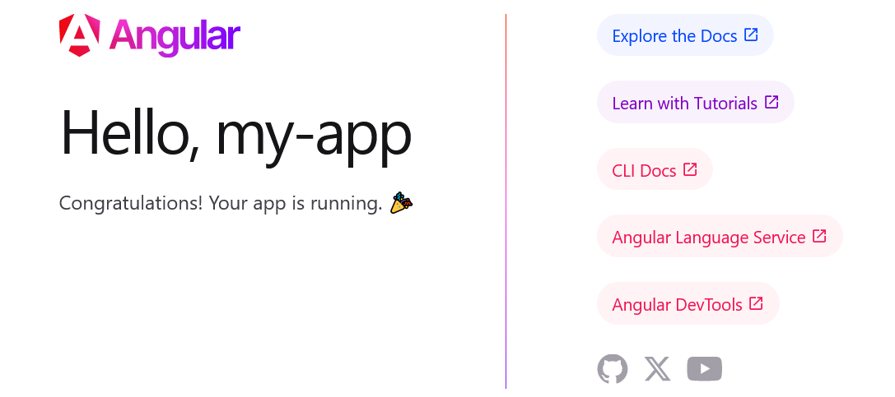
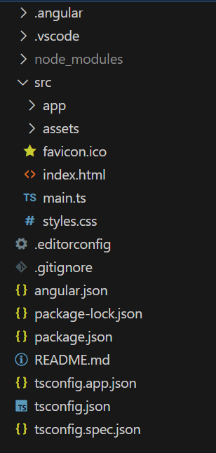
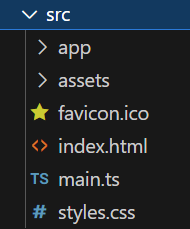
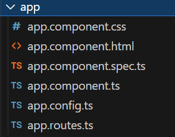
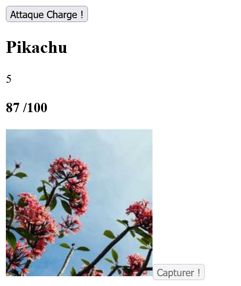
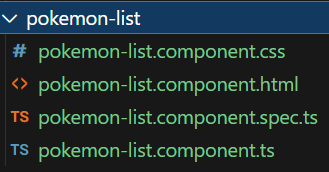
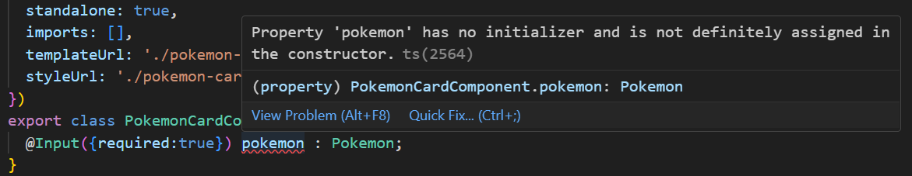
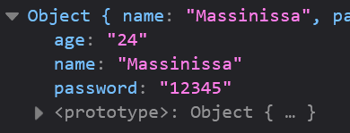
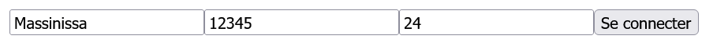

# Introduction à Angular

## Qu'est ce que RestFul ?

RestFul est une architecture d'application web qui consiste en un siteweb front-end communiquant avec une ou plusieurs API Rest (Representational state transfer) via le protocole HTTP. Le plus souvent les données sont échangés en JSON.

## Une API Rest ?
Une Api REST est un serveur web sans êtat (stateless). C'est à dire qu'à l'inverse d'un serveur web classique, l'api rest ne retient aucune données lors des requêtes : ni cookies, ni session, rien.

Cela permet a l'api d'être utilisable dès la première requête par n'importe quelle programme ayant la capacité d'effectuer des requêtes HTTP. REST permet de garantir que pour une même requête on reçoit toujours une même réponse.

Une API RESTful trouve sa puissance par sa capacité à se connecter à une nombres "infini" de front-end : site web, application web SPA, app mobile, montre, télévision.

***Vous créer une API REST qui expose des ressources via des url HTTP et un client HTTP les récupère via une requête HTTP.***

> Une api rest n'à donc pas conscience du nombre d'utilisateur qui la consommes.

## Application web moderne, les Single Page Application (SPA)
L'époque des sites web classique composés de plusieurs pages et de quelques fonctionnalités codez en PHP est révolue. Les applications modernes tendent à reproduire les interfaces des clients lourds *Desktop* dans un navigateur web. Les sites modernes d'aujourd'hui ne sont donc plus vraiment des *sites internet* mais des *applications web*.

Le client d'une architecture RESTFul est une application web entièrement codée en JavaScript qui consomme une où plusieurs API REST via des requêtes Ajax.

> *Asyncronous JavaScript and XML* ou *AJAX* est une méthode de programmation qui consiste a effecuter des requetes HTTP en JavaScript dans le navigateur. 
> Pendant longtemps le format de référence de l'ajax était le XML et la classe `XMLHttpRequest` permettait d'effectuer des requêtes HTTP en JavaScript. 
>
> Malgré sont nom, aujourd'hui AJAX envoi plutot du JSON et la méthode `window.fetch()` est venu remplacer `XMLHttpRequest` grâce à sa syntaxe moderne basé sur les `Promise`.

De nombreux frameworks permettent de créer des SPA, parmit les plus connus on retrouve :
- Angular, le framework du jour :). Développez par Google.
- Vue.js, un framework basé sur les web components. Développez par Evan You.
- Next.js développé par Vercel, une surcouche de la bibliotèque d'UI React (Facebook).

## Angular, pourquoi ?
Angular permet de résoudre une problématique classique du développement front-end de SPA : la mise à jour de l'affichage en fonction des données (variables) JavaScript.
### La fin de `window.document` ...
Habituellement la mise à jour de l'affichage se fait via le jeu de méthodes du DOM : `createElement`, `addEventListener`, `querySelector`, etc.

*Avec Angular plus besoin de tout ça : je déclare une variable et je l'affiche. Si la variable change l'affichage se mettera à jour **automatiquement**.*

On peut donc oublier l'api DOM et se concentrer sur la logique métier.

### Les fonctionnalités clés d'angular
- La liaison d'une donnée et de son affichage (data binding)
- La liaison d'un événement et d'une fonction
- Le découpage de l'application en composants réutilisables et customisables. De véritables balises HTML maison en somme.
- La création de classe *Service* qui gère la logique non-UI. Angular les instancies et les rend disponible à l'ensemble de notre application via l'injection de dépendance.

En résumé Angular permet de créer une interface front-end réactif, stable et puissant.

## Ce que Angular ne fait pas.
Angular ne fait pas :
- De persitance de données dans une BDD SQL un back-end est néccessaire.
- Tout logique back-end est hors de portée d'Angular. Au final ce n'est que du code JS coté client et il vous faudra tout de même mêttre en place en back-end.

# Hello World et mise en place d'un projet Angular.
Nous utiliserons la dernière version d'angular en date de se cours : la version 17.

> Veuillez bien à avoir nodejs et npm installé sur votre ordinateur : https://nodejs.org/en

## Installation et création du projet
> *Tout la procédure d'installation est défini dans la doc : https://angular.dev/tools/cli/setup-local*

### Installer Angular cli
Comme tout les frameworks, Angular propose un interface en ligne de commande (CLI) pour créer et gérer le projet : le angular CLI.

Installez le cli avec npm.
```bash
npm install -g @angular/cli
```
> ### ***ATTENTION WINDOWS !***
> Veuillez éxécuter la commande suivante avec `npm install`
> ```powershell
> Set-ExecutionPolicy -Scope CurrentUser -ExecutionPolicy RemoteSigned
> ```

### Créer un projet
```bash
ng new my-app
```
Répondez au question par les réponses par défaut (ENTREE).

### Lancer le serveur local de développement
```bash
cd my-app
ng serve
```
Ouvrez votre navigateur à `localhost:4200`.


*La page par défaut d'un projet Angular !*

### L'arborescence d'un projet Angular


#### Vous pouvez les ignorer :
- `.angular`
- `.vscode`
- `.editorconfig`
- `README.md`
- `angular.json`, fichier de config du framework. Vous n'aurez jamais à le toucher.
- `tsconfig.json`, `tsconfig.app.json` et `tsconfig.spec.json`

#### Bon à savoir :
- `package.json` et `package-lock.json`, fichiers de conf inclus dans n'importe quel projet npm. Ils définissent les dépendences du projet.
- `node_modules`, le dossier qui contient les dépendences npm. Etant très volumineux il doit être inclus dans un `.gitignore`. Si le dossier est absent faite un `npm install`, après un *git clone* par exemple.

#### Le dossier src



- `index.html`, la page d'accueil de votre site. Rien de nouveau.
- `style.css`, le fichier de style général de votre site. Rien de nouveau non plus.
- `favicon.ico`. Le favicon de l'onglet, rien de fou non plus.
- `main.ts`, le fichier de script qui démarre le framework et mes en place votre premier composant. **N'y touchez jamais.**
- `assets`, un dossier qui contiendra nos images et médias : tout nos `src` ou `href` locaux commenceront par `"/asset/..."`. Exemple : ``

> Angular utilise TypeScript, un langage de surcouche (superset) fortement typé de JavaScript. 
>Globalement nous allons avoir un compilateur qui va nous indiquer si une erreur de type c'est glissée dans le programme. Aussi il va falloir tout typer : variable, fonctions (paramètres et return value). 
>
>C'est grâce à TypeScript que Angular peut produire des applications solide qui ne crash pas de façon inopiné comme en JS vanilla (enfin presque, une erreur peut toujours se glisser *héhé*).

#### Le dossier app
La plupart de vos actions se ferons dans le dossier `app` : ils contiendra tout nos composants, nos classes et la logique métier de notre application.



- `app.config.ts`, met en place un router d'url pour notre appli. Angular le génère tout seul, vous n'aurez pas à y touchez.
- `app.routes.ts`, défini les différentes "pages" de notre appli. En effet une SPA n'à qu'une seul page : index.html mais Angular simule un système de page en lisant l'url du navigateur. ***Nous pourrons plus tard relier des urls à des composants et ainsi construire les différents "écrans" de notre application.***

Après l'installation avec `ng new`, angular nous a crée un composant principal qui est le point d'entrée de l'application, le composant `app` décrit dans les fichiers suivant :
- `app.component.html`, la vue, le html
- `app.component.css`, le style
- `app.component.ts`, le code
Egalement :
- `app.component.spec.ts`, les *test*. Ignorez le si vous ne s'avez pas se qu'est un test unitaire.

Tout application Angular possède au minimum un composant app. On voit d'ailleurs que c'est le premier et unique composant appelez dans le fichier index.html.
```html
<body>
  <app-root></app-root>
</body>
```

## Hello World
Pour l'instant notre appli affiche la page par défaut d'angular dans le composant app.

Nous allons faire le ménage en remplacant tout le contenu du fichier `app.component.html` par :

*app.component.html*
```html
<h1>Hello World !</h1>
```

Supprimez également la variable `title` du fichier `app.component.ts`.

*app.component.ts*
```ts
import { Component } from '@angular/core';
import { RouterOutlet } from '@angular/router';

@Component({
  selector: 'app-root',
  standalone: true,
  imports: [RouterOutlet],
  templateUrl: './app.component.html',
  styleUrl: './app.component.css'
})
export class AppComponent {
    
}
```

### Afficher un état.
Un composant angular est une classe qui représente une balise html via ses fichiers html,css et ts.

La mécanique principale d'Angular réside dans la création d'un attribut publique dans la classe et de son affichage directement dans le HTML. Le tout

Je déclare une variable en tant qu'attribut publique de ma classe.

*app.component.ts*
```ts
import { Component } from '@angular/core';
import { RouterOutlet } from '@angular/router';

@Component({
  selector: 'app-root',
  standalone: true,
  imports: [RouterOutlet],
  templateUrl: './app.component.html',
  styleUrl: './app.component.css'
})
export class AppComponent {
    prenom = "Massinissa" // Je déclare une variable
}
```

Je l'affiche dans le html avec l'opérateur `{{}}`.

*app.componenent.html*
```html
<h1>Hello {{prenom}}</h1>
```

Résultat !

*c'est mon prénom héhé*

C'est. Tout.

Au revoir `querySelector()`, `innerText` ou encore l'horrible `getElementsByClassName()`. **Je crée une variable et je l'affiche c'est tout.**

*C'est beau n'est ce pas ?*

Cette opération s'appelle le ***text interpolation*** et il est décrit lui et son opérateur `{{}}` en détail dans la documentation d'Angular : https://angular.dev/guide/templates/interpolation

# Les bases d'Angular
> Retrouvez les bases d'Angular décrites dans la partie *Essentials* de la doc : https://angular.dev/essentials

## Text interpolation `{{ }}`
L'interpolation d'une donnée et d'une affichage dans du html se fait via la mécanique du *text interpolation* grâce à l'opérateur `{{}}`.

1. Je défini un attribut publique dans ma classe Component
```ts
import { Component } from '@angular/core';
import { RouterOutlet } from '@angular/router';

@Component({
  selector: 'app-root',
  standalone: true,
  imports: [RouterOutlet],
  templateUrl: './app.component.html',
  styleUrl: './app.component.css'
})
export class AppComponent {
    pokemon = {
        name : "Pikachu",
        id : 5
    }
}
```
2. Je l'affiche dans le html
```html
<div>
    <h2>{{pokemon.name}}</h2>
    <p>{{pokemon.id}}</p>
</div>
```
Tout se qui se trouve entre accolades est du TypeScript. Je peux donc écrire des choses comme :
```html
<div>
    <h2>{{pokemon.name.toLowerCase()}}</h2>
    <p>{{pokemon.id}}</p>
</div>
```
## Property binding `[ ]`
De la même manière je peux affecter une variable TS à n'importe quel attribut HTML.
```ts
import { Component } from '@angular/core';
import { RouterOutlet } from '@angular/router';

@Component({
  selector: 'app-root',
  standalone: true,
  imports: [RouterOutlet],
  templateUrl: './app.component.html',
  styleUrl: './app.component.css'
})
export class AppComponent {
    pokemon = {
        name : "Pikachu",
        id : 5,
        image : "http://unsplash.it/200/200"
    }
}
```
Pour se faire j'utilise l'opérateur `[]` autour du nom de l'attribut HTML pour lui affecter du code TypeScript
```html
<div>
    <h2>{{pokemon.name}}</h2>
    <p>{{pokemon.id}}</p>
    
</div>
```
Je peux le faire sur n'importe qu'elle attribut HTML.
```ts
import { Component } from '@angular/core';
import { RouterOutlet } from '@angular/router';

@Component({
  selector: 'app-root',
  standalone: true,
  imports: [RouterOutlet],
  templateUrl: './app.component.html',
  styleUrl: './app.component.css'
})
export class AppComponent {
    pokemon = {
        name : "Pikachu",
        id : 5,
        pv : 100,
        image : "http://unsplash.it/200/200"
    }

}
```
```html
<div>
  <h2>{{pokemon.name}}</h2>
  <p>{{pokemon.id}}</p>
  <h3>{{pokemon.pv}} /100</h3>
  
  <button [disabled]="pokemon.pv > 10" >Capturer !</button>
</div>
```
> Si le pokemon à plus de 10pv je désactive le bouton capturer; il est encore trop fort...
## Event binding `( )`
Nous pouvez attacher à un évenement du DOM l'appel d'une fonction grâce à l'opérateur `()`.

Par exemple pour un clic, il faut :

1. Déclarer une méthode publique dans la classe Composant
```ts
import { Component } from '@angular/core';
import { RouterOutlet } from '@angular/router';

@Component({
  selector: 'app-root',
  standalone: true,
  imports: [RouterOutlet],
  templateUrl: './app.component.html',
  styleUrl: './app.component.css'
})
export class AppComponent {
    pokemon = {
        name : "Pikachu",
        id : 5,
        pv : 100,
        image : "http://unsplash.it/200/200"
    }

    // Le dresseur attaque le pokemon.
    onAttaque(){
      console.log("Attaque !")
    }
}
```
2. Appeller la fonction quand le clic se produit
```html
<!-- J'attaque au clic ! -->
<button (click)="onAttaque()">Attaque Charge !</button>

<div>
  <h2>{{pokemon.name}}</h2>
  <p>{{pokemon.id}}</p>
  <h3>{{pokemon.pv}} /100</h3>
  
  <button [disabled]="pokemon.pv > 10" >Capturer !</button>
</div>
```
Essayez de cliquer sur le bouton, vous allez voir qu'un `console.log` se produit.

Le plus souvent je réagis à un event pour modifier une donnée. Ici je peux par exemple décrémenter les PVs du `pokemon` et Angular va automatiquement mettre à jour l'affichage !

```ts
onAttaque(){
    this.pokemon.pv--;
}
```

```html
<button (click)="onAttaque()">Attaque Charge !</button>

<div>
  <h2>{{pokemon.name}}</h2>
  <p>{{pokemon.id}}</p>
  <h3>{{pokemon.pv}} /100</h3>
  
  <button [disabled]="pokemon.pv > 10" >Capturer !</button>
</div>
```
Voyez par vous-même ! Lors du clic, la variable `pokemon.pv` est diminuée et son affichage dans la page est donc réévalué par Angular !



### Récupérer l'événement
Je peux réagir à une événement mais je peux aussi récupérer cette event lorsqu'il se produit. Par exemple pour l'event `input`.

```html
<!-- Je fournis l'événement à la fonction avec $event -->
<input type="text" (input)="onTypeName($event)">
```

```ts
onTypeName(event : Event){
    const input = event.target as HTMLInputElement;
    console.log(input.value); // J'ai récupéré la valeur de l'input
}
```
> Nous verrons plus tard qu'il existe une méthode plus simple pour récupérer la valeur d'un input en la placant dans un état.

## Structures de contrôle
Les structures de controle *if*, *else* et *for* de Angular sont décrites dans la doc : https://angular.dev/essentials/conditionals-and-loops

### @if @else
Depuis la version 17 d'angular il est possible d'utiliser des structures de controles à la syntaxe très proche du JavaScript. Vous pouvez les placer directement dans le HTML pour conditionner l'affichage de certaine balise.

Soit ce composant TS :
```ts
import { Component } from '@angular/core';
import { RouterOutlet } from '@angular/router';

@Component({
  selector: 'app-root',
  standalone: true,
  imports: [RouterOutlet],
  templateUrl: './app.component.html',
  styleUrl: './app.component.css'
})
export class AppComponent {
    pokemon = {
        name : "Pikachu",
        id : 5,
        pv : 100,
        image : "http://unsplash.it/200/200",
        sauvage : true // Ce pokemon est sauvage !,
        dresseur : ""
    }
}
```

Mon pokemon peut être sauvage ou non. Si le pokemon est sauvage je peux le capturer avec le bouton capturer sinon mieux vaut ne pas afficher ce bouton.

```html
<div>
  <h2>{{pokemon.name}}</h2>
  <p>{{pokemon.id}}</p>
  <h3>{{pokemon.pv}} /100</h3>
  
  <!-- Si le pokemon est sauvage j'ai le droit à la capture ! -->
  @if(pokemon.sauvage){
    <button [disabled]="pokemon.pv > 10" >Capturer !</button>
  }
</div>
```

#### @else
Evidemment le *else* existe avec Angular toujours précédé d'un arobase.

Si mon pokemon n'est pas sauvage je peut signaler le nom de son dresseur plutôt qu'un bouton capturer!
```html
<div>
  <h2>{{pokemon.name}}</h2>
  <p>{{pokemon.id}}</p>
  <h3>{{pokemon.pv}} /100</h3>
  

  @if(pokemon.sauvage){
    <button [disabled]="pokemon.pv > 10" >Capturer !</button>
  }@else {
    <p>J'appartiens à {{pokemon.dresseur}} !</p>
  }
</div>
```

### @for
La boucle for est essentiel pour afficher plusieurs éléments d'une coup, comme un catalogue d'images ou une liste de produit dans un panier.

Elle permet de parcourir un tableau.

>TypeScript étant un langage formatement typé, le mieux lorsque l'on travail avec des objets et des tableaux c'est de définir un interface qui décrit les champs de mon objet.
>
>1. Dans le dossier `app` crée un dossier `interfaces`.
>2. Créez ensuite un fichier Pokemon.ts qui export un interface Pokemon.
>```ts
>export interface Pokemon{
>    name : string,
>    id : number,
>    pv : number,
>    image : string,
>   sauvage : boolean,
>  dresseur : string
>}
>```

Si j'ai un tableau de pokemons par exemple :
```ts
import { Component } from '@angular/core';
import { RouterOutlet } from '@angular/router';
import { Pokemon } from './interfaces/Pokemon';

@Component({
  selector: 'app-root',
  standalone: true,
  imports: [RouterOutlet],
  templateUrl: './app.component.html',
  styleUrl: './app.component.css'
})
export class AppComponent {
    pokemons : Pokemon[] = [
      {
        name : "Pikachu",
        id : 5,
        pv : 100,
        image : "http://unsplash.it/200/200",
        sauvage : false,
        dresseur : "Sasha"
      },
      {
        name : "Salamèche",
        id : 25,
        pv : 100,
        image : "http://unsplash.it/200/200",
        sauvage : true,
        dresseur : ""
      }
    ];
}
```
Je peux tous les afficher d'un coup en placant la div de mon pokemon dans une boucle @for
```html

@for (pokemon of pokemons; track pokemon.id) {
  <div>
    <h2>{{pokemon.name}}</h2>
    <p>{{pokemon.id}}</p>
    <h3>{{pokemon.pv}} /100</h3>
    
  </div>
}
```
> Vous noterez la présence de track dans la boucle for. Il permet à Angular de différencier le élément du tableau et ainsi optimiser les performances d'affichage. Il suffit de lui fournir un identifiant unique comme un id ou un nom par exemple.

## Les composants
Jusqu'à maintenant notre composant app contient l'entièreté de notre application. Il faut découper l'appli en plusieurs composants unique pour augementer sa maintenanbilité et éviter le code spaguetti.

Nous souhaitons tout d'abord créer un composant pokemon-list qui gère l'affichage de notre liste de pokemons.

avec angular cli j'execute la commange `ng generate componenent` ou `ng g c`
```bash
ng generate component pokemon-list
```
Un nouveu dossier contant mon composnt est apparu !

Pour afficher le composant nouvellement crée dans app je dois :

1. L'importer dans le tableau includes de la classe AppComponent.
```ts
import { Component } from '@angular/core';
import { RouterOutlet } from '@angular/router';
import { Pokemon } from './interfaces/Pokemon';
import { PokemonListComponent } from './pokemon-list/pokemon-list.component';

@Component({
  selector: 'app-root',
  standalone: true,
  imports: [RouterOutlet, PokemonListComponent], // J'importe le composant
  templateUrl: './app.component.html',
  styleUrl: './app.component.css'
})
export class AppComponent {
    pokemons : Pokemon[] = [
      // ...
    ];
}
```
2. L'utiliser dans le code html de app. Les composant angular sont toujours préfixé de `app-`.

*app.component.html*
```html
<app-pokemon-list></app-pokemon-list>
```
Par défaut le composant contient une petite balise p pour vous dire qu'il fonctionne.


### Découpage d'un composant
Il est très important de découper corretement notre application en composants, ici `app` a trop de responsabilité nous allons donc déporter tout la logique néccessaire au composant `pokemon-list` dans ce dernier.

*pokemon-list.component.ts*
```ts
import { Component } from '@angular/core';
import { Pokemon } from '../interfaces/Pokemon';

@Component({
  selector: 'app-pokemon-list',
  standalone: true,
  imports: [],
  templateUrl: './pokemon-list.component.html',
  styleUrl: './pokemon-list.component.css'
})
export class PokemonListComponent {
  pokemons : Pokemon[] = [
    {
      name : "Pikachu",
      id : 5,
      pv : 100,
      image : "http://unsplash.it/200/200",
      sauvage : false,
      dresseur : "Sasha"
    },
    {
      name : "Salamèche",
      id : 25,
      pv : 100,
      image : "http://unsplash.it/200/200",
      sauvage : true,
      dresseur : ""
    }
  ];
}
```

*pokemon-list.component.html*
```html
@for (pokemon of pokemons; track pokemon.id) {
    <div>
      <h2>{{pokemon.name}}</h2>
      <p>{{pokemon.id}}</p>
      <h3>{{pokemon.pv}} /100</h3>
      
    </div>
  }
```

Mon composant app s'en retrouve allégé :)
```ts
import { Component } from '@angular/core';
import { RouterOutlet } from '@angular/router';
import { PokemonListComponent } from './pokemon-list/pokemon-list.component';

@Component({
  selector: 'app-root',
  standalone: true,
  imports: [RouterOutlet,PokemonListComponent],
  templateUrl: './app.component.html',
  styleUrl: './app.component.css'
})
export class AppComponent {
  
}
```
```html
<app-pokemon-list></app-pokemon-list>
```

### Découpage de composant enfant et @Input()
Notre composant *pokemon-list* est encore trop intelligent, pour allez plus loin nous allons découper la div d'un pokemon et en faire un composant pokemon-card qui sera réutilisable partout dans notre appli.

```ts
ng g c pokemon-card
```
> `ng g c` est un raccourcis de `ng generate component`

Comme précedement nous retiront toute la logique html et TS du composant père (pokemon-list) pour la collé dans le composant enfant (pokemon-card)
*pokemon-card.component.html*
```html
<div>
    <h2>{{pokemon.name}}</h2>
    <p>{{pokemon.id}}</p>
    <h3>{{pokemon.pv}} /100</h3>
    
</div>
```
*pokemon-list.component.html*
```ts
@for (pokemon of pokemons; track pokemon.id) {
    <app-pokemon-card></app-pokemon-card>    
}
```
> N'oubliez pas d'importer PokemonCard dans PokemonList.

**Mais la un problème survient !** la variable pokemon n'existe pas dans le composant PokemonCard.
```ts
import { Component } from '@angular/core';

@Component({
  selector: 'app-pokemon-card',
  standalone: true,
  imports: [],
  templateUrl: './pokemon-card.component.html',
  styleUrl: './pokemon-card.component.css'
})
export class PokemonCardComponent {
  // ???pokemon
}
```
Il nous faut un moyen de passer un pokemon à chaque PokemonCard de la boucle @for.
La solution est `@Input()` et la création d'attribut HTML personnalisé.

#### @Input() passer une propriété à un enfant
Dans PokemonCardComponent je peut définir les attributs HTML que le parent doit obligatoirement me passer.

Pour créer cette input je dois :

1. Ajouter un attribut publique à ma classe ProductCard
```ts
import { Component, Input } from '@angular/core';
import { Pokemon } from '../interfaces/Pokemon';

@Component({
  selector: 'app-pokemon-card',
  standalone: true,
  imports: [],
  templateUrl: './pokemon-card.component.html',
  styleUrl: './pokemon-card.component.css'
})
export class PokemonCardComponent {
    pokemon : Pokemon;
}
```
2. Le définir en tant qu'Input
```ts
import { Component, Input } from '@angular/core';
import { Pokemon } from '../interfaces/Pokemon';

@Component({
  selector: 'app-pokemon-card',
  standalone: true,
  imports: [],
  templateUrl: './pokemon-card.component.html',
  styleUrl: './pokemon-card.component.css'
})
export class PokemonCardComponent {
  @Input() pokemon : Pokemon;
}
```
3. Le pokemon est obligatoire au bon fonctionnement de PokemonCard, je peux donc définir cette Input comme oligatoire
```ts
import { Component, Input } from '@angular/core';
import { Pokemon } from '../interfaces/Pokemon';

@Component({
  selector: 'app-pokemon-card',
  standalone: true,
  imports: [],
  templateUrl: './pokemon-card.component.html',
  styleUrl: './pokemon-card.component.css'
})
export class PokemonCardComponent {
  @Input({required:true}) pokemon : Pokemon;
}
```
Malgré la présence de required, Typescript nous embète etnous demande d'initaliser la variable pokemon d'une valeur.

4. Pour que TypeScript nous laisse tranquille nous allons utilisez le *definite assignement assertion operator* : `!:`
 ```ts
import { Component, Input } from '@angular/core';
import { Pokemon } from '../interfaces/Pokemon';

@Component({
  selector: 'app-pokemon-card',
  standalone: true,
  imports: [],
  templateUrl: './pokemon-card.component.html',
  styleUrl: './pokemon-card.component.css'
})
export class PokemonCardComponent {
    // Je suis sur que pokemon sera initalisé, ne t'inquiète pas TS
    @Input({required:true}) pokemon !: Pokemon; 
}
```

5. Une fois @Input() mis en place je peut me servir du property binding pour lui fournir un pokemon
```html
@for (pokemon of pokemons; track pokemon.id) {
    <app-pokemon-card [pokemon]="pokemon"></app-pokemon-card>    
}
```

## Les services
J'ai souvent besoin d'effectuer la même actions a travers mon application sans pour autant que cette action soit en rapport avec l'affichage. Dans une architecture propre, cette logique est placée dans une classe accessible de tous qui sert de "facade" à la logique qu'elle cache comme : des requêtes ajax, localStorage, etc.

Angular appelle se genre de classe un Service.

Un service est une classe générer via le angular cli qui je peux récupérer dans n'importe quelle composant si tant est que je l'ai déclaré a Angular dans le constructeur de mon composant.

Un service possède des méthodes publiques comme getProduct(), addToCart() ou encore getPokemons() par exemple.

### Créer un service
```bash
ng generate service api
```
```ts
import { Injectable } from '@angular/core';

@Injectable({
  providedIn: 'root'
})
export class ApiService {

  constructor() { }
}
```
### Ajouter une méthode publique au service

```ts
import { Injectable } from '@angular/core';
import { Pokemon } from './interfaces/Pokemon';
import { HttpClient } from '@angular/common/http';

@Injectable({
  providedIn: 'root'
})
export class ApiService {
  constructor() { }

  public async getPokemons(limit : number = 100) : Promise<Pokemon[]>{
    // Ma fonctionne asyncrone renvoie une promesse de Pokemon[]
    return fetch("https://pokebuildapi.fr/api/v1/pokemon/limit/"+limit)
    .then(res=>res.json());
  }
}
```
### Se servir d'un service avec l'injection de dépendance
Pour se servir d'un service il faut demander à Angular de vous le fournir en tant qu'attribut private. 

Pour se faire vous allez déclarer ce service en tant que paramètre obligatoire de votre constructeur. Au moment où Angular voudra instancier votre composant il va remarquer les paramètre du constructeur, instancier le service et vous le passer en paramètre du constructeur.

On appelle cette méchanique ***l'injection de dépendance***.

Concrètement voici la procédure :

1. Je déclare mon service en tant qu'attirbut private du constructeur
```ts
import { Component } from '@angular/core';
import { Pokemon } from '../interfaces/Pokemon';
import { PokemonCardComponent } from '../pokemon-card/pokemon-card.component';
import { ApiService } from '../api.service';

@Component({
  selector: 'app-pokemon-list',
  standalone: true,
  imports: [PokemonCardComponent],
  templateUrl: './pokemon-list.component.html',
  styleUrl: './pokemon-list.component.css'
})
export class PokemonListComponent {
    // injection de la dépendance ApiService par Angular
    constructor(private api : ApiService){}

    pokemons : Pokemon[] = [];
}

```
2. Fini ! :)

J'ai maintenant accès à mon service dans le composant PokemonList

### ngOnInit, phase d'initialisation du composant
Vous savez executer du code en réaction à un événement mais pas encore d'office à l'affichage d'un composant.

Ici je souhaite récupérer mes pokemons à l'initlisation du composant et ainsi modifier l'attribut pokemons pour afficher correctement tout mes pokemons

Pour se faire Angular nous permet de remplir la méthode ngOnInit qui s'appelle une fois à l'initialisation du composant. Il nous faut implémenter l'interface OnInit pour y avoir accès.

```ts
import { Component, OnInit } from '@angular/core';
import { Pokemon } from '../interfaces/Pokemon';
import { PokemonCardComponent } from '../pokemon-card/pokemon-card.component';
import { ApiService } from '../api.service';

@Component({
  selector: 'app-pokemon-list',
  standalone: true,
  imports: [PokemonCardComponent],
  templateUrl: './pokemon-list.component.html',
  styleUrl: './pokemon-list.component.css'
})
export class PokemonListComponent implements OnInit{ // J'implemente l'interface onInit

  constructor(private api : ApiService){}

  pokemons : Pokemon[] = [];

    // ngOnInit est appelée par Angular une fois à l'initialisation du composant
  ngOnInit(): void {

    this.api.getPokemons().then(pokemons=>{
        // Je fetch tout mes pokemons et les places dans l'état pokemons.
        this.pokemons = pokemons
    });
  }
}
```
> N'oubliez pas les imports.

# Routing
Vous avez maintenant tout les bases pour conçevoir une belle application Angular, à un détail près. Les pages !
Notre application ne possède pas encore de navigation d'écran en écran, de routing en sommes.

 ## Le routing, qu'est ce que c'est ?
Le routing c'est le fait de relier un url à l'affichage d'un composant.

Par exemple :
- `/pokedex`, redirige vers le composant `pokemon-list`
- `/pokemon-details`, redirige vers un composant qui affiche les detail d'un pokemon
- `/home` et `/` redirige vers la page d'accueil

Pour mettre en place une route il faut :

1. Mettre en place un `router-outlet`. Une balise qui contient le composant chargé en fonction de l'url.
2. Relier un composant à une route dans `app.routes.ts`
3. Ajouter des liens de navigation avec l'attribut `routerLink` (fini href)

## RouterOutlet
1. Ajoutez une balise `router-outlet` dans le html de AppComponent, le contenu de cette balise changera en fonction de l'url de la page et contiendra le composant associé à l'url. Il évite ainsi le rechargement du site.

*app.component.html*
```html
<h1>My App</h1>
<main>
    <router-outlet></router-outlet>
</main>
```

2. Importez le composant `RouterOutlet` dans le tableau d'`imports` de la classe `AppComponent`.
```ts
import { Component } from '@angular/core';
import { RouterOutlet } from '@angular/router';

@Component({
  selector: 'app-root',
  standalone: true,
  imports: [RouterOutlet], // J'importe le Composant RouterOutlet
  templateUrl: './app.component.html',
  styleUrl: './app.component.css'
})
export class AppComponent{
  constructor(){}
}
```

## Lier un composant à une route dans *app.routes.ts*
*app.routes.ts* contient un tableau de Route.
Une `Route` est un interface composé d'un path (chemin, url) et d'un component (un composant).

Dans *app.routes.ts* ajoutez une route comme ceci :

*app.routes.ts*
```ts
import { Routes } from '@angular/router';
import { PokemonListComponent } from './pokemon-list/pokemon-list.component';

export const routes: Routes = [
    {path : "pokedex",component:PokemonListComponent},
];
```
J'ai maintenant une route `/pokedex` qui placera `app-pokemon-list` dans le `<router-outlet>`.

## Les liens de navigations RouterLink
J'utilise l'attribut `routerLink` pour rediriger vers la page pokedex au clic sur un lien de navigation.

*app.component.html*
```html
<h1>My App</h1>
<main>
    <nav>
        <li><a routerLink="/pokedex">Liste des pokemons</a></li>
    </nav>
    <router-outlet></router-outlet>
</main>
```
> N'oubliez pas le / devant l'url dans routerLink.

Et voilà j'ai mis en place le routing.

## Page d'accueil et page 404

### Page Not Found 404
Pour défini une page 404 je crée une composant 404 et je le relis à une route *wildcard* `**` qui correspond à n'importe qu'elle route.
```bash
ng g c not-found
```

*app.routes.ts*
```ts
import { Routes } from '@angular/router';
import { PokemonListComponent } from './pokemon-list/pokemon-list.component';
import { NotFoundComponent } from './not-found/not-found.component';

export const routes: Routes = [
    {path : "pokedex",component:PokemonListComponent},
    {path :"**",component:NotFoundComponent} 
    // Je place la route ** en dernière car l'ordre des routes est important
];
```
Si un utilisateur tape une url inconnu la liste des routes sera parsée jusqu'à la *wildcard* qui affichera le composant `NotFoundComponent`.
> Veillez à faire une page statique sympatique pour le composant `NotFound` pour indiquer à l'utilisateur qu'il s'est perdu. :) 

## Page d'accueil
La page d'accueil n'a pas de route, j'écrit donc une route vide pour la définir.
```ts
import { Routes } from '@angular/router';
import { PokemonListComponent } from './pokemon-list/pokemon-list.component';
import { HomeComponent } from './home/home.component';

export const routes: Routes = [
    {path : "pokedex",component:PokemonListComponent},
    {path : "",component:HomeComponent}, // Page d'accueil
];
```

## Passer des paramètres dans l'URL -  *query params*.

Par exemple passer l'id d'un pokemon à une page pokemon-details pour afficher un pokemon spécifique.
```bash
ng g c pokemon-details
```

Dans un route vous pouvez précisez un paramètre d'url en le préfixant d'un `:`.

*app.routes.ts*
```ts
import { Routes } from '@angular/router';
import { PokemonListComponent } from './pokemon-list/pokemon-list.component';
import { HomeComponent } from './home/home.component';
import { PokemonDetailComponent } from './pokemon-detail/pokemon-detail.component';

export const routes: Routes = [
    {path : "pokedex",component:PokemonListComponent},
    // exemple /pokemon-details/25 pour salamèche
    {path : "pokemon-details/:id",component : PokemonDetailComponent}
    {path : "",component:HomeComponent},
];
```


Il suffit ensuite de préciser cette id directement dans l'url du routerLink

*pokemon-list.component.html*
```ts
<div id="pokemons">
    @for (pokemon of pokemons; track pokemon.id) {
        <app-pokemon-card  routerLink="/pokemon-details/{{pokemon.id}}" [pokemon]="pokemon"></app-pokemon-card>
    }
</div>
```
> Ici je place l'id de chaque pokemon dans l'url du routerLink pour rediriger vers la page pokemon-detail associé. J'utilise pour ce faire le *text interpolation* `{{}}`


## Activer l'input binding
Il faut activer le lien entre @Input() et les query params avec la fonction :  `withComponentInputBinding()` dans `app.config.ts`

*app.config.ts*
```ts
import { ApplicationConfig, provideZoneChangeDetection } from '@angular/core';
import { provideRouter, withComponentInputBinding } from '@angular/router';

import { routes } from './app.routes';

export const appConfig: ApplicationConfig = {
  providers: [
    provideRouter(routes,withComponentInputBinding())]
};
```

## Recupérer le query param
Depuis Angular 16 pour récupérer un query param il suffit d'avoir un @Input() publique du même nom dans le composant.

```ts
import { Component, Input, OnInit } from '@angular/core';
import { PokemonCardComponent } from '../pokemon-card/pokemon-card.component';
import { Pokemon } from '../Interface/Pokemon';
import { ApiService } from '../api.service';

@Component({
  selector: 'app-pokemon-detail',
  standalone: true,
  imports: [PokemonCardComponent],
  templateUrl: './pokemon-detail.component.html',
  styleUrl: './pokemon-detail.component.css'
})
export class PokemonDetailComponent implements OnInit{
  pokemon : Pokemon | null = null;

  @Input() id : number = 0; // ceci est mon query param /pokemon-details/:id

  constructor(private api : ApiService){}

  ngOnInit() : void{
    console.log(this.id); // J'affiche l'id de l'url
  }
}
```
Je peux ensuite récupère la donnée à partir de son id avec un service dans la fonction ngOnInit
```ts
ngOnInit() : void{
    this.api.getPokemon(this.id).then(pokemon=>this.pokemon=pokemon)
    .catch(error=>console.log(error));
}
```

## Pour allez plus loin, le query param en tant que setter
Pour un code plus clean je peux me passer de `ngOnInit` et utiliser la syntaxe TypeScript des setter. Elle permet de définir une méthode publique qui est vue de l'exterieur comme un attribut et ainsi allez directement chercher mon pokemon a ce moment là.
```ts
import { Component, Input, OnInit } from '@angular/core';
import { PokemonCardComponent } from '../pokemon-card/pokemon-card.component';
import { Pokemon } from '../Interface/Pokemon';
import { ApiService } from '../api.service';

@Component({
  selector: 'app-pokemon-detail',
  standalone: true,
  imports: [PokemonCardComponent],
  templateUrl: './pokemon-detail.component.html',
  styleUrl: './pokemon-detail.component.css'
})
export class PokemonDetailComponent{
  pokemon : Pokemon | null = null;
  @Input() set id(pokemonId : number){
    this.api.getPokemonById(pokemonId).then(pokemon=>this.pokemon = pokemon)
    .catch(error=>console.log(error));
  }

  constructor(private api : ApiService){}

}
```
> Voir les setter typescript https://www.typescriptlang.org/docs/handbook/2/classes.html#getters--setters
> Exemple :
>```ts
>class User{
>    public name : string
>    public set password(value:string){
>        this._password =  hash(value);
>    }
>    public get password(){
>        return this._password
>    }
>    private _password : string;
>}
>const user = new User();
>user.name = "Massinissa";
>user.password = "1234556789";
>console.log(user.name);
>console.log(user.password);
>```
>```bash
>name : "Massinissa"
>password : "$2y$10$wyIB5okQN2lxpFfGBZacFeSxir6WpfgwJ0KHN/tH4cdNVt5I022Y2"
>```

## Verrouiller l'accès au routes
https://angular.dev/guide/routing/common-router-tasks#preventing-unauthorized-access
Pour vérrouiller l'accès à une route en fonction d'une condition précise Angular utilise des fonctions middleware appellés `Guard`.

> Un middleware est un programme / fonction qui fait l'interface entre deux programmes / fonctions.

La logique d'un Guard est la suivante :
Je veux vérrouiler la route /admin
1. Je crée une fonction guard
2. J'écrit un if/else et renvoi true ou false en fonction de la condition
3. J'ajoute cette guard dans l'attribut canActivate de la route de mon tableau de route dans `app.routes.ts`.

```bash
ng g guard auth # Je créer une fonction guard nommé authGuard
```
J'écrit une condition et renvoi un boolean
> Une guard doit toujours renvoyer un boolean

```ts
import { CanActivateFn } from '@angular/router';

export const authGuard: CanActivateFn = (route, state) => {
  if(/*check somethings*/){
    return true;
  }else{
    return false;
  }
};

```
Un exemple plus réaliste pourrait utiliser un service d'autentification qui consulte le JWT(JSON Web Token) dans le `localstorage` par exemple.
```ts
import { CanActivateFn } from '@angular/router';
import { AuthService } from './auth.service';
import { inject } from '@angular/core';

export const authGuard: CanActivateFn = (route, state) => {
  const auth = inject(AuthService);
  return auth.isAdmin();
};
```

Je peux ensuite verrouiller ma route dans app.routes.ts grace à CanActivate

```ts
import { Routes } from '@angular/router';
import { AdminPanelComponent } from './admin-panel/admin-panel.component';
import { LoginComponent } from './login/login.component';
import { HomeComponent } from './home/home.component';
import { authGuard } from './auth.guard';

export const routes: Routes = [
    {path : "admin",component : AdminPanelComponent, canActivate:[authGuard]}, // Ici
    {path : "login",component : LoginComponent},
    {path : "home",component : HomeComponent}
];
```

> Exercice - Créez un composant nightclub qui n'est accessible que lorsque la nuit est tombée grâce a : `new Date()`.

# Les formulaires
Il existe de façon de créer des formulaire avec Angular :

- Template Driven, des formulaire simple codez dans le HTML.
- Reactive form, des forumulaire complexe et solide codez dans le TypeScript.

## Template driven formulaire
Le Template driven, consiste à définir son formulaire principalement dans le HTML sans se prendre la tête avec du TypeScript. Cette solution est très rapide et simple à mettre en place et convient au petit formulaire qui ne sont pas destiné à beaucoup évoluer. Un exemple de template driven form serait une barre de recherche par exemple.

### ngModel gérer un champs du formulaire
Vous pouvez relier un input et une variable via le two-way data binding.

Je déclare une variable
```ts
import { Component } from '@angular/core';
import { FormsModule} from '@angular/forms';

@Component({
  selector: 'app-root',
  standalone: true,
  imports: [FormsModule],
  templateUrl: './app.component.html',
  styleUrl: './app.component.css'
})
export class AppComponent {
  name = ""
}
```
Je la relis à l'input grâce à la directive `ngModel` importée depuis `FormsModule`.
```html
<input [(ngModel)]="name">
{{name}}
```
Avec cette méthode `name` est toujours égale au champs input et le champs input est toujours égal au `name`. Il sont relié dans les deux sens, c'est le *two way data binding*.

Les *template driven forms* permettent tout de même de créer des formulaires complexes et de les valider, mais d'une manière moins propre que les réactive form. 

Si vous souhaitez utiliser le *template driven form* pour un peu plus que `[(ngModel)]` veuillez consulter ce guide d'angular qui détail tout son fonctionnement : https://angular.dev/guide/forms/template-driven-forms

***La soumission d'un formulaire se fait via l'événement `ngSubmit`.
Le fonctionnement est le même que pour les réactives forms décrit plus bas.***

## Reactive formulaire
*Reactive forms*, consiste à définir le formulaire principalement dans le TypeScript via des objets très peu dépendant du HTML. Cette solution est modulaire, stable et réutilisable mais aussi plus complexe à mettre en place. Les Reactive forms sont utiles pour les formulaires complexes en plusieurs parties. Un exemple de reactive form serait un formulaire d'inscription avec des mutliples champs à valider.

### FormControl
Un FormControl représente une balise `input`.

On le déclare dans le TS

```ts
import { Component } from '@angular/core';
import { FormControl, ReactiveFormsModule } from '@angular/forms';

@Component({
  selector: 'app-root',
  standalone: true,
  imports: [ReactiveFormsModule],
  templateUrl: './app.component.html',
  styleUrl: './app.component.css'
})
export class AppComponent {

  nameControl = new FormControl("");
}
```
Et s'utilise dans le HTML via la directive `formControl` du module `ReactiveFormsModule`. ON accède à la valeur du champs via l'attribut publique `FormControl.prototype.value`.
```html
<input type="text" [formControl]="nameControl">
<p>{{nameControl.value}}</p> 
```

### FormGroup
Pour construire un formulaire complet il faut utiliser un FormGroup.

#### Construction du formulaire
```ts
import { Component } from '@angular/core';
import { FormControl, FormGroup, ReactiveFormsModule } from '@angular/forms';

@Component({
  selector: 'app-root',
  standalone: true,
  imports: [ReactiveFormsModule],
  templateUrl: './app.component.html',
  styleUrl: './app.component.css'
})
export class AppComponent {

  userGroup = new FormGroup({
    name : new FormControl<string>(""),
    password : new FormControl<string>(""),
    age : new FormControl<number>(18)
  });
}
```

```html
<form [formGroup]="userGroup">
  <input formControlName="name">
  <input formControlName="password">
  <input formControlName="age">
</form>
```

#### Régir à l'event Submit
Pour réagir à la soumission du formulaire il nous faut un bouton type submit et réagir à l'evenement ngSubmit avec une fonction.
```html
<form [formGroup]="userGroup" (ngSubmit)="onSubmit()">
  <input formControlName="name">
  <input formControlName="password">
  <input formControlName="age">

  <button type="submit">Se connecter</button>
</form>
```
Je peux récupérer les valeurs du formulaire dans l'attribut value du FormGroup.
```ts
onSubmit(){
    console.log(this.userGroup.value);
}
```



### Valider un formulaire avec Validators
La classe Validators possède de nombreux attrtibuts statique qui permettentde valider les FormControls d'un formulaire comme ceci :
```ts
userGroup = new FormGroup({
    name : new FormControl<string>("",[
      Validators.required
    ]),
    password : new FormControl<string>("",[
      Validators.required,
      Validators.pattern("[a-zA-Z0-9]*"),
      Validators.minLength(5)
    ]),
    age : new FormControl<number>(18)
  });
```
L'attibut FormGroup.valid est un boolean qui défini si un formulaire rempli ses Validators ou non (true ou false). Je peux m'en servir avec l'attribut HTML disabled pour déactiver le bouton submit si le formulaire n'est pas valide.
```html
<form [formGroup]="userGroup" (ngSubmit)="onSubmit()">
  <input formControlName="name">
  <input formControlName="password">
  <input formControlName="age">

  <button type="submit" [disabled]="!userGroup.valid">Se connecter</button>
</form>
```
> Voir la liste de tout les Validators : https://angular.dev/api/forms/Validators

> Il existent également les FormArray pour ajouter dynamiquement des FormControl à un FromGroup très utile par exemple pour le déveleppement d'un logiciel de facturation ou l'on peut rajouter des lignes dans la facture au fur et mesure.

> Voir la doc sur les FormArray : https://angular.dev/guide/forms/reactive-forms#creating-dynamic-forms


# Mettre à jour Angular
Angular subit une mise à jour majeur tout les 6 mois. Il est donc important de mettre à jour le projet régulièrement pour éviter les breaking changes au bon de plusieurs années.

## Mettre à jour le CLI global
```bash
npm uninstall -g @angular/cli
npm install -g @angular/cli
```

## Mettre à jour un projet
Pour une démarche précise d'un projet important suivez les conseil d'outil d'upgrade d'angular : https://angular.dev/update-guide

Sinon les commandes suivante mettez à jour le framework et le cli.

**Dans un projet angular**
Pour la version 18 :
```bash
ng update @angular/cli@18 @angular/core@18
```
