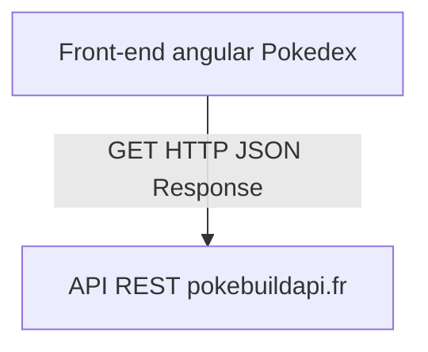
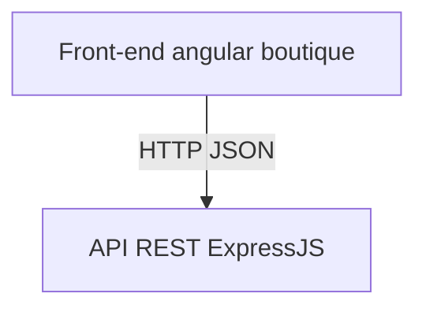

# Projets Angular

## 1 - Pokedex
### Description
Un simple pokedex qui consomme l'api pokebuild pour récupérer les pokemons.
L'utilisateurs peux naviger vers une autre page de détail des pokemons au click sur un pokemon et aussi recherche un pokemon spécifique pour mettre à jour en temps réel la liste des pokemons de la page d'accueil.

## Use Case UML

### Maquette
*Page d'accueil*
.png)
*Page details d'un pokemon*
 
### Stack et architecture logicielle
- Angular
- NPM

## 2 - Boutique api crud
## Description
Une petite boutique en ligne qui consomme une api rest conçue par vos soins.

## Use case UML

### Stack et architecture logicielle

- Angular pour la boutique
- NodeJS/Express pour l'api REST
- Sequelize pour l'ORM SQL
- npm

### Cours et documentation
- Cours sur NODEJS et express : https://github.com/CHAOUCHI/parcours_cda/blob/master/NodeJS/Express/Cr%C3%A9er%20un%20back%20end%20en%20JavaScript%20avec%20NodeJS.md

- ORM SQL Sequelize : https://github.com/CHAOUCHI/parcours_cda/blob/master/NodeJS/sequelize/TP%20-%20Persitence%20des%20donn%C3%A9es%20avec%20l'ORM%20sequelize.md
- La doc de express : https://expressjs.com/fr/starter/hello-world.html
- La doc de sequelize : https://sequelize.org/docs/v6/getting-started/

> Vous n'êtes pas obligés de faire tout les exercices du cours sur Express

## 3 - Boutique upload de fichiers
### Description
Ajoutez une autre api rest d'upload de fichier conçu avec NodeJS et express

## 4 - Boutique Paiement
### Description
Créez une autre api express qui se connecte à stripe pour gérer le paiment.

## 5 - Dockeriser le tout
