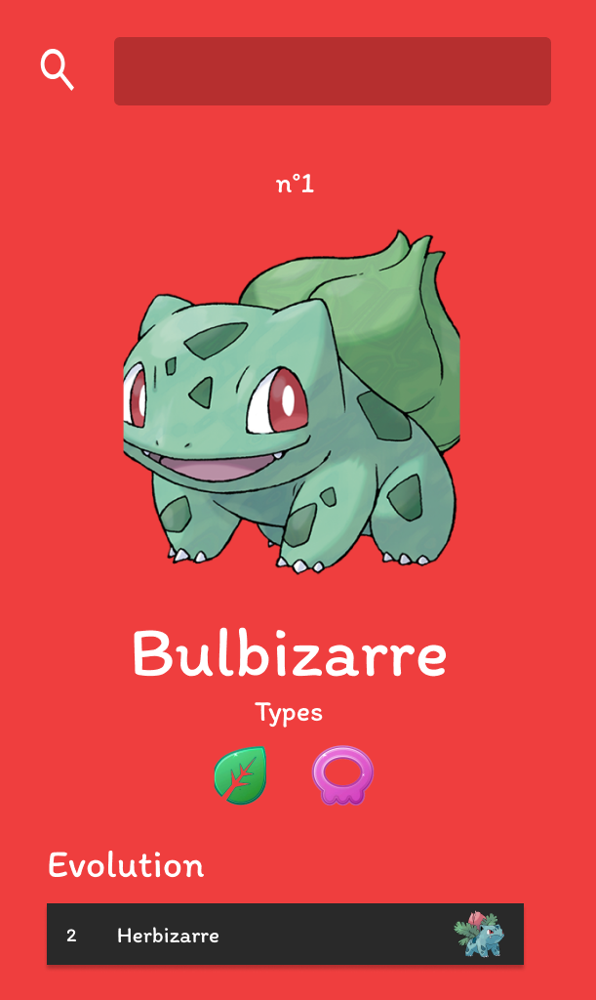
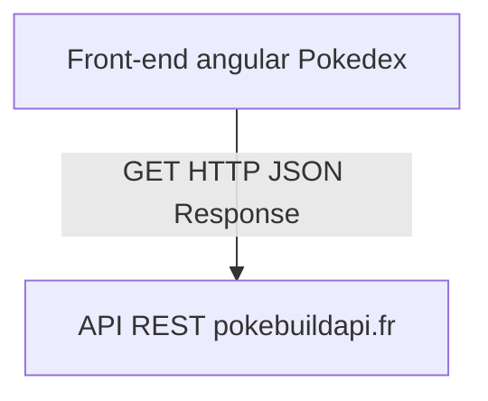
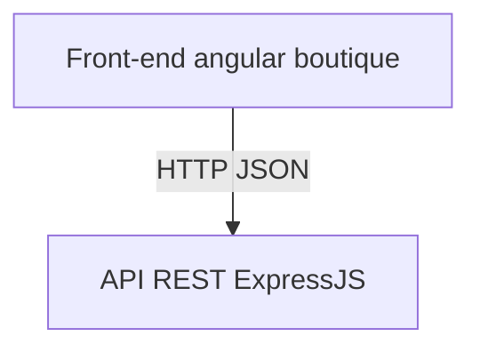

# Projets Angular

## 1 - Pokedex
### Description
Un simple pokedex qui consomme l'api pokebuild pour récupérer les pokemons.
L'utilisateurs peux naviger vers une autre page de détail des pokemons au click sur un pokemon et aussi recherche un pokemon spécifique pour mettre à jour en temps réel la liste des pokemons de la page d'accueil.

## Use Case UML

### Maquette
*Page d'accueil*

.png)

*Page details d'un pokemon*

 

### Stack et architecture logicielle
- Angular
- NPM

## 2 - Boutique api crud
## Description
Une petite boutique en ligne qui consomme une api rest conçue par vos soins.Par exemple l'api que vous avez conçu dans le Projet Boutique NodeJS.

## Use case UML

### Stack et architecture logiciel

- Angular pour la boutique
- NodeJS/Express pour l'api REST
- Sequelize pour l'ORM SQL
- npm

### Plan de travail
1. Définir le diagramme de cas d'utilisation de la boutique en ligne : ce que l'utilisateur ou l'admin poura faire sur la boutique.
2. Créer l'API Rest et la tester sur postman
3. Créer un service qui fait l'interface entre l'api et la boutique angular
4. Créer les composants angular et les assembler pour mettre en place la boutique (mettez en place un routing)

### Cahier des charges
- Page d'accueil qui affiche des produits aléatoire.
-  header avec une barre de recherche
-  menu de navigation qui contient des liens vers toutes les categories de produits
-  Page de categorie qui décrit la catégorie et affiche ses produits (doit contenir une pagination)
-  Page CGU
-  Barre de recherche
-  Page panier
-  Page Admin
    -  ajout de produit
    -  liste de produits avec bouton supprimer
    -  modification de produit

### Cours et documentation
- Cours sur NODEJS et express : https://github.com/CHAOUCHI/parcours_cda/blob/master/NodeJS/Express/Cr%C3%A9er%20un%20back%20end%20en%20JavaScript%20avec%20NodeJS.md

- ORM SQL Sequelize : https://github.com/CHAOUCHI/parcours_cda/blob/master/NodeJS/sequelize/TP%20-%20Persitence%20des%20donn%C3%A9es%20avec%20l'ORM%20sequelize.md
- La doc de express : https://expressjs.com/fr/starter/hello-world.html
- La doc de sequelize : https://sequelize.org/docs/v6/getting-started/

> Vous n'êtes pas obligés de faire tout les exercices du cours sur Express

## 3 - Boutique Auth et JWT
### Cahier des charges :
**Verrouiler les routes sensibles de l'api rest** : POST, DELETE, PUT (eventuelement GET en fonction de la route) voir le cours sur middleware JWT : https://github.com/CHAOUCHI/parcours_cda/blob/master/Auth/JWT.md

**Verrouiller les pages suivantes à l'aide des guards et d'un service AuthService.**
- Page panier pour les utilisateurs connectés
- Page Admin pour les utilisateurs connectés ayant pour rôle admin.

### Cours et doc
- Angular.fr pour le cours sur les guards (fonction middleware pour les routes) : https://angular.fr/routing/guard
- Le chapitre sur les guards du cours Angular : https://github.com/CHAOUCHI/parcours_cda/blob/master/Angular/Angular.md#verrouiller-lacc%C3%A8s-au-routes
- Cours sur les tokens JWT pour créer un token sur la route */login* et le renvoyer en body de la réponse: https://github.com/CHAOUCHI/parcours_cda/blob/master/Auth/JWT.md
- *localstorage* pour stocker le token JWT renvoyer par la route */login* , le service AuthService sert d'interface pour accéder au token et le decoder pour lire les infos comme le role, etc... . AuthService contient des méthodes publiques comme isLogin(), isAdmin() ou encore login(username,password).
- la fonction atob() pour décoder un token de base64 vers json : https://developer.mozilla.org/fr/docs/Web/API/Window/atob
- JSON.parse pour décoder le token de JSON à Object : https://developer.mozilla.org/en-US/docs/Web/JavaScript/Reference/Global_Objects/JSON/parse

## 4 - Boutique upload de fichiers
### Description
Ajoutez une autre api rest d'upload de fichier conçu avec NodeJS et express.
L'upload de fichier doit ce faire dans un autre programme nodejs vous aurez donc deux backend : api-boutique pour le crud et api-file-upload pour l'upload d'images.

Dans la page admin :
- L'ajout et la modification d'un produit doit fournir une liste des images disponibles dans un popup
- L'ajout et la modification d'un produit doit fournir un bouton "upload file" qui permet d'uploader une image dans l'api file-upload.

https://github.com/CHAOUCHI/parcours_cda/blob/master/NodeJS/Express/file_upload/Uploader%20un%20fichier%20sur%20un%20back-end.md

## 5 - Boutique Paiement
### Description
Créez une autre api express qui se connecte à stripe pour gérer le paiment.
Voir stripe checkout.

## 6 - Dockeriser le tout
Utiliser docker compose pour dockeriser nodejs et apache et servir le front et tout les services nodejs du backend.
