# Les Diagrammes UML
Concevoir un logiciel est une entreprise complexe qui peut échouer à de nombreux moments de la production.

## Travailler en équipe
La plupart du temps, un logiciel se conçoit en équipe. Une équipe typique peut être composée de :
- **Un graphiste,** il va concevoir l'expérience utilisateur et l'esthétique de l'application
- **Un développeur,** il va intégrer les maquettes du graphiste et concevoir toute l'application aussi bien en front-end(affichage) qu'en back-end (serveur).
- **Un chef de projet,** il va être en contact avec le client et traduire son besoin en un cahier des charges qui devra être respecté par les graphistes et développeurs.

Dans cet exemple simpliste, on comprend que tous ces acteurs manipulent des outils différents et ne parle pas tout à fait la même "langue". **Il nous faudrait un langage universel**, compréhensible par l'ensemble de l'équipe, qui **définisse tout les aspects du projet** pour permettre une communication claire entre les membres de l'équipe et ainsi répondre au mieux au besoin du client.

Ce langage s'appelle **UML, Unified Modeling langage** (langage de modélisation unifié).

## L'UML, qu'est ce que c'est ?
L'UML, c'est un ensemble de schémas appelé diagrammes UML qui modélises tous les aspects d'un projet informatique. Les diagrammes les plus utilisés sont par exemple :
- **Le diagramme de cas d'utilisation**, il modélise les actions possibles de l'utilisateur du logiciel. C'est probablement le diagramme UML le plus utile et c'est aussi souvent lui que l'on fait en premier.
- **Le diagramme d'entité relations**, il modélise les tables de données et leurs relations : One to Many, One to One, Many to Many. Il permet d'un simple coup d'œil de comprendre toutes les données persistantes mises en jeu dans l'application et la manière dont elles sont connectées entre elles.
- **Le diagramme de classe**, il représente les classes du code source du projet. Il contient les attributs et méthodes des classes, leurs droits d'accès ainsi que les liens d'héritages qui les unissent. 
- **Le diagramme de Gantt**, permet d'estimer le temps de réalisations des taches du projet.

## Les étapes de la conception d'un projet
Un projet en développement web suis souvent ce schéma :
1. **Analyse du besoin** du client
2. Définition du diagramme de **cas d'utilisation**
3. Création d'un premier **wireframe** pour définir l'expérience utilisateur.
4. **Choix des technologies** utilisées (la stack) : JS, PHP, Frameworks, Docker ?
5. Écriture du **cahier des charges**
6. Départ de la **conception**.

Le diagramme de cas d'utilisation UML (ou simplement **use case**) apparaît très tôt dans la conception et vous permet de savoir **par où commencer**.

## Comment créer un diagramme UML.
Il existe de nombreux logiciels pour créer des diagrammes UML, je recommande deux logiciels en particulier :

### Draw.io
Un site web simple d'utilisation qui permet de créer des diagrammes UML et toutes sortes de schémas.
Lien : https://app.diagrams.net/

### Papyrus Eclipse
Un client lourd professionel pour créer des diagrammes UML. Il faut quelque temps pour se faire à son coté "usine à gaz" mais il est très complet, moins facile à prendre en main que draw.io sans pour autant être extremement difficile à utiliser.
Télécharger ici : https://eclipse.dev/papyrus/download.html

# Use Case Diagram

Un diagramme de cas d'utilisation est fait de 3 choses :

- **Les acteurs,** qui peuvent être des êtres humain ou des machines. Par exemple un utilisateur, un client, une base de données, un service d'authentification sont autant d'acteurs extérieurs à notre système.
- **Les cas d'utilisations** (use cases), ce sont les actions possibles des acteurs : se connecter, acheter un produit, envoyer un message, ajouter au panier. Ce sont toutes les manières possibles d'utiliser le logiciel, tout les cas d'utilisations du logiciel.
- **Les liaisons,** ce sont les flèches qui relient les acteurs et les cas d'utilisations. Il en existe différents types pour lier les acteurs entres eux, les cas d'utilisations entre eux ou encore pour lier les acteurs et les cas d'utilisations.

## Exemple de diagramme de cas d'utilisation

Mettons que nous développons un Pokedex dans lequel un utilisateur peut consulter tous les pokemons du jeu et un administrateur peut se connecter pour modifier les données du pokedex, voir même rajouter de nouveaux pokemons !

Ce diagramme représente les cas d'utilisations d'un pokedex.

### Les acteurs et leurs cas d'utilisations
Les acteurs sont représentés par des "bonhommes bâtons" ou *stick-men*, les cas d'utilisations par une bulle ovale contenant une action.

> Une action doit obligatoirement contenir un verbe.

**Un utilisateur peut voir les informations des pokémons.**

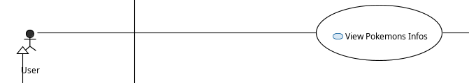

**Et ces informations lui seront fournit par une base de données.** 

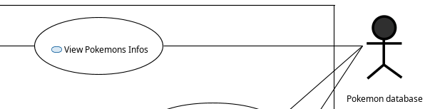

On voit également qu'**un autre acteur nommé administrateur** peut mettre à jour les données du Pokedex.
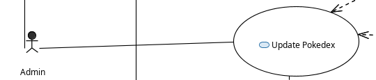

### Les acteurs non-humains
Les acteurs non-humains sont représentés à droite du diagramme de cas d'utilisation au l'extérieur du système.
> Le système est le carré qui contient tous les cas d'utilisation. Il délimite l'intérieur de notre logiciel.

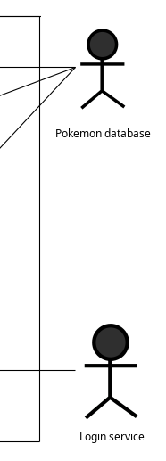

En-dehors de ça, les diagrammes ne font pas de différence entre humain et non-humain. Ils sont tous des acteurs extérieurs au système.

### Les acteurs entre eux
La flèche qui relie l'administrateur à l'utilisateur signifie que l'admin est capable de faire tout ce que l'utilisateur sait faire. Dans notre cas, voir les informations des pokémons.

### Les cas d'utilisations entre eux
Vous remarquerez que certains cas d'utilisation sont reliés à d'autres cas d'utilisation via les flèches *extend* ou *include*.

#### Extend, définir les cas d'utilisations optionnels
**Extend** défini des actions optionnelles dérivées d'un cas d'utilisation. 

**Update Pokedex** peut signifier **l'ajout d'un pokemon** (Adding new pokemon) ou bien **la modification d'un pokemon** (Edit existing pokemon).
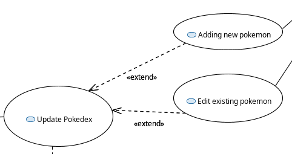
#### Include, définir les cas d'utilisations obligatoires

**Include** défini les actions obligatoires au fonctionnement d'un cas d'utilisation. 

Pour mettre à jour un pokemon (Update Pokemon) l'administateur doit  **obligatoirement** se connecter (Login).

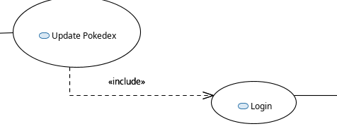

## Résumé d'un diagramme de cas d'utilisation
| Element d'un use case diagram | Symbole | Description |
|-|-|-|
|Acteur| 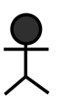 | Tout les éléments extérieurs qui interagissent avec le logiciel.
| Cas d'utilisation | 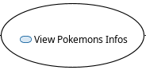 | Actions possibles des acteurs, elle contient un verbe.
| Association Link | 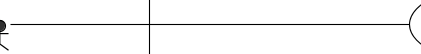 | Liaison entre un acteur et un cas d'utilisation
| Generalisation Link | 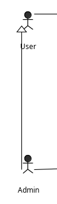 | Liaison entre deux acteurs, l'acteur pointant la fleche possède toutes les actions de l'acteur pointé par la flèche.
| Include Link | 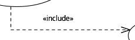 | Liaison entre deux cas d'utilisation qui définit **les actions obligatoires** au fonctionnement d'un cas d'utilisation.
| Extend Link | 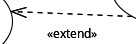 | Liaison entre deux cas d'utilisation qui définit **les actions optionnelles** résultant d'un cas d'utilisation.

## Et ensuite ?
**Après avoir crée votre premier diagramme de cas d'utilisation** vous pouvez créer une maquette type *wire-frame* de votre logiciel pour pouvoir démarrer rapidement la conception sans perdre trop de temps dans le design. Typiquement ce genre de maquette se crée sur `Figma`.