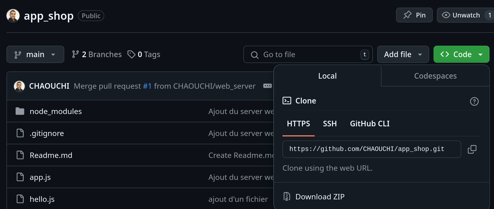

# Mettre en projet sur GitHub
Mettre un projet sur GitHub permet de sauvegarder son code au fur et à mesure de l'avancée. GitHub fonctionne par un système de versions appellées commit.

Pour se faire il faut :
- Avoir un compte GitHub
- Créer un répo(projet) GitHub avec GitHubCli(gh)
- Cloner le projet sur son pc
- Coder...
- Pousser (push) le projet sur GitHub

## 1. Créer un compte GitHub
Créez vous un compte sur https://www.github.com .

## 2. Installer Git et GitHubCLI

```bash
sudo apt install git
sudo apt install gh
```

## Décliner son identité à Git
Pour pouvoir pousser les modifications de code sur GitHub le programme git doit pouvoir donner un nom à la source de l'envoi (vous).

Donnez donc votre identité à git avec les commandes suivantes :
```bash
git config --global user.name "Billie JOE"
git config --global user.email joe.billie@gmail.com
```

## Configurer les merges
Executez la commande suivante pour autoriser git à fusionner (merge) les commits en cas de conflits.
```bash
git config pull.rebase false
```

## 3. Se connecter à GitHub
```bash
gh auth login
```


## 4. Créer un nouveau répo GitHub
Créer un projet avec la commande suivante et donnez lui un nom, par exemple `my-repo`.
***Attention il faut REFUSER le clonage du répo !***
```bash
gh repo create
```

## 5. Cloner le répo sur votre PC
Pour cloner le répo il vous faut son *url*, trouvable sur la page GitHub du répo.

```bash
git clone https://github.com/VOTRE_NOM/my-repo.git
```

Par exemple, ici je clique sur le bouton `code` de la page du répo et je copie son url. Elle fini normalement par `.git`.



`git clone` à créer un nouveau dossier dans votre PC.

Vous pouvez ensuite ouvrir votre répo avec VSCode et commencez à coder :
```bash
code my-repo
```

Par exemple créer un fichier index.html et ajoutez du code à l'intérieur.

*index.html*
```html
<h1>Hello</h1>
```

Une fois que des changements on été effectué vous pouvez publier ces changements sur GitHub.

## 6. Publier ses changements en ligne

```bash
git add .
git commit -m "Mon message"
git push
```
- add : ajoute les changements dans un colis (commit)
- commit : donne un nom au colis
- push : envoyez le colis sur GitHub

> ***Si git commit echoue***
> Si git vous demande email et nom entrée les commandes qu'il vous fournit:
> 

## 7. Récupérer les changements des autres collaborateurs
Si un collègues à vous à modifié le répo depuis une autre machine et publié avec git push, vous pouvez récupérer ses changements avec `git pull`.
```bash
git pull
```
