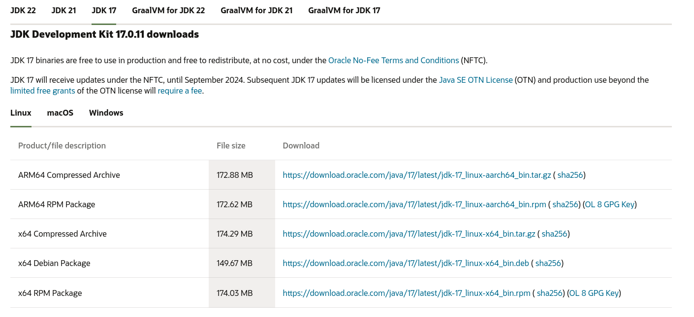

# Mise en place d'un projet Libgdx - Un framework Java pour le développement de jeux vidéo cross-plateformes 2D ou 3D
https://libgdx.com/
Libgdx est un framework Java qui permet de créer des jeux vidéos en 2D ou 3D cross-plateformes, c'est à dire des jeux PC, android, Web et IOS.

## Syntaxe du cours
Le annotations comme celle-ci :
> Je suis une annotation.

**Ne sont pas nécessaires pour comprendre le cours.** Elle ne servent qu'a apporter des informations suplémentaires, de la mise en contexte ou encore indiquer les erreurs classiques à éviter.
 
## Pré-requis
- Java Developpement Kit (JDK) 17 ou inférieur
- gdx-setup : utilitaire de création de projet libgdx

> #### Rappel sur la compilation en java
> Pour rappel un programme Java n'est pas executé directement par l'OS mais un programme appellé Java Virtual Machine (JVM). La JVM ne comprend que les programme compilé en ByteCode, on reconnait ces programmes à leurs extensions : `.jar`

> #### Bon à savoir - Kotlin
> La plupart du temps les programme .jar sont compilé par JDK à partir de code Java (le langage de programmation) mais il est aussi possible d'écrire en Kotlin car la JDK est capable de compilé du Kotlin en ByteCode.
> Une question se pause, peut ont ecrire du code Kotlin pour utilisé libgdx ? A priori je ne le sais pas moi-même je dirait qu'il faudrait écrire ou trouver une bibliotèque Kotlin qui encapsule libjdx. N'hésitez pas à faire vos recherche si ce sujet vous intéresse.

### Installer JDK 17
JDK est un ensemble de programme qui permet de compiler du java ou de lancer des fichier .jar (les executable java).

Télécharger le paquet Debian de JDK 17 : 

https://www.oracle.com/java/technologies/downloads/#java17



Dans le dossier où se trouve le paquet nouvellement téléchargé. Installez le paquet avec apt
```bash
apt install jdk-17_linux-x64_bin.deb
```

### Tester si JDK est bien installé
Vérifiez si vous possédez bien la version 17 de Java.
```bash
java --version
```

## Créer un projet libgdx
### Télécharger l'utilitaire gdx-setup
https://libgdx-nightlies.s3.amazonaws.com/libgdx-runnables/gdx-setup.jar

### Générer un projet
L'utilitaire libgdx est un programme .jat vous pouvez donc l'executer avec la commande java (la JVM sera utilisée).

```bash
java -jar gdx-setup.jar
```

#### Utilitaire CLI
```bash
java -jar gdx-setup.jar --dir mario --name mario --package com.mygdx.game --mainClass Game --sdkLocation / --excludeModules lwjgl2;Android;iOS
```

1. Définissez le chemin vers votre projet dans le champs *Output folder* ( il doit poiter vers un dossier vierge exesitant) 
2. Cochez uniquement *Desktop* et décochez le reste
3. Cliquez sur *Generate* pour télécharger les fichiers du framework dans le *Output folder*.

## Lancer le jeu
Le fichier gradlew permet de lancer le jeu via la tache *desktop*


# 