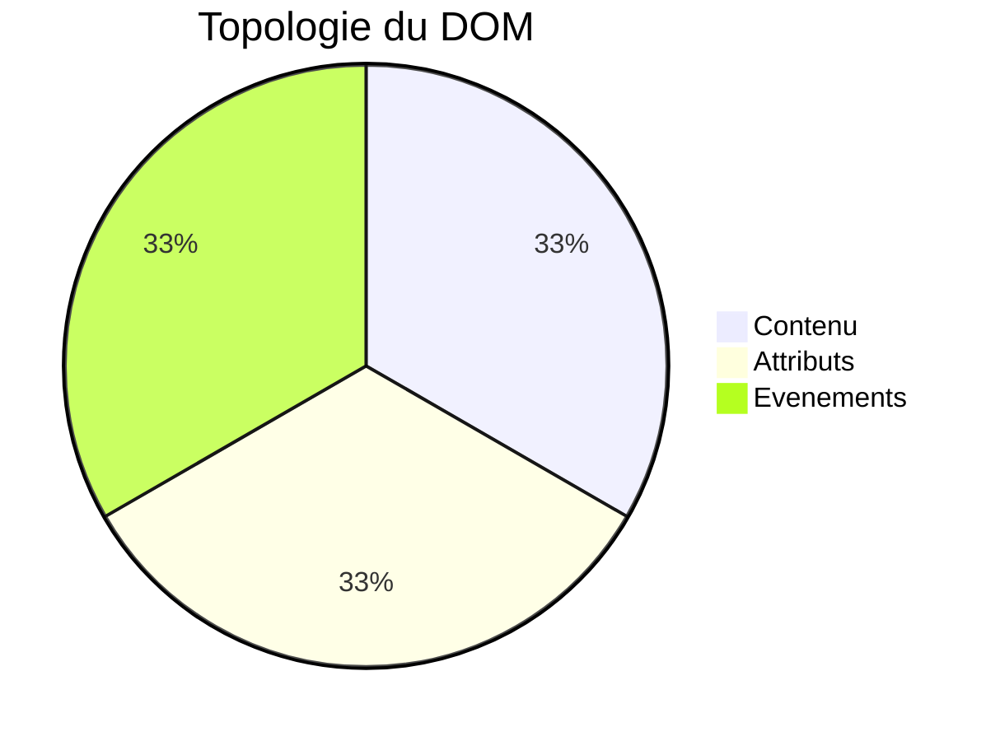
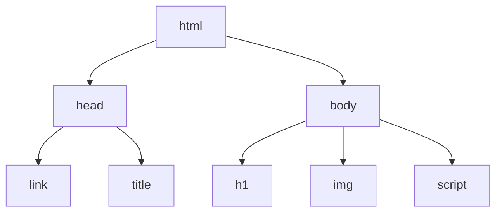
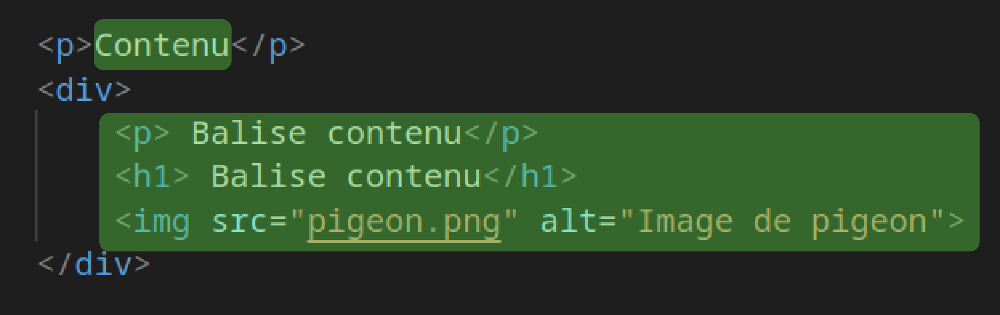
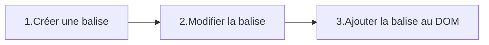
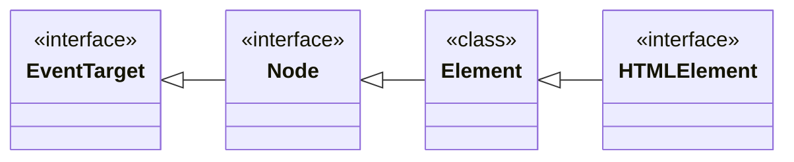

# JavaScript - Le DOM, Document Object Model

DOM signifie Document Object Model, c'est à dire la representation objet de votre page HTML.
Le DOM est une API du navigateur web qui permet d'accéder au balises du document HTML via l'objet `document`.

L'objet `document` est, au même titre que `console`, un attribut de l'objet `window`.
<!-- 
# Sommaire
- [Introduction](#introduction---récupérer-un-element-html)
- [La topologie du DOM](#la-topologie-du-dom)
    - [Le contenu](#le-contenu)
    - [Les attributs](#les-attributs-html)
    - [Les évenements](#les-événements)
- [Un tour du DOM](#un-tour-du-dom) -->

# Introduction - Récupérer un element HTML 
## La méthode querySelector
Comment tout objet `document` est fait d'attributs et de méthodes, la plus importante étant `querySelector`.
La méthode `querySelector` permet de récupérer une balise HTML en JS. Pour ce faire la méthode parcours la page HTML à la recherche d'une balise HTML qui correspond au selecteur CSS passé en paramètre.
```js
const h1 = document.querySelector("h1");    // HTMLElement
const photoProfil = document.querySelector("#photo_profil"); // HTMLElement
const produits = document.querySelectorAll(".produit"); // Array of HTMLElement
```
### Héritage
Les constantes `h1` et `photoProfil` sont des objets. Il hérite de la classe `Element` et implémentes les interfaces : `EventTarget`, `Node` et `HTMLElement`.

Tout les elements du document hérite de la classe `Element`, c'est l'une des  classes les plus importantes du DOM. Un `Element` est une representation objet d'une balise HTML.

### Différence entre `querySelector` et `querySelectorAll`
```js
const produits = document.querySelectorAll(".produit"); // Array of HTMLElement
```
La constante `produits` quant à elle est un tableau d'`Element`. Vous noterez l'utilisation de la méthode `querySelectorAll` pour la récupération d'un tableau d'`Element` en fonction la classe CSS produit.

`querySelector` renvoi le premier `Element` rencontré en fonction du selecteur CSS , alors que `querySelectorAll` renvoi tout les `Element` correspondant au selecteur CSS.

Typiquement l'on voudra recupérer un tableau d'élement avec `querySelectorAll` et les parcourir via une boucle `for`.
# La topologie du DOM
L'utilisation du DOM peut être divisé en 3 parties : le contenu, les attributs, les évenements.
Lorsque je veux utiliser le DOM je me pose toujours la question de : "A quoi est ce que je veux accéder ? : le contenu d'une balise, les attributs d'une balise ou les évenements d'une balise ?".

Le DOM est un arbre composé de branche, au bout de chaque branche se trouve un noeud. Le premier noeud est la balise `<html>` qui contient toute les autre balises.

## Le Contenu : le texte interne ou une balise fille
C'est le contenu d'une balise qui peut être soit un texte soit une balise fille.

```html
<p>Texte interne du paragraphe.</p>
<a href="http://youtube.com">Texte interne d'un lien</a>
<h1>Texte interne d'un titre</h1>
```
*Contenu : texte interne d'une balise.*
```html
<div>
    <p>AirMax taille 42</p> // Balise fille du div
     // Balise fille du div
</div>
```
*Contenu : balises filles d'une balise.*

Le contenu d'une balise peut être un texte ou d'autres balises filles.
Grâce à la partie *contenu* du DOM vous pourrez : changer le texte, **récuperer** des balises (querySelector), les **supprimer**(remove) ou même en **ajouter** de nouvelles(appendChild).
>Cela peut paraitre bête mais le contenu d'un balise est forcement soit un texte soit d'autres balises, ainsi est fait le HTML.

## Les Attributs HTML
Les attributs HTML son accessibles et modifiables grâce au DOM.
Parmis les attributs les plus classique on retrouve : `href`, `src` ou encore `class`.
```html
<balise attributHTML="Exemple d'attribut HTML">Un balise HTML</balise>

<a href="lienClicable"> Go to youtube.</a>
```
On accède au attributs pour deux raisons : la **lecture** (getAttribute) ou la **modification**(setAttribute).

Par exemple :
- Je veux **modifier** l'attribut `src` d'une image
- Je veux connaitre le lien d'un texte en **lisant** l'attribut `href`.
- Je veux ajouter un classe CSS en `modifiant` l'attribut `class`.

## Les événements
Le principale avantage du JavaScript est la facilité avec laquelle on peut réagir à des évenements. **Un évenement est une action de l'utilisateur auquelle on peut associer une fonction.**
Parmis les évenements les plus connus on retrouve :
- "click" : L'utilisateur a cliqué
- "dblclick" : L'utilisateur a double cliqué
- "scroll" : l'utilisateur a scrollé
- "change" : l'utilisateur a écrit un caractère dans une balise input
- "input" : l'utilisateur a appuyé sur ENTREE dans une balise input
- "submit" : l'utilisateur a soumit un forumlaire
- "copy" / "paste" : l'utilisateur a copié (Ctrl+C) ou collé (Ctrl+V).

```html

```
En HTML on peut executer du JavaScript lors d'un evenement grâce à l'attribut HTML `onclick`, cette méthode propose peu de flexibilité et ne permet pas de séparer le JS du HTML. ***Je déconseille donc son utilisation.***


# Un tour du DOM
## Le contenu
Comme dit précedement le contenu d'une balise peut être un texte ou bien d'autre balise. Commençont par voir comment récupérer une balise dans le `document` ou dans une autre balise.
### `querySelector` - récupérer une balise
La méthode querySelector est disponible sur les objets des classes `Element` et `Document`.
#### Valeur de retour
Un objet `Element` du `document` ou `null` si l'element demandé n'existe pas.
#### Paramètre
Une `string` contenant un selecteur CSS valide.
```html
<h1>Titre</h1>
<p id="paragraphe">texte un peu long.</p>

<div>
    <h1>Air Max 42</h1>
    
</div>
```

#### Selectionner une balise via le nom de la balise
```js
const titre =  document.querySelector("h1");
```
#### Selectionner une balise via son id
```js
const para =  document.querySelector("#paragraphe");
```
#### Selectionner une balise via sa classe 
```js
const oiseau =  document.querySelector(".photo");
```
#### Selectionner une balise via un selecteur CSS complexe
```js
const shoesImg =  document.querySelector("div>.photo");
```

> --- 
> `querySelector` renvoi le premier `Element` rencontré qui match le selecteur CSS, voilà pourquoi le code suivant renvoi l'`` de l'oiseau et non de la chaussure.
>```js 
>const oiseau =  document.querySelector(".photo"); //=> 
>```
>---

#### `querySelector` sur un `Element`
Je peux effectuer un `querySelector` sur un `Element` récuperée avec `document.querySelector`. Ceci permet de rechercher uniquement les balises correspondants au selecteur CSS dans le **contenu** de la balise et non dans tout le document.
```js
const conteneur = document.querySelector("div"); // => <div>...</div>
const shoesName = conteneur.querySelector("h1");  // => <h1>Air Max 42</h1>
```

### `innerText` - Le contenu textuel
`innerText` est un attiribut de la classe Node. Il permet de lire ou modifier le texte écrit entre la balise ouvrante et la balise fermante de n'importe quelle balise HTML non-orpheline.
#### Lire le contenu textuel d'une balise
On lit le contenu via l'attribut `innerText`.
```html
<p id="paragraphe">texte pas très long</p>
```
```js
const para =  document.querySelector("#paragraphe");
console.log(para.innerText);        // => "texte pas très long"
```

#### Modifier le contenu textuel d'une balise.
On modifie le contenu textuel en affectant une nouvelle valeur à l'attribut `innerText` comme pour n'importe quelle variable.
```html
<p id="paragraphe">texte pas très long</p>
```
```js
const para =  document.querySelector("#paragraphe");
console.log(para.innerText);        // => "texte pas très long"
para.innerText = "Nouveau texte pour mon paragraphe";
console.log(para.innerText);        // => "Nouveau texte pour mon paragraphe"
```

### Créer dynamiquement une balise enfant
L'ajout d'une nouvelle balise dans le HTML se fait en plusieurs étapes.

#### `createElement` - Créer une balise
```html
<body>
</body>
```
```js
const nouvelleBalise = document.createElement("p");
```
##### Valeur de retour
Un objet de la classe `Element` similaire à ceux renvoyés par `querySelector`.
##### Paramètre
Le nom de la balise - une `string` contenant le nom de la balise à créer comme : `"h1"`, `"h2"`, `"div"`, `"a"`, `"img"`.
#### Modifier la balise
L'étape de modification permet de définir le texte de la balise, d'éventuel attributs(class, src, href,...) ou d'y attacher des évenements. Elle n'est pas obligatoire mais est dans la plupart des cas présente.
```js
nouvelleBalise.innerText = "Ceci est une balise crée dynamiquement en JavaScript"
```
*Modification du texte interne d'une balise crée au péalable.*

> La modification d'une balise ne consiste pas uniquement en la modification de son texte. la plupart du temps on voudra également modifier ses attributs et parfois y attacher des évenements.

#### `appendChild` - Ajouter la balise au document
La méthode `appendChild` permet d'ajouter une balise crée avec `createElement` dans une autre balise, et ainsi le rendre visible sur la page html.

```js
document.appendChild(nouvelleBalise);
```
*Résultat*
```html
<body>
    <p>Ceci est une balise crée dynamiquement en JavaScript</p>
</body>
```
Si l'on appel `appendChild` à partir de l'objet `document` la nouvelle balise sera rajoutée à la fin du `<body>`.

#### `appendChild` - Ajouter une balise dans une balise
Il est également possible d'ajouter une balise dans une balise autre que `<body>` en effectuant un `querySelector` au préalable.
```html
<body>
    <h1>Ma page</h1>
    <div class="container">
        <p>J'etais là avant !</p>
    </div>
</body>
```
```js
const nouvelleBalise = document.createElement("p");
nouvelleBalise.innerText = "Je suis une balise p dans un div.";
const conteneur = document.querySelector(".container");
conteneur.appendChild(nouvelleBalise);
```
*Résultat*
```html
<body>
    <h1>Ma page</h1>
    <div class="container">
        <p>J'etais là avant !</p>
        <p>Je suis une balise p dans un div.</p>
    </div>
</body>
```

## Les attributs HTML
#### Lire la valeur d'un attribut HTML
Pour lire la valeur de n'importe quel attributs HTML on utilise la méthode `getAttribute` sur un `Element`. 
> Pour rappel les elements sont des objets retournés par la méthode `querySelector`.
```html

<p class="text-content font-14"> Some text </p>
<a href="https://youtube.com">Clic me</a>
<input id="name" value="Ecrire ici le nom..." >
<personnage pv="100">
```
```js
const imgTag = document.querySelector("img");
const lienDeImage = imgtag.getAttribute("src");     // "piegon.png"

const pTag = document.querySelector("p");
const classNames = ptag.getAttribute("class");      // "text-content font-14"

const linkTag = document.querySelector("a");
const link = linkTag.getAttribute("href");          // "https://youtube.com"

const inputTag = document.querySelector("#name");
const input = inputTag.getAttribute("value");       // "Ecrire ici le nom..."

const persoTag = document.querySelector("personnage");
const pv = persoTag.getAttribute("pv");       // "100"

```

#### Modifier la valeur d'un attribut HTML
La valeur d'un attribut se défini avec la méthode `setAttribute` de la classe `Element`.
```js
const imgTag = document.querySelector("img");

let lienDeImage = imgtag.getAttribute("src");     
console.log(lienDeImage);       // => "piegon.png"

// Modification d'attributs HTML
imgTag.setAttribute("src","aigle.png");
imgTag.setAttribute("alt","Photo d'un aigle");

lienDeImage = imgtag.getAttribute("src");     
console.log(lienDeImage);      // => "aigle.png"
```

<!-- #### Inverser la valeur d'un attribut HTML
```js

``` -->
#### Le cas des classes CSS - l'attribut `Element.classList`
Les classes CSS peuvent être modifiés via la méthode `setAttribute`. Le problème c'est que cette méthode renvoie une `string` de toute les classes CSS et rend par conséquent laborieux la suppression ou l'ajout d'une classe, ce qui est pourtant une tache commune en JavaScript front-end.

Voilà pourquoi on prefère l'utilisation de l'objet `Element.classList` et de ses méthodes : `add`, `remove` et `toggle`.

##### HTML
```html
<p class="text-content font-14"> Some text </p>
```
*index.html*

##### Récupération de la balise `<p>`
```js
// On récupère la balise <p>
const paraTag = document.querySelector("p");
console.log(paraTag.getAttribute("class"));     // => "text-content font-14"
```

##### Supprimer une classe CSS - `Element.classList.remove`
```
// On retire la classe font-14
paraTag.classList.remove("font-14");
console.log(paraTag.getAttribute("class"));     // => "text-content"
```
##### Ajouter une classe CSS - `Element.classList.add`
```
// On ajoute la classe font-6
paraTag.classList.add("font-6");
console.log(paraTag.getAttribute("class"));     // => "text-content font-6"
```
##### Inverser la présence d'une classe CSS - `Element.classList.toggle`
```
// On inverse la présence de la classe text-content
paratag.classList.toggle("text-content");               
console.log(paraTag.getAttribute("class"));     // => "font-6"

// On inverse la présence de la classe text-content
paratag.classList.toggle("text-content");               
console.log(paraTag.getAttribute("class"));     // => "font-6 text-content"
```
#### Le cas du style
Comme l'attribut class, l'attribut style est difficile à traiter avec la méthode `Element.setAttribute`.
```html
<h1 style="font-size:16px;color:#efefef;margin:5px;">Bienvenue chez nous !</h1>
```
Comment gérer toutes ces règles CSS contenu en une seule et même chaine de caractère ? 
La solution est l'objet `Element.style` et ses attributs.
##### L'objet `Element.style`
L'objet `style` possède toutes les règles CSS sont formes d'attributs.
Si je souhaite modifier la rêgle `font-size` à `20px` de mon `<h1>` je fais : 
```js
const h1 = document.querySelector("h1");
h1.style.fontSize = "20px";
```
> **Combien de règles CSS sont prises en compte ?**
> Si vous souhaitez voir l'entièreté des règles CSS disponible dans l'objet `Element.style`. Effectuer un `console.log(h1.style)` pour que le navigateur vous affiche les attributs de l'objet `style`. ( Firefox )

>**Le CamelCase**
>La syntaxe des règles CSS est en **camelCase**, c'est à dire la **première lettre en minuscule** puis chaque **début de mot en majuscule**. C'est également la syntaxe de réference de tout code codé en JS.

## Les évenements 
Le principale avantage du JavaScript front-end réside en la présence d'évenement du navigateur.
Le navigateur est un logiciel executé par le système d'exploitation par consequant il a accès au entrées utlisateurs tel que la souris et le clavier.
Parmis les évenements notables on retrouve.
|||||
|---|---|---|---|
**click** |wheel |**keydown** |dblclick |
**submit** |fullscreenchange |keypress |message|
**input** |**change** |keyup |**scroll** |
mousedown |pointercancel |focusin |mousewheel|
**copy** |pointerdown |focusout |storage|
**paste** |pointerenter |focus  |mouseout |
**cut** |pointerleave |pointermove |pointerup |
mouseenter |pointerout |mousemove |mouseup |
mouseleave |pointerover |select |mouseover |

### Réagir à un évenement
Les évenements apparaissent toujours sur un `Element` ou sur le `document`, et pour réagir à un évenement il faut y attacher une fonction, déclarée au préalable par vos soins.

Le principe est simple : *"Lorsque l'évenement X apparait sur l'élement Y la fonction Z s'execute".*

**Par exemple :**

- Lorsque l'évenement `click` apparait sur la balise `` la fonction `goToProductPage` s'execute.
- Lorsque l'évenement `change` apparait sur la balise `<input>` la fonction `saveUserName` s'execute.
- Lorsque l'évenement `scroll` apparait sur le `document` la fonction `loadNextVideo` s'execute.

#### La méthode `addEventListener`
La méthode Element.addEvenetListener execute une fonction donnée quand un evenement spécifique apparait sur une balise spécifique.
```html
<button class="btn_hello">Say Hello !</button>
```
```js
const btnHello = document.querySelector(".btn_hello");
btnHello.addEventListener("click",sayHello);
function sayHello(){
    console.log("Hello everyone !");
}
```
`addEventListener` est une méthode de la classe `Element` par héritage et est donc accessible via l'objet `document` ou n'importe quel `Element` renvoyé par la méthode `querySelector`.

##### Paramètres
La méthode `addEventListener` possède deux paramètres.
- l'évenement : une string qui contient le nom d'un évenement.
- la fonction à appelée : une fonction à appellé lorsque l'evenement apparait.

> Vous noterez que l'on passe la fonction `sayHello` à la méthode `addEventListener` sans les parentèses. En effet on souhaite passer la fonction `sayHello` à `addEventListener` comme l'on passerait une variable pour que `addEventListener` l'execute à sa convenance lorsque l'évenement `click` apparait. 
> Si l'on avait mit les parentèses, la fonction `sayHello` se serait executée et la valeur de retour de la fonction aurait été donné a la méthode `addEventListener` ce qui nous serait complètement inutile.

#### Le paramètre `event`
Dans certain cas on voudrait avoir plus d'information sur l'évenement : quelle touche du clavier à été tapé, la position de la souris ou encore la balise qui à subit l'evenement.

Heursement la méthode `addEventListener` fournis un paramètre à la fonction callback passée en deuxième paramètre. Vous pouvez nommé se paramètre à votre convenance mais la plupart du temps on l'appellera `event`.
```js
document.addEventListener("keydown",function(event){
    console.log(event.key); // Affiche la touche tapée par l'utilisateur.
})
```

<!-- #### La méthode `removeEventListener` -->

<!-- #### Les évenements de la souris -->
<!-- ### L'évenement click -->
<!-- ### L'évenement dblclick -->
<!-- ### L'évenement scroll -->
<!-- ### Les évenements mouse-->
<!-- ### Les évenements wheel-->

<!-- #### Les évenements du clavier -->
<!-- ### L'évenements key -->
<!-- ### Les évenements copy ,paste et cut -->
<!-- ### L'évenement change -->
<!-- ### L'évenement input -->
<!-- ### L'évenement submit -->


<!-- 


- Un tour du DOM
    - Contenu
        - ~~querySelector~~
        - ~~innerText~~
        - ~~createElement~~
        - ~~appendChild~~
    - ~~Attributs HTML~~
        - ~~getAttribute~~
        - ~~setAttribute~~
        - ~~toogleAttribute~~
        - ~~classList~~
        - ~~style~~
        - ~~value~~
    - Evenements
        - "click"
        - addEventListener
        - removeEventListener
        - "dblclick"
        - "key..."
        - "scroll"
        - "change"
        - "change"
        - "input"
        - "submit"
        - "copy" / "paste"
            - Ctrl+C / V
            - la méthode copy
        - "mouse..."
        - "transition..."
    - Boite
        - height
        - width
- Le DOM en 4 parties : le contenu, les attributs, les evenements et le boxModel.
- Le contenu d'une balise
    - Récupérer une balise querySelector params et valeur de retour (classes)
    - Différence entre innerText et innerHTML
    - Les balises input
    - Créer une balise
    - Les elements enfants
        - querySelector dans un element enfant
        - nextSibil / prevSibil
        - firstChild / lastChild
- Les attributs HTML
    - Rappel du fonctionnement des attributs HTML : tout les nom peuvent être donnée
    - Récupérer la valeur d'un attribut
    - Modifier la valeur d'une attirbut
    - Tester si un attributs est vrai ou faux.
- Les évenements
    - Exemple d'evenement
    - La classe EventTarget
    - *addEventListener* et les fonctions callback
    - le parametre ** et l'inversion de contrôle
    - L' Bubbling
- Le BoxModel
    - height
    - width
    - top position(px) -->
    
# Les classes et interface du DOM

Le DOM c'est la représentation objet du document HTML et de toutes ses caractéristiques. Comme pour tout objets les elements(les balises) du document sont instanciés à partir de classes.

## La classe Element
La classe `Element` represente tout les elements du DOM. Dans le cadre d'un document HTML il represente les balises. 
La classe `Element` contient la plupart des méthodes et attributs permettant la **manipulation** des elements comme par exemple : 
- `Element`.appendChild() : Ajoute une element
- `Element`.getAttribute() : Recupère les attributs de l'element (src, href, id, class).
- `Element`.setAttribute() : Change la valeur des attributs de l'element.
- `Element`.classList.add() : Ajoute une classe CSS à un element
- `Element`.classList.remove() : Retire une classe CSS à un element

En résumé, la classe `Element` permet d'ajouter ou modifier les caractéristiques ou le contenu des balises peut importe que l'on parle de HTML, XML, SVG ou autre forme de document.
## La classe HTMLElement
La classe HTMlElement est un interface qui fournis des méthodes et attributs permettent, tout comme `Element`, de manipuler les balises a la différence que HTMLElement est spécialiser dans les balises HTML : 
- innerText : Contenu textuel d'une balise, comme le texte d'un `<p>`.
- style : les propriétés CSS de l'element, comme style.backgroundColor.

Tout les `HTMLElement` hérite de la classe `Element`.
En résumé : la classe `HTMLElement` permet d'ajouter ou modifier les caractéristiques ou le contenu des balises HTML exclusivement.

## La classe Node
La classe Node est un interface qui représente toutes les parties d'un document et pas seulement les balises; il represente, par exemple, également les commentaires HTML.

Un document est un "arbre génalogiques" d'element appelé noeud. Tout `Element` est également un noeud. Un noeud peut accéder à ses élements enfants ou frères via les méthodes :

- previousElementSibiling : Node précedent 
- nextElementSibiling : Node suivant 
- firstChild : Premier node d'un node
- lastChild : Dernier node d'un node

Tout les `Element` héritent de la classe `Node` et on donc accès au méthodes et attributs de la classe `Node`.

En résumé la classe `Node` permet d'évoluer entre les noeuds du document, la plupart du temps ces noeuds seront des `HTMLElement` et donc par extensions des `Elements`. 


## La classe EventTarget 
La classe EventTarget est un interface implémenté par tout les `Element` du DOM. Elle permet l'accès au méthodes comme `addEventListener` et `removeEventListener` qui permettent d'associer à un évenement l'éxecution d'une fonction.
Tout `Node` peut être ciblé par un évenement car la classe `Node` hérite de `EventTarget`.
