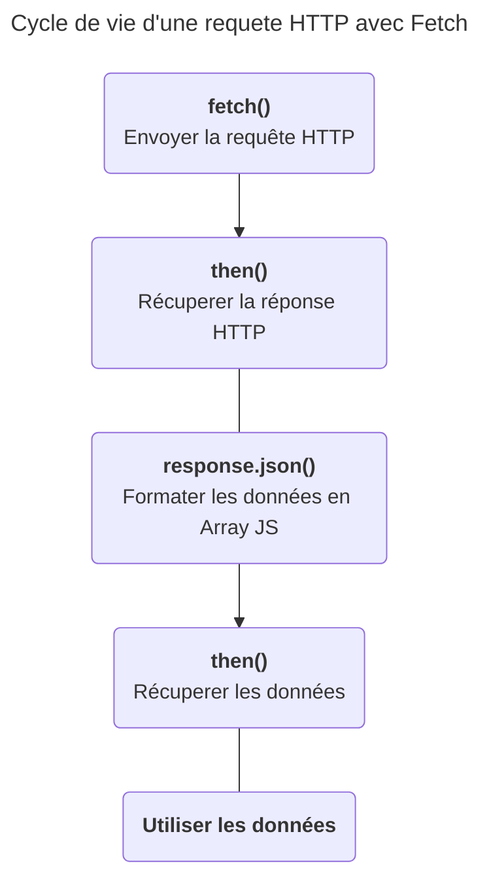

# L'API Fetch, récupérer des données depuis un serveur.


## L'API Fetch en résumé
### Qu'est ce que c'est ?
L'*API Fetch* est un client HTTP utilisable en JavaScript. Au même titre que les objets : `console`, `document` ou `localStorage` l'*API Fetch* est accesible via l'objet window. 

**L'API Fetch est utilisable via la méthode `window.fetch`.**

Comme dit plus haut `fetch` est un client HTTP, ce qui signifie qu'il permet d'envoyer une requête HTTP à un serveur HTTP et ainsi reçevoir une réponse HTTP.

Votre navigateur est déjà capable d'effecter des requêtes HTTP. Il le fait d'ailleurs à chaque chargement de page. `Fetch` permet simplement de récupérer des données sans charger toute une nouvelle page. Les données les plus courantes peuvent être :
- Une liste de produits d'une boutique en ligne qui change en fonction d'un filtre de prix.
- Des suggestions de recherche lorsque l'utilisateur tape au clavier.
- Des données géographiques du serveur de google maps.
- L'envoie d'un message via un formulaire sans recharger toute la page.
- La mise en ligne d'un tweet sur twitter.
- L'affichage des posts Facebook au fur et à mesure du défilement de la page.

Toutes ces opérations neccessites l'envoi d'une requête HTTP à un serveur, mais neccessites également de rester sur la page actuel. Il faut donc envoyer la requête en JavaScript via la méthode `fetch`.

>##### L'envoi de requête HTTP avant `fetch` :
>
>Avant l'envoi de requêtes HTTP en JavaScript, la seule façon de récupérer ou envoyer des données à un serveur HTTP était via les formlaires, l'url et le langage PHP. 
> PHP s'executant sur le serveur et générer le HTML coté serveur, il fallait recharger toute la page à l'utilisateur se qui rendait la navigation sur le web bien moins fluide que sur des applications mobile ou bureau.

### Comment se servir de `window.fetch` ?
*Documentation MDN* : https://developer.mozilla.org/fr/docs/Web/API/Fetch_API/Using_Fetch

Dans la plupart des cas un serveur de données ne renvoi pas du HTML mais du JSON, un format de données représentant un tableau d'objet JavaScript sous la forme d'une string.

*Fetch* signifie *récupérer* un anglais et *then* signifie *ensuite*. Il faut voir la syntaxe de fetch comme ceci : 

1. "I **fetch** some data from an url ..."
2. "**then** I transform the JSON response to a JavaScript array ..."
3. "**then** I use the data."

#### Code : 
```js
fetch(url)          // Remplacez l'url par l'url de la requête HTTP à executer
.then(function(reponseHTTP){    // La fonction callback fournit la réponse HTTP
    // Les données JSON sont transformées en un tableau JS
    return reponseHTTP.json();      
})
.then(function(data){    // la 2nd fonction callback fournit les données   
    console.log(data);
});
```


Vous pouvez tester le coder suivant avec l'url suivante : https://pokebuildapi.fr/api/v1/pokemon/limit/10
Vous aurez les dix premier pokemons affichés dans la console du navigateur.

Rendez-vous sur le site de l'api pokebuild pour expérimenter avec `fetch` !
https://pokebuildapi.fr/api/v1

> **Remarque - Passage à la ligne avant `.then`**
> La méthode `then` est une méthode de la classe `Promise`, la méthode `fetch` renvoie une ``Promise``. Ici l'appel de la méthode `then` est passée à la ligne pour plus de lisbilité mais ce n'est pas du tout obligatoire. L'on pourrait faire `fetch(url).then(...)` comme l'on ferait `console.log(...)`.

> **Remarque - Syntaxe raccourcis**
> L'exemple précedent utilise la syntaxe classique des fonctions anonyme, la syntaxe *fonction fléchée* est plus souvent utilisé pour les fonctions callback en JS, y compris la fonction callback en paramètre de la méthode `fetch.then`.
> ```js
> fetch(url)
>.then((reponseHTTP)=>reponseHTTP.json())
>.then((data)=>{
>    console.log(data);
>});
>```
>Ce code produit exactement le même résultat. 
Voir les fonctions fléchées sur la MDN : https://developer.mozilla.org/fr/docs/Web/JavaScript/Reference/Functions/Arrow_functions

## La méthode fetch
La méthode `fetch` de l'objet `window` renvoi un objet de la classe `Promise` fournissant une réponse HTTP, soit : "une promesse de réponse HTTP". Elle prend en paramètre obligatoire l'url du serveur (`string`) vers lequel effectuer la requête HTTP.

**Défintion de la fonction**

```js
fetch(url [,options]) : Promise<Response> 
```
> Les paramètres notés entre crochets *[]* sont optionnels, cette norme est utilisée dans la plupart des documentations technique.
> ```js
>functionName(param [,paramOptionel1,paramOptionel2])
>```

> Les double points *:* après la fonction signifie le type de la velur de retour de la fonction, ici un objet de la classe `Promise` qui fournira un objet de la classe `Response`.

### Paramètres
#### `url : string`
Une chaine de caractère contenant l'URL de la ressource demandée

Cela peut etre une nom de domaine comme www.leboncoin.fr/voitures/offres ou une adresse ip comme 127.0.0.1:8000/users

#### `options : Object`
Un objet JavaScript possédant de nombreux attributs optionnel, les plus utiles étant :

- `method` : `string` - Une string contenant la méthode HTTP à utiliser (`GET`, `POST`, `DELETE`, ...). Par défaut `"GET"`.
- `headers` : `Headers` - Un objet de la classe `Headers` contenant les eventuels Header HTTP à utiliser comme "Content-type : application/json" par exemple pour envoyer du JSON.
- `body` : `string` - Le body de la requete HTTP, la plupart du temps vous fournirez une string JSON mais d'autre formats sont possibles.

### Valeur de retour
La méthode fetch permet d'effectuer une requete et renvoie "une promesse de réponse HTTP", c'est à dire un objet de la classe Promise qui se fournis un objet `Response` lors de sa resolution.
En JavaScript une Promise est un objet que l'on utilise lorsque une action neccessite un certain temps à s'accomplir comme la lecture d'une fichier ou encore l'envoi d'une requête HTTP et la reception d'une requête HTTP.

#### La problématique du temps de réponse
Une réponse HTTP met a minima plusieurs centaines de milisecondes à arriver alors qu'une ligne de code met environ quelques milisecondes à s'executer. Il y a donc un soucis : le code s'execute plus vite que le temps de réponse.

La solution pour gérer un cas comme celui-ci est l'asyncrone. C'est à dire une ligne de code qui ne va pas s'executer avant un temps plus ou moins connu. Vous avez déjà connu ce cas de figure par le passé avec pour des méthodes ancéstrales du JavaScript comme`addEventListener` ou `setTimeout`.
```js
const button = docuement.querySelector(".button_validate");
console.log("1");
button.addEventListener("click",()=>{
    console.log("2");
});
console.log("3");
/* --- Résultat --- */
> 1
> 3
> 2
```
Les `console.log()` ne s'executes pas dans de haut en bas comme habituellement en programmation. L'action est donc asyncrone.

```js
console.log("1");
setTimeout(()=>{
    console.log("2");
},1000);
console.log("3");
/* --- Résultat --- */
> 1
> 3
> 2
```
Même chose avec `setTimeout`, `"2"` sera affiché dans la console une seconde après la fin du script, soit après l'affichage de `"3"`.

Vous remarquez que le code asyncrone utilise les fonctions callback : "Dans X secondes tu appel cette fonction", "Quand il se passe cette evenement tu appel cette fonction".

#### L'asyncrone moderne avec les Promises
Imaginez. 
Vous etes au restaurant et vous demandez un café au serveur seulement le serveur ne peut pas faire instantanement apparaitre un café sur votre table quand vous le demandez, alors le serveur vous fait une promesse : 
\- "Je vous ramène votre café dans quelques instants." et  quelque instant plus tard le serveur revient avec le résultat de sa promesse.
\- "Voici votre café !"
Magnifique !

Lorsque vous avez demandez un café le serveur vous à fournit un objet : **une promesse** intangible d'un café à venir et en tant qu'être humain vous etes tout à fait à l'aise avec ce concept ! Vous demandez quelque chose et l'on vous donne, non pas la chose demandée mais une promesse, puis la chose demandée arrives au bout d'un certain temps.

En JavaScript les choses fonctionne de la même manière. Le serveur est la méthode `fetch` qui vous fournit une promesse. 
```js
const promise = fetch(url);
```
Le résultat de la promesse n'est pas un café mais une réponse HTTP fournit dans la méthode `then`.
```js
promise.then(function(response){
    /*Buvez votre café...*/
    /*Ou plutôt consommez votre réponse HTTP.*/
})
```
> L'objet response fournit dans la méthode `then` est un objet de la classe `Response`. Il possède donc des attributs et des méthodes relative à une réponse HTTP, on peut accèder au code de status(200,404,500) au headers, au temps de réponse et surtout au body (HTML pour une page, JSON pour une donnée).

Les Promises sont une façon moderne de gérer l'asyncrone en JavaScript. Elle s'utilise en deux étapes : la création d'une promise puis le passage de la fonction callback de resolution qui fournis la donnée demandée via à la méthode `then`.
```js
console.log("1");
const promise = fetch(url);
promise.then((response)=>{
    console.log("2");
})
console.log("3");
/* --- Résultat --- */
> 1
> 3
> 2
```
> La promise "travail" et excutera votre fonction callback quand elle aura fini de "travailler". Dans le cas de la promise fournit par `fetch`, lorsqu'elle recevra la réponse HTTP du serveur.

On recupère le résultat d'une promise en tant que paramètre de la fonction callback présente dans le `then`, ce qui signifie que le résultat est accesible uniquement localement dans cette fonction callback. Cela n'est pas génant et nous permettra tout de même d'effecter des `querySelector`, `createElement`, ou `addEventListener`; il nous faudra cependant les écrires dans la fonction callback du `then`.

## L'objet Response
L'objet Response est le resultat d'une promise fabriqué par la méthode `fetch`. C'est la representation objet d'une réponse HTTP.


TODO screen shoot d'une réposne HTTP de Rest Client
TODO screen shoot d'une réposne HTTP de fetch
TODO accéder au elements d'une reponse
    - Status line
    - headers
    - body


- Rappel sur les messages HTTPs
    - Le procotole HTTP
    - Structure d'un message HTTP
    - Structure d'une reuqte HTTP
    - Structure d'une reponse HTTP
    - Comment envoyé une reuqte HTTP - client HTTP
    - Comment envoyé une reponse HTTP - serveur HTTP
