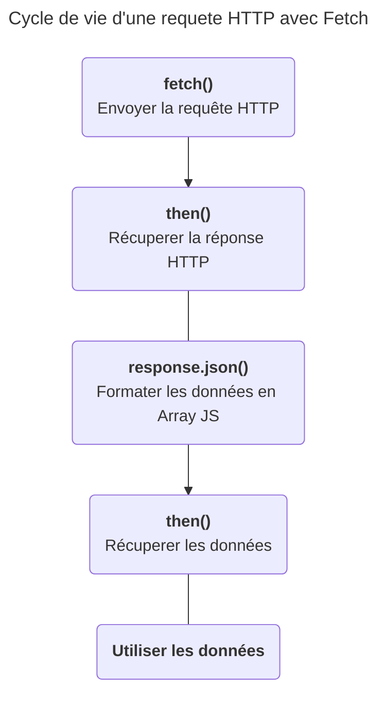
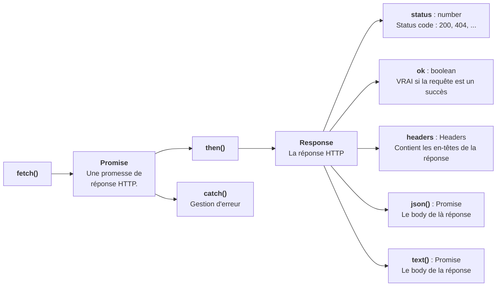

# L'API Fetch, récupérer des données depuis un serveur.
Pré-requis : https://developer.mozilla.org/fr/docs/Web/HTTP/Overview#les_messages_http
## I - Qu'est ce que c'est ?
L'*API Fetch* est un client HTTP utilisable en JavaScript. Au même titre que les objets : `console`, `document` ou `localStorage` l'*API Fetch* est accesible via l'objet window. 

**L'API Fetch est utilisable via la méthode `window.fetch`.**
```js
fetch(url : string,options : Object) : Promise<Response> 
```

Comme dit plus haut `fetch` est un client HTTP, ce qui signifie qu'il permet d'envoyer une requête HTTP à un serveur HTTP et ainsi reçevoir une réponse HTTP.

Votre navigateur est déjà capable d'effecter des requêtes HTTP. Il le fait d'ailleurs à chaque chargement de page. `Fetch` permet simplement de récupérer des données sans charger toute une nouvelle page. Les données les plus courantes peuvent être :
- Une liste de produits d'une boutique en ligne qui change en fonction d'un filtre de prix.
- Des suggestions de recherche lorsque l'utilisateur tape au clavier.
- Des données géographiques du serveur de google maps.
- L'envoie d'un message via un formulaire sans recharger toute la page.
- La mise en ligne d'un tweet sur twitter.
- L'affichage des posts Facebook au fur et à mesure du défilement de la page.

Toutes ces opérations neccessites l'envoi d'une requête HTTP à un serveur, mais neccessites également de rester sur la page actuel. Il faut donc envoyer la requête en JavaScript via la méthode `fetch`.

>##### L'envoi de requête HTTP avant `fetch` :
>
>Avant l'envoi de requêtes HTTP en JavaScript, la seule façon de récupérer ou d'envoyer des données à un serveur HTTP était via les formlaires, l'url et le langage PHP. 
>PHP s'execute sur le serveur et génère le HTML coté serveur, il fallait donc recharger toute la page à l'utilisateur pour recevoir la réponse HTTP.
>Ce qui rendait la navigation sur le web bien moins fluide que sur des applications mobile ou bureau.

### Comment se servir de la méthode `fetch()` ?
*Documentation MDN* : https://developer.mozilla.org/fr/docs/Web/API/Fetch_API/Using_Fetch

Dans la plupart des cas un serveur de données ne renvoi pas du HTML mais du JSON, un format de données représentant un tableau d'objet JavaScript sous la forme d'une string.

*Fetch* signifie *récupérer* un anglais et *then* signifie *ensuite*. Il faut voir la syntaxe de fetch comme ceci : 

1. "I **fetch** some data from an url ..."
2. "**then** I transform the JSON response to a JavaScript array ..."
3. "**then** I use the data."

#### Code : 
```js
fetch(url)          // Remplacez l'url par l'url de la requête HTTP à executer
.then(function(reponseHTTP){    // La fonction callback fournit la réponse HTTP
    // Les données JSON sont transformées en un tableau JS
    return reponseHTTP.json();      
})
.then(function(data){    // la 2nd fonction callback fournit les données   
    console.log(data);
    // Utiliser les données ici ...
});
```


Vous pouvez tester le coder suivant avec l'url suivante : https://pokebuildapi.fr/api/v1/pokemon/limit/10. Remplacez `url` par l'url.
Vous aurez les dix premier pokemons affichés dans la console du navigateur.

Rendez-vous sur le site de l'api pokebuild pour expérimenter avec `fetch` !
https://pokebuildapi.fr/api/v1

> **Remarque - Passage à la ligne avant `.then`**
> La méthode `then` est une méthode de la classe `Promise`, la méthode `fetch` renvoie une ``Promise``. Ici l'appel de la méthode `then` est passée à la ligne pour plus de lisbilité mais ce n'est pas du tout obligatoire. L'on pourrait faire `fetch(url).then(...)` comme l'on ferait `console.log(...)`.

> **Remarque - Syntaxe raccourcis**
> L'exemple précedent utilise la syntaxe classique des fonctions anonyme, la syntaxe *fonction fléchée* est plus souvent utilisé pour les fonctions callback en JS, y compris la fonction callback en paramètre de la méthode `fetch.then`.
> ```js
> fetch(url)
>.then((reponseHTTP)=>reponseHTTP.json())
>.then((data)=>{
>    console.log(data);
>});
>```
>Ce code produit exactement le même résultat. 
Voir les fonctions fléchées sur la MDN : https://developer.mozilla.org/fr/docs/Web/JavaScript/Reference/Functions/Arrow_functions


## II - Anti-sèche - à retenir
### Code
```js
fetch(url).then(response=>response.json())
.then((data)=>{
    console.log(data);
    // Utilisez les données ici ...
})
.catch(err=>console.warn(err.message));
```
### Encapsulation des éléments.

### Documentations notables
- fetch() : https://developer.mozilla.org/fr/docs/Web/API/Fetch_API/Using_Fetch
- Promise : https://developer.mozilla.org/fr/docs/Web/JavaScript/Guide/Using_promises
- Promise.prototype.then() : https://developer.mozilla.org/fr/docs/Web/JavaScript/Reference/Global_Objects/Promise/then
- Promise.prototype.catch() : https://developer.mozilla.org/fr/docs/Web/JavaScript/Reference/Global_Objects/Promise/catch
- Response : https://developer.mozilla.org/en-US/docs/Web/API/Response
- Response.prototype.json() : https://developer.mozilla.org/en-US/docs/Web/API/Response/json
- Response.prototype.text() : https://developer.mozilla.org/en-US/docs/Web/API/Response/text

## III - La méthode fetch
La méthode `fetch` de l'objet `window` renvoi un objet de la classe `Promise` fournissant une réponse HTTP, soit : "une promesse de réponse HTTP". Elle prend en paramètre obligatoire l'url du serveur (`string`) vers lequel effectuer la requête HTTP.

**Défintion de la fonction**

```js
fetch(url [,options]) : Promise<Response> 
```
> Les paramètres notés entre crochets *[]* sont optionnels, cette norme est utilisée dans la plupart des documentations technique.
> ```js
>functionName(param [,paramOptionel1,paramOptionel2])
>```
> Ici *param* est obligatoire alors que *paramOptionel1* et *2* non.

> Les double points *:* après la fonction signifie le type de la velur de retour de la fonction, ici un objet de la classe `Promise` qui fournira un objet de la classe `Response`.
> ```js
>prompt(message) : string
>```

### Paramètres
#### `url : string`
Une chaine de caractère contenant l'URL de la ressource demandée

Cela peut etre une nom de domaine comme https://www.leboncoin.fr/voitures/offres, une adresse ip comme 127.0.0.1:8000/users ou encore la route d'une API REST fournissant du JSON comme l'api pokebuild : https://pokebuildapi.fr/api/v1/pokemon/limit/10

#### `options : Object`
Un objet JavaScript possédant de nombreux attributs optionnel, les plus utiles étant :

- `method` : `string` - Une string contenant la méthode HTTP à utiliser (`GET`, `POST`, `DELETE`, ...). Par défaut `"GET"`.
- `headers` : `Headers` - Un objet de la classe `Headers` contenant les eventuels Header HTTP à utiliser comme "Content-type : application/json" par exemple pour envoyer du JSON.
- `body` : `string` - Le body de la requete HTTP, la plupart du temps vous fournirez une string JSON mais d'autre formats sont possibles.

Voir la MDN pour plus d'attributs.

### Valeur de retour
La méthode `fetch` permet d'effectuer une requête et renvoie "une promesse de réponse HTTP", c'est à dire un objet de la classe `Promise` qui fournit un objet de la classe `Response` lors de sa résolution.
En JavaScript une `Promise` est un objet que l'on utilise lorsque une action neccessite un certain temps à s'accomplir comme la lecture d'une fichier ou encore la reception d'une réponse HTTP.

#### La problématique du temps de réponse
Une réponse HTTP met à minima plusieurs centaines de milisecondes à arriver alors qu'une ligne de code met environ quelques milisecondes à s'executer. Il y a donc un soucis : le code s'execute plus vite que le temps de réponse.

La solution à un cas comme celui-ci est l'asyncrone. C'est à dire une ligne de code qui ne va pas s'executer avant un temps plus ou moins connu. Vous avez déjà connu ce cas de figure par le passé avec pour des méthodes ancestrales du JavaScript comme`addEventListener` ou `setTimeout`.
```js
const button = docuement.querySelector(".button_validate");
console.log("1");
button.addEventListener("click",()=>{
    console.log("2");
});
console.log("3");
/* --- Résultat --- */
> 1
> 3
> 2
```
Les `console.log()` ne s'executes pas de haut en bas comme habituellement en programmation. L'action est donc asyncrone.

```js
console.log("1");
setTimeout(()=>{
    console.log("2");
},1000);
console.log("3");
/* --- Résultat --- */
> 1
> 3
> 2
```
Même chose avec `setTimeout`, `"2"` sera affiché dans la console une seconde après la fin du script, soit après l'affichage de `"3"`.

Vous remarquez que le code asyncrone utilise les fonctions callback : "Dans X secondes tu appel cette fonction", "Quand il se passe cette evenement tu appel cette fonction".
> Une fonction callback est une fonction passée en paramètre d'une fonction.

## IV - Les Promises - l'asyncrone
### Théorie
Imaginez. 
Vous etes au restaurant et vous demandez un café au serveur, seulement le serveur ne peut pas faire instantanement apparaitre un café sur votre table quand vous le demandez, alors il vous fait une promesse : 
\- "Je vous ramène votre café dans quelques instants." et  quelque instant plus tard le serveur revient avec le résultat de sa promesse.
\- "Voici votre café !"
Magnifique !

Lorsque vous avez demandez un café, le serveur vous à fournit un objet : **une promesse** intangible d'un café à venir et en tant qu'être humain vous etes tout à fait à l'aise avec ce concept ! Vous demandez quelque chose et l'on vous donne, non pas la chose demandée mais une promesse, puis la chose demandée arrives au bout d'un certain temps.

En JavaScript les choses fonctionne de la même manière. Le serveur est la méthode `fetch` qui vous fournit une promesse. 
```js
const promise = fetch(url);
```
### La méthode Response.prototype.then()
```js
Promise.prototype.then(callback : Function) : Promise
```
Le résultat de la promesse n'est pas un café mais une réponse HTTP fournit dans la méthode `then`.
```js
promise.then(function(response){
    /*Buvez votre café...*/
    /*Ou plutôt consommez votre réponse HTTP.*/
})
```
> L'objet response fournit dans la méthode `then` est un objet de la classe `Response`. Il possède donc des attributs et des méthodes relative à une réponse HTTP, on peut accèder au code de status(200,404,500) au headers et surtout au body (HTML pour une page, JSON pour une donnée).

Les `Promises` sont une façon moderne de gérer l'asyncrone en JavaScript. Elle s'utilise en deux étapes : la création d'une promise puis le passage de la fonction callback de resolution qui fournit la donnée demandée via à la méthode `then`.
```js
console.log("1");
const promise = fetch(url);
promise.then((response)=>{
    console.log("2");
})
console.log("3");
/* --- Résultat --- */
> 1
> 3
> 2
```
> La `Promise` "travail" et excutera votre fonction callback quand elle aura fini de "travailler". Dans le cas de la `Promise` crée par `fetch`, lorsqu'elle recevra la réponse HTTP du serveur.

On recupère le résultat d'une promise en tant que paramètre de la fonction callback présente dans le `then`, ce qui signifie que le résultat est accesible uniquement localement dans cette fonction callback. Cela n'est pas gênant et nous permettra tout de même d'effectuer des `querySelector`, `createElement`, ou `addEventListener`; il nous faudra cependant les écrires dans la fonction callback du `then`.

#### Enchainer les `then`
Chose importante à savoir la méthode `then` renvoi la `Promise` appelante se qui permet d'echainer les appels de `then`.

```js
console.log("Début");
let promise = fetch("https://api.open-meteo.com/v1/forecast?latitude=48.8534&longitude=2.3488");
promise.then(response=>{
    console.log("1er then !");
})
.then(()=>{
    console.log("2eme then !");
})
.then(()=>{
    console.log("3eme then !");
});
console.log("Fin");

> Début
> Fin
> 1er then !
> 2eme then !
> 3eme then !
```
Les `then` s'echaine à la manière d'une phrase en anglais.

> Pour qu'une méthode renvoie son objet appelant il suffit qu'elle renvoie `this`.
>```js
>const objet = {
>    compteur : 0,
>    add(){
>        this.compteur++;
>        return this;
>    }
>}
>objet.add().add().add().add();
>console.log(objet.compteur);        // => 4
>```
>`this` == `objet`.

#### La valeur de retour de la fonction callback de la méthode `then`
Si l'on place un `return` dans la fonction callback celle ci va fournir sa valeur de retour en paramètre du `then` suivant.

```js
let promise = fetch("https://api.open-meteo.com/v1/forecast?latitude=48.8534&longitude=2.3488");
promise.then(response=>{
    return "Je viens du 1er then !";
})
.then((value)=>{
    console.log(value);     // => "Je viens du 1er then !"
    return "Je viens du 2eme then !";
})
.then((value)=>{
    console.log(value);     // => "Je viens du 2eme then !"
});
```

#### Retourner une `Promise` dans la fonction callback de la méthode `then`
Si l'on retourne une `Promise` dans la callback d'un `then`, le `then` suivant ne fournira pas la `Promise` mais la donnée promise par la `Promise`.
C'est exactement ce qui se passe lorsque l'on utilise la méthode `response.json()` pour récuéper un objet JavaScript à partir du body de la réponse HTTP reçu.
```js
const promise = fetch(url)
promise.then((response)=>{
    return response.json();     // json() renvoie une Promise
})
.then((data)=>{  // Le résultat de cette Promise est le paramètre data
    console.log(data);
});
```
Ce fonctionnement évite de dévoir imbriquer des `Promises` dans des `Promises` de cette façon : 
```js
const promise = fetch(url)
promise.then((response)=>{
    response.json().then(data=>{
        console.log(data);
    });
});
```
### Gérer les erreurs avec les `Promises`
```js
Promise.prototype.catch(callback : Function) : Promise
```
Si une erreur apparait lors qu'une promise la méthode `catch` est disponible. La méthode catch fonctionne de la même manière que then à la différence que sa fonction callback contient l'erreur.
```js
const promise = fetch(url)
promise.then((response)=>{
    return response.json();     // json() renvoie une Promise
})
.then((data)=>{  // Le résultat de cette Promise est le paramètre data
    console.log(data);
})
.catch((error)=>{
    console.error(error.message);
})
```
`error` est un objet de la classe `Error`.
> Une bonne pratique consite à toujours ajouter un `catch` au appel de `Promise`. La manque de `catch` est un indice d'un code trop fragile.

## V - L'objet Response
L'objet `Response` est le resultat d'une `Promise` fabriquée par la méthode `fetch`. C'est la représentation objet d'une réponse HTTP.
Comparons une réponse HTTP brut reçu avec un client HTTP comme REST Client ou Postman avec l'objet `réponse` reçu par `fetch`.

Soit la requête suivante :
```http
GET https://api.open-meteo.com/v1/forecast?latitude=48.8534&longitude=2.3488 HTTP/2
```
Envoyé avec fetch comme ceci :
```js
fetch("https://api.open-meteo.com/v1/forecast?latitude=48.8534&longitude=2.3488");
```

On reçoit cette réponse HTTP :
```http
HTTP/2 200 
Content-type: application/json;

{
    "latitude":48.86,
    "longitude":2.3399997,
    "generationtime_ms":0.0020265579223632812,
    "utc_offset_seconds":0,
    "timezone":"GMT",
    "timezone_abbreviation":"GMT",
    "elevation":43.0
}

```
L'objet réponse fournit dans le `then` :
```js
Response{
    body: ReadableStream { locked: false }
    bodyUsed: false
    headers: Headers { "content-type" → "application/json; charset=utf-8" }
    ok: true
    redirected: false
    status: 200
    statusText: ""
    type: "cors"
    url: "https://api.open-meteo.com/v1/forecast?latitude=48.8534&longitude=2.3488"​
}
```

L'objet reponse contient des attributs analogue à la réponse HTTP brut :
- `200` - l'attribut status, 200 signifie un succès.
- `Content-type : application/json` - fournit dans l'attributs headers

### Accéder au body de la réponse
La réponse HTTP présente dans le `then` ne fournit pas directement le body JSON, il nous faut y accéder via la méthode Response.protoype.json(). 
La conversion d'un body JSON en tableau JS peut etre une opération lourde et peux parfois echouer en cas d'erreur dans le JSON, voilà pourquoi il nous faut une promise pour la conversion.

#### La méthode `json()` de la classe `Response`
```js
Response.prototype.json() : Promise<Objet | Array>
```
La méthode `response.json()` renvoi une `Promise` qui se résout en un objet JavaScript.
> Si le body contient un tableau JSON la `Promise` fournira un tableau JavaScript.

```js
fetch("https://api.open-meteo.com/v1/forecast?latitude=48.8534&longitude=2.3488")
.then(response=>{
    return response.json();
})
.then(data=>{
    console.log(data);
});
```
L'objet data ressemble à ceci :
```js
Object ​{
    elevation: 43
    generationtime_ms: 0.0010728836059570312
    latitude: 48.86
    longitude: 2.3399997
    timezone: "GMT"
    timezone_abbreviation: "GMT"
    utc_offset_seconds: 0
}
```
L'objet data possède des attributs analogue au body de la réponse HTTP brut :
```http
HTTP/2 200 
Content-type: application/json;

{
    "latitude":48.86,
    "longitude":2.3399997,
    "generationtime_ms":0.0020265579223632812,
    "utc_offset_seconds":0,
    "timezone":"GMT",
    "timezone_abbreviation":"GMT",
    "elevation":43.0
}
```

#### La méthode `text()` de la classe `Response`
```js
Response.prototype.text() : Promise<string>
```
La méthode `response.text()` fonctionne comme `response.json()` à la différence qu'il ne produit pas un objet JavaScript à partir de JSON mais une `string` à partir du body de la réponse HTTP, quel qu'il soit.
Cela permet de récupérer le texte brut de la réponse.