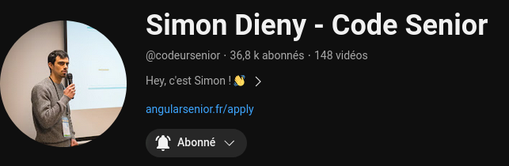
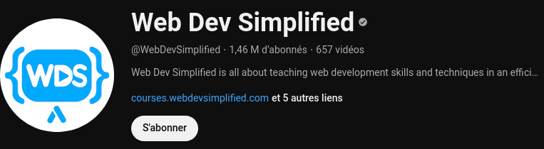

# Bibliographie et ressources en ligne JavaScript

L'apprentissage de la programmation et la conception de programme passe TOUJOURS par une lecture des livres de référence et des documentations en ligne. Certes les forums comme stackoverflow ou openclassrooms apporte une aide ponctuel intéressente, mais la compréhension et la stabilité du programme depent de votre connaissance réel de son fonctionnement.

Voilà pourquoi les livres et la Doc vous accompagnera tout au long de votre vie de développeur. Au départ, vous allez être retissant à son utilisation ( comme tout le monde) seulement l'absence de lecture de la documentation fait de vous un mauvais codeur à coup sûr.

# Documentation en ligne
## La MDN - mozilla developper network
La MDN est LA documentation du developpeur front-end (HTML/CSS/JS). Vous y trouverez des guides et la référence détailler de toutes les fonctions et objets du lanagage JavaScript en front-end(Nodejs exclu).
- Guide "Apprendre le JavaScript" : https://developer.mozilla.org/fr/docs/Web/JavaScript
- Référence de toutes les fonctions et objets du langage JavaScript : https://developer.mozilla.org/fr/docs/Web/JavaScript/Reference

## W3Schools
W3schools est un site web qui décrit de façon presque exhaustive tout  les lanagage. La différence avec MDN est que les explications vont à l'essentiel ce qui en fait un allié de poids lorsque l'on souhaite avoir une explication rapide d'un concept.
Lien de w3s : https://www.w3schools.com/js/

# Livres papier
##  JavaScript: The Definitive Guide 
JavaScript the definitve guide est un ouvrage écrit en anglais qui est la référence du Langage JavaScript. Il est absolument complet concernant le langage JavaScript en lui même sans forcement aborder specifiquement le devleoppeur front-end ou bakc-end.

Lien Fnac : https://www.fnac.com/livre-numerique/a14785650/David-Flanagan-JavaScript-The-Definitive-Guide

# Chaines youtube
## Simon Dieny - Code Senior

Description de sa chaîne : " Mon objectif à travers cette chaîne est de faire monter le niveau de notre métier de développeur.
Il est temps d'arrêter de se poser la question "Comment coder X", mais "Pourquoi coder X comme ça et pas autrement ?".
C'est cette démarche qui vous permettra de produire du "code SENIOR".

Qu'est-ce que le code SENIOR ?

C'est le code professionnel, de la vraie vie.
Au-delà du code "qui marche".

Pour de vrais clients.
Avec des vraies deadline.
Avec des vrais budgets.

Si votre objectif est actuellement de devenir développeur professionnel, cette chaîne se veut le point de départ de votre nouvelle carrière...

Excellent début apprentissage,
Simon."

Lien : https://www.youtube.com/@codeursenior

## Web Dev Simplified

Chaine en anglais très complète avec des vidéos simples et efficace sur comment coder ceci ou cela. Un très bon complément pour les débutants à la chaine de Simon.

Lien : https://www.youtube.com/@WebDevSimplified