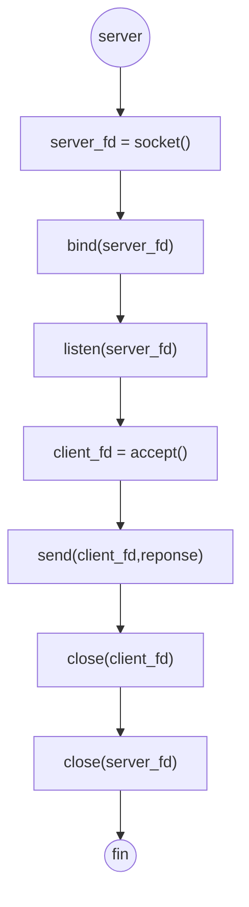

# Gérer plusieurs clients à la fois avec le multithreading

## Exemple de code d'un serveur web ici :
https://github.com/CHAOUCHI/tcp-socket/settings

>Il ne fait pas de sens pour un serveur de vouloir écrire dans son propre socket, ce socket ne sert qu’à gérer les connexions. 

> Le socket client est toujours synchronisé avec sa copie côté serveur. 


## Exercie 1
Pour ce premier exercice nous allons uniquement coder le serveur, nous utiliserons google chrome comme client TCP.

Faite un serveur TCP qui renvoie une réponse http au client pour afficher une page HTML.



En effet chrome est un client HTTP et le protocole HTTP est par dessus le TCP dans le modèle OSI. Chrome est donc par extension un client TCP valide.

Cependant pour qu'une page HTML s'affiche il faut respecter le format HTTP.

Une réponse HTTP ressemble à ça : 

```http
HTTP/1.1 200 OK

<h1>Hello World !</h1>
```
*Voir la RFC HTTP(6.Response) : https://datatracker.ietf.org/doc/html/rfc2616#section-6*

Vous pouvez former la réponse à envoyer au client comme ceci :
```c
char reponse[BUFSIZ];memset(response,0,BUFSIZ);
sprintf(reponse,"HTTP/1.1 200 OK\n\n<h1>Hello World!</h1>");
```

pour ensuite l'envoyer au serveur comme ceci.
```c
send(client_fd,message,strlen(message),0);
```

> Rappel un client place SON PROPRE SOCKET dans la fonction send pour envoyer un message au serveur. En aucun cas le client ne peut placer le socket serveur dans send comme pour dire : "Envoyer un message au server". Il faut plutot voir les socket comme des boites aux lettres, le client pose sont message dans la boite au lettre(socket client) et le serveur lit la boite avec recv().

## Exercice 2
Acctuelement le server
2.	Faite un server tcp qui retourne à un état accept après avoir close la connexion au client.

3.	Créez un client TCP qui envoie un requête au serveur et affiche sa réponse

4.	Faite un serveur tcp qui peut traiter plusieurs connexion clients en même temps. Pour ceci vous aurez besoin d’un tableau d’int pour stocker les socket clients et de multithreading pour traiter les accept en même temps que les recv -->