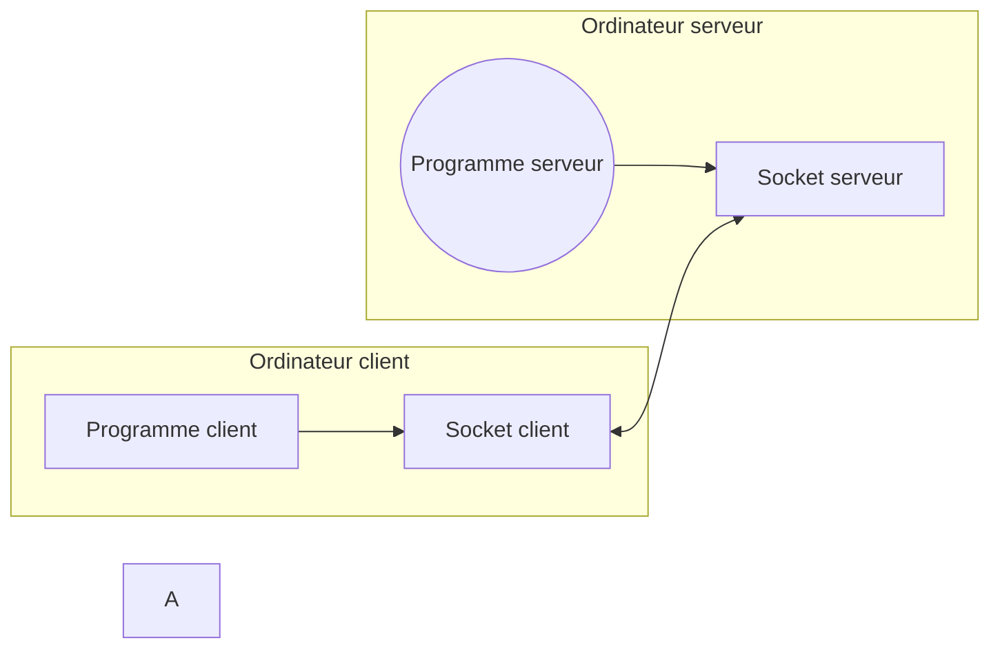

# Socket TCP 

## Les fichiers sockets des *tuyaux de données*

Les socket est une API du kernel linux qui permet d’envoyer des octets de données à un autre programme exécuté par un autre ordinateur sur le réseau internet.

Les deux programmes possèdent chacun un fichier spécial appelé socket. Un socket est un fichier linux classique hormis qu’il est « connecté » au serveur. 
Les données placés sur le fichier socket du client ressortent sur le fichier socket du serveur comme un tuyau transporte de l’eau. 

## Le protocle TCP

Le TCP est un protocole fiable avec connexion. 

C’est à dire que les données sont garanties sans perte via un système de vérification de la bonne réception des données à chaque envoi.

Ont dit protocole avec connexion car avant l’envoi de données il faut d’abord se connecter à un socket server, un fois la connexion acceptée les données peuvent être envoyées vers le socket serveur, le socket server les liras dans l’ordre dans lequel le client les a écrit dans son socket. 

Vous pouvez voir un socket TCP comme une « tuyauterie » direct entre un client et un serveur. Une fois la connexion établie il suffit d’envoyer de l’eau dans le tuyau (écrire sur le socket) pour envoyer les données au serveur. De la même façon il suffit de regarder (lire le socket) le tuyau pour récupérer des données entrantes.

Le TCP permet donc une connexion dans les deux sens entre client et serveur : une connexion duplex donc (dans les deux sens). 

Il y a deux types de sockets : 

⁃ Les sockets clients qui se connectent(Connect)à un serveur pour ensuite envoyer(send)ou recevoir(rcv) des données au serveur.

⁃ Les sockets serveur qui écoute(listen) les requêtes de tout client qui souhaite se connecter au serveur, puis accepte (accept) la connexion et récupère une « copie » du socket client. Ce socket client présent côté server est en quelques sortes l’autre extrémité de la tuyauterie mise en place par le client avec le socket. 

Si le client veut communiquer avec le serveur il lui suffit de lire/écrire dans son socket. 

Si le serveur veux communiquer avec un client il lui faut écrire/lire sa copie du socket client côté. 

Il est interessant de noter que du point de vu du client son socket est un seul et unique « tuyau » qui se branche au serveur. 
Alors que le serveur lui possède autant de tuyaux que de clients dont la connexion a été acceptés. 

Également le socket personnel du serveur est verrouillé si il écoute(listen) les demandes de connexion des clients. 

On ne peut donc ni lire ni écrire directement sur le socket server. Comme dit plus haut pour communiquer avec un client le serveur doit écrire/lire sa copie du socket client. 

## Exemple de code d'un serveur web ici :
https://github.com/CHAOUCHI/tcp-socket/settings

>Il ne fait pas de sens pour un serveur de vouloir écrire dans son propre socket, ce socket ne sert qu’à gérer les connexions. 

> Le socket client est toujours synchronisé avec sa copie côté serveur. 

