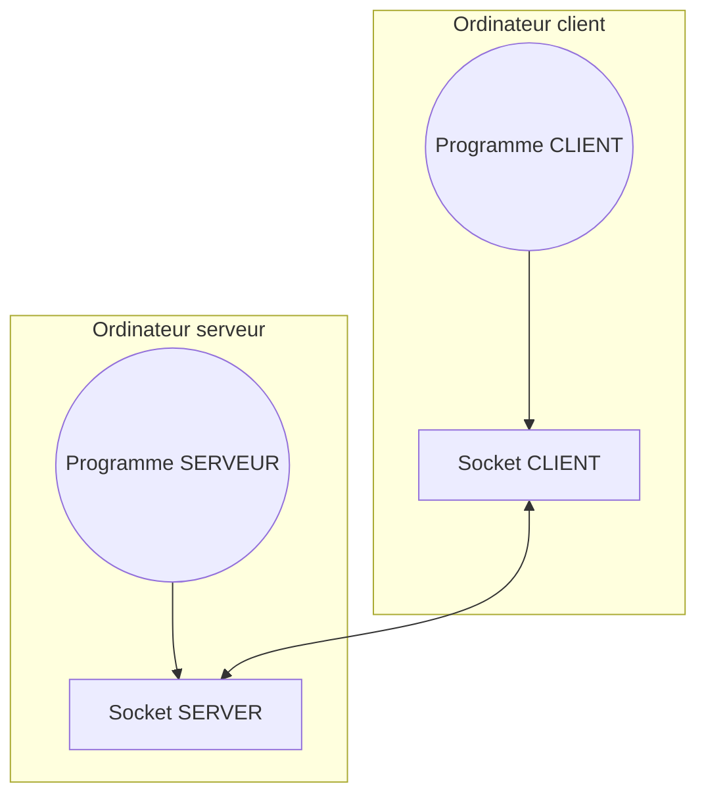
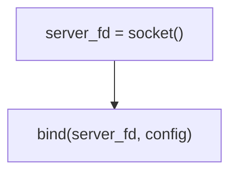
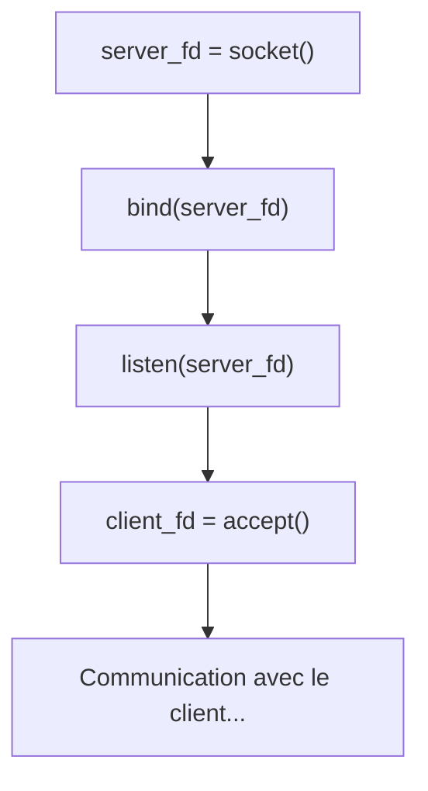
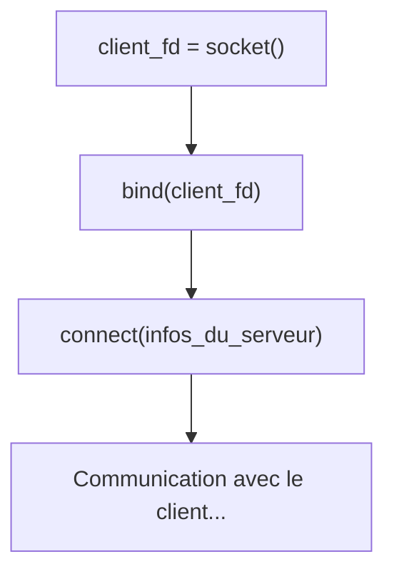
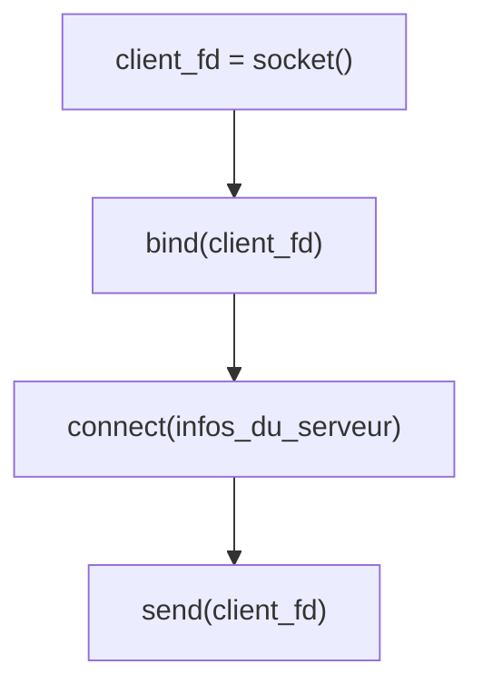
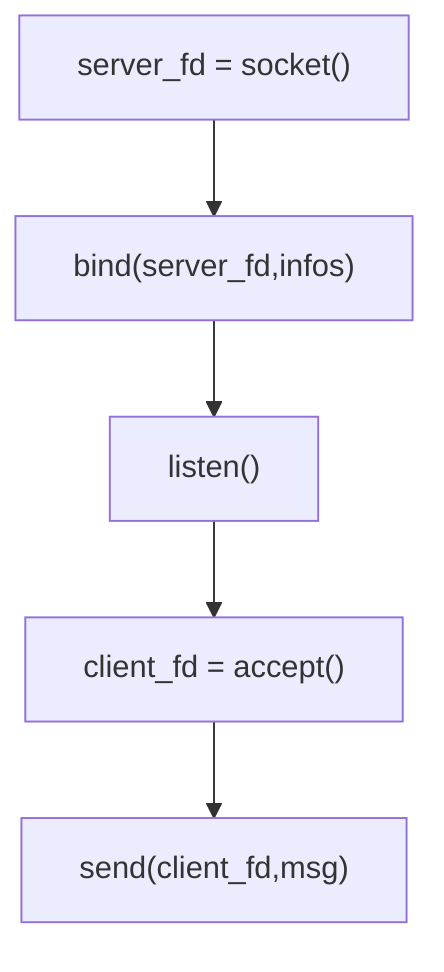

# Socket TCP 

## Les fichiers sockets des *tuyaux de données*

Socket est une API du kernel Linux qui permet d’envoyer des octets de données à un autre programme exécuté par un autre ordinateur sur le réseau internet.



Les deux programmes possèdent chacun un fichier spécial appelé socket. Un socket est un fichier linux « connecté » au serveur.
Les données placées sur le socket du client ressortent sur le fichier socket du serveur comme un tuyau transporte de l’eau. 


## Le protocle TCP

Le TCP est un protocole fiable avec connexion. 

C’est à dire que les données sont garanties sans perte via un système de vérification de la bonne réception des données à chaque envoi.

Ont dit protocole avec connexion car avant l’envoi de données il faut d’abord se connecter à un socket server, un fois la connexion acceptée le client peut envoyer des données au serveur et le serveur au client.

Vous pouvez voir un socket TCP comme une « tuyauterie » direct entre un client et un serveur. Une fois la connexion établie il suffit d’envoyer de l’eau dans le tuyau (écrire sur le socket) pour envoyer les données au serveur. De la même façon il suffit de regarder (lire le socket) le tuyau pour récupérer des données entrantes.

Le TCP permet donc une connexion dans les deux sens entre client et serveur : une connexion duplex donc (dans les deux sens). 

Il y a deux types de sockets : 

⁃ Les sockets clients qui se connectent(Connect)à un serveur pour ensuite envoyer(send)ou recevoir(rcv) des données au serveur.

⁃ Les sockets serveur qui écoute(listen) les requêtes de tout client qui souhaite se connecter au serveur, puis accepte (accept) la connexion et récupère une « copie » du socket client. Ce socket client présent côté server est en quelques sortes l’autre extrémité de la tuyauterie mise en place par le client avec le socket. 

Si le client veut communiquer avec le serveur il lui suffit de lire/écrire dans son socket. 

Si le serveur veux communiquer avec un client il lui faut écrire/lire sa copie du socket client. 

Il est interessant de noter que du point de vu du client son socket est un seul et unique « tuyau » qui se branche au serveur. 
Alors que le serveur lui possède autant de tuyaux que de clients dont la connexion a été acceptés. 

Également le socket personnel du serveur est verrouillé si il écoute(listen) les demandes de connexion des clients. 

On ne peut donc ni lire ni écrire directement sur le socket server. Comme dit plus haut pour communiquer avec un client le serveur doit écrire/lire sa copie du socket client. 

# Créer un socket
Que se soit pour un client ou un serveur la création d'un socket se passe toujours de la même façon.

1. La **création** d'un file descriptor et donc d'un **socket** avec la fonctin `socket()`
2. La liaison (`bind()`) du socket à une **adresse ip** et un **port**.

## Initaliser un socket
```c
#include <stdio.h>
#include <stdlib.h>
#include <sys/socket.h>
#include <netdb.h>
#include <arpa/inet.h>
#include <unistd.h>
#include <string.h>


#define SOCKET_PORT 3000

int main(){

    /**
    * socket
    * Je crée le socket client
    */
    int socket_fd = socket(AF_INET,SOCK_STREAM,0);perror("socket");
    // Si la création échoue je ferme mon programme
    if(socket_fd == -1) return EXIT_FAILURE;

    /**
     * bind
     * Je relie le socket à un port et une ip avec la fonction bind()
     */
    struct sockaddr_in socket_addr = {
        .sin_addr.s_addr = INADDR_ANY, // Adresse localhost et LAN
        .sin_family = AF_INET,
        .sin_port = htons(SOCKET_PORT)
    };
    int error = bind(socket_fd,(struct sockaddr*)&socket_addr,sizeof socket_addr);perror("bind");
    if(error == -1) { close(socket_fd); return EXIT_FAILURE; }


    //...

    return EXIT_SUCCESS;
}
```
> `perror()` affiche le contenu de la constante `errno`. Cette constante est remplit par le kernel linux quand un appel système (comme `socket()`, `bind()` ou `write()`) échoue.

## L'appel système `socket()`
La définition de la fonction socket est la suivante :

```c
#include <sys/socket.h>

int socket(int domain, int type, int protocol);
```

Notre appel ressemble à ça :

```c
socket(AF_INET,SOCK_STREAM,0);
```

- Le `domain` correspond au type de réseau du socket. `AF_INET` permet de parcourir de domaine `IP`. J'aurais écrit `AF_UNIX` pour communiquer unqiuement en local sur la machine *UNIX-like*.

- Le `type` défini le type de données transmisent. `SOCK_STREAM` divise le données en petites parties appelés `paquet`, le **TCP** fonctionne anisi. `SOCK_DATAGRAM` envoit les données en un bloc entier appelé datagramme (comme un télégramme), l'*UDP* fonctionne anisi.

- `0` ne défini aucun protocole en particulié pour notre socket. La fonction socket choisi donc automatiquement un protocole adapté en fonction des domaine et type fournit précedemment.

### Paramètre du socket TCP
***Nous voulons faire un socket TCP il nous faut donc :***

- domain :  `AF_INET`
- type :  `SOCK_STREAM`
- protocole : `0`


```c
socket(AF_INET,SOCK_STREAM,0);
```


> Retrouvez tout les paramètres possibles sur la manpage de socket
>```bash
>man socket
>```

## L'appel système `bind()`
La liaison d'un socket à un port et une adresse ip se fait comme ceci : 

1. Je crée une struct qui contient le port, l'adresse ip et le domain du socket.

2. J'appel bind et je fournit :
    - le socket
    - la structure de configuration
    - la taille de la structure


```c
    /**
     * bind
     * Je relie le socket à un port et une ip avec la fonction bind()
     */
    struct sockaddr_in socket_addr = {
        .sin_addr.s_addr = INADDR_ANY,
        .sin_family = AF_INET,
        .sin_port = htons(SOCKET_PORT)
    };
    
    int error = bind(socket_fd,(struct sockaddr*)&socket_addr,sizeof socket_addr);perror("bind");
    
    if(error == -1) { close(socket_fd); return EXIT_FAILURE; }
```

### INADDR_ANY
INADDR_ANY est une constante qui définir l'addresse ip du socket comme etant :
- 127.0.0.1, le localhost. Il permet de communiquer uniquement sur son PC en local.
- 192.168.10.x le LAN. Il permet de communiquer avec un autre oridnateur.

L'avantage de INADDR_ANY c'est qu'il fonctionne automatiquement et ne nécessite pas de connaitre à l'avance l'adresse IP de l'hôte (PC) qui va lancer le programme. Cela évite d'ecrire en dur l'IP dans le code.

Je peux aussi utiliser la fonction `inet_addr` comme ceci pour définir une addresse IP précise :
```c
struct sockaddr_in client_addr = {
    // .sin_addr.s_addr = inet_addr("192.168.10.3"), // Dispo sur le LAN
    .sin_addr.s_addr = inet_addr("127.0.0.1"),      // Dispo en localhost
    .sin_family = AF_INET,
    .sin_port = htons(SOCKET_PORT)
};
```

### htons()
htons() permet de convertir le port de int vers un binaire correct.

### `struct sockaddr_in` ou `struct sockaddr` ?

La structure sockaddr_in défini des champs comme l'ip ou le port qui conviennent au socket TCP.
Par défaut la fonction `bind()` demande une `struct sockaddr`, seuelement les champs de cette structure sont brut de décofrage et difficile à manipuler. On préfère donc utilise la structure `struct sockaddr_in`.

Etant donné que `bind()` nous demande tout de même un `struct sockaddr*` j'effectue un transtypage vers ce type pour éviter un warning à la compilation.

### La deconnexion : l'appel système close()
L'appel système close ferme un file descriptor et le supprime du PC. Les sockets etant des fichiers close permet de couper la connexion.

Je ferme toutjours mes sockets si une errur fatale se produit.

> Il est possible de savoir si un utilisateur s'est déconnecté en observant la valeur de retour de la fonction `recv()`, si elle renvoi `0`alors le client est déconnecté.
> Nous verrons `recv()` plus tard dans le cours.


# Créer un serveur
Le TCP est protocle client-serveur il nous faut donc DEUX programmes : un client pour le socket client et un serveur pour le socket serveur.
Pour créer un serveur il faut :



```c 
#include <stdio.h>
#include <stdlib.h>
#include <sys/socket.h>
#include <netdb.h>
#include <arpa/inet.h>
#include <unistd.h>
#include <string.h>
#include <errno.h>

#include SERVER_PORT 3001

char buf[BUFSIZ];

int main(){

    /**
     * SOCKET
     * Je crée le socket serveur
     */
    int server_fd = socket(AF_INET,SOCK_STREAM,0);perror("socket");
    // Si la création échoue je ferme mon programme
    if(server_fd == -1) return EXIT_FAILURE;

    /**
    * BIND
    * Je relie le socket à un port et une ip avec la fonction bind()
    */
    struct sockaddr_in server_addr = {
        .sin_addr.s_addr = INADDR_ANY,
        .sin_family = AF_INET,
        .sin_port = htons(SERVER_PORT)
    };
    int error = bind(server_fd,(struct sockaddr*)&server_addr,sizeof server_addr);perror("bind");
    if(error == -1) { close(server_fd); return EXIT_FAILURE; }


    /**
     * LISTEN obligatoire 
     */
    error = listen(server_fd,BUFSIZ);perror("listen");
    if(error == -1) { close(server_fd); return EXIT_FAILURE; }

    printf("Server listen on port : %d\n",SERVER_PORT);
    

    /**
     * ACCEPT
     * J'attend qu'un client se connecter grâce à la fonction bloquante accept()
     * accept renvoi le client accepté ou -1 en cas d'erreur.
     */
    struct sockaddr_in client_addr;
    socklen_t len;
    int client_fd = accept(server_fd,(struct sockaddr*)&client_addr,&len);
    
    // LE PROGRAMME EST EN PAUSE ET ATTEND UN CLIENT ...

    perror("accept");
    if(client_fd == -1){ close(client_fd); close(server_fd); return EXIT_FAILURE; }
 
    // Prêt à communiquer avec le client
    // ...
    


    close(client_fd);
    close(server_fd);
    return EXIT_SUCCESS;    
}
```

## L'appel système `listen()`
Listen n'est pas très complexe il lance l'écoute du serveur et configure la congestion de celui-ci.

```c 
/**
* LISTEN obligatoire 
*/

error = listen(server_fd,BUFSIZ);perror("listen");

if(error == -1) { close(server_fd); return EXIT_FAILURE; }

printf("Server listen on port : %d\n",SERVER_PORT);
```

## L'appel système `accept()` (BLOQUANTE)

La fonction `accept()` est une **fonction bloquante**. C'est à dire qu'elle met en pause l'execution du programme jusqu'à ce qu'un client veuille se connecter.

- BLOQUANTE : Lorsque le client se connecter accept() est déclenché et renvoi le file descriptor du client.

- Return value : ***Le `client_fd` est très important et nous allons l'utiliser dans chacune de nos communications :  en reception, comme en envoi.***

- accept return `-1` en cas d'erreur.

- struct : `accept()` prend en paramètre une nouvelle `struct sockaddr_in`  complement vide. Cette struct sera rempli par accept à la connexion du client et contiendra son IP et son PORT si besoin.


> La fonction `accept()` agit de façon similaire à un `sleep()`

# Créer un client
Créer un client consiste à :
1. Créer un socket et le bind à un port et une ip (comme pour tout socket).
2. Connecter le socket au serveur en lui fournissant l'ip et le port du serveur via une variable de type `struct addr_in` contenant les infos du serveur.




## L'appel système `connect()` 
La fonction `connect()`

```c
#include <stdio.h>
#include <stdlib.h>
#include <sys/socket.h>
#include <netdb.h>
#include <arpa/inet.h>
#include <unistd.h>
#include <string.h>

#define SERVER_PORT 3001
#define CLIENT_PORT 4001

int main(){

    /**
     * socket
     * Je crée le socket client
     */
    int client_fd = socket(AF_INET,SOCK_STREAM,0);perror("socket");
    // Si la création échoue je ferme mon programme
    if(client_fd == -1) return EXIT_FAILURE;

    /**
     * bind
     * Je relie le socket à un port et une ip avec la fonction bind()
     */
    struct sockaddr_in client_addr = {
        .sin_addr.s_addr = INADDR_ANY,
        .sin_family = AF_INET,
        .sin_port = htons(CLIENT_PORT)
    };
    int error = bind(client_fd,(struct sockaddr*)&client_addr,sizeof client_addr);perror("bind");
    if(error == -1) { close(client_fd); return EXIT_FAILURE; }


    /**
     * connect
     * Je connecte mon socket client au socket server situé en 127.0.0.1:SERVER_PORT
     */
    struct sockaddr_in server_addr = {
        .sin_addr.s_addr = inet_addr("127.0.0.1"), // Attention à ne pas mettre INADDR_ANY !
        .sin_family = AF_INET,
        .sin_port = htons(SERVER_PORT)
    };
    error = connect(client_fd,(struct sockaddr*)&server_addr,sizeof server_addr);perror("connect");
    if(error == -1) { close(client_fd); return EXIT_FAILURE; }

    // SOCKET CLIENT PRET A COMMUNIQUER !
    //...

    close(client_fd);

    return EXIT_SUCCESS;

}
```

Si `connect : Sucessful` s'affiche votre client c'est bien connecté au serveur, faite bien attention à démarrer votre serveur AVANT votre client.

Attention à bien mettre des ports différents pour le client et le serveur Deux services TCP ne peuvent pasé avoir le même port.


### inet_addr()
Il faut préciser l'ip du serveur. Je ne peux pas me servir de INADDR_ANY car habituellement client et serveur ont des IP différente.
Le programme client étant suposer tourner sur un autre PC que le serveur je précise donc l'ip exact du serveur.
Ici j'utilise `127.0.0.1` car je suis entrain de faire tourner mon serveur en localhost sur le même PC que le client.

La fonction iner_addr() converti une string contenant une ip valide en une donnée binaire accepté par la `struct sockaddr_in`.

```c
inet_addr("127.0.0.1") // Addresse localhost
```
```c
inet_addr("192.168.10.x") // Addresse LAN
```
```c
inet_addr("back.monsite.com") // Nom de domaine DNS
```

# `send()` - Envoyer un message du client au serveur
Que vous soyez un client ou un serveur l'envoi d'un message se fait toujours via la fonction `send()`.




L'envoi d'une donnée se fait toujours via le socket client.

Pour envoyer `"Hello World !"` la fonction sera ecrite comme suit :

## Définition de la fonction `send()`: 
```c
send(int sockfd,void* buf, int buf_size, int flags);
```

### Exemple 1 : Hello World
*Un simple envoi sur le serveur d'un Hello World !*
```c
char message[] =  "Hello World !";
send(client_fd,message,strlen(message),0);
```

### Exemple 2: Tchat
Sur un client *tchat* je demande son message au client puis l'envoyer au serveur.
```c
// Une fois le client connecté

while(1){
    // Je demande le message à l'utilisateur
    char message[BUFSIZ];memset(message,0,BUFSIZ);
    fgets(message,BUFSIZ,stdin);

    // Je formate le message dans un buffer
    // [heure]pseudo : message...
    char buf[BUFSIZ];memset(buf,0,BUFSIZ);
    sprintf(buf,"[%d]%s:%s",time(NULL),pseudo,message);

    // J'envoi le message au serveur du salon de discussion
    send(client_fd,buf,strlen(buf),0);
}
```
 
> Pour l'instant il ne se passera pas grand chose sur le client visuellement.
> Pour que le serveur reçoivent bien notre send() il faudra utilisez la fonction recv() coté serveur donc.

## Code complet d'un client qui envoi un message au serveur
```c
#include <stdio.h>
#include <stdlib.h>
#include <sys/socket.h>
#include <netdb.h>
#include <arpa/inet.h>
#include <unistd.h>
#include <string.h>

#define SERVER_PORT 3001
#define CLIENT_PORT 4001

int main(){

    /**
     * socket
     * Je crée le socket client
     */
    int client_fd = socket(AF_INET,SOCK_STREAM,0);perror("socket");
    // Si la création échoue je ferme mon programme
    if(client_fd == -1) return EXIT_FAILURE;

    /**
     * bind
     * Je relie le socket à un port et une ip avec la fonction bind()
     */
    struct sockaddr_in client_addr = {
        .sin_addr.s_addr = INADDR_ANY,
        .sin_family = AF_INET,
        .sin_port = htons(CLIENT_PORT)
    };
    int error = bind(client_fd,(struct sockaddr*)&client_addr,sizeof client_addr);perror("bind");
    if(error == -1) { close(client_fd); return EXIT_FAILURE; }


    /**
     * connect
     * Je connecte mon socket client au socket server situé en 127.0.0.1:SERVER_PORT
     */
    struct sockaddr_in server_addr = {
        .sin_addr.s_addr = inet_addr("127.0.0.1"), // Attention à ne pas mettre INADDR_ANY !
        .sin_family = AF_INET,
        .sin_port = htons(SERVER_PORT)
    };
    error = connect(client_fd,(struct sockaddr*)&server_addr,sizeof server_addr);perror("connect");
    if(error == -1) { close(client_fd); return EXIT_FAILURE; }

    // SOCKET CLIENT PRET A COMMUNIQUER !
    int error = 0;
    while(error != -1){
        // Je demande le message à l'utilsiateur
        char message[BUFSIZ];memset(message,0,BUFSIZ);
        fgets(message,BUFSIZ,stdin);

        // Je formate le message dans un buffer
        // [heure]pseudo : message...
        char buf[BUFSIZ];memset(buf,0,BUFSIZ);
        sprintf(buf,"[%d]%s:%s",time(NULL),pseudo,message);

        // J'envoi le message au serveur du salon de discussion
        error = send(client_fd,buf,strlen(buf),0);
    }

    close(client_fd);

    return EXIT_SUCCESS;

}
```

> Voir *"le Code complet d'un serveur qui reçoit le message d'un client"* pour la reception du message par le serveur.

# `recv()` - Le Serveur reçoit un message (BLOQUANTE)
La reception d'un message se fait via la fonction `recv()`.

Comme `accept()` ou `sleep()` la fonction `recv()` est bloquante, c'est à dire que lorsque elle est appelée elle met en pause l'execution du fil d'execution jusqu'à ce que le socket reçoivent des données grâce à la fonction `send()`.

Etant donné que `recv()` attend des données du `send()` ou peut dire que chaque= appel de recv() sur le serveur doit correspondre à un appel de `send()` sur le client et vis versa.

Pour réagir au `send()` d'un client le serveur doit donc appeler un `recv()` sur le file descriptor du  client émetteur.

*J'accepte une connexion client pour obtenir son socket fd*
```c
//...
int client_fd = accept(server_fd,(struct sockaddr*)&client_addr,&len);
    
// LE PROGRAMME EST EN PAUSE ET ATTEND UN CLIENT ...
perror("accept");
if(client_fd == -1){ close(client_fd); close(server_fd); return EXIT_FAILURE; }
```

*Je remplit un buffer de char avec *
```c
// Prêt à communiquer avec le client

// Je crée mon buffer de char
char buf[BUFSIZ];memset(buf,0,BUFSIZ);
// Je remplis le Buffer quand je reçoit le send du client
recv(client_fd,buf,BUFSIZ,0);perror("recv()");
// J'affiche le message du client si je le souhaite
printf("%s\n",buf);
```


## Code complet d'un serveur qui reçoit un message du client

```c

#include <stdio.h>
#include <stdlib.h>
#include <sys/socket.h>
#include <netdb.h>
#include <arpa/inet.h>
#include <unistd.h>
#include <string.h>
#include <errno.h>

#include SERVER_PORT 3001

char buf[BUFSIZ];

int main(){

    /**
     * SOCKET
     * Je crée le socket serveur
     */
    int server_fd = socket(AF_INET,SOCK_STREAM,0);perror("socket");
    // Si la création échoue je ferme mon programme
    if(server_fd == -1) return EXIT_FAILURE;

    /**
    * BIND
    * Je relie le socket à un port et une ip avec la fonction bind()
    */
    struct sockaddr_in server_addr = {
        .sin_addr.s_addr = INADDR_ANY,
        .sin_family = AF_INET,
        .sin_port = htons(SERVER_PORT)
    };
    int error = bind(server_fd,(struct sockaddr*)&server_addr,sizeof server_addr);perror("bind");
    if(error == -1) { close(server_fd); return EXIT_FAILURE; }


    /**
     * LISTEN obligatoire 
     */
    error = listen(server_fd,BUFSIZ);perror("listen");
    if(error == -1) { close(server_fd); return EXIT_FAILURE; }

    printf("Server listen on port : %d\n",SERVER_PORT);
    

    /**
     * ACCEPT
     * J'attend qu'un client se connecter grâce à la fonction bloquante accept()
     * accept renvoi le client accepté ou -1 en cas d'erreur.
     */
    struct sockaddr_in client_addr;
    socklen_t len;
    int client_fd = accept(server_fd,(struct sockaddr*)&client_addr,&len);
    
    // LE PROGRAMME EST EN PAUSE ET ATTEND UN CLIENT ...

    perror("accept");
    if(client_fd == -1){ close(client_fd); close(server_fd); return EXIT_FAILURE; }
 
    // Prêt à communiquer avec le client
    // ...
    char buf[BUFSIZ];memset(buf,0,BUFSIZ);
    
    recv(client_fd,buf,BUFSIZ,0);perror("recv()");
    printf("%s\n",buf);


    close(client_fd);
    close(server_fd);
    return EXIT_SUCCESS;
}
```

# Le Serveur envoie un message

Le serveur envoie un message de la même manière que le client avec `send(client_fd)`.



Le serveur accepte un client puis lui envoie une donnée.


# Le Client reçoit un message

Le client reçoit des messages avec la fonction recv() comme le serveur.


# Gérer la deconnexion
Pour déconnecter un socket il faut utiliser la fonction close().

```c
close(fd);
```

Lorsque l'on close une connexion on envoie message de deconnexion au serveur.

Pour savoir si un client c'est déconnecté il faut traiter les valeurs de retour de `recv()`.

- Si recv() renvoi 0 : Le client c'est deconnecté avec close() ou pour une autre raison : fermeture innopiné de l'application client, perte de connexion internet, plus de batterie sur son PC.

- Si recv() renvoi -1 alors une erreur est apparue.

Dans les deux cas la connexion est interompue.

```c
int error = recv(client_fd,buf,BUFSIZ,0);perror("recv()");
if(error == -1 || error == 0){
    // Error client déconnecté
    // Ici je gère la deconnexion
    close(client_fd);
}
```

# Gérer plusieurs clients à la fois avec le multithreading
// TODO