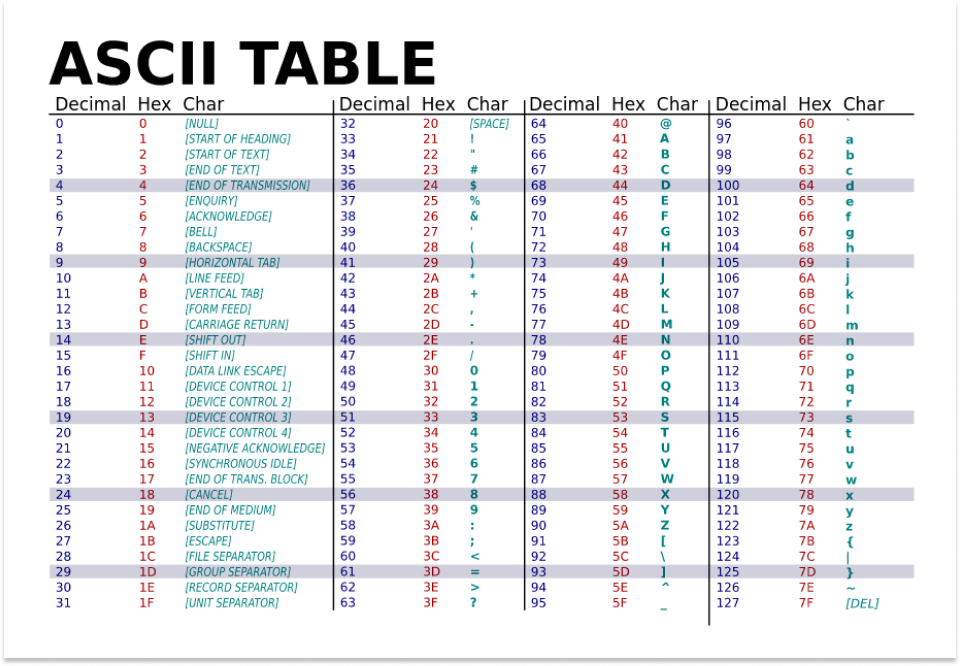

# String - les chaines de caractère
Les chaines de caractère (`string`) permettent de stocker des textes.

## Déclarer et remplir une chaine de caratère.

En langage C une string est une suite de `char` stockés dans un tableau les uns à la suite des autres.

```c
char prenom[5] = {'M','a','s','s','i'};
```

- Ici je déclare un tableau de 5 éléments de type `char`.
- J'y stock ensuite 5 `char` les uns à la suite des autres.

Comme ma string est un tableau je peux y accéder avec l'opérateur d'indexation `[]`.

> **Attention je rappel que les tableaux commence à l'index `0` !**
```c
char prenom[5] = {'M','a','s','s','i'};

printf("%c\n",prenom[0]); // M
printf("%c\n",prenom[1]); // a
printf("%c\n",prenom[2]); // s
printf("%c\n",prenom[3]); // s
printf("%c\n",prenom[4]); // i
```

1. Pour la string "Je suis un pigeon" afficher la lettre p et e.

Comme n'importe quel tableau je peux aussi changer ses éléments.
```c
char prenom[5] = {'M','a','s','s','i'};

prenom[0] = 'L';
printf("%c",prenom[0]); // L
```

1. Modifier la valeur des éléments pour former le mot "Manny".

## Parcourir une chaine de caractère
Nous avons vu que je peux accéder au caractère d'une string avec l'opérateur d'indexation en écrivant *en dur* les index : `0,1,2,3,4`.

Avec une boucle `for` je peux parcourir une chaine de caractère automatiquement grâce à une variable d'index i.

1. A partir de la boucle for suivante, affichez chaque élément de la string en passant à la ligne à chaque fois avec `\n`.
```c
#include <stdio.h>
#define TAILLE 5

int main(){
    char prenom[5] = {'M','a','s','s','i'};

    for(int i = 0;i < TAILLE;i++){
        printf("%c\n",/*Codez ici ..*/);
    }
    return 0;
}
```

> `#define` permet de définir une constante. Le compilateur remplacera toutes les utilisation de `TAILLE` par la valeur `5`. Ca nous évite de reécrire `5` à chaque fois et évite ainsi les erreurs de frappe.

Les éléments d'un tableau sont stocké à la suite en mémoire.

Vous pouvez afficher leurs adresses avec l'opérateur `&`.

```c
char prenom[5] = {'M','a','s','s','i'};
printf("%p",&(prenom[0]));
printf("%p",&(prenom[1]));
printf("%p",&(prenom[2]));
```

1. Afficher l'adresse de tout les élements. Que remarquez vous ?
2. Afficher l'adresse de tout les éléments avec une boucle `for`.

## La table ASCII
En informatique les caractères sont des nombres entiers de la table ASCII.

Par exemple :
- `'a'` est égale à `97`
- `'b'` est égale à `98`
- `'A'` est égale à `65`
- `'B'` est égale à `66`



Ici je peux voir la valeur ASCII de tout mes caractères.
```c
#include <stdio.h>
#define TAILLE 5

int main(){
    char lettres[5] = {'a','b','c','d','e'};

    for(int i = 0;i < TAILLE;i++){
        printf("%c : %d\n",lettres[i],lettres[i]);
    }
    return 0;
}
```

1. Afficher la valeur ASCII de chaque caractère des `string` suivantes :
```c
#include <stdio.h>

int main(){
  char str1[6] = "massi";
  char str2[11] = "CHAOUCHI";
  char str3[8] = "Bonjour";
  char str4[8] = "Bonjour ça va ?";
  char str5[26] = "anticonstitutionnellement";
  char str6[28] = "intergouvernementalisations";

  
  return 0;
}
```

Un caractère est un nombre entier je peux donc effectuer des calculs sur un caractère pour naviguer dans la table ASCII.

```c
printf("%c",'a'+1);
printf("%d",'a' < 'b'); // VRAIE ! 
```
```
b
1
```

2. Afficher la string `str1` en majuscule.
2. Afficher la string `str2` en minuscule.
2. Afficher la string `str3` en majuscule.
2. Afficher la string `str4` en majuscule.

## Le caractère de fin de string `\0`.
Les chaine de caractère doivent toujours finir par le caractère `NULL` de la table ASCII. Celà permet de savoir quand est ce que le texte est fini.

Le caractère `NULL` s'écrit `\0` ou `0` en décimal.

```c
#include <stdio.h>
#define TAILLE 6

int main(){
    char prenom[TAILLE] = {'M','a','s','s','i',0};

    for(int i = 0;i < TAILLE;i++){
        printf("%c : %d\n",prenom[i],prenom[i]);
    }
    return 0;
}
```

Ce caractère est utilisable pour connaitre la fin d'une chaine de caractère.

Par exemple ici j'utilise une boucle `while` pour avancer dans le tableau jusqu'à le caractère `0`. Avec la fonction `putchar()` j'affiche une seul caractère à l'écran.
> putchar est une fonction fondamentale du C, sur laquelle print() est basée. Elle ne sert qu'à afficher un `char`.
```c
#include <stdio.h>
#define TAILLE 6

int main(){
    char prenom[TAILLE] = {'M','a','s','s','i',0};
    int i = 0;
    while(prenom[i] != 0){
        putchar(prenom[i]);
        i++;
    }
    return 0;
}
```
**Résultat :**
```
Massi
```

Grâce à cette méchanique je peux mieux comprendre comment printf() fonctionne.

```c
#include <stdio.h>
#define TAILLE 6

int my_print(char* str);

int main(){
    char prenom[TAILLE] = {'M','a','s','s','i',0};
    int i = 0;
    my_print(prenom);
    return 0;
}

int my_print(char* str){
  int i = 0;
  while(str[i] != 0){
      putchar(str[i]);
      i++;
  }
}
```
Résultat :
```
Massi
```


## Déclarer une string litérale
Une string doit **TOUJOURS** avoir un `\0` à la fin, c'est ainsi que l'on connais la fin du texte. Mais rassuré vous i n'y à pas à le placer à la main à chaque fois, les string litérale sont là pour ça.

Les string litérale sont des chaines de caractère qui possède déjà le caractère `0` à la fin.

Au lieu de déclarer un tableau de `char` je dois déclarer un pointeur sur `char`, c'est à dire *une variable qui contient l'adresse du premier caractère du tableau*.

```c
char* nom;
nom = "Chaouchi";
```
Ou en une ligne :

```c
char* nom = "Chaouchi";
```

Comme dit précedemment les strings litérales contiennent déjà le caratère `0` à la fin.

Je peux le voir avec une boucle `for()`
```c
#include <stdio.h>

int main(){
    char* nom = "Chaouchi";
    int i = 0;
    for (int i = 0; i < 9; i++){
        printf("%d : %c\n",nom[i],nom[i]);
    }
    return 0;
}
```

```
67 : C
104 : h
97 : a
111 : o
117 : u
99 : c
104 : h
105 : i
0 :        # Le caractère ZERO est ici.
```

## Récupérer l'entrée utilisateur
Jusqu'ici vous avez utilisé `scanf()` pour récupérer l'entrée utilisateur. Cette fonction n'est pas utilisé dans l'industrie.

On prefère l'utilisation de `fgets()`.

### fgets() pour récupérer la string tapée par l'utilisateur.
La fonction `fgets()` permet de récuperer une string tapée par l'utilisateur dans la console.

Voilà comment :

```c
#include <stdio.h>

int main(){
    char texte[100]; // Je déclarer un tableau de char
    fgets(texte,sizeof(texte),stdin); // Je le rempli grace à fgets()
    
    printf("%s\n",texte);
    return 0;
}
```

`fgets (char *__restrict __s, int , FILE * fichier)`
Les paramètres de `fgets()` sont :

- texte : le tableau de `char`à remplir
- sizeof(texte) : la taille du tableau `texte`, ici 100. C'est le nombre de caractère que l'ordinateur va lire. Si un utilisateur tape 150 lettres seules 100 seront enregistrées.
- `stdin` : C'est le fichier qui lit le clavier sous Linux. `fgets()` permet de lire 

#### Récupérer une string
```c
#include <stdio.h>

int main(){
    char texte[100]; // Je déclarer un tableau de char
    fgets(texte,sizeof(texte),stdin); // Je le rempli grace à fgets()
    
    printf("%s\n",texte);
    return 0;
}
```


#### Récupérer un `int`
La fonction `atoi()` ASCII to Integer transformer un texte en `int`.
```c
#include <stdio.h>
#include <stdlib.h>
#define BUF_SIZE 100

int main(){
    // Je déclare un tableau de char de 100 caratère
    char buf[BUF_SIZE];
    // Je le remplis avec fgets(), fgets rajoute un \0 à la fin pour en faire une string
    fgets(buf,BUF_SIZE,stdin);

    // Je convertis la string en interger avec atoi "24" deviens 24.
    int age = atoi(buf);
    printf("%d\n",age);

    return 0;
}
```

1. Afficher si l'utilisateur est majeur ou mineur
2. Redemander son age à l'utilisateur si il met une valeur négative ou 0.
3. Si l'utilisateur écrit du texte au lieu d'un entier `atoi()` renvoi `0`. Prennez en compte ce cas de figure et redemander son age à l'utilsiateur dans ce cas.


#### Récupérer un `float`
La fonction `atof()` ASCII to Float transformer un texte en `float`.
```c
#include <stdio.h>
#include <stdlib.h>
#define BUF_SIZE 100

int main(){
    // Je déclare un tableau de char de 100 caratère
    char buf[BUF_SIZE];
    // Je le remplis avec fgets(), fgets rajoute un \0 à la fin pour en faire une string
    fgets(buf,BUF_SIZE,stdin);

    // Je convertis la string en float avec atof "1.70" devient 1.70.
    float taille = atof(buf);
    printf("%f\n",age);

    return 0;
}
```

**Le rollercoster demande de faire entre 1m40 et 1m90**
1. Afficher si l'utilisateur est autoriser à faire le rollercoaster
2. Redemander sa taille à l'utilisateur si il met une valeur négative ou inférieur à 40cm.
3. Si l'utilisateur écrit du texte au lieu d'un float `atof()` renvoi `0.0000`. Prennez en compte ce cas de figure et redemander son age à l'utilisiateur dans ce cas.
#### Formater un texte
La fonction sprintf() permet de fabriquer une string qui contient des variables.
Sa syntaxe est très similaire à printf() sauf qu'aux lieu d'afficher le texte dans le temrinal il le place dans un tableau de `char`.

```c
#include <stdio.h>
#include <stdlib.h>
#define BUF_SIZE 100

int main(){
    // Je déclare un tableau de char de 100 caratère
    char* prenom = "Massinissa";
    int age = 24;
    char buf[BUF_SIZE];
    sprintf(buf,"Salut je suis %s et j'ai %d ans !\n",prenom,age);
    
    printf("%s",buf);
    return 0;
}
```

## Utiliser les strings.

Les chaines de caractère néccessite plus fonction pour être utilisable.

La bibliothèque `<string.h>` fournit des fonctions pour manipuler les chaînes de caractères :
- **Longueur jusqu'à `\0`** : `strlen()`
- **Copie une string dans un tableau de string** : `strcpy()`
- **Concaténation de deux string** : `strcat()`
- **Comparaison, égalité entre deux string** : `strcmp()`

Exemple d'utilisation :

```c
#include <string.h>
#include <stdio.h>

int main() {
    char str1[50] = "Hello, ";
    char str2[] = "World!";
    
    strcat(str1, str2); // Concatène str2 à str1
    printf("%s\n", str1); // Affiche "Hello, World!"

    int isEgale = strcmp("Massi","Lounes");
    if(isEgale == 0){
        printf("Les chaines sont les mêmes");
    }else{
        printf("Les chaines sont différentes");
    }

    char* faction = "Horde";
    char* faction_hero
    strcpy()

    return 0;
}
```

>```c
> Syntaxe rapide pour décalrer une string litérale dans un tableau
> // Syntaxe qui permet de demander au compilateur de compter 
> // le nombres de char + 1 pour le \0
>char str2[] = "World!"; 
>```

### Egalité entre deux strings.
Pour vérifier si deux tableau sont égaux avec l'opérateur `==`.

```c
#include <string.h>
#include <stdio.h>
// CE CODE NE MARCHE PAS !
int main() {
  char faction_humain[] = "Alliance";
  char faction_gnome[] = "Alliance";
  
  // Ceci ne compare pas deux strings...
  if(faction_gnome == faction_humain){
    printf("Les string sont les mêmes");
  }else{
    printf("Les string ne sont pas les mêmes");
  }
  return 0;
}
```
Résultat
```
Les string ne sont pas les mêmes
```

Ici le compilateur `gcc` ne va faire que comparer l'adresse des deux tableaux et par leurs contenus.

Si je veux savoir si un tableau est égal à un autre il faut utiliser la fonction `strcmp()`.

> Voir la doc de `strcmp()` 
> https://www.w3schools.com/c/ref_string_strcmp.php

```c
#include <string.h>
#include <stdio.h>

int main() {
  char faction_humain[] = "Alliance";
  char faction_gnome[] = "Alliance";
  
  if(strcmp(faction_gnome,faction_humain) == 0){
    printf("Les string sont les mêmes");
  }else{
    printf("Les string ne sont pas les mêmes");
  }
  return 0;
}
```

`strcmp()` à plusieurs valeurs de retour possible :
- `0` si les chaines sont les mêmes
- `>0` si la première string est premiere que la deuxieme dans l'ordre alphabétique.
- `<0` si la première string est inférieur à la deuxieme dans l'ordre alphabétique.

Voilà notre programme fonctionne maintenant !

#### Exercices 
1. Ecrire une fonction similaire à strcmp qui renvoi 0 si les deux chaines de caratère sont égales.
> Astuce : pour parcourir une string j'utilise une boucle `while` jusqu'au caractère `\0`.

> Astuce : Je peux comparer deux `char` avec `!=` ou `==`.

```c
#include <string.h>
#include <stdio.h>

int isEgale(char* str1,char* str2);

int main() {
  char faction_humain[] = "Alliance";
  char faction_gnome[] = "Alliance";
  
  if(isEgale(faction_gnome,faction_humain) == 0){
    printf("Les string sont les mêmes");
  }else{
    printf("Les string ne sont pas les mêmes");
  }
  return 0;
}


int isEgale(char* str1,char* str2){
  int egale = 0;
  /**
    A completer...
  */
  return egale;
}
```


/**
 * printf s attend un \0
 * parcourir une string avec un for ?
 * Ne pas oubliez de placer un \0 après avec copié une string
 */

### 

### 1. **Inverser une chaîne**
Écrivez une fonction `inverseString()` qui : 
1. lit une chaîne de caractères saisie par l'utilisateur 
2. inverse la chaîne
3. Affiche la chaine de caractère inversé

Par exemple, si l'utilisateur saisit "bonjour", le programme doit afficher "ruojnob".

### 2. **Longueur d'une chaîne**
Sans utiliser la fonction `strlen()`, écrivez un programme qui calcule la longueur d'une chaîne de caractères saisie par l'utilisateur.

### 3. **Vérifier si une chaîne est un palindrome**
Écrivez un programme qui vérifie si une chaîne de caractères saisie par l'utilisateur est un palindrome. Une chaîne est un palindrome si elle peut être lue de la même manière à l'endroit et à l'envers (par exemple, "radar" est toujours lu "radar" si on inverse les lettres du mot).

### 4. **Remplacer un caractère dans une chaîne**
Écrivez un programme qui demande à l'utilisateur de saisir 
1. un texte
2. une lettre
3. une autre lettre qui doit remplacer toutes les occurrences de la première lettre.

Le programme doit donc remplacer toutes les occurrences du premier caractère dans la chaîne par l'autre caractère choisi par l'utilisateur.

### 5. **Compter les voyelles et les consonnes**
Écrivez un programme qui lit une chaîne de caractères saisie par l'utilisateur et qui compte le nombre de voyelles et de consonnes dans cette chaîne. Ignorer les espaces et autres symboles.

### 6. **Concaténer deux chaînes**
Écrivez un programme qui lit deux chaînes de caractères saisies par l'utilisateur, puis les concatène sans utiliser la fonction `strcat()`.

### 7. **Trouver une sous-chaîne dans une chaîne**
Écrivez un programme qui demande à l'utilisateur de saisir deux chaînes de caractères. Le programme doit vérifier si la deuxième chaîne est une sous-chaîne de la première. Si oui, il doit afficher la position de la première occurrence.
