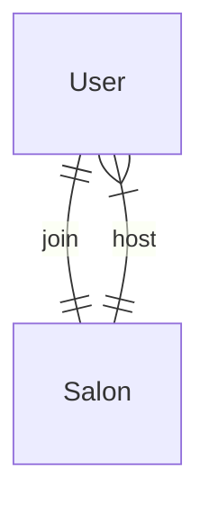

# TchatTCP

Une application CLI de Tchat où des joueurs peuvent rejoindre des salons de discutions ou envoyer un message privé à un autre utilisateur connecté.

## Utilisation de l'application

### Se connecter
Au départ l'utilisateur doit se connecter comme ceci : 
```bash
./tchat connect Massi
```

Ensuite un *prompt* apparait il permet les commandes suivantes : 

```bash
###################### TCHAT ###################
- create salon : créer un salon de discussion publique

- list users: Lister les utilisateurs connectés
- list salons: Lister les salons de discution disponible

- join salon *salon_id* : rejoindre un salon de discussion
- join user *user_id* : rejoindre un joueur dans un salon privé
- join world

- exit : Se déconnecter ou revenir en arrière
################################################

[Massi]>
```

### Se déconnecter
La command `exit` permet de revenir en arrière :

- Dans le menu principal : quitter l'application et se déconnecter
- Dans un salon : quitter le salon et revenir au menu principal

*Exemple de la commande dans le menu principal*
```
[Massi]> exit
```

*Exemple de la commande dans un salon*
```
[Massi]@salon_id> exit
```

### Les salons de discussion publique
Un salon de discution publique est un tchat publique dans le lequel tout les utilisateurs peuvent discuter entre eux.

#### Créer un salon publique

La commande suivante créer un salon publique

```
[Massi]> create salon
```

#### Créer un salon privé (message privé)
Un joueur peut envoyer des messages privés à un autre en créant un salon privé à partir de l'identifiant du joueur

```
[Massi]> join user *user_id*
```

Vous pouvez à présent discuter avec l'utilisateur ciblé

### Voir les utilisateurs connectés
```bash
[Massi]$ list users

user_id     Nom du créateur
3           Arnaud 
2           Massi 
```

### Voir les salons existants
```bash
[Massi]$ list salons

salon_id    Nom du créateur
1           Arnaud 
2           Massi 
```


#### Rejoindre un salon publique

```
[Massi]> join salon *salon_id*
```
Vous pouvez à présent discuter avec tout les utilisateurs qui on rejoint le salon.

#### Rejoindre le salon *World*
Le salon world est un salon créer automatiquement au lancement du serveur.

Tout le monde peut y rentrer et discuter.


#### [BONUS] Notifications

Si quelqu'un vous envoi un message alors que vous n'etes pas dans le bon salon une notification.

La notifications peut apparaitre sous la forme d'un message de ce genre :

```
*Nouveau message de la part de [salon_id | user_id]*
*Faite exit pour quitter le salon*
*Puis join salon salon_id*
*ou*
*Puis join user user_id*
```

#### [BONUS] Mot de passe de salon et limite d'utilisateurs
Les salons privés peuvent demander un mot de passe et une limite d'utilisateur acceptés dans le salon.


### Cas critiques

- Un Utilisateur peut être dans un seul salon à la fois
- Un salon peut héberger de un à plusieurs utilisateurs en même temps (que le salon soit privé ou public)

- Un salon privé ne contient que deux utilisateurs maximum




## Cahier des charges

|Tache|Description|Contraintes|
|-|-|-|
|Se connecter|
|Se déconnecter|
| Voir les utilisateurs connectés|
| Rejoindre le salon World|
| Créer un salon publique|
| Voir les salons publique|
|Rejoindre un salon publique| Rejoindre un salon public en fonction du salon_id
|Message privé | Rejoindre un salon privé en fonction du user_id
|Quiter un salon|
| BONUS Notification |
