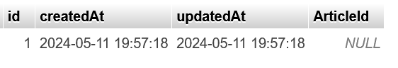
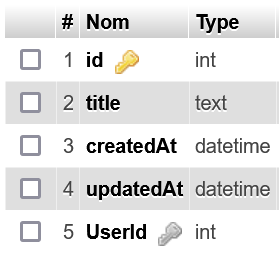
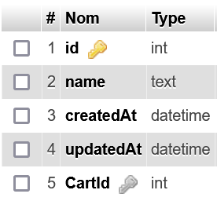
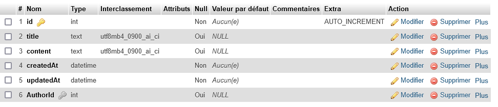
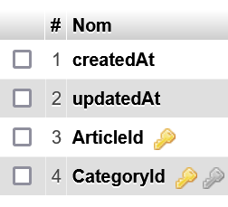
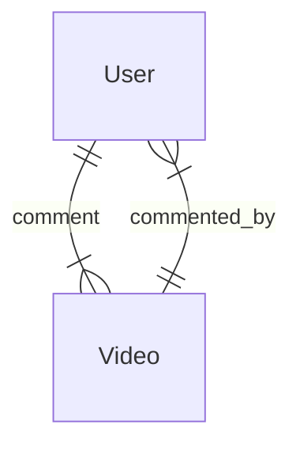
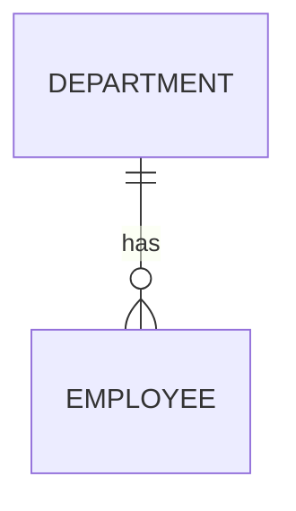
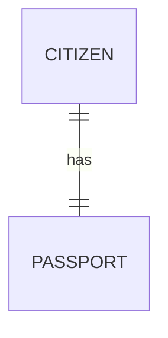
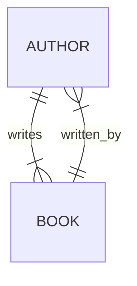

# Relation sequelize
L'interet d'une base de données relationnel se trouve dans l'utilisation de relation entre les tables.
Sequelize permet de simplifier la mise en place et l'utilisation de relation inter-table en vous évitant d'écrire le moindre code SQL.

## Rappel sur les relations SQL
Il existent trois relations :
- one to Many
- one to One
- Many to Many

Les relations sont mises en place à l'aide de clé étrangère. Une clé étrangère est une colonne d'une table qui contient la clé primaire d'une autre table.

### One to Many
La relation one to Many signifie qu'une ligne d'une table A peut être réferencé dans plusieurs lignes d'une table B.

**Par exemple** : un *article* de la table *Articles* peut être référencé dans plusieurs *commentary* de la table *Commentary*.
La primary key de l'article sera alors référencé en tant que clé étrangère d'un ou plusieurs commentaire.
> Ainsi un article peut etre lié à plusieurs commentaires. 
> 
> *One article has many commentary.*

### Many to Many
La relation Many to Many signifie qu'une ligne d'une table A peut être réferencé dans plusieurs lignes d'une table B **ET** qu'une ligne de la table B peut aussi être référencé dans plusieurs lignes de la table A.

> C'est en quelque sorte une double relation one to Many.

#### Exemple Article et Catégorie
Un article de la table Article avoir plusieurs Catégorie associé **ET** une catégorie peut évidemment avoir plus articles.
> *one article has Many Category*
>
> *one category has Many Article*
> 
> *Many to Many*

#### Exemple Utilisateur et Produit pour une Wishlist
Un Utilisateur peut avoir plusieurs produits dans sa wishlist (one to Many donc) MAIS un produit peut être dans la wishlist de plusieurs Utilisateur (one to Many dans l'autre sens). Les tables Produit et Utilisateur on toutes les deux une liaison one To Many dans les deux sens c'est donc une relation Many to Many.

> Avec mysql la realtion Many to Many genere une table de jointure

### One to One
La realation One to One est plutot rare et défini une relation parfiatement exlusive entre deux table.

Une ligne de la table A ne peut être référencé que par une seul et unique ligne de la table B MAIS la ligne de la table B doit référencé la même ligne de la table A.

#### Exemple carte d'identitié et citoyen
Par exemple une carte d'identitié de la table IdCards ne peut être référencé que par un seul citoyen de la table Citizens et vis-versa.

#### Exemple utilisateur et panier
Autre exemple, une panier ne peut être avoir qu'une utilisateur et un utilisateur ne peut avoir qu'un seul et unique panier. *One to One*.

## Les relations de tables avec sequelize
Avec sequelize les tables sont appellées Model et définis grâce à la fonction `sequelize.define()`.

Une fois deux modèles définis il est possible de définir leurs relations grâce à un jeu de méthode de la classe Model :
```ts
Model.hasOne(otherModel : Model) 
Model.belongTo(otherModel : Model)
Model.hasMany(otherModel : Model)
Model.belongToMany(otherModel : Model,{through : "JoinTableName"})
```
Ces fonctions permettent de créer des relations et donc de placer une clé étrangère sur l'un des deux models.
La table qui reçoit la clé étrangère s'appelle la `Target`(cible) celle qui envoi sa clé primaire s'appelle la `Source`.

`A.hasOne(B)` crée une relation **One to One** entre A et B et place la clé étrangère dans B. B est donc la target.
`A.belongTo(B)` crée une relation **One to One** entre A et B et place la clé étrangère dans A. A est donc la target.

> Vous remarquerez que hasOne et belongTo font la même chose mais inverse simplement la position de la target.

`A.hasMany(B)` crée une relation **One to Many** entre A et B et place la clé étrangère dans B. B est donc la target.

`A.belongToMany(B, trough : "C")` crée une relation **Many to Many** entre A et B via la table de jointure C. Les clés étrangères seront placées dans la table C sous les noms aId et bId. La table C sera crée si néccessaire.

> Attention seul `belongsToMany` est capable de gérer une table de jointure. On ne peut donc pas utiliser `hasMany` pour une relation Many to Many.

## Requêtes SQL sur les associations, les méthodes dynamiques (mixins) de sequelize.

Soit les deux modèles suivants :
```js
const Article = sequelize.define("Article",{});
const Category = sequelize.define("Cateogry",{});
```
Les méthodes précedentes permettent de créer des relations entre les tables, ajouter les clées étrangères et meme de créer automatiquement une table de jointure.

Quand est t-il du requêtage ?

Lors de de l'utilisation d'une méthode *has/belong* sur un Model, le Model se voit attribué de nouvelles méthodes en fonction de la méthode utilisé.

### setModelName
Par exemple l'appel de `belongsTo` :
```js
Article.belongsTo(Category); // Clé étrangère de category sur Article
```
Permet au modèle `Article` d'accéder à la méthode `setCategory()`. Elle permet de définir la catégorie de l'article sans s'embéter avec la clé étrangère.

Je crée un article et une categorie.
```js
const category = await Category.create({});
const article = await Article.create({});
```
Je défini la categorie de l'article
```js
await article.setCategory(category);  
// Le champs article.categoryId est défini
```

```js
console.log(article.dataValues);
```

```bash
{
  id: 1,
  updatedAt: 2024-05-11T13:46:52.585Z,
  createdAt: 2024-05-11T13:46:52.580Z,
  CategoryId: 1
}
```

**Les fonction has/belongs permettent a un Model d'accéder à la table associés**

### getModelName

La méthode `setCategory` permet de définir la clé étrangère du model target et reciproquement la méthode `getCategory()` permet de récupérer la catégorie.

```js
const category = await article.getCategory();
```

### Lexique des méthodes mixins disponible

#### Pour hasOne() et belongsTo()
hasOne et belongsTo permettent de créer une relation One to One. Ces méthodes mixins permettent donc de définir ou récupérer une instance de modele. Il est aussi possible de créer une instance et de la définir en une seule fonction.

- setBar()
- getBar()
- createBar()

> Rempalcez Bar par le nom du Model associé.

> Lire la documention de sequelize sur le fonctionnement de chaque fonction : https://sequelize.org/docs/v6/core-concepts/assocs/#foohasonebar

#### Pour hasMany() et belongsToMany()
`hasMany()` et `belongsToMany()` permettent de créer respectivement des relations One to Many et Many to Many.

Leurs fonctions permettent donc de gérer plusieurs instance de model. La plupart des méthode sont aux pluriel et demander ou renvoi donc un tableau.
##### Getter
- getBars()
- countBars()
> Au meme titre que `Model.findAll()` on peut fournir au getter un `where` pour condition la recherche du `SELECT`.
##### Tester la présence d'une instance
- hasBar()
- hasBars()
##### Setter
- setBars()
- addBar()
- addBars()
- removeBar()
- removeBars()
- createBar()

> Remplacez `Bar` par le nom du Model associé.

> Lire la documention de sequelize sur le fonctionnement de chaque fonction : https://sequelize.org/docs/v6/core-concepts/assocs/#foohasmanybar

###### Ne confondez pas setBars et addBars.
`setBars()` définis plusieurs éléments d'un coup et supprime toutes les anciennes associations.

`addBars()` ajoute plusieurs élements aux associations précedentes.

Cela signifie que cette ligne retire tout les elements d'une `categorie`: 
```js
const categorie = await Category.findByPk(2);
await categorie.setArticles([]);
```

### Neccessiter de doubler les relations

Soit :
```js

const Article = sequelize.define("Article",{});
const Category = sequelize.define("Category",{});

Article.belongsTo(Category);

(async ()=>{
    await sequelize.sync({force : true});
    
    const category = await Category.create({});
    const article = await Article.create({});

    // Codez ici ...
})();
```
Les méthodes `has/belongs` nous donne accès aux méthodes getter et setter sur le Model appelant.

```js
// Article est le modèle appelant belongsTo
Article.belongsTo(Category);
// Il possède donc les méthodes getter et setter de Category.
```

```js
await article.setCategory(category);
const assocCategory = await article.getCategory();
```
Seul problème l'autre modèle(Cateogry) n'a pas accès aux getter et setter, car il n'appelle jamais de méthodes `has/belongs`. C'est très génant.

```js
const assocArticle = await category.getArticle(); // ERROR 
```
*TypeError : La fonction getArticle n'existe pas !*
```bash
const assocArticle = await category.getArticle();
                                    ^
TypeError: category.getArticle is not a function
```

**Alors, comment faire pour récupérer l'article depuis une categorie ?**

*Pour récupérer l'article depuis une categorie il faut que le model Category est accès au méthodes getter et setter, **il faut donc que Category appelle une méthode has ou belongs.***

```js
Article.belongsTo(Category);
Category.hasOne(Article);
```

```js
await article.setCategory(category);
const assocCategory = await article.getCategory();
const assocArticle = await category.getArticle(); // OK
```

Ici j'ai utilisé la liaison hasOne qui va cherche la clé étrangère(article.CategoryId) qui correspond à sa clé primaire(id).

 #### **Pourquoi ne pas utilise deux fois hasOne ou belongsTo ?**
Si belongsTo et hasOne font la même chose mais à l'envers pourquoi ne pas simplement utiliser toujours la même fonction en inversant les Models comme ceci ?
 ```js
// Ajout du champ FK article.CategoryId 
Article.belongsTo(Category);  
// Ajout du champ FK category.ArticleId
Category.belongsTo(Article);
```
*Ce qui me permetrait théoriquement de faire ceci donc ?*
```js
await article.setCategory(category);
const assocCategory = await article.getCategory();
const assocArticle = await category.getArticle();  // ??
```
**FAUX** assocArticle est null.
```js
console.log(assocArticle);
```
```bash
null
```
La fonction category.getArticle() na pas trouvé d'article correspondant à notre categorie ...
Pourtant nous avons bien défini le champs article.CategoryId avec la fonction `article.setCategory()`.

Oui, mais le problème c'est que **nous avons utilisé belongsTo* pour lier Category à Article.
```js
// Ajout du champ FK category.ArticleId
Category.belongsTo(Article);
```
Ce qui a eu pour conséquance de créer une foreign key dans la table Category.
Ainsi la fonction category.getArticle() ne cherche plus une categorie dans les foreign key de la table Article mais un article en fonction de la FK cateogry.ArticleId.

Regardons donc quelle est la valeur de la FK ArticleId dans *phpMyAdmin*.

*SELECT * FROM Category*


Le champs `ArticleId` de la category est `NULL`. C'est logique car nous n'avons pas définit ce champs avec la méthode category.setArticle() comme ceci :
```js
await category.setArticle(article);
```

*Une fois la FK défini tout fonctionne.*

*app.js - code complet*
```js
const {Sequelize, DataTypes} = require("sequelize");

const sequelize = new Sequelize("blog","blog","blog",{
    dialect:"mysql",
    logging : false
});

sequelize.authenticate().then(()=>console.log("logged in"));

const Article = sequelize.define("Article");
const Category = sequelize.define("Category",{});

Article.belongsTo(Category);
Category.belongsTo(Article);  // J'utilise deux fois belongsTo

(async ()=>{
    await sequelize.sync({force : true});
    
    const category = await Category.create({});
    const article = await Article.create({});

    // Donc je dois définir deux fois les foreign keys
    await article.setCategory(category); // pour article.CategoryId
    await category.setArticle(article);  // et category.ArticleId
    
    const assocCategory = await article.getCategory();
    const assocProduct = await category.getArticle();
    
    console.log(assocCategory.dataValues); //OK
    console.log(assocProduct.dataValues); // OK
})();
```
En conclusion il est inutile et même génant d'utiliser deux fois belongsTo car ceci vous demendera de définir deux fois les clés etrangères lors de l'ajout d'un élément. 
C'est inutile car en SQL il suffit qu'un l'une des deux tables possède la clé étrangère de l'autre pour former une relation One to One (a condition de mettre une contrainte UNIQUE sur la clé étrangère).

### Relation One to One
```js
const User = sequelize.define("User",{
    name : DataTypes.TEXT
});
const Cart = sequelize.define("Cart",{
    title : DataTypes.TEXT,
});
// Cart get a foreign key of User
Cart.belongsTo(User,{
    foreignKey : {
        unique : true
    }
});
User.hasOne(Cart);     
sequelize.sync({force: true});
```
> J' ai ajouté une contrainte `unique` sur le champ foreignkey, je pourrais également ajouter `allowNull : false` pour rendre ma liaison One to One encore plus strict.

*Cart*


*User*


### Relation One to Many
Avec Sequelize, la relation One to Many se créer avec les fonctions `Model.belongTo()` et `Model.hasMany()`.

```js
const Article = sequelize.define("Article",{
    title : DataTypes.TEXT,
    content : DataTypes.TEXT
});
const Author = sequelize.define("Author",{
    name : DataTypes.TEXT
});
Article.belongsTo(Author); //  one Article belongs To one Author
Author.hasMany(Article) // one Author has Many Article

sequelize.sync({force: true});
```

> `belongsTo` place la clé étrangère sur la table Article. On l'appel la `table source`.

#### Requête avec des relations
```js
//Create
const massinissa = Author.create({name : "Massinissa"});
// Associate
Article.create({
    title : "Comment faire du skate",
    content : "bla bla ollie",
    AuthorId : massinissa.id
});
// Fetch
const article = Article.findOne(1); // Comment faire du skate
const author = article.getAuthor(); // Massinissa
```
### Relation Many to Many
La relation Many to Many se crée avec la fonction belongsToMany.
```js
const Article = sequelize.define("Article",{
    title : DataTypes.TEXT,
    content : DataTypes.TEXT
});
const Category = sequelize.define("Category",{
    title : DataTypes.TEXT,
    description : DataTypes.TEXT
});
Article.belongsToMany(Category,{through : "ArticleCategory"});
Category.belongsToMany(Article,{through : "ArticleCategory"});
sequelize.sync({force: true});
```
*La table de jointure ArticleCategory*


Il est également possible de créer un table de jointure à l'avance et de la fournir dans through. Cela permet définir des champs en plus dans la table de jointure en plus de ceux que sequelize rajoute (les foreign keys, createdAt).


```js
const User = sequelize.define("User",{});
const Video = sequelize.define("Video",{});
const Comment = sequelize.define("Comment",{
    content : DataTypes.TEXT,
    liked : DataTypes.INTEGER // nombre de like
});
User.belongsToMany(Video,{through : Comment});
Video.belongsToMany(User,{through : Comment});
sequelize.sync({force: true});
```

### Ajouter des éléments pour Many to Many

L'ajout d'élément pour une liaison Many to Many se fait via les méthodes mixins : addBars,setBars,createBar et addBar.

```js
// Je fais mes liaisons
Category.belongsToMany(Product,{through : "CategoryProduct"});
Product.belongsToMany(Category,{through : "CategoryProduct"});

sequelize.sync({force : true}).then(async ()=>{
    // Je crée un produit
    const cat = await Category.create({title : "Voiture"});
    // Je crée un autre produit
    const product = await Product.create({
        name : "206"
    });
    // J'ajoute un produit dans la category
    cat.addProduct(product);
    // addProduct s'appelle ainsi car le model s'appelle Product
    // Grace au liaisons belongsToMany faites plus haut,
    // sequelize va automatiquement rajouter un élément
    // dans la table de jointure
})
```
> Voir les méthodes mixins plus haut ou la doc de sequelize : https://sequelize.org/docs/v6/core-concepts/assocs/#foobelongstomanybar--through-baz-

# Exercices
- Mettez en place les relations suivantes avec Sequelize
- Pour chaque diagramme ajoutez et récupérez des éléments avec les méthodes mixins pour prouver que les associations on bien fonctionnés.

### One to Many
1. Créez 10 employées avec Model.create()
2. Ajoutez en 5 à un departement nommé "Comptable"
3. Ajoutez en 4 à un autre nommé "Dev"
4. Ajoutez en 1 dans le departement "Direction"
5. Récupérer tout les employées
6. Récupérer tout les Dev
7. Récupérer le nombre de comptables.

1. Créez 15 classes avec Model.create()
2. Ajoutez en 5 à une school nommée "College"
3. Ajoutez en 5 à une autre nommée "Lycee"
4. Ajoutez en 5 dans la school "Primaire"
5. Récupérer toutes les classes
6. Récupérer tout les collégiens
7. Récupérer le nombre de primaire.
8. Récupérer tout les collégiens ET lycéens
```mermaid
erDiagram
    SCHOOL ||--o{ CLASS : has

```

### One to One
1. Créez 2 citoyens avec Model.create()
2. Leurs fournir à chacun un passeport
3. Grace à la contrainte UNIQUE empécher un citoyen d'avoir plusieurs passports dans la BDD.


### Many to Many
> N'oubliez pas de nommer votre table de jointure par le nom des deux tables.
1. Créez les authors du livre "DESIGN PATTERNS" dans le model Author
https://www.amazon.fr/Design-Patterns-Elements-Reusable-Object-Oriented/dp/0201633612

2. Ajoutez les authors du livre "Parallel Programming"  
https://www.eyrolles.com/Informatique/Livre/parallel-programming-with-microsoft-visual-c--9780735651753/

3. Ajoutez les deux livres.
4. Associez les authors aux livres.
