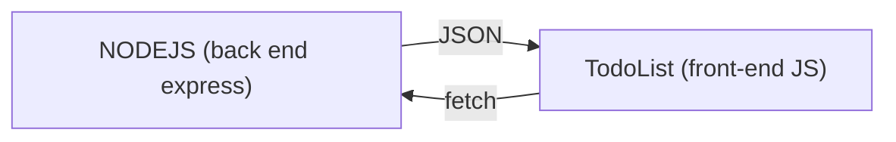

# Brancher un front-end JavaScript à un back-end NodeJS.

Une fois toutes les routes de votre back-end crées vous devriez avoir un serveur qui tourne vers lequel vous pouvez requetez envoyer des requêtes HTTP via postman.

L'objectif, c'est maintenant d'effectuer des requêtes, non pas dans postman, mais dans un front-end JavaScript grâce la fonction `fetch()`.

Soit un back end nodejs comme ceci :

*/back-end/app.js*
```js
const express = require("express");

const app = express();

app.get("/hello",(req,res)=>{
    res.json({data:"Hello"});
})

app.listen(3030);
```

Et un front end comme ceci :
*/front-end/index.html*
```html
<!DOCTYPE html>
<html lang="fr">
<head>
    <meta charset="UTF-8">
    <meta name="viewport" content="width=device-width, initial-scale=1.0">
    <title>Front-end</title>
</head>
<body>
    <h1>Mon front-end</h1>
</body>
<script>
console.log("Je suis un script");

// J'effectue une requete HTTP GET vers la route /hello
fetch("http://localhost:3030/hello")
.then(res=>res.json())
.then(data=>{
    console.log(data)
});
</script>
</html>
```

Le code précedent effectue une requête HTTP.
```js
fetch("http://localhost:3030/hello")
```
Transforme le body json en objet Javascript
```js
.then(res=>res.json())
```
Puis affiche dans la console la donnée. A savoir l'objet renvoyée par le back-end.
```js
.then(data=>{
    console.log(data)
});
```

Rien de bien méchant, on devrait donc se retrouver avec un objet affiché dans la console du navigateur.

Seulement voilà, le navigateur refuse la réponse du serveur et renvoie une erreur qui vous ai pour l'instant énigmatique.


## Qu'est ce que CORS ?
CORS est une politique de sécurité qui permet de demander au navigateur d'autoriser les réponses HTTP provoquées par la méthode fetch() ou l'objet XMLHttpRequest. 

Le seul moyen pour le navigateur d'autoriser la réponse d'un fetch c'est que le serveur renvoi l'origine autorisée et que l'origine du client corresponde. L'origine autorisée est fournit dans la réponse du serveur via l'entête Access-Control-Allow-Origin.

```http
Access-Control-Allow-Origin : http://127.0.0.1:3000
```

Notre API REST est donc pour l'instant inutilisable par la fonction fetch() car l'en tête `Access-Control-Allow-Origin` n'est pas renvoyer par le serveur.

Il nous faut donc :
1. Ajouter l'entête Access-Control-Origin dans les réponses du serveur express.
2. Précisier l'origine du client comme etant l'origine autorisée.


### Ajouter le header Access-Control-Origin et préciser les origine autorisées.
Si notre front-end à comme origine :
```http
http://127.0.0.1:3000
```
Alors le header doit se rajouter comme suit :
```js
app.use((req,res,next)=>{
    res.setHeader(
        "Access-Control-Allow-Origin",
        "http://127.0.0.1:3000"
    );
    next();
});
```

L'ajout de ce code permet de demander au navigateur du client 127.0.0.1:3000 d'autoriser la réponse HTTP du serveur lorsque elle est émise par un `fetch()`.


Comme souvent avec nodejs un paquet existe pour évité de tapez tout ce code à chaque fois.

C'est le paquet `cors`.

## Autoriser les réponses de notre API REST.

1. Dans le dossier de votre api rest ( dans cet exemple `/back-end`), installez le module `cors`.
```bash
npm install cors
```
2. Importez le module dans le code source du back-end.
```js
const express = require("express");

const cors = require("cors"); // +

const app = express();

app.get("/hello",(req,res)=>{
    res.json({data:"Hello"});
})

app.listen(3030);
```
3. Ajoutez un middleware qui ajoute l'entête Access-Control-Allow-Origin avec la fonction `app.use()` et `cors()`. Ceci autorise TOUTES les origines à accéder au back-end via un `fetch()`.
```js
const express = require("express");

const cors = require("cors");

const app = express();

app.use(cors());    // +

app.get("/hello",(req,res)=>{
    res.json({data:"Hello"});
})

app.listen(3030);
```

Voilà vous venez d'autoriser les requêtes fetch pour votre back-end.

## Améliorer la sécurité
Par défaut la fonction `cors()` autorise toutes les origines à se connecter à notre back-end.
On peut donc préciser un tableau d'orgines en paramètre de la fonction cors().
```js
const express = require("express");

const cors = require("cors");

const app = express();

app.use(
    cors({
        origin : [ 
            "http://127.0.0.1:3000",
            "http://localhost:3000",
        ]
    }
));

app.get("/hello",(req,res)=>{
    res.json({data:"Hello"});
})

app.listen(3030);
```

Pour plus d'infos sur le fonctionnement de la politique CORS avant de passez au projet vous pouvez <a href="#plus-infos">consultez dans la suite du cours</a> et la documention MDN de <a href="https://developer.mozilla.org/fr/docs/Glossary/Same-origin_policy">la politique Same Origin</a> et <a href="https://developer.mozilla.org/fr/docs/Glossary/CORS">CORS</a>.

# Projet TodoList FullStack.

## Objectif
*Maintenant que toutes les routes du CRUD (GET, POST, PUT, DELETE) sont crées il est temps de les utiliser pour accéder à notre BDD MySQL depuis le front-end.*

A partir de votre todolist codée précedement et de votre back-end nodejs nouvellement codé, connectez le front-end et le back-end avec la fonction `fetch()` pour que les tâches soit enregistrées, lues ou modifiées à partir de la BDD MySQL.




## Pré-requis :
- `fetch()`, le cours pdf sur Fetch est disponible dans le canal JS.
- Le module <a href="https://www.npmjs.com/package/cors">cors</a> en back-end pour contourner la sécurité Same origin.
- Les promises pour utiliser la fonction `fetch()`, explications également disponible dans le cours sur fetch.
## <span id="plus-infos">En quoi la politique CORS protège le client ?</span>

Par défaut la politque de Same Origin bloque toutes les requêtes HTTP qui vise une origine différente de celle du client.

La politique c'est assouplie pour les balises img, script ou link car aujourd'hui de nombreux sites charges des ressources depuis une origine différente (bootstrap, jquery, des images de unsplash).

Cependant, pour de raison de sécurité, il est toujours interdit d'effectuer un fetch vers une origine différente.

Sauf si le serveur informe le navigateur que l'origine du client est autorisée.

C'est uniquement si le serveur à prévu le coup et envoyé le domaine autorisé en header que la sécurité CORS peut être contournée.

L'origine ce place dans l'entete `Access-Control-Allow-Origin`.

## Est ce que Same origin protège le serveur ?
Non, same origin ne protège par le serveur. Car le serveur est toujours accessible via n'importe quel client http comme : Postman ou la commande curl par exemple.

## Mauvaise pratique amenant à une faille de securité.
Il est possible d'autoriser toutes les origines en utilisant la valeur `*` dans le header `Access-Control-Allow-Origin`.

```http
Access-Control-Allow-Origin : *
```

> Sous nodejs avec le module cors :
> ```js
> const cors = require("cors");
> app.use(cors());
>```
> Par défaut le caractère `*` est utilisée par le module cors.

Cette valeur est néccessaire lorsque vous concevez une API public accessible depuis des origines inconnues, comme l'API meteo france ou la fameuse pokebuild-api.

Dans le cas des deux précedentes API, les données ne sont pas sensible il est donc bénin de contournée la sécurité CORS.

Cependant comment faire lorsque je ne peut pas prévoir l'origine autorisée par mon serveur et que mes données sont sensible comme par exemple pour les apis : youtube, instagram, les api de paiement de credit-agricole ?

Il faut que le client fournisse un token d'authetification en header de sa requete pour que le serveur vérifie si il est belle et bien autorisé à consultée les données.

*Client request*
```http
Authorization: Bearer <token>
```

Cette méthodes permet de sécurisé le serveur.

Nous verrons plus tard comment mettre en place un tokken d'authentification sur nos API REST pour les rendres sécurisées.