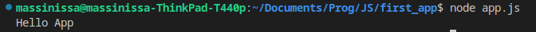
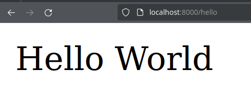
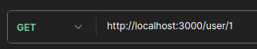
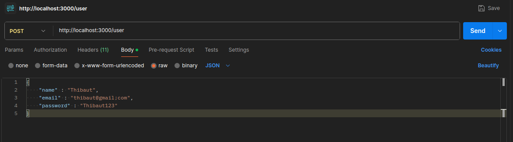

# NodeJS

Habitulement le JavaScript tourne sur le navigateur du client, coté front-end donc. Il est donc impossible pour du JavaScript coté front-end d'accéder à une BDD SQL, d'envoyer des mails ou de gérer la connexion d'un utilisateur.

Voilà pourquoi il faut un programme coté serveur qui peut exécuter du JavaScript coté Back-End. Ce programme s'appelle NODEJS.

## NodeJS un runtime JavaScript

NodeJS est un environnement d'exécution JavaScript basé sur le moteur V8 utilisé par Chrome.

NodeJS va exécuter notre code JS et donner accès au réseau, au fichier, à une bdd SQL,etc.

## Créer une API REST avec NodeJS et Express
Il est possible de créer une API REST sous nodejs via le paquet NPM express.js .

Une api REST est un serveur web qui délivre des données au format JSON.

Les actions d'une API Rest sont analogue au méthodes du protocole HTTP.

- GET : Récupérer une donnée
- POST : Envoyer une donnée au serveur
- DELETE : Supprimer une donnée du serveur
- PUT : Modifier une donnée du serveur

# Pré-requis

## Installer NodeJS et npm sous Windows
Télécharger NodeJS Long term Support (LTS) ici : https://nodejs.org/en


> Long Term Support signifie que cette version de NodeJS est stable et toutes les failles seront corrigées pendant encore un moment. C'est donc une version fiable à utiliser pour la plupart des projets.

## Installer NodeJS et npm sous Linux
```bash
sudo apt install nodejs npm
```
## Installer NodeJS et npm sous Mac
Avec HomeBrew, le gestionnaire de paquet MacOS :
```bash
brew install node
```
Ou à la main via le lien suivant : https://nodejs.org/en/download/

## Installer express

Créez un dossier vide pour votre projet et appelez le `first_api`.

Ouvrez un terminal dans ce dossier et executer les commandes suivante pour : 
- initialiser le projet node 
- installer express

```bash
npm init
npm install express
```

> **Attention !** `npm init` vous pose plusieurs questions pour initialiser le projet avant de vous redonner la main. Appuiez sur entrée jusqu'à ce que vous recupériez la main pour choisir les réponses par défaut.

## Executer du JavaScript
Créez un fichier `app.js` et placez y un `console.log()` pour vérifier que tout fonctionne.

```js
console.log("Hello App");
```

Puis executer le code dans un terminal via la commande :
```bash
node app.js
```


> Attention à bien être dans le dossier `first_app` avant d'éxecuter node, sinon il ne trouvera pas le fichier `app.js`.

## Le routage
L'acces à un serveur web se fait toujours via des urls appelées `routes`.

Par exemples :
- GET /user/1, peut renvoyer un utilisateur avec pour id 1 par exemple.
- POST /annonce, peut renvoyer une nouvelle annonce au serveur à rajouter dans une BDD SQL par exemple. La nouvelle annonce sera une donnée au format JSON transmit dans le body de la requête HTTP.
- DELETE /task/3, peut supprimer la tache numéro 3.
- PUT /task/3, peut modifier la tache numéro 3 avec les infos à modifier fournit en JSON dans le body.

## Hello World - créer une route avec express

1. Importer express.
```js
const express = require("express");
```

2. Création de l'application
```js
const express = require("express");
const app = express();
```

3. Ajout d'un route `GET /hello` avec la fonction `app.get()`.
```js
const express = require("express");
const app = express();

app.get("/hello",(request,response)=>{
    response.send("<p>Hello World</p>");
});
```
> La fonction callback est appelée quand l'utilisateur tapera `localhost/hello` dans son navigateur.

4. Lancement du serveur en localhost sur le port 8000 avec la fonction `app.listen()`.
```js
const express = require("express");
const app = express();

app.get("/hello",(request,response)=>{
    response.send("<p>Hello World</p>");
});

app.listen(8000,()=>{
    console.log("Serveur lancé sur localhost:8000");
});
```
> La fonction callback est appelée une fois que le serveur est bien lancé sur le port 8000.

Allez on regarde dans un navigateur !
5. Dans un navigateur tapez dans la barre de recherche : `localhost:8000/hello` pour lancer une requête HTTP GET sur la route /hello.



Voilà, vous avez crée votre première route HTTP avec express !

Cette route renvoi en body du texte html, la réponse HTTP brut ressemble à celle-ci.

*La réponse du serveur express*
```http
HTTP/1.1 200 OK

<p>Hello World</p>
```

*La requête du navigateur client*
```http
GET /hello HTTP/1.1
Host : localhost
```

## Envoyer un donnée au client.

### Envoyer du texte
Vous avez envoyer du du html avec `res.send()`.

Vous pouvez envoyer n'importe quel variables de type primitif.

```js
const users = ["David","Louis","Théo"];

app.get("/user",(req,res)=>{
    res.send(users[0]);
})
```

### Envoyez un objet
Souvent on veut envoyer une donnée complexe au client comme une reservation, un produit par exemple.

Cette donnée complexe est un objet et je peux l'envoyer avec express en utilisant la fonction `res.json()`.

```js
const product = {
    id : 3,
    name : "Nike Air",
    price : 99
};

app.get("/product",(req,res)=>{
    res.json(product);
})
```
A la différence de la fonction send la fonction json envoie une string JSON au client.

Il est également possible d'envoyer un tableau d'objet directement.

```js
const products = [
    {
        id : 1,
        name : "Puma taille 42",
        price : 67
    },
    {
        id : 2,
        name : "Adidias sport",
        price : 102
    },
    {
        id : 3,
        name : "Nike Air",
        price : 99
    },
];

app.get("/all_products",(req,res)=>{
    res.json(products);
})
```

#### Exercices
Soit le tableau d'utilisateur suivant.
```js
const users = [
    {
        name : "theo",
        lastname : "dupont",
        age : 25
    },
    {
        name : "Mattieu",
        lastname : "Dupuit",
        age : 19
    },
    {
        name : "Billy",
        lastname : "Elliot",
        age : 12
    }
];
```
1. Créer une route nommée `/users` qui envoie les infos de tout les utilisateurs.

## Récuperer un query param
En HTTP il est possible de récupérer une donnée dans l'url de requête client. Le plus souvent cette info est un identifiant sql ou le texte d'une barre de recherche.

Par exemple :
- `GET /eleve/1`, l'identifiant de l'élève demandé est 1, on pourra donc effectuer un 
```sql
SELECT * FROM Eleve WHERE id = 1;
```
- `GET /products/search/table`, une recherche s'effectue sur le nom de produit contenant la string `table`. 
```sql
SELECT * FROM Products WHERE name LIKE %table%;
```

J'ajoute une route à mon API. En précisiant le nom du query param dans l'url de la route.

Pour récupérer un query param il suffit d'utiliser l'objet request fournit en paramètre de la fonction callback de la fonction `app.get()`.

```js
const users = ["David","Louis","Théo"];

// Ajout d'une nouvelle route
app.get("/user/:id",(request,response)=>{
    const userId = request.params.id;
    response.json(users[userId]);
});
```

Puis dans Postman pour récupérer par exemple Louis, je tape l'url.



Vous avez reussi à afficher un utilisateur en fonction de son id.

#### Exercices
Soit le tableau d'utilisateur suivant.

```js
const users = [
    {
        name : "Theo",
        lastname : "Dupont",
        age : 25
    },
    {
        name : "Mattieu",
        lastname : "Dupuit",
        age : 19
    },
    {
        name : "Billy",
        lastname : "Elliot",
        age : 12
    }
];
```

1. Créer une route nommée `/user/:id` qui envoie toute les infos d'un utilisateur en fonction de son id.
2. Créer une route nommée `/user/name/:id` qui envoie le nom d'un utilisateur en fonction de son id.
3. Créer une route nommée `/user/majeur/:id` qui envoie true si l'utilisateur est majeur ou false si il ne l'est pas.
4. Créer une route nommée `/users/majeur` qui renvoie tout les utilisateurs majeurs.
5. Créer une route nommée `/user/search/:name` qui renvoie un utilisateur en fonction de son name.
6. Créer une route nommée `/user/search/:text` qui renvoie tout les utilisateurs qui ont le `text` dans leurs `name` ou leurs `lastName`.

## Créer des routes pour les differentes méthodes HTTP
Tout à l'heure vous avez créez une route qui utilise la méthode GET. C'est la méthode utilisée pour récupérer une donnée, elle est par exemple utilisée d'office par la barre de recherche des navigateurs web (Firefox, chrome, etc).

La syntaxe pour créer une route est :
```js
app.METHOD(chemin,fonction)
```
Par exemple, pour créer une nouvelle route en GET vous avez écrit.
```js
app.get(chemin,fonction)
```
Et la même logique s'applique sur `POST`, `DELETE`, `PUT` :
```js
app.post(chemin,fonction)
app.delete(chemin,fonction)
app.put(chemin,fonction)
```

### Ajouter une donnée au serveur avec POST
Pour ajouter une donnée au serveur il faut que le client la passe dans le body de la requête.

Nous voulons donc accéder au body sous la forme d'un attribut de l'objet request.

```js
app.post("/user",(request,response)=>{
    const user = request.body;
    res.json(user); // Je veux renvoyer l'utilisateur au client.
});
```

#### **CEPENDANT**, par défaut l'objet req.body est `undefined`.

Si le client envoi un objet JSON en body d'une requête POST dans Postman et que vous le loggez dans votre serveur nodejs vous le verrez comme  : `undefined`.

*Postman*


*app.js*
```js
app.post("/user",(request,response)=>{
    const user = request.body; 
    console.log(user);  // undefined
    res.json(user); 
});
```


Pour remplir l'attribut req.body il faut dire à express de convertir le body des requêtes client en un objet JS et de le placer dans `req.body`.

Cela se fait avec la fonction middleware `express.json()` et la fonction `app.use()`.

```js
app.use(express.json());

app.post("/user",(request,response)=>{
    const user = request.body; 
    console.log(user);  // {...} un objet JS
    res.json(user); 
});
```

> `app.use` fonctionne de la même manière que app.get ou app.post à la différence qu'il est toujours pris en compte peut importe : l'url tapez par le client ou la méthode HTTP utilisée.
> Voir la doc : https://expressjs.com/en/guide/using-middleware.html

# Exercice
Soit ce tableau de products pour vous servir de pseudo *BDD*.
```js
const products = [
    {
        id : 1,
        name : "Puma taille 42",
        price : 67,
        stock : 5
    },
    {
        id : 2,
        name : "Adidias sport",
        price : 102,
        stock : 2
    },
    {
        id : 3,
        name : "Nike Air",
        price : 99,
        stock : 12
    },
];
```
Pour chaque route crée, trouvez leurs un nom approprié et clair.

1. Créer une route `POST` qui permet d'ajouter un product à la *BDD* et qui renvoi le produit ajoutée.
2. Créer une route `DELETE` qui permet de supprimer un produit via son id.
3. Créer une route `PUT` qui permet de modifier les infos d'un produit de la BDD.
4. Créer une route `PUT` qui permet de vendre un produit et donc de faire baisser son stock de 1. Si le stock arrive à 0 le produit est supprimé.
5. Créer une route `GET` qui permet de récupérer un produit via son `id` ou son `name`. *Utilisez un `queryParam`.*

# Résumé 
En résumé grâce à express il est possible de créer plusieurs routes pour mettre en place un CRUD.
- `app.get()`, pour la récupération de données
- `app.post()`, pour l'ajout d'une nouvelle donnée
- `app.put()`, pour la modification de données
- `app.delete()`, pour la suppression d'une donnée

Pour chaque route je défini : 
- **une url** et éventuellement les `queryparam` préfixés de `:`.
- **une fonctio**n à appeler quand la route est accédée par l'user. Cette fonction fournit la requête de l'utilisateur et un objet response.

La requete contient :
- Les queryparams dans l'attribut `req.params`.
- Le body dans `req.body` si vous avez peuplé le body JSON avec le middleware `app.use(express.json())`

```js
app.use(express.json());        // Obligatoire pour utiliser req.body !

app.get("/route/:p1/:p2",(req,res)=>{
    const param1 = req.params.p1;
    const param2 = req.params.p2;
    const data = req.body;

    res.json(data);
});
```

# Et maintenant ?

## Faire le Getting started et les guides Express.js pour s'approprier la DOC.
*Les bases*
- https://expressjs.com/fr/starter/installing.html
- https://expressjs.com/fr/starter/hello-world.html
- https://expressjs.com/fr/starter/basic-routing.html
- https://expressjs.com/fr/starter/static-files.html
- https://expressjs.com/en/guide/routing.html
**Avancé*
- https://expressjs.com/en/guide/writing-middleware.html

# Back-end TODOLIST

Créer une nouveau projet npm nommée `api-rest-todolist`.

## CRUD et cahier des charges
1. Créez un diagramme de cas d'utilisation de la todolist pour définir toutes les actions utilisateurs possibles.
2. Créez un cahier de charges des actions CRUD de votre back end et appelez moi pour le valider avant de commencer.
3. **Coder le back-end de la todolist et testez le sur Postman.**


## Gestion de status d'erreur 
Une api rest se doit d'envoyer les bonnes erreurs à l'utilisateur.

Par défaut la fonction `res.json()` envoi un code 200 OK.
```js
app.get("/shoe",(req,res)=>{
    res.json({ name : "nike air", price : 100});    // Response 200 OK
})
```

Mais il est recommandé de le préciser comme ceci :

```js
app.get("/shoe",(req,res)=>{
    res.status(200).json({ name : "nike air", price : 100});    // Response 200 OK
})
```

Les status les plus commun en HTTP sont :
- 200, tout va bien.
- 400, Le client c'est trompé dans la requête.
- 404, la ressource n'existe pas.
- 500, le serveur à echoué (problème de connexion à la BDD ou serveur qui crash).

## Consigne
Pour chaque route crée précédemment, prévoyez les cas critiques de votre application et envoyez des status code adéquat en fonction.

Utilisez les docs suivantes pour vous aidez :
- https://expressjs.com/fr/4x/api.html#res.status
- https://developer.mozilla.org/fr/docs/Web/HTTP/Status

> Pour trouvez les cas critiques il vous suffit de tester votre application dans `PostMan` et de notez tout les bugs qui se produisent. Vous pouvez aussi m'appelez pour que je test votre appli :) .

## Pérsistance des données avec mysql
Actuellement si vous coupez votre programme(Ctrl+C) aucune donnée n'est sauvegardée, c'est un gros soucis pour un back-end :).

Il faut donc mettre en place la persitance des données via une BDD Mysql.

Le module npm `mysql2` permet d'effectuer des requêtes SQL en JavaScript.

Il est installable dans votre projet avec la commande :
```bash
npm install mysql2
```

> N'oubliez pas de mettre en place une BDD MySQL avec docker et de binder le port 3306 pour que le container docker soit disponible sur le localhost.
> Vous pouvez aussi installer MySQL Workbench sous windows sans Docker.
> Attention si vous utilisez docker il faut que l'utilisateur que vous crée est comme adresse ip host `%` et pas `localhost`.

### Consigne

1. Copiez collé votre fichier app.js pour le garder en mémoire.
2. A partir de maintenant vous utilisez une BDD SQL et plus un tableau JavaScript comme BDD. Vous pouvez donc supprimer le tableau `tasks`.

A partir de maintenant tout votre code va changer plus de push, de findIndex ou autre tout est gérer en SQL.

En utilisant la documentation du module mysql : 
- https://www.npmjs.com/package//mysql2

1. Apprenez à faire des requêtes SQL en JS.
2. Mettez en place la persistance des données dans votre back-end todolist.
