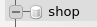
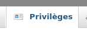
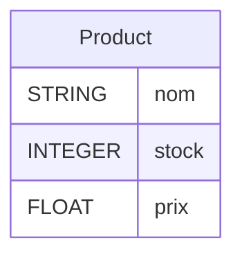

# Persitance des données avec l'ORM Sequelize.

https://sequelize.org/

`Sequelize` est un module npm qui permet d'accéder à une BDD SQL sans jamais écrire le moindre code SQL. Toutes les actions habituelles du SQL sont accessibles via des objets. Les programmes comme sequelize s'appelle des ORM ( object-relational mapping ) c'est une surcouche (un interface) du SQL qui permet un accès simple, rapide et orienté objet à la BDD.

A titre d'exemple une requête comme :
```sql
SELECT * FROM User WHERE User.id==1
```
S'écrit avec sequelize :
```js
const user = await User.findByPk(1);
```
Une relation One to Many se crée comme suit :
```js
Category.hasMany(Product);
Product.belongsTo(Category);
```

Ce cours se déroulera en deux parties.

1. Découverte de sequelize, les fonctionnalitées de bases et la documentation.
2. Projet : Création d'un projet Pokedex de zéro du front-end au back-end. Le back-end sera fait d'un serveur `express` et de `sequelize` pour simplifier l'accès à la BDD SQL.

> Sequelize est un ORM JavaScript, il existe d'autres ORM dans d'autres langages comme 
> - Hibernate pour Java / Spring
> - Doctrine pour PHP / Symfony
>
> Souvenez-vous qu'un ORM permet de faire abstraction du langage SQL via des objets.

# Installer sequelize
Dans un dossier spécifique à votre projet back-end faites : 
```bash
npm init # Répondez au questions avant de faire la commande suivante...
npm install express cors sequelize mysql2
```
> Il est **obligatoire** d'installer mysql2 pour le fonctionnement de sequelize.

# Créer une BDD dans PhpMyAdmin
Pour se connecter, sequelize a besoin d'une BDD SQL et d'un utilisateur ayant tout les droits sur la BDD.

Vous pouvez mettre en place rapidement un serveur mysql et phpMyAdmin avec docker.

```bash
docker network create lamp-net

docker run -d --name lamp-mysql --network=lamp-net -e MYSQL_ROOT_PASSWORD=root 
-p 3306:3306 mysql

docker run -d --name lamp-pma --network=lamp-net -e PMA_HOST=lamp-mysql 
-p 8080:80 phpmyadmin

docker start lamp-mysql
docker start lamp-pma
```

Rendez-vous ensuite sur *localhost:8080* pour accéder à phpMyAdmin.

Les identifiants sont :
- id : root
- mdp : root

1. Une fois connectée à phpMyAdmin, créez une BDD nommée `shop` 
*Cliquez sur "Nouvelle base de données"*

2. Créez ensuite un utilisateur ayant tout les droits sur cette BDD.
*Cliquez sur le nom de la bdd*

*Puis sur l'onglet Privilèges*

- On met en mot de passe shop et en identifiant shop (pour se simplifier la vie)
- On accorde tout les privilèges à l'utilisateur shop sur la base de données shop.


En résumé, les identifiants pour vous connectez à la BDD sont :
- **bddName** : shop
- **username** : shop
- **mdp** : shop
- **host** : localhost

# Organisez votre code en plusieurs fichiers

Pour garder un code compréhensible et maintenable on va diviser notre programme en deux fichiers.
- un fichier **database.js** qui initialise la connexion à la base de donnée, instancie les modeles (les tables) et les exportes aux autres fichiers.
- un fichier **app.js**, qui contient nos routes express et utilise les modeles crées avec sequelize.

# Se connecter à la BDD avec Sequelize

Dans un fichier nommée `database.js`
*/back-end/database.js*
```js
const { Sequelize,DataTypes } = require("sequelize");

const login = {
    database : "shop",
    username : "shop",
    password : "shop"
};
// Connexion à la BDD
const sequelize = new Sequelize(login.database, login.username, login.password, {
    host: 'localhost',
    dialect: 'mysql'
});
```

```js
// Vérifier la connexion
sequelize.authenticate()
.then(()=>console.log("Connexion à la base de donnée shop"))
.catch(error=>console.log(error));
```

> Assurez vous d'avoir bien installé le paquet `mysql2` pour vous connecter à une BDD MySQL.
> Si il s'avert que vous utilisez plutôt une BDD MariaDB, MongoBD, SQLite ou autre, référerez vous à la documentation de `sequelize` pour avoir savoir quel paquet installer.
> https://sequelize.org/docs/v6/getting-started/#installing

# Créer une table, un modèle.
Avec sequelize les tables SQL sont représentées sous la forme d'objet appelées `Models`.

Un `Model` contient toutes les fonctions néccessaires pour accèder à la table qu'il décrit et aux éventuelles tables auxquelles il est lié via des liaisons OneToOne, ManyToMany ou ManyToOne.

La création d'un modèle se fait en deux étapes :
1. La définition du modèle.
2. La synchronisation avec la base de donnée.

## Définir une table (un modèle)
Soit une table `Product` contenant trois champs : nom, stock et prix.



J'utilise la fonction `sequelize.define()` pour décrire la table.

*database.js*
```js

const {Sequelize,DataTypes} = require("sequelize");

// const sequelize = new Sequelize(...)
/* ...après la connexion... */

// Création de la table Product
const Product = sequelize.define("Product",{
    name : DataTypes.STRING,
    price : DataTypes.FLOAT,
    stock : DataTypes.INTEGER
});
```
> La fonction define renvoie un objet de la classe `Model`, je stock cet objet dans une variable homonyme au nom du modèle (Product).

Une fois le modèle défini j'applique les changements à la BDD avec la fonction `sequelize.sync`.
```js
const {Sequelize,DataTypes} = require("sequelize");

// const sequelize = new Sequelize(...)
/* ...après la connexion... */

// Création de la table Product
const Product = sequelize.define("Product",{
    name : DataTypes.STRING,
    price : DataTypes.FLOAT,
    stock : DataTypes.INTEGER
});

// Application des changements à MySQL
sequelize.sync({force : true})
.then(() => console.log("Les modèles et les tables sont synchronisés."));
```
***Vous devriez voir une table apparaitre dans PHPMyAdmin.***

La fonction `sequelize.sync` provoque l'envoi de la requête `CREATE TABLE` à la BDD MySQL, sans cette fonction aucun changement ne serait appliquer à notre BDD. Il est donc obligatoire de l'appeler.

Pour savoir si une fonction de sequelize effectue une requête sur la BDD il suffit de voir si cette méthode renvoie une Promise.
>La fonction `sequelize.sync` est une fonction asyncrone renvoyant une Promise elle effectue donc une requete SQL (dans le cas de `sequelize.sync` un `CREATE TABLE`)

 Le paramètre `{force : true}` permet d'écraser les données de la table quand le serveur redémarre ce qui est pratique en développement.

> ATTENTION à bien passer force à false avant la mise en production, sinon toutes les données seront supprimées lors d'un redémarage du serveur.

## Exporter le modèle

J'exporte `sequelize` et le modèle `Product` pour pouvoir m'en servir dans d'autres fichiers.
```js
const {Sequelize,DataTypes} = require("sequelize");

// const sequelize = new Sequelize(...)
/* ...après la connexion... */

// Création de la table Product
const Product = sequelize.define("Product",{
    name : DataTypes.STRING,
    price : DataTypes.FLOAT,
    stock : DataTypes.INTEGER
});

// Application des changements à MySQL
sequelize.sync({force : true})
.then(() => console.log("Les modèles et les tables sont synchronisés."));

// J'exporte le modèle Product
module.exports.Product = Product;    
// J'exporte aussi sequelize au cas où pour plus tard.
module.exports.sequelize = sequelize;   
```

# Les bases du requêtage d'un Model
Le `Model` est le point d'entrée vers la table qu'il représente. Un modèle contient de nombreuses méthodes publiques permettant d'effectuer des requêtes vers la table.

1. Créez un fichier `app.js`.
2. Importez l'objet `Product` dans le fichier app.js.

*app.js*
```js
const {Product} = require("./database.js");
```

## Ajouter un élement à la table

Ajoutez un produit avec la fonction `Product.create()`.Passez lui en paramètre un objet possèdant les champs du modèle en attributs.

*app.js*
```js
const {Product} = require("./database.js");

Product.create({
    name : "Nike air",
    price : 100,
    stock : 24
});
```

***Et voilà un produit à été ajouté à la BDD !***

Si vous regardez dans PHPMyAdmin vous verrez qu'un nouveau produit à été ajouté à la table `Product`.

Je peux facilement encapsuler tout ça dans une route express.
```js
const express = require("express");
const app = express();
const {Product} = require("./database.js");

app.use(express.json());

app.post("/product",async (req,res)=>{
    const newProduct = req.body;

    const product = await Product.create({
        name : newProduct.name,
        price : newProduct.price,
        stock : newProduct.stock
    });
    res.status(200).json(product);
});
```
Et voilà rien de bien compliqué.

### La syntaxe async await
La fonction `Model.create` provoque une requête SQL `INSERT INTO` sur la BDD, elle renvoie donc une Promise.

Lors de l'utilisation d'une Promise dans une route express il faut attendre la résolution de la Promise avant d'envoyer la réponse HTTP.

Pour attendre la résolution on utilise le mot clé `await`, il faut obligatoirement définir la fonction callback comme asynchrone pour pouvoir utiliser `await`.

Voilà pourquoi l'appel de la fonction `Product.create` est préfixé d'un `await` et la déclaration de la fonction callback est préfixé d'un `async`.
```js
// Je défini la fonction callback comme asychrone.
app.post("/product",async (req,res)=>{  
    const newProduct = req.body;

    // J'attend la résolution de la Promise avant de récupérer le produit crée.
    const product = await Product.create({
        name : newProduct.name,
        price : newProduct.price,
        stock : newProduct.stock
    });
    // Je renvoi le produit ainsi crée dans la réponse HTTP.
    res.status(200).json(product);
});
```

# Exercices
1. Ajoutez un produit dans la BDD avec la fonction `Product.create()`.
2. Ajoutez les produits du tableau suivant dans la BDD :
```js
const products = [
    { name : "Adidas taille 42", price : 100, stock:12 },
    { name : "Nike air 45", price : 150, stock:3 },
    { name : "Pantalon celio", price : 45, stock:9 }
];
```
3. Ajoutez une route express qui permet d'ajouter un produit. Cette route devra utiliser la bonne méthode HTTP et renvoyer les bon `status codes` en fonction des entrées utilisateur.
4. Créer une route express qui permet d'ajouter plusieurs produit en même temps. Cette route devra utiliser la bonne méthode HTTP et renvoyer les bon `status codes` en fonction des entrées utilisateur.

## Récupérer tout les produits - findAll()

```js
const products = await Product.findAll();
```

La fonction findAll() renvoie tout les elements d'une table sous la forme d'un tableau.

1. Ajoutez plusieurs produits puis affichez les tous dans la console.
2. Créer une route qui renvoi tout les produits. Cette route devra utiliser la bonne méthode HTTP.

## Récupérer un produit via son id
Pour chaque modèle, sequelize attribut automatiquement une clé primaire (Primary key).

Je peut donc récupérer un élément en fonction de sa PK via la fonction `Model.findByPk()`.
```js
const product = await Product.findByPk(3);
```
1. Ajoutez une route qui renvoi un produit en fonction de son id.
2. La route doit renvoyer une réponse correct si un produit inconnu est demandé.

## Récupérer un produit via son name

Je peux effectuer un WHERE en fournissant un objet en paramètre de la méthode `findAll()`.

```js
const nameToSearch = "Nike air max";
const product = await Product.findAll({
    where : {
        name : nameToSearch // name = "Nike air max"
    }
})
```

## Les conditions
Pour construire des conditions, `sequelize` utilise un objet représentant les opérateurs `OR`, `AND`, `LIKE`, etc.

Cette objet s'appelle `Op`, il faut l'importer du module `sequelize`.
```js
// J'importe l'objet Op depuis sequelize.
const { Op } = require("sequelize");

Product.findAll({
    // L'objet where peut avoir comme attributs
    where: {
        // le nom d'une colonne
        name : "Puma taille 42",
        // Un opérateur conditionnel
        [Op.or]: [  // name="Air max" OR price=13
            { name: "Air max" },     
            { price: 13 }
        ]
    }
});
```

Par défaut le nom d'une colonne vérifie l'égalité.
```js
const { Op } = require("sequelize");

Product.findAll({
    // L'objet where peut avoir comme attributs
    where: {
        // le nom d'une colonne
        name : "Puma taille 42",    // name = "Puma taille 42"
    }
});
```
Mais je peux passer un objet en tant que valeur d'une colonne et placer des opérateurs logiques à l'interieur comme ceci :
```js
Product.findAll({
    // L'objet where peut avoir comme attributs
    where: {
        // je place un objet dans le nom de la colonne
        price : {
            [Op.gt] : 10    // price > 10 (greater)
        }
    }
});
```
Je peux placer autant d'opérateurs que je le souhaite en tant qu'attribut de la colonne et ainsi vérifier si plusieurs conditions sont vraies.

```js
Product.findAll({
    // L'objet where peut avoir comme attributs
    where: {
        // Je place un objet dans le nom de la colonne
        price : {
            [Op.gt] : 10,    // price > 10 (greater)
            [Op.ne] : 10,    // price != 10 (not equal)
            [Op.gte] : 10,    // price >= 10 (greater equal)
            [Op.lt] : 10,    // price < 10 (greater equal)
            [Op.lte] : 10,    // price <= 10 (greater equal)
        }
        [Op.or] : [ // name = "Air max" OR price > 10
            { name: "Air max" },     
            { 
                price: {
                    [Op.gt] : 10
                } 
            }
        ]
    }
});
```
>Regardez absolument la liste de tout les opérateurs possible avec sequelize !
https://sequelize.org/docs/v6/core-concepts/model-querying-basics/#operators

1. Ajoutez une route qui renvoi un produit en fonction de son id
2. Ajoutez une route qui renvoi un produit en fonction de son name
3. Ajoutez une route qui renvoi un produit en fonction de son name ou de son id
4. Ajoutez une route qui filtre les produits en fonction d'un stock minimal et les renvois
5. Ajoutez une route qui filtre les produits en fonction d'un interval de prix et les renvois

## Supprimer un produit
```js
await Product.destroy({
  where: {
    firstName: "Puma taille 42"
  }
});
```
> Doc `Model.destroy()`
> https://sequelize.org/docs/v6/core-concepts/model-querying-basics/#simple-delete-queries

1. Ajoutez une route qui supprime un produit en fonction de son name
1. Ajoutez une route qui supprime plusieurs produits en fonction d'un texte fournit par l'utilisateur. Supprimer tout les produits qui contiennent ce texte dans leurs `name` ou qui possèdent ce texte en tant qu'id. Cette route informe correctement l'utilisateur de la réussite de sa requête au moyen de status codes appropriés.

## Modifier un produit
```js
const newValues = {
    name : "Converse"
}
await Product.update(newValues, {
  where: {
    id: 2
  }
});
```
> Doc `Model.update`
> https://sequelize.org/docs/v6/core-concepts/model-querying-basics/#simple-update-queries

1. Créer une route qui permet décrementer le stock d'un produit
2. Modifier le Model pour qu'il possède un champ BOOLEAN nommé published. Ce champ défini si un produit est visible des clients ou non. Puis ajoutez une route qui permet de publier ou non un produit.
3. Modifier la route qui renvoie tout les produits. L'utilisateur doit pouvoir préciser si il veut ou non afficher tout les produits, uniquement les produits publiés ou uniquement les produits non publiés. Par défaut ce sont les produits publiés qui son renvoyés.
4. Créer une route qui permet de modifier les champs d'un produit. Cette route informe correctement l'utilisateur de la réussite de sa requête au moyen de status codes appropriés.

# Getting started sequelize
Dans la doc de sequelize consultez et pratiquez : 
- https://sequelize.org/docs/v6/getting-started/
- https://sequelize.org/docs/v6/core-concepts/model-basics/
- https://sequelize.org/docs/v6/core-concepts/model-instances/
- https://sequelize.org/docs/v6/core-concepts/model-querying-basics/
- https://sequelize.org/docs/v6/core-concepts/model-querying-finders/
- https://sequelize.org/docs/v6/core-concepts/getters-setters-virtuals/

# Projet Pokedex
Vous allez conçevoir de A à Z une application responsive, du back-end au front-end.

## Fonctionnalités spécifique obligatoires
- une barre de recherche

## Objectifs
- Créer le diagramme de cas d'utilisation d'un pokedex, appelez moi pour le valider.
- Mettre en place un back-end nodejs / express / sequelize
- Mettre en place un front-end JS pour ce pokedex.

## Proposition de maquette

.png)
.png) 
.png) 


