# Exercices
1. Mettez en place les relations suivantes avec Sequelize
2. Pour chaque diagramme ajouter et récupérer des éléments avec les méthodes mixins pour prouver que les associations on bien fonctionnés.
### One to Many
<!-- 1. Créez 10 employées avec Model.create()
2. Ajoutez en 5 a un departement nommé "Comptable"
3. Ajoutez en 4 a un autre nommé "Dev"
4. Ajoutez en 1 dans le departement "Direction"
5. Récupérer tout les employées
6. Récupérer tout les Dev
7. Récupérer le nombre de comptables.
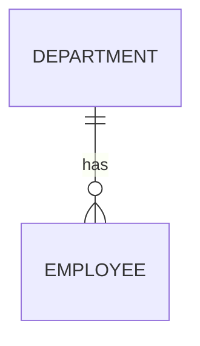
1. Créez 15 classes avec Model.create()
2. Ajoutez en 5 a un school nommée "College"
3. Ajoutez en 5 a une autre nommée "Lycee"
4. Ajoutez en 5 dans la school "Primaire"
5. Récupérer tout les classes
6. Récupérer tout les collégiens
7. Récupérer le nombre de primaire.
8. Récupérer tout les collégiens et lycéens.
```mermaid
erDiagram
    SCHOOL ||--o{ CLASS : has

```
1. Créez 15 classes avec Model.create()
2. Ajoutez en 5 a un school nommée "College"
3. Ajoutez en 5 a une autre nommée "Lycee"
4. Ajoutez en 5 dans la school "Primaire"
5. Récupérer tout les classes
6. Récupérer tout les collégiens
7. Récupérer le nombre de primaire.
8. Récupérer tout les collégiens et lycéens.
```mermaid
erDiagram
    COUNTRY ||--o{ CITY : contains

``` -->
<!-- 0. Créer les modèles suivants et leurs associations. Ils vous faudra utilisez un alias de foreignKey : https://sequelize.org/docs/v6/core-concepts/assocs/#defining-an-alias
1. Créer 3 utilisateurs et 10 messages
2. Assignez les 10 messages à des utilisateurs (sender et target) en utilisant addBars()
3. Assignez 3 nouveaux messages avec createBar()
```mermaid
erDiagram
    USER
    MESSAGE{
        senderUserId INT
        targetUserId INT
    }
    USER ||--o{ MESSAGE : sends

``` -->
0. Implementez la relation ci-dessous
1. A l'aide de addBars() ajoutez et associez les trois albums suivant :
- https://fr.wikipedia.org/wiki/Thriller_(album)
- https://www.senscritique.com/album/wish_you_were_here/58288
- https://fr.wikipedia.org/wiki/Astro_Lounge
```mermaid
erDiagram
    ALBUM ||--o{ SONG : contains
```
7.
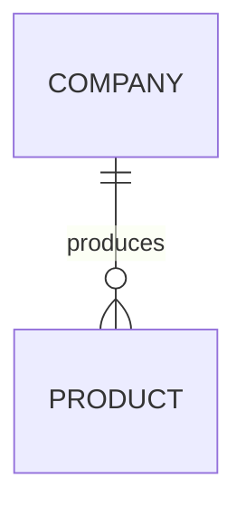

### One to One
1. Créez 2 citoyen avec Model.create()
2. Leurs fournir à chaqu'un un passeport
3. Grace à la contrainte UNIQUE empecher un citoyen d'avoir plusieurs passport dans la BDD.
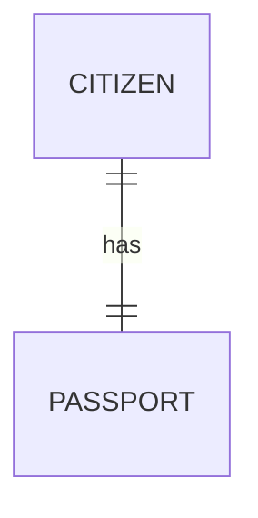
2.
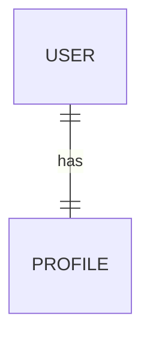
3.
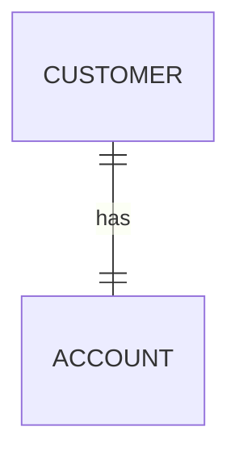
4.
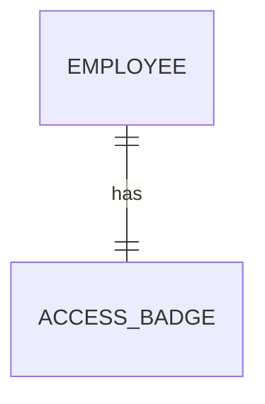
5.
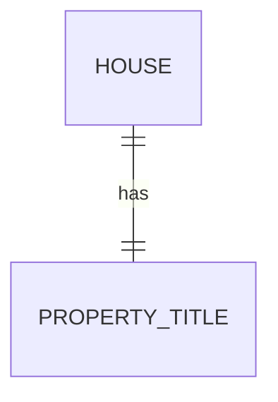
### Many to Many
> N'oubliez pas de nommer votre table de jointure par le nom des deux tables.

1. 
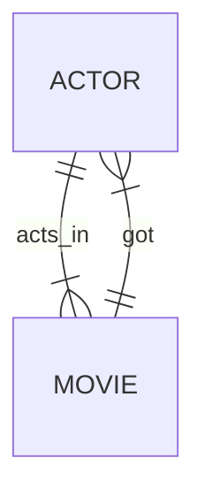
```mermaid
2. 
erDiagram
    CUSTOMER ||--|{ PRODUCT : likes
    PRODUCT ||--|{ CUSTOMER : liked_by
```

2.
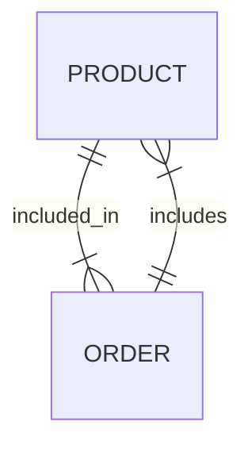
3.
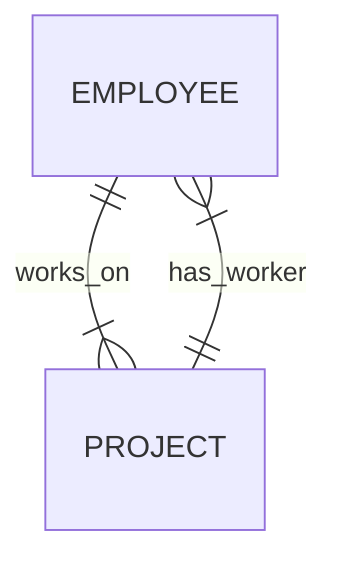
4.
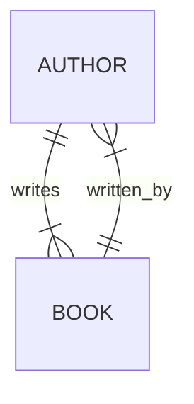
5.
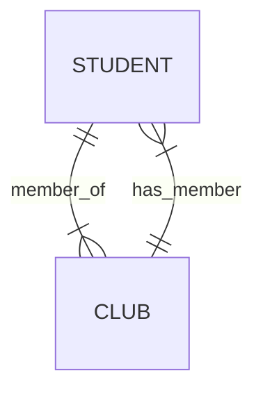
6.
