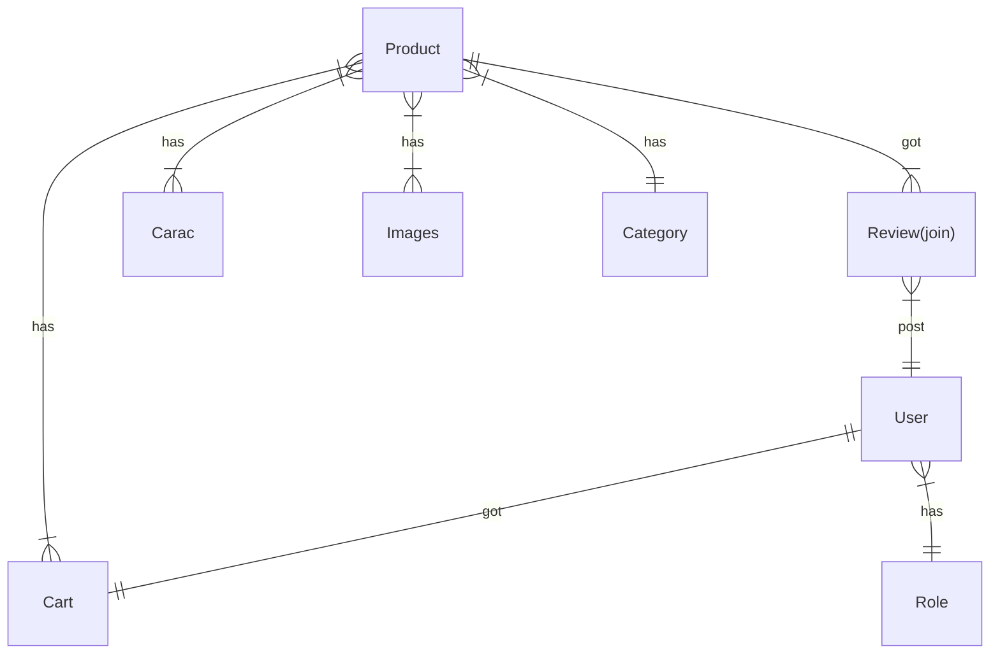
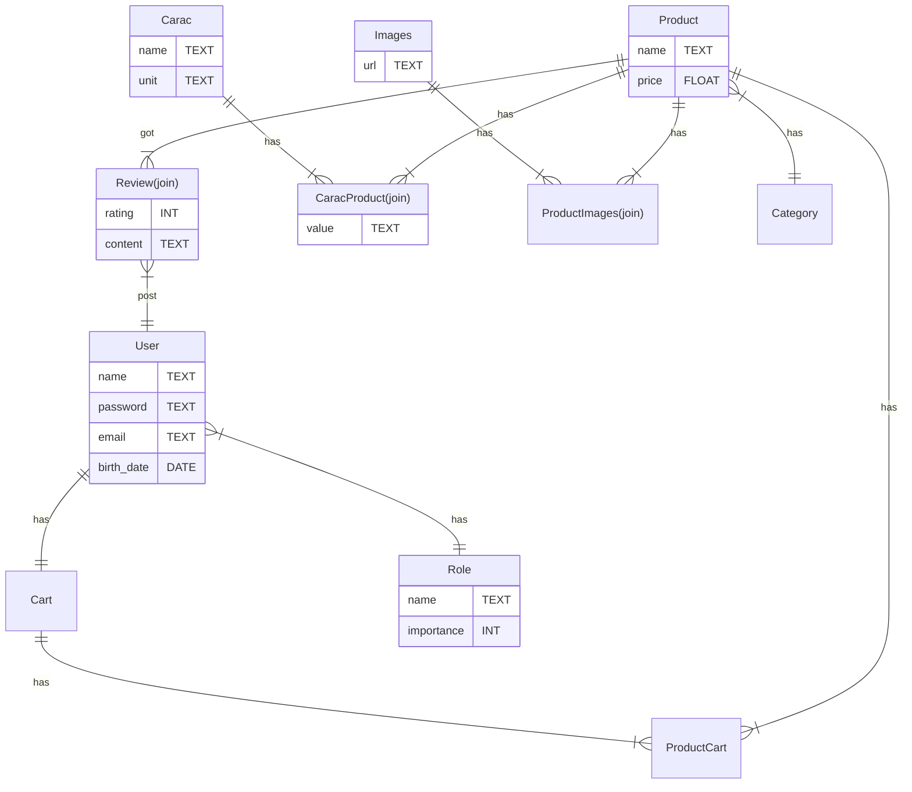

# Projet boutique en ligne

Définissez chaque model dans un fichier du même nom.

Par exemple le modèle `User` est défini dans le fichier `User.js` avant d'être exporté dans database.js

## Diagramme simpliste : sans jointure ni champs

## Diagramme complet avec jointure et champs des tables

## 1. Implementation avec sequelize

Avec sequelize implementez le diagramme d'entité relation.
> Faite attention ! Ce diagramme ne contient pas les clés primaires et les clés etrangères.

## 2. Crud
Créez un programme NodeJS (un service) qui permet d'effectuer les actions CRUD sur ce diagramme.
- Faite le avec express.
- Tout le projet doit être dans un dossier nommé `api_crud`

> C'est important de mettre tout le projet dans un même dossier pour pouvoir faire un docker compose facilement plus tard.

Voici les routes à construirent :

*Pour les produits :*
- GET /product/:id
- GET /product/search/:input
- GET /products/:limit
- GET /products/category/:id
- POST /product
- DELETE /product
- PUT /product
- POST /product/review
- PUT /product/review
- GET /product/:id/review

*Pour les categories de produit :*
- GET /categories
- POST /category
- DELETE /category
- PUT /category

*Pour les utilisateurs :*
- POST /user/login
- POST /user/signin
- PUT /user
- GET /user/:id
- GET /users

*Pour le panier :*
- GET /cart/:userid
- POST /cart/:userid/:productid/:quantity
- PUT /cart/:userid/:productid/:quantity

