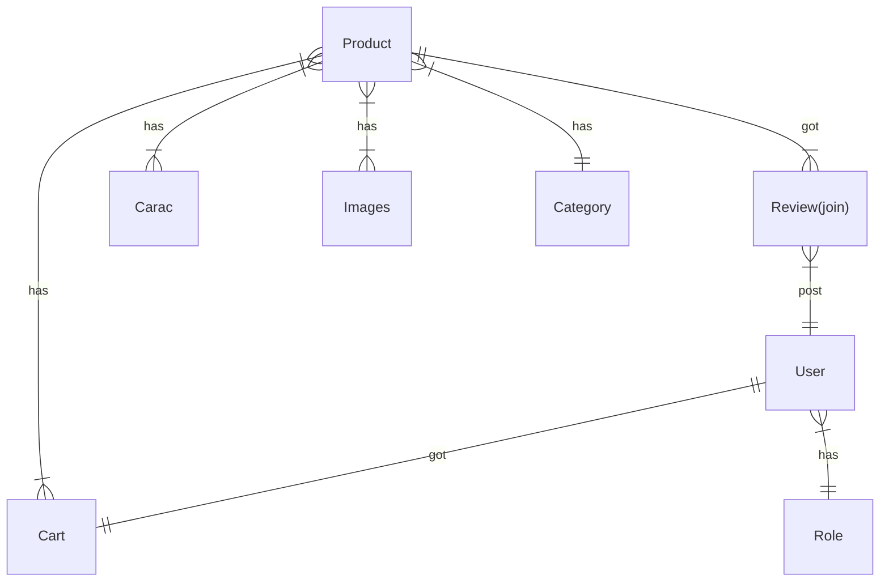
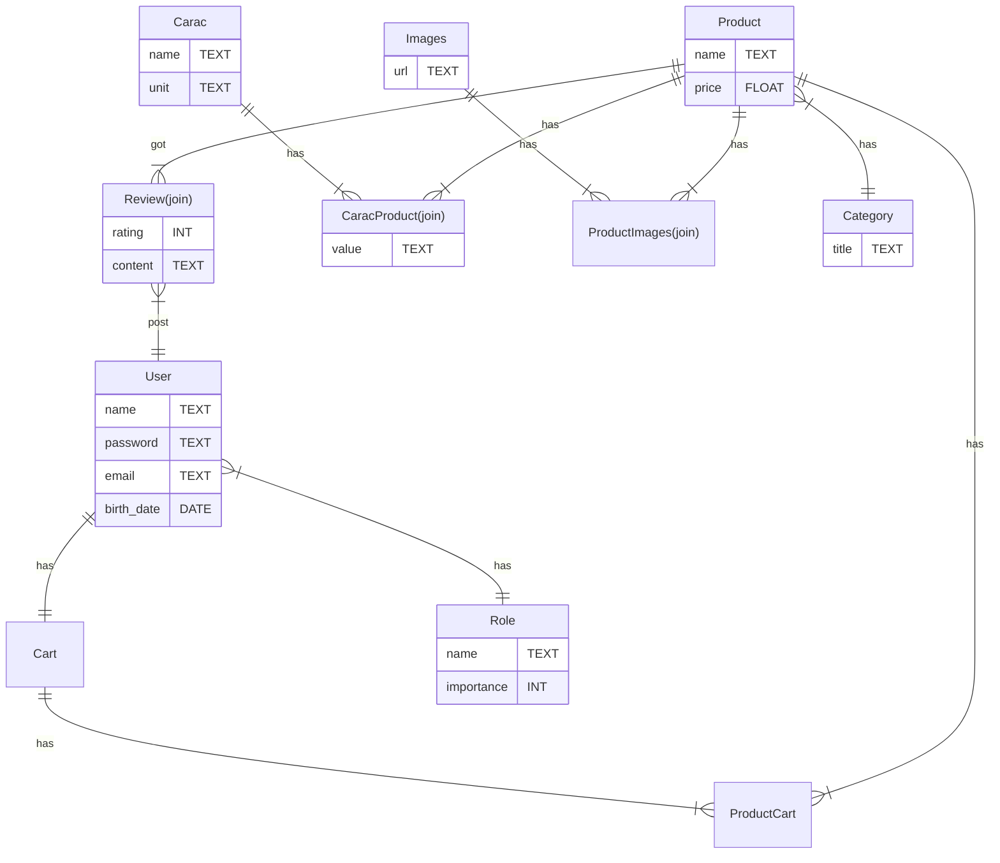

# Projet boutique en ligne BACK END

Définissez chaque model dans un fichier du même nom.

Par exemple le modèle `User` est défini dans le fichier `User.js`.

## Diagramme simpliste : sans jointure ni champs

## Diagramme complet avec jointure et champs des tables

## 1. Implémentation avec sequelize

Avec sequelize implementez le diagramme d'entité relation.
> Faite attention ! Ce diagramme ne contient pas les clés primaires et les clés etrangères.

### Structure du projet

*/database/index.js*
```js
const sequelize = new Sequelize(...)
// ...
module.exports = sequelize;
```

*/database/Product.js*
```js
const Product = sequelize.define("Product",{...});
// ...
module.exports = Product;
```

*/app.js*
```js
const sequelize = require("./database");
const Product = require("./database/Product.js");
// Code ...
```

#### Les associations se feront dans les fichiers de Models
*Exemple :*

*/database/Product.js*
```js
const Category = require("./Category.js");
const Product = sequelize.define("Product",{...});

Product.hasMany(Category);
Category.hasOne(Product);

module.exports = Product;
```


## 2. Crud
Créez un programme NodeJS (un service) qui permet d'effectuer les actions CRUD sur ce diagramme.
- Faite le avec express.
- Tout le projet doit être dans un dossier nommé `api_crud`
- Le fichier `database.js` contient la connexion à la BDD et exporte la variable `sequelize`.
- Les Models sont crées dans des fichiers specifiques éponymes. 

> C'est important de mettre tout le projet dans un même dossier pour pouvoir faire un docker compose facilement plus tard.

### Voici les routes à construire :

#### *Pour les produits :*
- GET /product/:id
- GET /products/search/:input
- GET /products/:limit
- GET /products/category/:categoryId
- POST /product
- DELETE /product/:id
- PUT /product
- POST /product/review
- PUT /product/review
- GET /product/review/:productId
- DELETE /product/review/:productId

#### *Pour les categories de produit :*
- GET /categories
- GET /category/:id
- POST /category
- DELETE /category/:id
- PUT /category

#### *Pour les utilisateurs :*
- POST /user/login
- POST /user/signin
- PUT /user
- GET /user/:id
- GET /users

> Veuillez hasher les mots de passe utilisateur dans un setter du modèle `User`.

> Pour la connexion il faut **comparer le mot de passe** passé par le client **avec le mot de passe hashé** contenu dans la BDD. 

>  Pour hasher vous pouvez utiliser le npm package `bcrypt`  : https://www.npmjs.com/package/bcrypt

> Voir la doc sequelize sur les setter : https://sequelize.org/docs/v6/core-concepts/getters-setters-virtuals/#setters

> Pour comparer vous pouvez utiliser le npm package `bcrypt`  : https://www.npmjs.com/package/bcrypt


#### *Pour le panier :*
- GET /cart/:userid
- POST /cart/:userid/:productid/:quantity
- PUT /cart/:userid/:productid/:quantity

