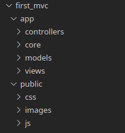
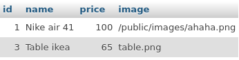
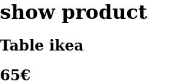
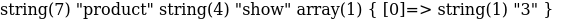
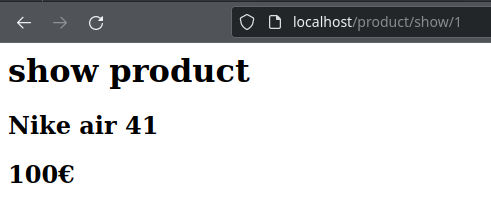
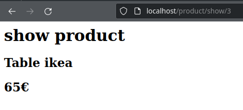

# Model View Controller en PHP
Le `Model View Controller` (MVC) est un design pattern de programmation qui permet d'organiser le code des applications web full-stack.

Le MVC divise le code en trois parties :
- **Le modèle**, il accède à la BDD et fournit des fonctions qui font abstractions du SQL.
- **La vue**, une page HTML qui ne fait qu'afficher des données.
- **Le contrôleur**, il fait le lien entre un modèle et une vue. On associe une URL à un contrôleur.


## Le flux d'éxecution du MVC
Le principe du MVC est simple :
- Tout les requêtes HTTP sont reçu par un seul et même fichier `index.php`.
- Ce dernier va ensuite appeller le bon `Controller` en fonction de l'URL.
- Le `Controller` va demander des données à un `Model` puis afficher une `View`. C'est la pierre angulaire du pattern MVC.


### Exemple - Afficher un produit :
- L'utilisateur tape : `localhost/produit/show/1`.
- Le fichier index.php reçoi l'URL.
- Il instancie le contrôleur `ProductController`
- La fonction `ProductController::show` est appelée
- Cette dernière appelle le modèle `ProductModel` et récupère le produit à l'id 1.
- Le contrôle fournit le produit à la vue HTML qui est affichée.

## Logique métier et code boilerplate
En informatique ont différencie le code en deux parties :
- **La logique métier** : c'est le code qui solutionne le besoin du projet. Pour une application de commande de pizza se sera : choisir ces aliments, choisir l'heure de livraison, rajouter des pizza en favoris.
- **Le code boilerplate** correspond au code que l'ont retrouve de façon récurrente dans beaucoup de projet : accéder à une BDD, valider des données, executer un controller en fonction de l'URL.

**Le design pattern MVC défini le code boilerplate d'une application web** et permet d'en accélerer le développement. 

Nous allons apprendre à coder un MVC en *"vanilla PHP"* c'est à dire uniquement avec PHP sans aucune extension ou framework. Plus tard vous utiliserez des frameworks comme Symfony ou Laravel qui vous fournissent tout le code *boilerplate* pour que vous n'ayez plus qu'à y ajouter votre logique métier.


##  Model
*Le Modèle à un accès direct à la base de donnée, il fournit des méthodes publiques simples d'utilisation pour épargner au développeur l'écriture des requêtes SQL.*

La création d'un modèle d'une table se fait en deux étapes : 
1. **La création d'une classe `Entity`** qui représente les **lignes** de la table.
2. **La création d'une classe `Model`** qui représente la **table**. Elle possède des méthodes publiques pour effectuer les actions `CRUD` sur la table : sélection d'une ou plusieurs entités , ajout, suppression et modification.

La classe `Model` va instancier des `Entity`, il est donc important de créer la classe `Entity` avant la classe `Model`. 

*Par exemple, si je veux récupérer une ligne de la table `Product` via son `id` je vais utiliser la méthode publique `Model::get(int $id)` en prenent soin de lui fournir l'id du produit recherché, la méthode me renverra une instance de la classe `Entity` qui contiendra toutes les informations de mon produit.*
> Un `modèle` est une représentation objet de la **table**.
> Une `entité` est une représentation objet d'une **ligne** de la table.

```
Les modèles sont contenu dans le dossier :
/app
 - /models
```

Voici un exemple de `Model` en PHP:
```php
class ProductModel{
    private PDO $bdd;
    private PDOStatement $addProduct;

    function __construct()
    {
        $this->bdd = new PDO("mysql:host=lamp-mysql;dbname=boutique","root","root");
        $this->addProduct = $this->bdd->prepare("INSERT INTO `Produit`
         (name,price,image) VALUES(:name,:price,:image);");
    }

    public function add(string $name, float $price,string $image) : void
    {
        $this->addProduct->bindValue("name",$name);
        $this->addProduct->bindValue("price",$price);
        $this->addProduct->bindValue("image",$image);
        $this->addProduct->execute();
    }
}

$productModel = new ProductModel();
$productModel->add("Air max taille 42",120.99,"/images/airmax.png");
echo "Un nouveau produit à été ajouté à la BDD regardez dans phpMyAdmin";
```

## View

Une vue contient la page HTML à afficher sur le navigateur du client. Elle ne fait qu'afficher les données que le contrôleur lui donne et n'a aucune conscience de la base de donnée.

C'est la partie la plus simple du modèle MVC car elle n'est composée que d'un seul fichier contenant du HTML et éventuellement un peu de CSS et de JavaScript.

> Une vue c'est simplement une page HTML qui sera appelée par un contrôleur.
```
Les vues sont contenu dans le dossier :
/app
 - /views
```

## Controller
Le `Controller` fait l'interface entre la `View` et le `Model`.

Le `Controller` est une classe est composée de méthodes appellées en fonction de l'URL tapée par le client.

La création d'un `Controller` se fait en plusieurs étapes :
- La création d'une classe `Controller`.
- L'ajout de méthodes publiques à la classe pour chaque url possibles.

Par exemple si les urls possibles de mon contrôleur sont :
```http
/product/add
/product/show
/product/delete
```

 J'ajoute trois méthodes publiques nommées :
 - ProductController::add()
 - ProductController::show()
 - ProductController::delete()

 Chaqu'une de ces méthodes appelera une vue et demandera éventuellement des données à un modèle.

## Exemple - Flux d'exécution d'un contrôleur
Par exemple si le client tape l'url :
```http
localhost/product/show/3
```
Le contrôleur `ProductController` appellera la méthode `show` avec comme paramètre `3`.

La méthode `show` va ensuite :
1. Utiliser un modèle pour récupérer un produit dans la BDD via son id.
2. Fournir le produit à la vue.
3. Afficher la vue.

*L'objectif d'un `Controller` c'est de faire correspondre l'url tapée par l'utilisateur à une méthode d'objet ce qui simplifie le développement de l'application et permet un code bien organisé.*

### Le routage
Habituellement en HTTP une URL ressemble à ça :
```http
localhost/single-product.php?id=3
```
En MVC l'URL ressemblera à ceci 
```http
localhost/product/show/3
```
Ce format permet de faire correspondre une méthode `ProductController::show` à l'url `/product/show` ce qui est très puissant en plus d'améliorer le réferencement Google du site.

Le soucis c'est que par défaut le serveur web apache interprète ce format comme une arborescence de dossier et nous renvoi une erreur 404 car aucun fichier nommé *3* n'existe.

Il nous faut donc modifier le comportement d'apache pour que les requêtes soit renvoyée au fichier index.php pour que ce dernier puisse appeler le bon `Controller` en fonction de l'url.

Ce principe s'appelle la la réecriture d'URL ou `URL Rewriting` et il sera obligatoire de modifier notre serveur apache pour appliquer ce nouveau comportement.

# Guide : Créer un architecture MVC
Nous allons créer pas à pas une architecture MVC.

## Plan d'action
Voici comment va se dérouler la suite du cours.
### I - Structure du projet
1. Créer la **structure** des dossiers du projet
2. Créer le **fichier index.php**
3. Mettre en place la **réécriture d'URL** pour que index.php reçoivent toutes les URLs à l'aide du fichier *.htaccess*
4. Créer la **classe App** qui sera le point de départ de notre application.

### II - Model
5. Créer un **modèle** de table SQL.

### III - Contrôleur et vue
6. **Créer un contrôleur et une vue.**
7. Tester le contrôleur dans App pour afficher une vue en fonction de valeurs rentrées en dur dans le code.
8. **Extraire** de l'**url**
    - le nom d'un **contrôleur**
    - le nom de la **méthode** 
    - les **paramètres**.
9. Tester mon controlleur avec ces valeurs extraites.

### IV - Routing
10. Créer une **classe Router** qui va instancier le bon contrôleur en fonction des valeurs extraites de l'url.
11. Tester mon application avec le Router
### V - Page d'accueil et erreur 404
12. Solidifier mon application avec
    - un **Contrôleur par défaut**, une page d'accueil
    - une **Contrôleur error 404**
### VI - Ajouter de nouvelles pages
13. Ajouter un nouveau contrôleur.
14. Ajouter une nouvelle méthode au contrôleur

## Pré-requis
- Un serveur LAMP
- Le module rewrite de apache d'activé, pour l'activer tapez : 
    ```bash
    docker exec lamp-php a2enmod rewrite
    ```
- Les extensions php PDO activées dans votre container docker pour toutes les activés tapez :
    ```bash
    docker exec lamp-php docker-php-ext-install pdo
    docker exec lamp-php docker-php-ext-install pdo_mysql
    docker exec lamp-php docker-php-ext-install mysqli
    ```
> Remplacez lamp-php par le nom de votre container php-apache.
## I - Structure du projet
### Arboresence du projet
> La racine de notre projet est : `localhost/first_mvc` dans le dossier `/var/www/html/` du serveur LAMP.

> Notre projet sera une petite boutique en ligne de produit.

Un projet MVC est structuré en plusieurs dossiers :


*Arborescence d'un projet MVC*

- **/first_mvc**: la racine de notre projet
    - **/app** : contient tout notre codes source.
        - **/controllers** : contient les fichiers sources de nos classes `Controller`
        - **/core**: contient la class App qui est le point de départ denotre projet et tout ce qui est utile à travers toutes l'appli comme les constantes par exemple.
        - **/models** : contient les fichiers sources de nos classes `Model`.
        - **/views** : contient les fichiers sources de nos page HTML
    - **/public** : contient notre index.php et tout ce qui doit être accessible publiquement.
        - **/css** : contient TOUT nos fichiers CSS
        - **/js** : contient TOUT nos scripts JavaScript
        - **/images** : contient TOUTES les images

### **Pratique :**
1. Créer l'arborescence de dossier si dessus.
3. Créer un fichier nommé `.htaccess` à la racine du projet.
2. Créer un fichier `index.php` à la racine du dossier `/public` et placer le code : `<h1>My first MVC</h1>` à l'intérieur.

Le projet devrait maintenant ressembler à ceci :


> N'oubliez pas le `.` devant le nom du fichier `.htaccess`. C'est un fichier de configuration apache et sont ortographe doit être exact. Attention au fautes de frappe ;).

### Redirection des requêtes vers index.php et réécriture d'URL.
#### Explications
Pour rappel un MVC n'utilise pas le format habituel des requêtes HTTP.
```http
localhost/first_mvc/single-product.php?id=3
```
L'URI d'un lien MVC respecte le format `/controller_name/method/param` :
```http
localhost/first_mvc/controller_name/method/param
```
**Exemples :**
La méthode `ProductController::show()` est appelée lorsque cette route est reçu.
```http
localhost/first_mvc/product/show/3
```

La méthode `CategoryController::delete()` est appelée lorsque cette route est reçu.
```http
localhost/first_mvc/category/delete/3
```

Il faut donc effectuer une réécriture d'url en modifiant la configuration du serveur web apache. La modification d'apache se fait dans le fichier .htaccess à la racine du projet.

#### Pratique
Dans le fichier `.htaccess` écrivez ceci : 
```htaccess
RewriteEngine On
RewriteRule ^(?!public/)(.*) public/index.php
```

Rendez-vous sur localhost/first_mvc et vous devriez voir votre `h1` :
<span style="box-shadow :0px 0px 10px 10px #efefef"></span>

>**Internal Error ?** 
>**Si le serveur vous renvoi une "Internal Error**" cela peut signifier deux choses : une faute de frappe dans le .htaccess ou le module rewrite de apache, qui permet la réecriture d'url, n'est pas activé.
> Pour activé le module **tapez la commande suivante** dans votre container docker, puis relancez votre container.
>```bash
> docker exec lamp-php a2enmod rewrite
>```
> lamp-php est le nom de mon container docker qui contient php et apache, il est basé sur l'image `php:8.2-apache`
- `RewriteEngine On` : active le moteur de réécriture d'url.
- `RewriteRule` rajoute un rêgle de réécriture en faisant corresepondre une regex à un fichier php. Cette rêgle renvoi au fichier `public/index.php`.

La regex `^(?!public/)(.*)` matches toute url qui ne commence pas par `public/`.

**Par exemple :**

`product/show/1` sera renvoyer vers index.php mais `public/css/style.css` renvera comme d'habitude le fichier CSS.

`Regex` est un langage qui permet de chercher des occurences de texte dans un texte, pour se faire il utilise une suite de caratères spéciaux. 

> Les regexs ne sont pas le sujet de ce cours.
> Plus d'info sur les regex ici : https://regexlearn.com/
 
> Si la requête HTTP précise `public/` cela signifie qu'il souhaite accéder aux images, aux css ou aux scripts JS et dans ce cas il ne faut pas le renvoyer à index.php mais bien lui donner la ressource qu'il demande.

### La classe App
La classe `App` est le point de départ de notre application rien ne se trouve en dehors de cette classe. Elle contient une méthode `static` nommée `start`.

Pour l'instant la méthode `start` affichera simplement un *"Hello World"* mais c'est ici que, plus tard, les urls seront lu et que les `Controller` seront appelés.

#### Pratique :
1. Dans le dossier `app/core/` créez un fichier appelé `App.php`.
2. A l'intérieur de ce fichier créer une classe nommée App et ajoutez lui une méthode public static qui echo `"App"`.
3. Appelez la méthode `App::start()` dans `index.php`.

*app/core/App.php*
```php
<?php
class App{
    public static function start(){
        echo "App";
    }
}
```
*public/index.php*
```php
<?php
require_once(__DIR__."/../app/core/App.php");
App::start();
```

Rendez-vous sur `localhost/first_mvc`, vous deveriez voir le texte *App* apparaître. Attention aux fautes de frappes dans le chemin du `require_once`!

> `../` signifie retour en arrière

> `__DIR__` en php est une constante qui contient le chemin vers le dossier actuel du fichier appelant. C'est très pratique pour ne pas se tromper dans le chemin du fichier et VSCode aide à l'autocompletion.

Maintenant que le point d'entrée du projet est mis en place (`App::start`) nous allons pouvoir rajouter les briques au fur et a mesure.

## II - Model
Commençont par créer un modèle, cela nous permettra d'accéder aux données de la BDD SQL et rendra le suite plus concrète.

Pour rappel un modèle est un classe qui permet via ses méthodes publiques d'accéder au données de la BDD.

L'objectif final sera de pouvoir écrire un code simple pour récupérer les données comme par exemple :
```php
$productModel = new ProductModel();
$products = $productModel->getAll();
```
Ici `$products` est un `array` qui contient tout les produits.

C'est parti.

> Avant de commencez assurez vous d'avoir une BDD avec une table nommée `Produit` avec quelque produit dedant.
>```mermaid
>erDiagram 
>Produit{
>    id INT
>    name TINYTEXT
>    price FLOAT
>    image TEXT
>}
>```

1. Dans le dossier `app/models/` ,créez un fichier nommée `ProductModel.php`.
2. Dans ce fichier ajoutez la classe `ProductModel` et `ProductEntity.php`

*app/models/ProductModel.php*
```php
class ProductModel{

}
class ProductEntity{

}
```

### ProductEntity
Une entité represente une ligne de la table. Malgré sont nombres de lignes, cette classe ne contient en faite que des getter et des setters c'est à dire des méthodes publiques pour définir les attributs de l'objet. 

Cette classe nous servira de *type* de reference pour les lignes d'une table.

1. Dans la classe `ProductEntity` ajoutez les méthodes `getter` et les attributs de l'entité. Une méthode `getter` est une méthode publique qui permet d'accéder au attributs de l'objet.

*app/models/ProductModel.php*
```php
class ProductEntity{
    private $name;
    private $price;
    private $image;
    private $id;
    public function getName() : string{
        return $this->name;
    }
    public function getPrice() : float{
        return $this->price;
    }
    public function getImage() : string{
        return $this->image;
    }
    public function getId() : int{
        return $this->id;
    }
}
```
2. Dans la classe `ProductEntity` ajoutez maintenant les méthodes setter qui permettent de définir les valeurs d'une entité. Ainsi que des constantes néccessaires au test dans les setters.

*app/models/ProductModel.php*
```php
class ProductEntity{
    // ...
    private const NAME_MIN_LENGTH = 3;
    private const PRICE_MIN = 0;
    private const DEFAULT_IMG_URL = "/public/images/default.png";
    
    public function setName(string $name){
        if(strlen($name) < $this::NAME_MIN_LENGTH){
            throw new Error("Name is too short minimum 
            length is ".$this::NAME_MIN_LENGTH);
        }
        $this->name = $name;
    }
    public function setPrice(float $price){
        if($price < 0){
            throw new Error("Price is too short minimum price is ".$this::PRICE_MIN);
        }
        $this->price = $price;
    }
    public function setImage(string $image){
        if(strlen($image) <= 0){
            $this->image = $this::DEFAULT_IMG_URL;
        }
        $this->image = $image;
    }
    // ...
}
```
3. Et pour finir le constructeur pour attribuer une valeur aux attributs à la création d'une entité.

*app/models/ProductModel.php*
```php
class ProductEntity{
   // ...
    function __construct(string $name,float $price,string $image,int $id=NULL)
    {
        $this->setName($name);
        $this->setPrice($price);
        $this->setImage($image);
        $this->id = $id;
    }
   // ...
}
```

Voilà il y a pas mal de lignes mais au final peu de complexité algorithmique.

Testez votre `Entity` dans `App`.

*app/core/App.php*
```php
require_once(__DIR__."/../models/ProductModel.php");

class App{
    public static function start(){
        var_dump(new ProductEntity("Billy",34,"/public/images/billy.png"));
    }
}
```

Il nous est maintenant possible de créer des `ProductEntity`, nous pouvont donc passer à la création du modèle.

### ProductModel
La création d'une modèle se fait comme suit :

1.  Déclarer les méthodes publiques qui permetteront d'accéder à la table Produit, par exemple : `get()`, `delete()`, `edit()`, `getAll()`.
2. Initialiser les requêtes préparés dans le constructeur.
3. Remplir toutes les méthodes publiques.

*app/models/ProductModel.php*
```php
class ProductModel{
    public function getAll(int $limit = 50) : array
    {
        return [];
    }

    public function get($id): ProductEntity | NULL
    {
        return NULL;
    }

    public function add(string $name, float $price,string $image) : void
    {   
    }

    public function del(int $id) : void
    {
    }
    public function edit(int $id,string $name = NULL,
    float $price = NULL, string $image = NULL) : ProductEntity | NULL
    {
        return NULL;
    }
}
```
#### Etude de cas : la méthode `ProductModel::getAll()`
Nous allons voir ensemble comment créer la méthode `getAll()` puis, vous essayerez par vous même de remplir les autres méthodes.
> Les classes sont raccourcis dans les exemples suivants.

1. Initaliser la connection à la BDD
2. Préparer la requête `getProducts` dans le constructeur.
*app/models/ProductModel.php*
```php
class ProductModel{

    private PDO $bdd;
    private PDOStatement $getProducts;
    function __construct()
    {
        // Connexion à la base de donnée
        $this->bdd = new PDO("mysql:host=lamp-mysql;dbname=boutique","root","root");
        // Création d'une requête préparée qui récupère tout les produits
        $this->getProducts = $this->bdd->prepare("SELECT * FROM `Produit` 
        LIMIT :limit");
    }
    public function getAll(int $limit = 50) : array
    {
    }
    ...
}
```
3. Remplir la méthode getAll en utilisant la requête préparée `getProducts`.
*app/models/ProductModel.php*
```php
class ProductModel{

    private PDO $bdd;
    private PDOStatement $getProducts;
    function __construct()
    {
        // Connection à la base de donnée
        $this->bdd = new PDO("mysql:host=lamp-mysql;dbname=boutique","root","root");
        // Création d'une requête préparée qui récupère tout les produits
        $this->getProducts = $this->bdd->prepare("SELECT * FROM 
        `Produit` LIMIT :limit");
    }

    /**
     * Renvoi les 50 premiers produits 
     * */
    public function getAll(int $limit = 50) : array
    {
        // Définir la valeur de LIMIT, par défault 50
        // LIMIT étant un INT ont n'oublie pas de préciser le type PDO::PARAM_INT.
        $this->getProducts->bindValue("limit",$limit,PDO::PARAM_INT);
        // Executer la requête
        $this->getProducts->execute();
        // Récupérer la réponse 
        $rawProducts = $this->getProducts->fetchAll();
        
        // Formater la réponse dans un tableau de ProductEntity
        $productsEntity = [];
        foreach($rawProducts as $rawProduct){
            $productsEntity[] = new ProductEntity(
                $rawProduct["name"],
                $rawProduct["price"],
                $rawProduct["image"],
                $rawProduct["id"]
            );
        }
        
        // Renvoyer le tableau de ProductEntity
        return $productsEntity;
    }
    ...
}
```
Vous pouvez maintenant tester le modèle en récupérant les 50 premiers produits de la table `Produit` dans `App::start`.

*app/core/App.php*
```php
require_once(__DIR__."/../models/ProductModel.php");

class App{
    public static function start(){
        $productModel = new ProductModel();
        var_dump($productModel->getAll());
    }
}
```
Tout les produits de votre BDD devraient s'afficher dans le `var_dump`.

#### Pratique : ProductModel::get()
Remplissez la méthode `ProductModel::get()`.
Souvenez vous bien de la méthode de travail :
1. Créez la requête préparée dans le constructeur.
2. Utilisez la dans la méthode `get()` pour renvoyez un ProductEntity en fonction de l'id passée en paramètre.
3. Tester dans `App::start()`.

Une fois cela fait passez aux méthodes suivante. Vous trouverez la signatures des méthodes documentées ci-dessous.

> Si vous ne savez pas par où commencer la méthode `ProductModel::add()` est la plus simple à coder.

*app/models/ProductModel.php*
```php
class ProductModel{
    /**
     * Récupérer tout les produits
     * @return array : Renvoi un array de ProductEntity
     * @param int $limit : défini le nombre maximum d'Entity renvoyée, par défaut 50.
     * */
    public function getAll(int $limit = 50) : array
    {
        return [];
    }

    /**
     * Recupérer un produit via son id.
     * @return Une ProductEntity ou NULL si aucune ne correspond à l'$id
     * @param int id : la clé primaire de l'entity demandée.
     * */
    public function get(int $id): ProductEntity | NULL
    {
        // TODO
        return NULL;
    }

    /**
     * Ajouter un produit
     * @return void : ne renvoi rien
     * @param les informations de l'entity
     * */
    public function add(string $name, float $price,string $image) : void
    {   
        // TODO
    }

    /**
     * Supprime un produit via son id
     * @return void : ne renvoi rien
     * @param int $id : la clé primaire de l'entité à supprimer
     * */
    public function del(int $id) : void
    {
        // TODO
    }

    /**
     * Modifier un produit
     * @return ProductEntity ou NULL : Le produit modifié après modification ou NULL si l'id n'existe pas.
     * @param int $id l'identifiant du produit, ce paramètre ne défini pas la nouvelle valeur de l'id car un id SQL est immuable, mais permet de définir quelle produit modifier.
     * */
    public function edit(int $id,string $name = NULL,
    float $price = NULL, string $image = NULL) : ProductEntity | NULL
    {
        // TODO
        return NULL;
    }
}
```

### Correction code source `ProductModel`
La création d'un `Model` est l'action qui néccessite le plus de ligne de code dans un MVC. Vous avez fait le plus long il ne vous reste plus que le `Controller`, les `Views` et un petit `Router` pour relier tout ça ;).

Voici le code source complet des classes `ProductModel` et `ProductEntity` :

*app/models/ProductModel.php*
```php
<?php
class ProductModel{
    private PDO $bdd;
    private PDOStatement $addProduct;
    private PDOStatement $delProduct;
    private PDOStatement $getProduct;
    private PDOStatement $getProducts;
    private PDOStatement $editProduct;

    function __construct()
    {
        $this->bdd = new PDO("mysql:host=lamp-mysql;dbname=boutique","root","root");

        $this->addProduct = $this->bdd->prepare("INSERT INTO `Produit`
         (name,price,image) VALUES(:name,:price,:image);");
        $this->delProduct = $this->bdd->prepare("DELETE FROM `Produit`
         WHERE `Produit`.`id` = :id;");
        $this->getProduct = $this->bdd->prepare("SELECT * FROM 
        `Produit` WHERE `Produit`.`id` = :id;");
        $this->editProduct = $this->bdd->prepare("UPDATE `Produit` 
        SET `name` = :name, `price` = :price, `image` = :image WHERE `Produit`.`id` = :id");
        $this->getProducts = $this->bdd->prepare("SELECT * FROM 
        `Produit` LIMIT :limit");

    }
    public function add(string $name, float $price,string $image) : void
    {
        $this->addProduct->bindValue("name",$name);
        $this->addProduct->bindValue("price",$price);
        $this->addProduct->bindValue("image",$image);
        $this->addProduct->execute();
    }
    public function del(int $id) : void
    {
        $this->delProduct->bindValue("id",$id,PDO::PARAM_INT);
        $this->delProduct->execute();
    }
    public function get($id): ProductEntity | NULL
    {
        $this->getProduct->bindValue("id",$id,PDO::PARAM_INT);
        $this->getProduct->execute();
        $rawProduct = $this->getProduct->fetch();

        // Si le produit n'existe pas, je renvoi NULL
        if(!$rawProduct){
            return NULL;
        }
        return new ProductEntity(
            $rawProduct["name"],
            $rawProduct["price"],
            $rawProduct["image"],
            $rawProduct["id"]
        );
    }
    public function getAll(int $limit = 50) : array
    {
        $this->getProducts->bindValue("limit",$limit,PDO::PARAM_INT);
        $this->getProducts->execute();
        $rawProducts = $this->getProducts->fetchAll();
        
        $productsEntity = [];
        foreach($rawProducts as $rawProduct){
            $productsEntity[] = new ProductEntity(
                $rawProduct["name"],
                $rawProduct["price"],
                $rawProduct["image"],
                $rawProduct["id"]
            );
        }
        
        return $productsEntity;
    }

    // A part l'id les paramètres de la méthode edit sont optionnel.
    // Nous ne voulons pas forcer le développeur à modifier tout les champs
    public function edit(int $id,string $name = NULL,
    float $price = NULL, string $image = NULL) : ProductEntity | NULL
    {
        $originalProductEntity = $this->get($id);

        // Si le produit n'existe pas, je renvoi NULL
        if(!$originalProductEntity){
            return NULL;
        }

        // On uilise un opérateur ternaire ? : ;
        // Il permet en une ligne de renvoyer le nom original du 
        // produit si le paramètre est NULL.
        // En effet si le paramètre est NULL celà veux dire que 
        // l'utilisateur ne souhaite pas le modifier.
        // Le même resultat est possible avec des if else
        $this->editProduct->bindValue("name",
         $name ? $name : $originalProductEntity->getName() );
        $this->editProduct->bindValue("price",
        $price ? $price : $originalProductEntity->getPrice());
        $this->editProduct->bindValue("image",
        $image ? $image : $originalProductEntity->getImage());
        
        // Je précise PDO::PARAM_INT car id est un INT
        $this->editProduct->bindValue("id",$id,PDO::PARAM_INT);
        
        $this->editProduct->execute();

        // Une fois modifié, je renvoi le produit en utilisant ma
        // propre méthode public ProductModel::get().
        return $this->get($id);
    }
}

class ProductEntity{
    private const NAME_MIN_LENGTH = 3;
    private const PRICE_MIN = 0;
    private const DEFAULT_IMG_URL = "/public/default.png";
    private $name;
    private $price;
    private $image;
    private $id;
    function __construct(string $name,float $price,string $image,int $id=NULL)
    {
        $this->setName($name);
        $this->setPrice($price);
        $this->setImage($image);
        $this->id = $id;
    }

    public function setName(string $name){
        if(strlen($name) < $this::NAME_MIN_LENGTH){
            throw new Error("Name is too short minimum 
            length is ".$this::NAME_MIN_LENGTH);
        }
        $this->name = $name;
    }
    public function setPrice(float $price){
        if($price < 0){
            throw new Error("Price is too short minimum price is ".$this::PRICE_MIN);
        }
        $this->price = $price;
    }
    public function setImage(string $image){
        if(strlen($image) <= 0){
            $this->image = $this::DEFAULT_IMG_URL;
        }
        $this->image = $image;
    }

    public function getName() : string{
        return $this->name;
    }
    public function getPrice() : float{
        return $this->price;
    }
    public function getImage() : string{
        return $this->image;
    }
    public function getId() : int{
        return $this->id;
    }
}
```

## III - Contrôleur et vue
Un contrôleur permet d'afficher un vue en fonction de la méthode demandée dans l'URI.
Un Controller est composée à minima de 
- une méthode `view()` qui execute la bonne méthode en fonction d'un chaine de caratère passée en paramètre.
- une méthode `show()` qui sera notre permière méthode reliée à la route /product/show/3 et qui prend en paramètre l'id d'un produit.

### Création du Controller
1. Dans le dossier `app/controllers/` créez le fichier `ProductController.php`.
2. Dans ce fichier créer une classe `ProductController`.

*app/controllers/ProductController.php*
```php
<?php
class ProductController{
    
}
```

3. Ajouter la méthode public `show()`.

*app/controllers/ProductController.php*
```php
<?php
class ProductController{
    public function show($params){

    }
}
```
### Création de la View

4. Créez la vue `single-product.php` dans le dossier `app/views/`. Ce fichier contient du HTML.

*app/views/single-product.php*
```html
<h1>show product id : <?= $id ?></h1>
```
### Affichage de la View
5. Affichez la vue dans la méthode show grâce à la fonction `require_once`.

*app/controllers/ProductController.php*
```php
class ProductController{
    public function show(array $params = []){
        // Préparation de la variable $id à afficher dans la vue
        $id = $params[0];

        // Affichage de la vue
        require_once(__DIR__."/../views/single-product.php");
    }
}
```
> la méthode show prends un table de paramètre en paramètre. Typiquement les paramètres de show sont les valeurs fournit dans l'url.
> `localhost/product/show/1/3/4`
> Ici params est égal à `[1,3,4]`.
> Même si la méthode n'a besoin que du premier paramètre, une méthode publique d'un `Controller` prends toujours un tableau de paramètre en paramètre.
6. Testez dans `App` si le `Controller` fonctionne.

*app/core/App.php*
```php
<?php
require_once(__DIR__."/../controllers/ProductController.php");

class App{
    public static function start(){
        $controller = new ProductController();
        $controller->show([3]);
    }
}
```
**Résultat :**

### Lier le `Model` au `Controller`
Maintenant que l'on sait que notre `Controller` fonctionne nous allons rajouter de la logique métier et récupérer un produit en fonction de l'id et le rendre disponible à la vue.

*app/controllers/ProductController.php*
```php
<?php
require_once(__DIR__."/../models/ProductModel.php");

class ProductController{
    public function show(array $params = []){
        // Préparation de la variable $id à afficher dans la vue
        $id = $params[0];

        // Récupération d'un produit
        $productModel = new ProductModel();
        $product = $productModel->get($id);

        // Affichage de la vue
        require_once(__DIR__."/../views/single-product.php");
    }
}
```

*app/views/single-product.php*
```php
<h1>show product </h1>
<h2> <?= $product->getName(); ?> </h2>
<p> <?= $product->getPrice(); ?> € </p>
```
Vous devriez maintenant voir un produit s'afficher dans votre navigateur.

**Resultat :**
J'ai dans ma table sql un produit qui à pour identifiant 3.


Pour l'afficher je fournit à la méthode show l'id 3 dans son tableau de paramètres.
*app/core/App.php*
```php
<?php
require_once(__DIR__."/../controllers/ProductController.php");

class App{
    public static function start(){
        $controller = new ProductController();
        $controller->show([3]);
    }
}
```
Mon produit s'affiche dans le navigateur :).



## IV - Routing
Nous avons un modèle pour nos données et un contrôleur pour nos vues, très bien. Seulement pour l'instant l'URL de la page n'a aucune incidence sur le controleur instancié ni sur la méthode à appeller.

Nous souhaitons qu'à l'écriture de la requête :
```http
localhost/product/show/3
```
Le code suivant s'execute :
```php
    $controller = new ProductController();
    $controller->show([3]);
```
Evidement, la valeur `3` devra être dynamique et changer en fonction de ce qui est écrit dans l'url.

Cette action s'appelle le `Routing`.

1. Dans le dossier `app/core` créer un fichier nommée `Router.php`
2. Dans ce fichier crée une classe appelée `Router`
3. Dans la classe Router ajouter un méthode public static nommée `getController()` elle prend en paramètre un string qui est le nom de notre controller.

*app/core/Router.php*
```php
<?php
class Router{
    public static function getController(string $controllerName){

    }
}
```
Cette fonction va effectuer un `switch` et renvoyer un `Controller` en fonction du paramètre `$controllerName`.

*app/core/Router.php*
```php
<?php
// Je vais créer les routes /product/... j'ai donc besoin
// de controleur ProductController
require_once(__DIR__."/../controllers/ProductController.php");

class Router{
    public static function getController(string $controllerName){
        switch ($controllerName) {
            // Si la route est /product 
            case 'product':
                // Je renvoi le controleur ProductController
                return new ProductController();
                break;
            default:
                break;
        }
    }
}
```
Nous pouvons maintenant récupérer un Controller en fonction d'une string.

*app/core/App.php*
```php
<?php
require_once(__DIR__."/Router.php");

class App{
    public static function start(){
        $controller = Router::getController("product");
        $controller->show([3]);
    }
}
```

### Extraire les données de l'URL
Pour l'instant nous avons écrit `"product"` en dur dans le code pour appeller le contrôleur `ProductController`. Il nous faut récupérer le nom du contrôleur présent dans l'URL ainsi que le reste des informations pour continer le routing.

Les informations maquantes sont :
- Le nom du contrôleur (ex : product)
- Le nom de la méthode à appeler (ex : show )
- Les paramètre éventuelles de la méthodes. (ex : [3] pour l'id)

Pour ceci nous auront besoin des regex avec la méthodes php preg_match_all qui recherche un pattern dans une string et remplis un tableau de matches.

*app/core/App.php*
```php
<?php

require_once(__DIR__."/Router.php");

const ROOT_APP_PATH = "path/to/website";

class App{
    public static function start(){
        /**
         * Récupère l'uri et supprime le chemin vers le site,
         *  si le site n'est pas à la racine du serveur apache.
         */
        $uri = str_replace(ROOT_APP_PATH,"",$_SERVER["REQUEST_URI"]);

        /**
         * Récupère un tableau des élements de l'uri en séparant
         * la string via le caractère '/'
         */
        $uri_elements = explode("/",$uri);
        // Pour l'uri /product/show/3
        // $uri_elements  => ["","product","show","3"]

        $controllerName = isset($uri_elements[1])?$uri_elements[1]:"";
        $methodName = isset($uri_elements[2])?$uri_elements[2]:"";
        $params = array_splice($uri_elements,3);

        var_dump($controllerName);
        var_dump($methodName);
        var_dump($params);

    }
}
```
Si vous tapez l'URL :
```http
http://localhost/product/show/3
```
Vous devriez reçevoir ce résultat :

On arrive à récupérer les paramètres de l'URL.

Il faut maintenant appeler la bonne méthode en fonction de variable `$methodName`, par exemple appeler `ProductController::show()` si `$methodName` est égal à `"show"`.

Pour faire ceci on à besoin de la fonction php : `call_user_func()`.

#### La fonction call_user_func()
La fonction call_user_func permet, entre autre, d'appeler la méthode d'un objet en passant le nom de la méthode en temps que paramètre `string`.
Exemple : 
```php
class User{
    function hello($params){ echo "Bienvenue ".$params["name"]."!"; }
}
$user = new User();
call_user_func([$user,"hello"],["name"=>"Théo"]);
```
> Le premier array contient l'objet appelant et le nom de la méthode
> Le deuxième array contient les paramètres à passer à la fonction via un tableau.

Cette fonction nous permet de modifier la classe `ProductController` pour rajouter une méthode nommée `view`, cette méthode executera la bonne méthode en fonction de la variable `$methodName` et fournira les `$params` à la méthode.


*app/controllers/ProductController.php*
```php
<?php

require_once(__DIR__."/../models/ProductModel.php");

class ProductController{
    public function view(string $method,array $params = []){
        // Je place la fonction call_user_func dans un try catch 
        // au cas une méthode inconnu est tapée dans l'URL
        try {
            call_user_func([$this,$method],$params);
        } catch (Error $e) {
        }
    }
    public function show(array $params = []){
        // Préparation de la variable $id à afficher dans la vue
        $id = $params[0];

        $productModel = new ProductModel();
        $product = $productModel->get($id);

        // Affichage de la vue
        require_once(__DIR__."/../views/single-product.php");
    }
}
```
Pour finir de rendre dynamique l'éxcution des méthodes du contrôleur nous allons appeler `ProductController::view` dans `App::start`.

*app/core/App.php*
```php
<?php

require_once(__DIR__."/Router.php");

const ROOT_APP_PATH = "first_mvc";

class App{
    public static function start(){
        $uri = str_replace(ROOT_APP_PATH,"",$_SERVER["REQUEST_URI"]);

        $uri_elements = explode("/",$uri);

        $controllerName = isset($uri_elements[1])?$uri_elements[1]:"";
        $methodName = isset($uri_elements[2])?$uri_elements[2]:"";
        $params = array_splice($uri_elements,3);

        // Je récupère le controller
        $controller = Router::getController($controllerName);

        // Appel de la méthode view 
        // La méthode view va executer la méthode en fonction de l'url
        $controller->view($methodName,$params);
    }
}
```

A présent testez votre route `/product/show/id` et remplacez l'id par l'id SQL d'un produit. Vous devriez afficher dynamiquement un produit en fonction de la route.




Voilà ! **Votre MVC est fonctionnel** ! Il ne reste plus qu'à corriger deux soucis pour que tout soit bon :
- La route `/` ne corresepond à aucune vue et donc une erreur apparait dans la fonction view si j'écrit juste `localhost`. Il nous faut enfaite une page d'accueil.
- Il faut afficher une vue erreur 404 si la route écrite n'existe pas.

## V - Page d'accueil
1. Créez un nouveau `Controller` `HomeController`
2. Ajouter une méthode `HomeController::home` qui affiche la vue `app/views/home.php`.
3. Définissez la méthode `home` comme méthode par défaut en l'appelant dans le catch du `try catch`.
4. Ajoutez ce `HomeController` à la route `""` dans le switch de `app/core/Router.php`

*app/controllers/HomeController.php*
```php
<?php
class HomeController{
    public function view(string $method,array $params = []){
        try {
            call_user_func([$this,$method],$params);
        } catch (Error $e) {
            // La route pour ce contrôleur est égale à "/"
            // Donc aucune method ne sera jamais trouvée
            // Donc par défaut on éxecute la methode home
            call_user_func([$this,"home"],$params);
        }
    }
    
    public function home($params = []){
        require_once(__DIR__."/../views/home.php");
    }
}
```
*app/views/home.php*
```php
<h1>Home Page</h1>
```

*app/core/Router.php*
```php
<?php

require_once(__DIR__."/../controllers/ProductController.php");
require_once(__DIR__."/../controllers/HomeController.php");

class Router{
    public static function getController(string $controllerName){
        switch ($controllerName) {
            // Route : /product
            case 'product':
                return new ProductController();
                break;

            // Route : /
            case '':
                return new HomeController();
                break;
            default:
                break;
        }
    }
}
```


## VI - Error 404
1. Créez un nouveau `Controller` `NotFoundController`
2. Ajouter une méthode `NotFoundController::notfound` qui affiche la vue `app/views/404.php`.
3. Execute cette méthode en tant que méthode par défaut dans le catch de `NotFoundController::view`.
4. Ajoutez ce `Controller` à la route default dans le switch de `app/core/Router.php`

*app/controllers/NotFoundController.php*
```php
<?php
class NotFoundController{
    public function view(string $method,array $params = []){
        try {
            call_user_func([$this,$method],$params);
        } catch (Error $e) {
            // method par default
            call_user_func([$this,"notfound"],$params);
        }
    }

    public function notfound($params = []){
        require_once(__DIR__."/../views/404.php");
    }
}
```
*app/views/404.php*
```html
<h1>Cette page d'existe pas.</h1>
```

*app/core/Router.php*
```php
<?php

require_once(__DIR__."/../controllers/ProductController.php");
require_once(__DIR__."/../controllers/HomeController.php");
require_once(__DIR__."/../controllers/NotFoundController.php");

class Router{
    public static function getController(string $controllerName){
        switch ($controllerName) {
            case 'product':
                return new ProductController();
                break;

            case '':
                return new HomeController();
                break;
            default:
                // Si aucune route de match
                return new NotFoundController();
                break;
        }
    }
}
```

## Controller réutiliable
Voici un template de `Controller` réutilisable : 
```php
<?php
// Remplacez Name par le nom du controller
class NameController{
    public function view(string $method,array $params = []){
        try {
            call_user_func([$this,$method],$params);
        } catch (Error $e) {
            require_once(__DIR__."/../views/404.php");
            // ou bien la method par default...
        }
    }

    // Remplacez methodName par le nom d'une method
    public function methodName($params = []){
        // Remplacez vue-name par le nom de la vue
        require_once(__DIR__."/../views/vue-name.php");
    }
}
```

# VI - Ajouter de nouvelles pages
Dans le pattern MVC l'ajout d'une nouvelle page signifie l'ajout d'une nouvelle méthode à un controleur. Si le controleur n'existe pas il vous faut le créer.

Partez de l'exemple de MVC vierge disponible sur mon github juste ici : https://github.com/CHAOUCHI/sample-mvc.git

## Ajouter un controleur
Vous pouvez vous basez sur les "samples" de `model` et `controller` présent dans le github. Egalement les parties de ce cours sur l'ajout du controleur ProductController et de la méthode show pour la route /product/show.

1. Si néccessaire créez un modèle dans app/model
2. Créez un fichier dans /app/controller, ce fichier contient une nouvelle classe Controller par exemple : PokemonController pour les routes qui commence par /pokemon.
3. Créez une méthode dans le Controller, par exemple pour la route pokemon/add créez la méthode PokemonController::add
4.  Ajouter une nouvelle route au Router du fichier /app/Router.php dans le switch, cette route doit return une instance du Controller précédement créez.
5. Si vous avez besoin d'un nouvelle page à partir du controleur, créez simplement une nouvelle méthode dans votre Controller et tout fonctionne directement. Attention cependant cette nouvelle méthode doit afficher une vue avec require_once()

# A propos des frameworks
Vous l'avez surement remarquez, mettre en place un MVC est plutot fastidieux et même une fois le MVC mit en place l'ajout de Controller et de méthodes est une actions plutot complexe. On appelle ces actions le code *boilerplate*, c'est à dire du code qui ne répond pas directement au besoin du projet mais qui est neccessaire pour faire fonctionner l'application.

Pour éviter d'avoir à ecrire tout ce code *boilerplate* on a inventé les frameworks. C'est à dire un gros paquet de code *boilerplate* déjà coder dans lequel vous allez juste rajouter le code qui vous interesse comme votre route et vos vues par exemple.

Un framework fournit également souvent un programme en ligne de commande appelé CLI. Ce programme permet via des lignes de commandes dans la console de créer à votre place le code *boilerplate*.

Par exemple avec le Framework PHP Symfony, l'ajout d'un `Controller` ce fin comme ceci :
```bash
symfony console make:controller ProductController
```
Symfony nous génère alors le code suivant que nous pouvont modifier :
```php
namespace App\Controller;

use Symfony\Bundle\FrameworkBundle\Controller\AbstractController;
use Symfony\Component\HttpFoundation\Response;
use Symfony\Component\Routing\Annotation\Route;

class ProductController extends AbstractController
{
    #[Route('/product', name: 'app_product')]
    public function index(): Response
    {
        return $this->render('product/index.html.twig', [
            'controller_name' => 'ProductController',
        ]);
    }
}
```

Les framework sont utilisez dans pratiquement tout les projets informatiques car il permettent un gain de temps obligatoire, un sécruité supérieur du code et une norme de codage déjà défini par le framework ce qui assure du code clean et lisible par tous.

Les framework PHP les plus connu sont :
- Symfony, le big boss des framework PHP Symfony est le framework le plus complet mais également le plus *"difficile"* à apprendre.
- Laravel, plus simple que Symfony mais moins complet.
- Slim Framework, c'est le plus facile à utiliser il permet de créer des API REST rapidement et sans trop d'effort.

<!-- 

### III - Contrôleur et vue
6. **Créer un contrôleur et une vue.**
7. Tester le contrôleur dans App pour afficher une vue en fonction de valeurs rentrées en dur dans le code.
8. **Extraire** de l'**url**
    - le nom d'un **contrôleur**
    - le nom de la **méthode** 
    - les **paramètres**.
9. Tester mon controlleur avec ces valeurs extraites.

### IV - Routing
10. Créer une **classe Router** qui va instancier le bon contrôleur en fonction des valeurs extraites de l'url.
11. Tester mon application avec le Router
### V - Page d'accueil et erreur 404
12. Solidifier mon application avec
    - un **Contrôleur par défaut**, une page d'accueil
    - une **Contrôleur error 404**
### VI - Ajouter de nouvelles pages
13. Ajouter une nouvelle méthode au contrôleur
14. Ajouter un nouveau contrôleur. -->


<!-- 
- Design pattern MVC
- Separation of concern
- Model (CRUD des Entity)
    - Gére la BDD
    - Une table est un model ex : UserModel
    - Une entité est une ligne de la table UserEntity
    - Un model possède des méthodes publique pour faire un CRUD et genere des entités si besoin
- Vue ( Page HTML)
    - Gère l'affichage
    - Une vue est une page HTML qui instancie un Controller
    - Une vue possède un route ("URL")
- Controller (Logique métier)
    - Relie le Model à la Vue
    - Controller Utilise les Model pour récupérer des données (souvent des Entité).
    - Il possède des méthodes et attributs publique accessible dans la vue
- Exemple de structure MVC Blog
    - index.php // stating point of the app
    - /models
        - /Category
            - CategoryModel.php
            - CategoryEntity.php
        - /Article
            - ArticleModel.php
            - ArticleEntity.php
    - /vues
        - /Home
            - HomeVue.php
            - HomeVue.css
            - HomeVue.js
        - /Blog
            - BlogVue.php
            - BlogVue.css
            - BlogVue.js
    - /controller
        - HomeController.php
        - BlogController.php -> ArticleModel


# Idée TP
- Blog Article
- Boutique en ligne
- User Login Logout space -->