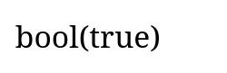
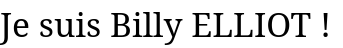

# Apprendre le PHP
**PHP (PHP : Hypertext Preprocessor) est un langage de programmation de scripting généraliste**. Sa principale vocation est l'envoi de réponse HTTP que se soit une page HTML générée en PHP ou des données JSON. 

Le PHP permet l'utilisation des principes de la **POO** (héritage, polymorphisme, interface) mais n'oblige pas son utilisation comme Java ou dans une moindre mesure le JavaScript. **Comme tout langage de scripting PHP néccessite un interpréteur pour être executé.**

# Documentations 
**Le manuel du langage PHP** est disponible sur le site officel du langage : https://www.php.net/manual/fr/index.php

**La réference des fonctions et objets** du langage sont disponible via la barre de recherche du site officel : https://www.php.net/docs.php

**La réference de la syntaxe du langage** est dispoible ici : https://www.php.net/manual/fr/langref.php

Comme d'habitude **W3schools** est également là : https://www.w3schools.com/php/php_syntax.asp

# Les possibilités du PHP
PHP est le premier langage de programmation du web et comme son nom l'indique PHP est un *Préprocesseur d'Hypertext*.  Concrètement, un hypertext est un fichier HTML et PHP permet de d'exectuer un algorithme avant l'envoi de l'hypertext au client pour envoyer du contenu dynamique.
>Aujourd'hui on n'envoi pas exclusivement de l'hypertext (html) mais également du JSON ou du XML.

Avec PHP vous pourrez entre autre : 
- **Créer un site web dynamique** sans l'utilisation de JavaScript.
- **Accéder à une base de données SQL**.
- Créer un **système d'autentification**.
- **Concevoir une API REST** accéssible depuis un front-end, par exemple en JavaScript via la méthode `fetch()` ou depuis n'importe quel client HTTP.
- Récupérer le contenu des champs d'un formulaire HTML.
- Gérer les **cookies**


# Installation de l'intérpreteur PHP 
L'intérpreteur php est le programme qui va executer nos scripts php.

## Linux
```linux
apt install php
le/dossier/de/mon/serveur$ php -S localhost:8080
```
## Mac
```
brew install php
le/dossier/de/mon/serveur$ php -S localhost:8080
```
# Lancez un serveur web compatible avec PHP
Une fois l'intérpréteur installé il faut lancer un serveur http local grâce à une simple commande disponible avec l'intérpréteur php. A la différence de serveurs HTTP lancés avec python, ce serveur local va executer les scripts php si un client demande un fichier `".php"`.

Rendez vous dans le dossier dans lequel vous souhaitez mettre vos futurs sites web PHP et ouvrez une console à cet endroit.

Puis écrivez ceci pour lancer le serveur en `localhost` sur le port `8080`.
```
php -S localhost:8080
```
> Si vous souhaitez que votre serveur soit accéssible à tout les PC du réseau local de chez vous : remplacez `localhost` par l'adresse ipv4 de votre pc.

## Apache2
Dans l'industrie on ne fournit pas un site PHP grâce à cette commande le plus souvent on utilise un serveur apache. Pour des raisons pratique on n'utilise peu apache2 en développement (sauf si vous developez votre application avec Docker)

# Hello World !
Tout code `php` doit être contenu dans un fichier .php et entre les balises php : `<?php ... ?>`

Dans le dossier ou vous avez lancé le serveur php créer un fichier **index.php**.

Dans le fichier **index.php** écrivez:
```php
<?php
echo "Hello World";
?>
```
`echo` est une fonction qui na pas besoin de parentèses et qui écrit un texte dans le HTML de la page à l'endroit où elle est placée.

Ouvrez ensuite votre site web à l'adresse `localhost:8080`.


Bravo vous venez d'interpréter votre premier script PHP.

## Exercices

1. Afficher une page internet qui contient le texte "Salut tout le monde je suis Billy !". *Vous n'avez pas le droit d'utiliser du HTML, uniquement du PHP.*
2. Faite une page web qui affiche "cerise","fleur" et "tomate" avec trois echo différent. Observez le comportement et dites moi en quoi la balise `<p>` du HTML vous aiderez à faire la mise en page.

# Afficher du HTML
Tout fichier `.php` peut contenir du HTML.

Je peux placer du php à n'importe quel endroit de mon code avec les balises ouvrantes et fermantes : `<?php .. ?>`
```php
<h1>Le magnifique site de <?php echo "Jeff"; ?> !</h1>
<p>
    <?php
        echo "Bienvenue tout le monde !";
    ?>
</p>
```

3. Afficher `"Bonjour les gens"` dans une balises `<p>` et `"ShopExpress2000"` dans un h1. Le tout en utilisant `echo`.

La plupart du temps on utilise la syntaxe alternative `<?= ?>` qui nous permet de ne pas écrire le `echo` a chaque fois.

```php
<h1>Le magnifique site de <?= "Jeff" ?> !</h1>
<p>
    <?= "Bienvenue tout le monde !" ?>
</p>
```
Ces deux codes sont les mêmes.

4. Afficher `"salut"` sans utiliser `echo` grâce à la nouvelle syntaxe.
5. Comme dans la question `3.` mais en utilisant la nouvelle syntaxe `<?= ?>`

## Allez plus loin avec une variable
```php

<?php
// J'écrit mon php ici pour initaliser toutes mes données.
$prenom = "Jeff";
?>

<h1>Le magnifique site de <?php echo $prenom; ?> !</h1>
<p> <?= "Bienvenue tout le monde !" ?> </p>
```
> **Précision sur `echo`** 
>Pour être plus précis `echo` écrit enfaite dans le body de la réponse HTTP à envoyer au client. Et oui PHP est un langage back-end qui a pour but final d'envoyer une réponse HTTP ! Tout texte écrit en dehors des balises php sera placé dans le body de la réponse HTTP. Et donc affiché sur la page.

1. A partir de la maquette suivante et du code php fournit plus bas faite cette page en PHP.

```php
<?php
// Utilisez les variables suivantes dans votre HTML
$prenom = "Massinissa";
$age = 24;
$metier = "Programmeur";
$photo_url = "https://avatars.githubusercontent.com/u/34664499?v=4";
?>

<!DOCTYPE html>
<html lang="fr">
<head>
    <meta charset="UTF-8">
    <title>Document</title>
    <style>
        // Ajoutez ici votre CSS comme d'habitude pour le style.
    </style>
</head>
<body>
    <div>
        // Codez ici en HTML et PHP pour afficher les infos
    </div>
</body>
</html>
```


# Syntaxe basique du PHP
En PHP toutes instructions se fini par un point virgule `;`.

## Type de données
En php il existe plusieurs types de données : 
- Integer, les nombres entiers
- Float, les nombres à virgules
- String, les textes
- Boolean, les valeurs binaires : `true` ou `false`
- Array, les tableaux (Map ou List)
- Object, les instances de classes.
- NULL, la valeur d'une variable non déclarée.

En PHP le typage est dynamique ce qui veut dire que je n'ai pas besoin de rajouter le type d'une variable avant de la déclarer.

```php
<?php
$isGameOver = true;
var_dump($isGameOver);
```



1. Déclarer des variables des types : Integer, Float, String, Boolean. Donnez leurs des valeurs et affichés les avec `var_dump()`

Pour déclarer un tableau il suffit de faire.
```php
<?php
$notes = [10,8,19,20];
var_dump($notes);
```
2. Afficher le contenu d'un tableau

### A propos de la concaténation 
En PHP la concaténation de deux string se fait via l'opérateur point : `.`  . 
```php
$age = 24;
echo "J'ai ".$age." ans !";     // => J'ai 24 ans !
```
> **Note**
> Dans une string il est possible de placer directement une variable sans concaténation. N'oublie pas le dollar ! `$`.
>```php
> $age = 24;
> echo "J'ai $age ans !";
>``` 
>

1. Concatenez deux variables `$nom` et `$prenom` pour afficher la page suivante :


2. Faite la même choses sans utiliser le `.` pour afficher la page suivante :

*Conseil : lisez la note juste en haut*


## Les opérateurs en PHP
Les opérateurs en `PHP` respecte la syntaxe classique de tout les langages qui hérite du C.
Parmis les opérateurs les plus commun on retrouve :
|Opérateur|Opération|Résultat|
|-|-|-|
|=|L'affectation|Une variable|
|**.**|La concaténation : `"J'ai ".$age." ans !"`|String|
|>  <  >=  <=  ==  !=|La comparaison|Boolean|
|%|modulo|Integer|
|+ * - /|Arithmétique|Float ou Integer|
|++|Incrémentation|Float ou Integer|
|--|Décrémentation|Float ou Integer|

## Variables
Une variable est défini par un nom et un type de données parmi les types de données du PHP décrit plus haut.
Ont utilise le symbole dollar **$** pour déclarer une variable et l'opérateur **=** pour l'affectation.

```php
$age = 24;                  // Nombre
$prenom = "Massinissa";     // String
$isMajeur = $age >= 18;     // Boolean
```
Pour utiliser une variable il faut toujours placer le *dollar* devant son nom.

 ```php
 
 echo $prenom;          // => Massinissa
 echo gettype($age);    // => Integer
 ```

## Les Tableaux
En php l'index d'un tableau s'appelle là `key` ou clé en français.
Il existe deux genres de tableaux : les listes et les `map`(ou dictionnaire) en français. La `key` d'une liste est un `Integer` alors que la `key` d'un dictonnaire est une `string`.

### Les Array - Liste
```php
$fruits = ["cerise","pomme","poire"];   
echo $fruits[0];        // => cerise , la key 0 est un Integer.
```
> A la différence du C les tableaux sont des listes avec un nombre dynamique d'élements. Pas besoin de déclarer la taille du tableau à la déclaration.

#### Connaître la taille du tableau
La fonction `count()` fournit le nombre d'élément d'un tableau, c'est très utile pour écrire une boucle `for` par exemple.
```php
count($fruits);         // 3
```

```php
<?php
$fruits = ["cerise","pomme","poire"];

for ($i=0; $i < count($fruits); $i++) { 
    echo " ".$fruits[$i];
}
?>
```


0. Afficher le tableau de fruits avec var_dump(), Expliquez ce que vous voyez.
1. Afficher tout les élements du tableau de fruits.
2. Afficher les notes impaires du tableau suivants :
```php
<?php
$notes = [20,10,15,12,9,3];
```
3. Afficher la moyenne des notes.
4. Afficher la somme des notes.

#### Ajouter un élement à la liste
```php
$fruits[] = "orange";   // Ajoute à la fin du tableau.
```

#### Modifier un élement de la liste
```php
echo $fruits[2];        // => poire
$fruits[2] = "banane";   // Ajoute à la fin du tableau.
echo $fruits[2];        // => banane
```

#### Supprimer un élément
`array_splice` permet de supprimer des éléments dans un intervale donnée.

**Définition :**
```php
array_splice(array $table,int startDeletingAt,int nbElementToDelete);
```
**Paramètres :**
- `array` le tableau à modifier
- `int` l'index à partir d'où commence la suppression des éléments
- `int` le nombre d'élément à supprimer

**Exemple :**
Supprimer l'élément à l'index 0 :
```php
$fruits = ["cerise","pomme","poire"];
array_splice($fruits,0,1);      // Starts at 1 Ends at 0
echo $fruits[0];        // => pomme
```
Supprimer 2 éléments à partir de l'index 1 :
```php
$fruits = ["cerise","pomme","poire"];
array_splice($fruits,1,2);
echo $fruits[0];        // => cerise
echo $fruits[1];        // => NULL
echo $fruits[2];        // => NULL
```

Supprimer tout les éléments à partir d'un index donné:
```php
<?php
$fruits = ["cerise","pomme","poire"];
array_splice($fruits,0);     // J'omets le nombre d'élément donc je supprime tout
echo count($fruits);        // 0
?>
```
> Si ont omet le troisième paramètre, ont vide le tableau à partir de l'index donné


## var_dump voir de quoi est fait une variable
En PHP il n'est pas rare qu'une variable soit fait de plusieurs valeurs comme pour les Array par exemple.

Je peux voir de quoi une variable est faite avec `var_dump()`.

```php
<?php
$fruits = ["cerise","pomme","poire"];
var_dump($fruits);
?>
```


**Pour apprendre faites des var_dump()** le plus souvent possible !

### Les Array - Map
Les Map possèdent des clés textuelles et sont très utilisés pour récupérer les lignes d'une table de donnée SQL par exemple.
```php
// Array à key numérique
$eleve = [
    "name" => "Thomas",
    "lastname" => "Canal",
    "age" => 27,
];
echo $eleve["name"];       // => Thomas , la key "name" est une string.
```

Imaginez les map comment des tableaux qui peuvent contenir plein de données différentes. L'accès au données est facile grâce à l'accès par clé.

### Ajouter
```php
$eleve = [
    "name" => "Thomas",
    "lastname" => "Canal",
    "age" => 27,
];
$eleve["job"] = "web dev";   // Ajoute à la clé job l'élément "web dev"
```
### Modifier la valeur d'une clé
Modifier et ajouter une clé répond à la même syntaxe.
```php
$eleve["name"] = "Mathieu";
```
### Supprimer une clé
La fonction `unset()` permet de supprimer une clé d'un `Map`, elle permet également de supprimer n'importe quelle variable.
```php
unset($fruits["lastname"]);
```
> la fonction `var_dump()` permet d'afficher le détail d'une variable comme les éléments d'un tableau par exemple.
>```php
>var_dump($fruits);     // Ecrit le contenu du tableau dans le HTML
>```

0. Afficher le tableau $eleve dans un `var_dump()`
1. A partir du tableau suivant reproduisez la maquette suivante.
```php
$eleve = [
    "name" => "Massinissa",
    "lastname" => "CHAOUCHI",
    "age" => 24,
    "metier" => "Programmeur"
];
```


## Les Conditions
Les conditions en PHP sont similaire au condition des autres langages de programmation.
### if...else
```php
if($age >= 18){
    echo "Majeur";
}
else{
    echo "Mineur";
}
```

## Les boucles
Les boucles while et for on la même syntaxe qu'en `C`. D'autres syntaxe plus simple existe en php boucle la boucle `for`.

### La boucle while
```php
while (test) {

}
```
```php
$i = 0;
$fruits = ["cerise","pomme","poire"];
while ($i < 3) {
    echo $fruits[$i];
    $i++;
}
```
### La boucle for
Le PHP supporte la syntaxe classique du `for` :
```php
$fruits = ["cerise","pomme","poire"];
for ($i=0; $i < count($fruits); $i++) { 
    echo $fruits[$i];
}
/**
 * cerisepommepoire
*/
```

Je peux placer du html dans ma boucle for pour un meilleure affichage.
```php
<?php
$fruits = ["cerise","pomme","poire"];
?>

<!DOCTYPE html>
<html lang="fr">
<head>
    <meta charset="UTF-8">
    <title>Document</title>
    <style>
        p{
            border : black 1px solid;
            padding : 10px;
            font-family : Arial;
        }
    </style>
</head>
<body>    
    <?php
    for ($i=0; $i < count($fruits); $i++) { 
        echo "<p>";
        echo $fruits[$i];
        echo "</p>";
    }
    ?>
</body>
</html>
```

#### Le foreach
La plupart du temps la syntaxe classique n'est pas utilisée car le `for` permet surtout de parcourir un tableau, pour ceci ont préfère utiliser `foreach`.

```php
$fruits = ["cerise","pomme","poire"];
foreach($fruits as $fruit){
    echo $fruit;        // J'affiche l'itérateur $fruit
}
/**
 * cerise
 * pomme
 * poire
*/
```
#### foreach - Utiliser la clé d'un tableau Map
Dans le cas où mon tableau est un `Map` je veux pouvoir récupérer la clé associée aux valeurs, j'utilise la syntaxe complète du `foreach`.
```php
$eleve = [
    "name" => "Thomas",
    "lastname" => "Canal",
    "age" => 27,
];
foreach($eleve as $key => $value){
    echo $key." : ".$value;
}
/**
 * name : Thomas
 * lastname : Canal
 * age : 27
 * */
```

#### Correctement faire une boucle dans du HTML.
Dans l'exemple précedent j'écrivait directement du HTML dans mon echo. C'est une mauvaise choses par ce que je rend difficle la lecture et l'écriture du code HTML.

*Code de mauvaise qualitée*
```php
<?php
$fruits = ["cerise","pomme","poire"];
?>

<!DOCTYPE html>
<html lang="fr">
<head>
    <meta charset="UTF-8">
    <title>Document</title>
    <style>
        p{
            border : black 1px solid;
            padding : 10px;
            font-family : Arial;
        }
    </style>
</head>
<body>    
    <?php
    for ($i=0; $i < count($fruits); $i++) { 
        echo "<p>"; // Horrible j'ai écrit du HTML dans un echo
        echo $fruits[$i];
        echo "</p>";
    }
    ?>
</body>
</html>
```

Le plus simple est d'utiliser la boucle foreach avec la syntaxe `:`  similaire au python.

Un code HTML comme celui-ci :


```html
<!DOCTYPE html>
<html lang="fr">
<head>
    <meta charset="UTF-8">
    <title>Document</title>
    <style>
        p{
            border : black 1px solid;
            padding : 10px;
            font-family : Arial;
        }
    </style>
</head>
<body>
    <div>
        <p> Fruit 1 </p>
        <p> Fruit 2 </p>
        <p> Fruit 3 </p>
    </div>
</body>
</html>
```
Doit être automatisé de cette façon :
```php
<?php
$fruits = ["cerise","pomme","poire"];
?>


<!DOCTYPE html>
<html lang="fr">
<head>
    <meta charset="UTF-8">
    <title>Document</title>
    <style>
        p{
            border : black 1px solid;
            padding : 10px;
            font-family : Arial;
        }
    </style>
</head>
<body>
    <div>
        <?php for ($i=0; $i < count($fruits); $i++): ?>

            <p> <?= $fruits[$i]; ?> </p>

        <?php endfor;?>
    </div>
</body>
</html>
```

> **Foreach de préférence**
> Note il est d'usage de carrement utiliser la syntaxe `foreach()` car le `$i` est inutile dans la plupart des cas.

<!--
# Session PHP
En PHP on peut sauvegarder des données pendant toute la session de l'utilisateur, de cette manière même si l'utilisateur charge de nouvelles pages et donc de nouveaux scripts php les données persistes. 

Une utilisation typique des sessions c'est l'autentification d'un utilisateur.
On démarre la session et on peuple les clées de la variable `$_SESSION` avec `session_start()` et ont supprime les variables de la session avec `session_destroy()`.
> Attention il ne faut appeller `session_start()` qu'une fois par fichier au tout début.
**Syntaxe :**
```php
session_start();                // Je lance la session
$_SESSION["userid"] = 1;        // Je créer une variable de session dans le tableau de session.
$_SESSION["role"] = "ADMIN";
```

## Exemple - Autentification
Le header "Location: url" permet de rediriger la page vers une autre page.
> ATTENTION IL FAUT COLLER `Location` et le `:` `"Location: autrepage.php"`sinon ça ne marche pas.

*index.php*
```php
<?php session_start(); ?>

<form action="index.php" method="post">
    <input type="email" name="email"> 
    <input type="password" name="password">
    <input type="submit" value="Se Connecter">
</form>

<?php
/*
 Récupérez l'utilisateur depuis là BDD...
 SELECT * FROM User WHERE email = $_POST["email"];
 
 Dans cet exemple je crée l'utilisateur à la main.
*/

$user = [
    "id"=>3,
    "email"=>$_POST["email"],
    "password"=>"0000"
];

if($user["password"] == $_POST["password"]){
    // Le mot de passe est bon !
    $_SESSION["user_id"] = $user["id"];
    header("Location: profil.php");  // Redirige vers la page du formulaire
}
?>
```

*profil.php*
```php
<?php
session_start();

if(!isset($_SESSION["user_id"])){
    header("Location: index.php");  // Redirige vers la page du formulaire
}
?>
<h1>Bienvenue !</h1>
<a href="logout.php">Se déconnecter</a>
```
> isset() est une fonction qui renvoi `vrai` si la variable existe.
*logout.php*
```php
<?php
session_start();
session_destroy();

header("Location: index.php");
?>
```
> Il faut charger la session actuel avec `session_start` avant de pouvoir la détruire.


<!-- 
# TODO
- Cookies ???
- Se connecter à une BDD SQL
    - Connector
    - Simple requete
    - Requêtes Preparées
    - Notion de transaction SQL
    - Gestion d'erreurs.
    - Injection XSS
- Système de fichier
- Envoyer un fichier à un serveur PHP
- Construire une page HTML en PHP
    - balise spécifique 
        - `<?= ?>`
        - `<?php foreach():?>`
        - `<?php if():?>`
 -->

<!-- # Idées TP
- TP Formulaire
    - Créer une page form.php contenant un Forumulaire HTML
    - Get prenom et age from $_POST et les afficher.
    - Enregister l'age et le prénom de l'utilisateur dans $_SESSION avec session_start()
    - Le formulaire renvoi sur une page info.php qui affiche les infos utilisateur stockées dans la session.
    - La page info.php affiche les infos uniquement si $_SESSION age et prenom sont isset() sinon location form.php
    - Dans la page info.php ajoute un lien qui supprimer les données utilisateur de la session grâce à la fonction unset() et un nouveau script php nommé logout.php.
- TP Simple Shop
    - Se connecter à une base de données SQL
    - Ajouter un produit à la base depuis un formulaire HTML dans un fichier add-product.php
    - Créer une page products.php qui affiche tout les produits
    - Créer une page product.php?id=1 qui affiche les données d'un produit via son id en récupérer en GET
    - Faire un lien entre les produits affichés dans la page products.php et la page product.php?id=1
    - Créer une page delete-product.php?id=1 qui supprime un produit via sont id en GET et y placer un lien vers la page products.
    - Créer un Formulaire de modification d'un produit
        - Afficher les données du produit dans un formulaire
        - Envoyer les données en POST au serveur
        - Le serveur modifie les données grace à un UPDATE TABLE
        - Affiche la page de l'utilisateur.
- TP Créer le site shoe-shop avec
    - une page d'accueil qui affiche les produits
    - Une page qui affiche les détail d'un produit unique
    - une page pour rajoute un produit à partir d'un formulaire
    - un lien de suppression de produit
    - BONUS : Créer une page de connection pour les administrateur et limité l'accés au pages : ajout,suppression et modifcation de produit au utilisateur connecté uniquement. Utiliser les sessions pour le faire.


// Idées de TP
- Blog Article
- Boutique en ligne
- User Login Logout
- API Paiement Stripe -->


# Le php dans le HTML

## Les données de l'URL $_GET

## Les données d'un formulaire $_POST

## Les sessions avec $_GET - Conserver des infos entre les pages

## Les bases de données avec SQL et PDO - Conserver des données sur le long terme