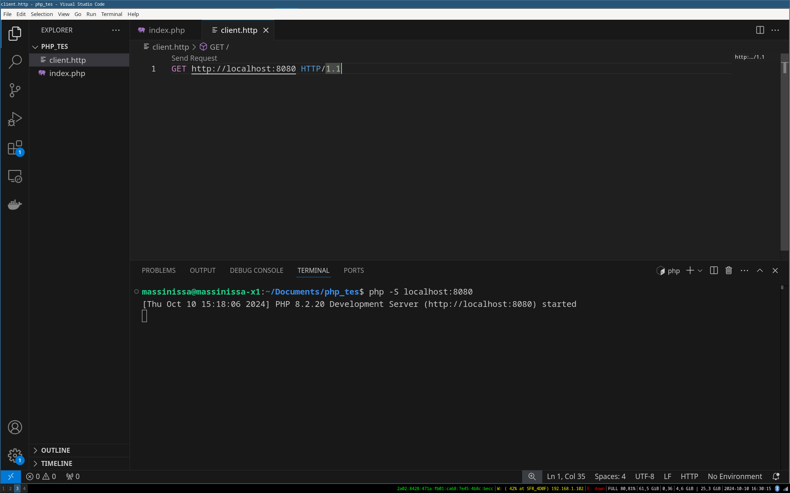

# Apprendre le PHP
**PHP (PHP : Hypertext Preprocessor) est un langage de programmation de scripting généraliste**. Sa principale vocation est l'envoi de réponse HTTP que se soit une page HTML générée en PHP ou des données JSON. 

Le PHP permet l'utilisation des principes de la **POO** (héritage, polymorphisme, interface) mais n'oblige pas son utilisation comme Java ou dans une moindre mesure le JavaScript. **Comme tout langage de scripting PHP néccessite un interpréteur pour être executé.**

# Documentations 
**Le manuel du langage PHP** est disponible sur le site officel du langage : https://www.php.net/manual/fr/index.php

**La réference des fonctions et objets** du langage sont disponible via la barre de recherche du site officel : https://www.php.net/docs.php

**La réference de la syntaxe du langage** est dispoible ici : https://www.php.net/manual/fr/langref.php

Comme d'habitude **W3schools** est également là : https://www.w3schools.com/php/php_syntax.asp

# Les possibilités du PHP
PHP est le premier langage de programmation du web et comme son nom l'indique PHP est un *Préprocesseur d'Hypertext*.  Concrètement, un hypertext est un fichier HTML et PHP permet de d'exectuer un algorithme avant l'envoi de l'hypertext au client pour envoyer du contenu dynamique.
>Aujourd'hui on n'envoi pas exclusivement de l'hypertext (html) mais également du JSON ou du XML.

Avec PHP vous pourrez entre autre : 
- **Créer un site web dynamique** sans l'utilisation de JavaScript.
- **Accéder à une base de données SQL**.
- Créer un **système d'autentification**.
- **Concevoir une API REST** accéssible depuis un front-end, par exemple en JavaScript via la méthode `fetch()` ou depuis n'importe quel client HTTP.
- Récupérer le contenu des champs d'un formulaire HTML.
- Gérer les **cookies**


# Installation de l'intérpreteur PHP 
L'intérpreteur php est le programme qui va executer nos scripts php.

## Linux
```linux
apt install php
le/dossier/de/mon/serveur$ php -S localhost:8080
```
## Mac
```
brew install php
le/dossier/de/mon/serveur$ php -S localhost:8080
```
# Lancez un serveur web compatible avec PHP
Une fois l'intérpréteur installé il faut lancer un serveur http local grâce à une simple commande disponible avec l'intérpréteur php. A la différence de serveurs HTTP lancés avec python, ce serveur local va executer les scripts php si un client demande un fichier `".php"`.

Rendez vous dans le dossier dans lequel vous souhaitez mettre vos futurs sites web PHP et ouvrez une console à cet endroit.

Puis écrivez ceci pour lancer le serveur en `localhost` sur le port `8080`.
```
php -S localhost:8080
```
> Si vous souhaitez que votre serveur soit accéssible à tout les PC du réseau local de chez vous : remplacez `localhost` par l'adresse ipv4 de votre pc.

## Apache2
Dans l'industrie on ne fournit pas un site PHP grâce à cette commande le plus souvent on utilise un serveur apache. Pour des raisons pratique on n'utilise peu apache2 en développement (sauf si vous developez votre application avec Docker)

# Hello World !
Tout code `php` doit être contenu dans un fichier .php et entre les balises php : `<?php ... ?>`

Dans le dossier ou vous avez lancé le serveur php créer un fichier **index.php**.

Dans le fichier **index.php** écrivez:
```php
<?php
echo "Hello World";
?>
```
`echo` est une fonction qui na pas besoin de parentèses et qui écrit un texte dans le HTML de la page à l'endroit où elle est placée.

Ouvrez ensuite votre site web à l'adresse `localhost:8080`.


Bravo vous venez d'interpréter votre premier script PHP.

## Exercices

1. Afficher une page internet qui contient le texte "Salut tout le monde je suis Billy !". *Vous n'avez pas le droit d'utiliser du HTML, uniquement du PHP.*
2. Faite une page web qui affiche "cerise","fleur" et "tomate" avec trois echo différent. Observez le comportement et dites moi en quoi la balise `<p>` du HTML vous aiderez à faire la mise en page.

# Afficher du HTML
Tout fichier `.php` peut contenir du HTML.

Je peux placer du php à n'importe quel endroit de mon code avec les balises ouvrantes et fermantes : `<?php .. ?>`
```php
<h1>Le magnifique site de <?php echo "Jeff"; ?> !</h1>
<p>
    <?php
        echo "Bienvenue tout le monde !";
    ?>
</p>
```

3. Afficher `"Bonjour les gens"` dans une balises `<p>` et `"ShopExpress2000"` dans un h1. Le tout en utilisant `echo`.

La plupart du temps on utilise la syntaxe alternative `<?= ?>` qui nous permet de ne pas écrire le `echo` a chaque fois.

```php
<h1>Le magnifique site de <?= "Jeff" ?> !</h1>
<p>
    <?= "Bienvenue tout le monde !" ?>
</p>
```
Ces deux codes sont les mêmes.

4. Afficher `"salut"` sans utiliser `echo` grâce à la nouvelle syntaxe.
5. Comme dans la question `3.` mais en utilisant la nouvelle syntaxe `<?= ?>`

## Allez plus loin avec une variable
```php

<?php
// J'écrit mon php ici pour initaliser toutes mes données.
$prenom = "Jeff";
?>

<h1>Le magnifique site de <?php echo $prenom; ?> !</h1>
<p> <?= "Bienvenue tout le monde !" ?> </p>
```
> **Précision sur `echo`** 
>Pour être plus précis `echo` écrit enfaite dans le body de la réponse HTTP à envoyer au client. Et oui PHP est un langage back-end qui a pour but final d'envoyer une réponse HTTP ! Tout texte écrit en dehors des balises php sera placé dans le body de la réponse HTTP. Et donc affiché sur la page.

### Exercice Maquette afficher des variables

1. A partir de la maquette suivante et du code php fournit plus bas faite cette page en PHP.

```php
<?php
// Utilisez les variables suivantes dans votre HTML
$prenom = "Massinissa";
$age = 24;
$metier = "Programmeur";
$photo_url = "https://avatars.githubusercontent.com/u/34664499?v=4";
?>

<!DOCTYPE html>
<html lang="fr">
<head>
    <meta charset="UTF-8">
    <title>Document</title>
    <style>
        // Ajoutez ici votre CSS comme d'habitude pour le style.
    </style>
</head>
<body>
    <div>
        // Codez ici en HTML et PHP pour afficher les infos
    </div>
</body>
</html>
```


# Syntaxe basique du PHP
En PHP toutes instructions se fini par un point virgule `;`.

## Type de données
En php il existe plusieurs types de données : 
- Integer, les nombres entiers
- Float, les nombres à virgules
- String, les textes
- Boolean, les valeurs binaires : `true` ou `false`
- Array, les tableaux (Map ou List)
- Object, les instances de classes.
- NULL, la valeur d'une variable non déclarée.

En PHP le typage est dynamique ce qui veut dire que je n'ai pas besoin de rajouter le type d'une variable avant de la déclarer.

```php
<?php
$isGameOver = true;
var_dump($isGameOver);
```


1. Déclarer des variables des types : Integer, Float, String, Boolean. Donnez leurs des valeurs et affichés les avec `var_dump()`

Pour déclarer un tableau il suffit de faire.
```php
<?php
$notes = [10,8,19,20];
var_dump($notes);
```
2. Afficher le contenu d'un tableau

### A propos de la concaténation 
En PHP la concaténation de deux string se fait via l'opérateur point : `.`  . 
```php
$age = 24;
echo "J'ai ".$age." ans !";     // => J'ai 24 ans !
```
> **Note**
> Dans une string il est possible de placer directement une variable sans concaténation. N'oublie pas le dollar ! `$`.
>```php
> $age = 24;
> echo "J'ai $age ans !";
>``` 
>

1. Concatenez deux variables `$nom` et `$prenom` pour afficher la page suivante :


2. Faite la même choses sans utiliser le `.` pour afficher la page suivante :

*Conseil : lisez la note juste en haut*


## Les opérateurs en PHP
Les opérateurs en `PHP` respecte la syntaxe classique de tout les langages qui hérite du C.
Parmis les opérateurs les plus commun on retrouve :
|Opérateur|Opération|Résultat|
|-|-|-|
|=|L'affectation|Une variable|
|**.**|La concaténation : `"J'ai ".$age." ans !"`|String|
|>  <  >=  <=  ==  !=|La comparaison|Boolean|
|%|modulo|Integer|
|+ * - /|Arithmétique|Float ou Integer|
|++|Incrémentation|Float ou Integer|
|--|Décrémentation|Float ou Integer|

## Variables
Une variable est défini par un nom et un type de données parmi les types de données du PHP décrit plus haut.
Ont utilise le symbole dollar **$** pour déclarer une variable et l'opérateur **=** pour l'affectation.

```php
$age = 24;                  // Nombre
$prenom = "Massinissa";     // String
$isMajeur = $age >= 18;     // Boolean
```
Pour utiliser une variable il faut toujours placer le *dollar* devant son nom.

 ```php
 
 echo $prenom;          // => Massinissa
 echo gettype($age);    // => Integer
 ```


## Les Conditions
Les conditions en PHP sont similaire au condition des autres langages de programmation.
### if...else
```php
if($age >= 18){
    echo "Majeur";
}
else{
    echo "Mineur";
}
```


## Les boucles
Les boucles while et for on la même syntaxe qu'en `C`. D'autres syntaxe plus simple existe en php boucle la boucle `for`.

### La boucle while
```php
while (test) {

}
```
```php
$i = 0;
$fruits = ["cerise","pomme","poire"];
while ($i < 3) {
    echo $fruits[$i];
    $i++;
}
```
1. Afficher tout les élements du tableau de fruits.
2. Afficher tout les élements qui sont égaux à `"cerise"` grâce à l'opérateur `==`.
> **Note** en PHP `==` fait également la comparaison des string, pas besoin de prendre en compte la caractère `'\0'` comme en C.
3. Afficher tout les éléments qui commence par un `'p'`.

### La boucle for
Le PHP supporte la syntaxe classique du `for` :
```php
$fruits = ["cerise","pomme","poire"];
for ($i=0; $i < count($fruits); $i++) { 
    echo $fruits[$i];
}
/**
 * cerisepommepoire
*/
```

1. Afficher  tout les élements du tableau grâce à la fonction `count()`
2. Ajouter des élements au tableau et vérifier si le code affiche toujours tout les élements.

### La boucle for pour afficher du HTML
#### La mauvaise méthode
Je peux placer du html dans ma boucle for pour un meilleure affichage.
```php
<?php
$fruits = ["cerise","pomme","poire"];
?>

<!DOCTYPE html>
<html lang="fr">
<head>
    <meta charset="UTF-8">
    <title>Document</title>
    <style>
        p{
            border : black 1px solid;
            padding : 10px;
            font-family : Arial;
        }
    </style>
</head>
<body>    
    <?php
    for ($i=0; $i < count($fruits); $i++) { 
        echo "<p>";
        echo $fruits[$i];
        echo "</p>";
    }
    ?>
</body>
</html>
```
#### La bonne méthode

Dans l'exemple précedent j'écrivait directement du HTML dans mon echo. C'est une mauvaise choses par ce que je rend difficle la lecture et l'écriture du code HTML.
```php
<?php
for ($i=0; $i < count($fruits); $i++) { 
    echo "<p>"; // HORRIBLE ! J'ai écrit du HTML dans un echo...
    echo $fruits[$i];
    echo "</p>";
}
?>
```

Le plus simple est d'utiliser la boucle for avec la syntaxe `:`  similaire au python.

```php
<body>
    <div>
        <?php for ($i=0; $i < count($fruits); $i++): ?>

            <p> <?= $fruits[$i]; ?> </p>

        <?php endfor;?>
    </div>
</body>
```

##### Code complet :

**Un code HTML comme celui-ci :**

```html
<!DOCTYPE html>
<html lang="fr">
<head>
    <meta charset="UTF-8">
    <title>Document</title>
    <style>
        p{
            border : black 1px solid;
            padding : 10px;
            font-family : Arial;
        }
    </style>
</head>
<body>
    <div>
        <p> Fruit 1 </p>
        <p> Fruit 2 </p>
        <p> Fruit 3 </p>
    </div>
</body>
</html>
```
**Doit être automatisé de cette façon :**
```php
<?php
// Je déclare un tableau
$fruits = ["cerise","pomme","poire"];
?>


<!DOCTYPE html>
<html lang="fr">
<head>
    <meta charset="UTF-8">
    <title>Document</title>
    <style>
        p{
            border : black 1px solid;
            padding : 10px;
            font-family : Arial;
        }
    </style>
</head>
<body>
    <div>
        <?php for ($i=0; $i < count($fruits); $i++): ?>

            <p> <?= $fruits[$i]; ?> </p>

        <?php endfor;?>
    </div>
</body>
</html>
```

## Les Tableaux
En php l'index d'un tableau s'appelle là `key` ou clé en français.
Il existe deux genres de tableaux : les listes et les `map`(ou dictionnaire) en français. La `key` d'une liste est un `Integer` alors que la `key` d'un dictonnaire est une `string`.

### Les Array - Liste
```php
$fruits = ["cerise","pomme","poire"];   
echo $fruits[0];        // => cerise , la key 0 est un Integer.
```
> A la différence du C les tableaux sont des listes avec un nombre dynamique d'élements. Pas besoin de déclarer la taille du tableau à la déclaration.

#### Connaître la taille du tableau
La fonction `count()` fournit le nombre d'élément d'un tableau, c'est très utile pour écrire une boucle `for` par exemple.
```php
count($fruits);         // 3
```

```php
<?php
$fruits = ["cerise","pomme","poire"];

for ($i=0; $i < count($fruits); $i++) { 
    echo " ".$fruits[$i];
}
?>
```


0. Afficher le tableau de fruits avec var_dump(), Expliquez ce que vous voyez.
1. Afficher tout les élements du tableau de fruits.
2. Afficher les notes impaires du tableau suivants :
```php
<?php
$notes = [20,10,15,12,9,3];
```
3. Afficher la moyenne des notes.
4. Afficher la somme des notes.

#### Ajouter un élement à la liste
```php
$fruits[] = "orange";   // Ajoute à la fin du tableau.
```

#### Modifier un élement de la liste
```php
echo $fruits[2];        // => poire
$fruits[2] = "banane";   // Ajoute à la fin du tableau.
echo $fruits[2];        // => banane
```

#### Supprimer un élément
`array_splice` permet de supprimer des éléments dans un intervale donnée.

**Définition :**
```php
array_splice(array $table,int startDeletingAt,int nbElementToDelete);
```
**Paramètres :**
- `array` le tableau à modifier
- `int` l'index à partir d'où commence la suppression des éléments
- `int` le nombre d'élément à supprimer

**Exemple :**
Supprimer l'élément à l'index 0 :
```php
$fruits = ["cerise","pomme","poire"];
array_splice($fruits,0,1);      // Starts at 1 Ends at 0
echo $fruits[0];        // => pomme
```
Supprimer 2 éléments à partir de l'index 1 :
```php
$fruits = ["cerise","pomme","poire"];
array_splice($fruits,1,2);
echo $fruits[0];        // => cerise
echo $fruits[1];        // => NULL
echo $fruits[2];        // => NULL
```

Supprimer tout les éléments à partir d'un index donné:
```php
<?php
$fruits = ["cerise","pomme","poire"];
array_splice($fruits,0);     // J'omets le nombre d'élément donc je supprime tout
echo count($fruits);        // 0
?>
```
> Si ont omet le troisième paramètre, ont vide le tableau à partir de l'index donné


### var_dump voir de quoi est fait une variable
En PHP il n'est pas rare qu'une variable soit fait de plusieurs valeurs comme pour les Array par exemple.

Je peux voir de quoi une variable est faite avec `var_dump()`.

```php
<?php
$fruits = ["cerise","pomme","poire"];
var_dump($fruits);
?>
```


**Pour apprendre faites des var_dump()** le plus souvent possible !

### Les Array - Map
Les Map possèdent des clés textuelles et sont très utilisés pour récupérer les lignes d'une table de donnée SQL par exemple.
```php
// Array à key numérique
$eleve = [
    "name" => "Thomas",
    "lastname" => "Canal",
    "age" => 27,
];
echo $eleve["name"];       // => Thomas , la key "name" est une string.
```

Imaginez les map comment des tableaux qui peuvent contenir plein de données différentes. L'accès au données est facile grâce à l'accès par clé.

#### Ajouter une clé 
```php
$eleve = [
    "name" => "Thomas",
    "lastname" => "Canal",
    "age" => 27,
];
$eleve["job"] = "web dev";   // Ajoute à la clé job l'élément "web dev"
```
#### Modifier la valeur d'une clé
Modifier et ajouter une clé répond à la même syntaxe.
```php
$eleve["name"] = "Mathieu";
```
#### Supprimer une clé
La fonction `unset()` permet de supprimer une clé d'un `Map`, elle permet également de supprimer n'importe quelle variable.
```php
unset($fruits["lastname"]);
```
> la fonction `var_dump()` permet d'afficher le détail d'une variable comme les éléments d'un tableau par exemple.
>```php
>var_dump($fruits);     // Ecrit le contenu du tableau dans le HTML
>```

#### Exercice Map - maquette à partir d'un Map
```php
$eleve = [
    "name" => "Massinissa",
    "lastname" => "CHAOUCHI",
    "age" => 24,
    "metier" => "Programmeur"
];
```

0. Afficher le tableau `$eleve` dans un `var_dump()`
1. A partir du tableau `$eleve` reproduisez la maquette suivante. C'est le même exercice que précedemment seuelement maintenant nous utilisons un objet `Map`.


## Le foreach
### Afficher une Liste
La plupart du temps la syntaxe classique n'est pas utilisée car le `for` permet surtout de parcourir un tableau, pour ceci ont préfère utiliser `foreach`.

```php
$fruits = ["cerise","pomme","poire"];
foreach($fruits as $fruit){
    echo $fruit;        // J'affiche l'itérateur $fruit
}
/**
 * cerise
 * pomme
 * poire
*/
```
### foreach - Utiliser la clé d'un tableau Map
Dans le cas où mon tableau est un `Map` je veux pouvoir récupérer la clé associée aux valeurs, j'utilise la syntaxe complète du `foreach`.
```php
$eleve = [
    "name" => "Thomas",
    "lastname" => "Canal",
    "age" => 27,
];
foreach($eleve as $key => $value){
    echo $key." : ".$value;
}
/**
 * name : Thomas
 * lastname : Canal
 * age : 27
 * */
```

1. Afficher la clé de tout les élements du Map.
2. Afficher le type de tout les élements du Map avec la fonction `gettype()`

Je peut vérifier si une variable est d'un certain type avec la fonction `gettype()`.

```php
$i = 24;
if(gettype($i) == gettype(1)){
    echo "Je suis un Int";
}
```
3. Afficher la clé et la valeur des élements de type `String`.

> **Foreach de préférence**
> Note il est d'usage d'utiliser la syntaxe `foreach()` plutot que for classique, car le `$i` est inutile dans la plupart des cas.

### Exercice
Reproduisez la maquette suivante en PHP.
Le tableau de fruits est déjà déclarer dans le fichier index.php
#### 1. Cloner le projet et lancer le serveur
*Lien du projet : https://github.com/CHAOUCHI/grid-php*
```bash
git clone https://github.com/CHAOUCHI/grid-php
cd grid-php
php -S localhost:7070
```
#### 2. Consulter la maquette

https://www.figma.com/design/tS9BqogLtVrJV5PCLOjdqk/Untitled?node-id=0-1&t=Zmfg9cyA549SaEWi-1


#### 3. Consigne
- A l'aide d'une boucle for et d'un display grid reproduisez la maquette vue plus en haut
- Tout les assets png sont deja dans le répo github
- les RGB sont sur la maquette figma
- Regarder bien tout les fichiers du répo, normalement vous avez tout ce qu'il faut : 
    - le tableau de fruits
    - le fichier index.php
    - le fichier style.css pour le style
    - Les fichiers PNG pour les images
- BONUS : Responsive avec les media query pour le nombre de colonnes.


<!--
# Session PHP
En PHP on peut sauvegarder des données pendant toute la session de l'utilisateur, de cette manière même si l'utilisateur charge de nouvelles pages et donc de nouveaux scripts php les données persistes. 

Une utilisation typique des sessions c'est l'autentification d'un utilisateur.
On démarre la session et on peuple les clées de la variable `$_SESSION` avec `session_start()` et ont supprime les variables de la session avec `session_destroy()`.
> Attention il ne faut appeller `session_start()` qu'une fois par fichier au tout début.
**Syntaxe :**
```php
session_start();                // Je lance la session
$_SESSION["userid"] = 1;        // Je créer une variable de session dans le tableau de session.
$_SESSION["role"] = "ADMIN";
```

## Exemple - Autentification
Le header "Location: url" permet de rediriger la page vers une autre page.
> ATTENTION IL FAUT COLLER `Location` et le `:` `"Location: autrepage.php"`sinon ça ne marche pas.

*index.php*
```php
<?php session_start(); ?>

<form action="index.php" method="post">
    <input type="email" name="email"> 
    <input type="password" name="password">
    <input type="submit" value="Se Connecter">
</form>

<?php
/*
 Récupérez l'utilisateur depuis là BDD...
 SELECT * FROM User WHERE email = $_POST["email"];
 
 Dans cet exemple je crée l'utilisateur à la main.
*/

$user = [
    "id"=>3,
    "email"=>$_POST["email"],
    "password"=>"0000"
];

if($user["password"] == $_POST["password"]){
    // Le mot de passe est bon !
    $_SESSION["user_id"] = $user["id"];
    header("Location: profil.php");  // Redirige vers la page du formulaire
}
?>
```

*profil.php*
```php
<?php
session_start();

if(!isset($_SESSION["user_id"])){
    header("Location: index.php");  // Redirige vers la page du formulaire
}
?>
<h1>Bienvenue !</h1>
<a href="logout.php">Se déconnecter</a>
```
> isset() est une fonction qui renvoi `vrai` si la variable existe.
*logout.php*
```php
<?php
session_start();
session_destroy();

header("Location: index.php");
?>
```
> Il faut charger la session actuel avec `session_start` avant de pouvoir la détruire.


<!-- 
# TODO
- Cookies ???
- Se connecter à une BDD SQL
    - Connector
    - Simple requete
    - Requêtes Preparées
    - Notion de transaction SQL
    - Gestion d'erreurs.
    - Injection XSS
- Système de fichier
- Envoyer un fichier à un serveur PHP
- Construire une page HTML en PHP
    - balise spécifique 
        - `<?= ?>`
        - `<?php foreach():?>`
        - `<?php if():?>`
 -->

<!-- # Idées TP
- TP Formulaire
    - Créer une page form.php contenant un Forumulaire HTML
    - Get prenom et age from $_POST et les afficher.
    - Enregister l'age et le prénom de l'utilisateur dans $_SESSION avec session_start()
    - Le formulaire renvoi sur une page info.php qui affiche les infos utilisateur stockées dans la session.
    - La page info.php affiche les infos uniquement si $_SESSION age et prenom sont isset() sinon location form.php
    - Dans la page info.php ajoute un lien qui supprimer les données utilisateur de la session grâce à la fonction unset() et un nouveau script php nommé logout.php.
- TP Simple Shop
    - Se connecter à une base de données SQL
    - Ajouter un produit à la base depuis un formulaire HTML dans un fichier add-product.php
    - Créer une page products.php qui affiche tout les produits
    - Créer une page product.php?id=1 qui affiche les données d'un produit via son id en récupérer en GET
    - Faire un lien entre les produits affichés dans la page products.php et la page product.php?id=1
    - Créer une page delete-product.php?id=1 qui supprime un produit via sont id en GET et y placer un lien vers la page products.
    - Créer un Formulaire de modification d'un produit
        - Afficher les données du produit dans un formulaire
        - Envoyer les données en POST au serveur
        - Le serveur modifie les données grace à un UPDATE TABLE
        - Affiche la page de l'utilisateur.
- TP Créer le site shoe-shop avec
    - une page d'accueil qui affiche les produits
    - Une page qui affiche les détail d'un produit unique
    - une page pour rajoute un produit à partir d'un formulaire
    - un lien de suppression de produit
    - BONUS : Créer une page de connection pour les administrateur et limité l'accés au pages : ajout,suppression et modifcation de produit au utilisateur connecté uniquement. Utiliser les sessions pour le faire.


// Idées de TP
- Blog Article
- Boutique en ligne
- User Login Logout
- API Paiement Stripe -->


# Le php dans le HTML
Le php est un langage back-end, c'est à dire un langage qui tourne sur un serveur.

Sont role est de fabriquer une page HTML et pour ça il a accès à toute les données de la requête HTTP du client (navigateur).

## Comprendre les requête et réponse HTTP

### Le navigateur effectue une requête HTTP
Prenons le site suivant écrit dans un fichier `index.php`:
```php
<h1>Salut à tous</h1>
```

Je lance mon serveur sur le port 8080.

```bash
php -S localhost:8080
```

Lorsque je tape `localhost:8080` dans la barre de recherche de firefox j'effectue un **requête HTTP** vers le serveur que je viens de lancer.

On le vois dans le terminal du serveur :

```
massinissa@massinissa-x1:~/Documents/php_tes$ php -S localhost:8080
[Thu Oct 10 15:12:12 2024] PHP 8.2.20 Development Server (http://localhost:8080) started
[Thu Oct 10 15:12:14 2024] [::1]:51366 Accepted
[Thu Oct 10 15:12:14 2024] [::1]:51366 [200]: GET /
[Thu Oct 10 15:12:14 2024] [::1]:51366 Closing
```

Je vois qu'une requête HTTP à été faite à 15:12 sur l'adresse `/` qui est par défaut le fichier `index.php`.

La méthode HTTP GET est la méthode utilisée par firefox lorsque l'on tape dans la barre de recherche.

### Effectuer une requête à la main avec REST Client sur VSCode
Grâce à l'extension REST Client je peux essayer d'envoyer la même requête à la main pour comprendre comment marche la barre de recherche du navigateur.

1. *Télécharger REST Client sur VSCode*


2. Créer un fichier `client.http` dans VSCode et écrivez la requête suivante :
```http
GET http://localhost:8080 HTTP/1.1
```

Normalement vous devez avoir la même chose que moi :
- un fichier client.http qui contient la requete HTTP
- Votre terminal sserveur en dessous qui affiche les requetes du serveur
- Un lien cliquable *Send Request* apparu au dessus de la requête.



3. Cliquez sur *Send Request* pour envoyer la requête et observez comment le serveur reçoit la requête et renvoi la réponse qui est affichée dans VSCode par REST Client.


Une requete GET à été reçu et une réponse 200 à été répondu.

> 200 signifie tout va bien.
> 404 est le code le plus connu il signifie *"Ressource inconnu"*

```
massinissa@massinissa-x1:~/Documents/php_tes$ php -S localhost:8080
[Thu Oct 10 15:18:06 2024] PHP 8.2.20 Development Server (http://localhost:8080) started
[Thu Oct 10 16:32:30 2024] [::1]:55768 Accepted
[Thu Oct 10 16:32:30 2024] [::1]:55768 [200]: GET /
[Thu Oct 10 16:32:30 2024] [::1]:55768 Closing
```

Et REST Client à affiché la réponse HTTP 200 sur la droite de VSCode.

```http
HTTP/1.1 200 OK
Host: localhost:8080
Date: Thu, 10 Oct 2024 14:32:30 GMT
Connection: close
X-Powered-By: PHP/8.2.20
Content-type: text/html; charset=UTF-8

<h1>Salut à tous</h1>
```

Vous pouvez voir que la réponse HTTP du serveur PHP est fait en 3 parties :

- Le code de status : 200 par défaut
- Les headers : des infos utile au client, pas important pour vous pour l'instant
- BODY HTML : Le html envoyé, `echo` permet d'écrire dedans.


```http
HTTP/1.1 code_status message
Header : value
Header : value
Header : value
Header : value
...

BODY HTML

```

### Résumé Requete et Réponse HTTP
En résumé la requete HTTP envoyé par le navigateur web ressemble à ça :

```http
GET http://localhost:8080 HTTP/1.1
```

Et la réponse HTTP du serveur PHP ressemble à ceci :

```http
HTTP/1.1 200 OK
Host: localhost:8080
Date: Thu, 10 Oct 2024 14:32:30 GMT
Connection: close
X-Powered-By: PHP/8.2.20
Content-type: text/html; charset=UTF-8

<h1>Salut à tous</h1>
```

L'objectif du PHP ça va être de lire les informations de la requetes et modifier le body HTML en fonction de ces infos.

Les informations de la requetes peuvent être :
- Des données présente dans l'url d'un lien cliquable `<a href>`
- Les données présente dans un formulaire HTML `<form>`

C'est partie nous allons donc apprendre à envoyer et lire ces données.

## Les données de l'URL $_GET

### $_GET et les variables d'url
Les données de l'url sont récupérable via le tableau `$_GET`.

Si je fournis une variable dans l'url comme ceci :
```php
GET http://localhost:8080?age=24 HTTP/1.1
```

Elle sera placée par PHP dans le tableau map `$_GET`.

Je peux afficher $_GET dans le body HTMl de la réponse avec `var_dump()`.

```php
<?php
var_dump($_GET);
```

La réponse contient donc ma variable age en tant que clé du map $_GET.

Je le vois dans la réponse HTTP de REST Client
```http
HTTP/1.1 200 OK
Host: localhost:8080
Date: Thu, 10 Oct 2024 14:41:53 GMT
Connection: close
X-Powered-By: PHP/8.2.20
Content-type: text/html; charset=UTF-8

array(1) {
  ["age"]=>
  string(2) "24"
}
```

Et je le vois évidement dans le navigateur.

1. Je tape `http://localhost:8080/?age=24` dans la barre de recherche du navigateur.

2. Il affiche ma variable car var_dump ecrit dans le body HTML de la réponse HTTP.


### Exercice :

1. Tapez `http://localhost:8080/?prenom=massi` dans la barre de recherche et affichez :
    - Le tableau `$_GET` avec un `var_dump()`
    - Le prénom `massi` dans un `<h1>`

### Utiliser la balise `<a href>` pour remplir `$_GET`

La balise a href permet d'envoyer une requête http pour changer de page.

Si je place une variable dans l'url de l'attribut `href` je peut **envoyer une variable d'une page à une autre**.

*index.php*
```html
<h1>Page d'accueil</h1>

<a href="/produit.php?id=1">Voir le produit numéro 1</a>
```

*product.php*
```php
<?php
var_dump($_GET["id"]); // string(1) "1" 
?>

<h1>Page du produit</h1>
```

Prenons un tableau de produit.

|name|price|
|-|-|
|Adidas taille 42|100|
|Airmax taille 45|98|
|Doliprane|2.78|

En PHP ont l'écrit comme ça.

*product.php*
```php
<?php
$products = [
    [
        "name"=>"Adidas taille 42",
        "price"=> 100
    ],
    [
        "name"=>"Airmax taille 45",
        "price"=> 98
    ],
    [
        "name"=>"Doliprane",
        "price"=> 2.78
    ]
]
?>

<h1>Page du produit</h1>
```

> Habituellement ce tableau de produits serait fournit par une fonction qui requeterait la base de données. Mais pour des raison pédagogique nous écrivons ce tableau à la main.

Ce tableau est un tableau de tableau je peux accéder au différent produit avec son index et sa clé.

```php
echo $products[0]["name"]; // J'affiche Adidias taille 42
echo $products[2]["name"]; // J'affiche Doliprane
echo $products[1]["price"]; // J'affiche 98
```

Je peux utiliser l'id passé en url pour afficher le produit en fonction de l'id passé en url.

*product.php*
```php
<?php
var_dump($_GET["id"]);
$product_id = $_GET["id"];


$products = [
    [
        "name"=>"Adidas taille 42",
        "price"=> 100
    ],
    [
        "name"=>"Airmax taille 45",
        "price"=> 98
    ],
    [
        "name"=>"Doliprane",
        "price"=> 2.78
    ]
]

?>

<h1>Page du produit</h1>

<p><?= $products[$product_id]["name"] ?></p>
<p><?= $products[$product_id]["price"] ?></p>
```

Pour l'url suivante :
```
http://localhost:8080/produit.php?id=1
```

Je vois cette vue :


#### Exercices :
1. Tapez dans la barre de recherche l'url neccessaire pour afficher le produit "Doliprane". Il doit s'afficher à l'écran.
2. Dans le fichier `index.php` ajouter d'autre balise `<a>` pour pouvoir naviguer vers tout les produits possibles.
3. Tester et afficher tout les produits possible avec les balises `<a>` nouvellement ajoutées.

## require_once() importer un script PHP dans un autre
Pour des raisons pratique je vais vous montrer comme importer un fichier php dans un autre.

Dans un fichier `bdd.php` écrivez le tableua suivant :

*bdd.php*
```php
<?php
$products = [
    [
        "name"=>"Adidas taille 42",
        "price"=> 100
    ],
    [
        "name"=>"Airmax taille 45",
        "price"=> 98
    ],
    [
        "name"=>"Doliprane",
        "price"=> 2.78
    ]
];
?>
```

Nous allons rendre disponible ce tableau dans les deux pages précedentes, il nous servira de base de donnée.

*product.php*
```php
<?php
require_once("bdd.php");
$product_id = $_GET["id"];

?>

<h1>Page du produit</h1>

<p><?= $products[$product_id]["name"] ?></p>
<p><?= $products[$product_id]["price"] ?></p>
```

Ajoutons le également dans le fichier `index.php` pour pouvoir faire les balises `<a>`.

*index.php*
```php
<?php
require_once("bdd.php");
?>

<h1>Page d'accueil</h1>

```

1. A l'aide du tableau et d'une boucle for afficher autant de balises `<a>` que de produit du tableau.
2. Placer l'id des produits dans l'url pour créer un catalogue dynamique de produit.

### Mini-projet - Boutique de fruit

#### Récupérer le projet
Clonez le projet et passez sur la branche `get` pour avoir la version du projet correspondant à ce tp.
```bash
git clone https://github.com/CHAOUCHI/grid-php.git
cd grid-php
git checkout get
```

Dans le fichier `bdd.php` vous trouverez un tableau de fruits.

#### Objectif
Créer une boutique en ligne de vente de fruit.

#### Cahier des charges

|Tache|Description|Contraintes|
|-|-|-|
|Page d'accueil|Afficher la photo de tout les produits dans la page index dans un display grid.<br> Les images doivent être des lien cliquable qui amène à la page produit correspondante|Attention le résultat doit être dynamique il faut donc utiliser `$_GET`.<br> **Respectez la maquette figma**|
|Page de produit|Afficher les infos du produit. | **Respectez la maquette figma**|

## Maquette figma
Egalement dispo dans le readme du github.

***La maquette est intérative.***

https://www.figma.com/design/NY2o3BtVLyjrA3AbLnpnCa/Untitled?node-id=0-1&t=1Rn6WsZhs4ERfDJg-1


## Les données d'un formulaire $_POST

L'autre moyen d'effecuter une requête HTTP est le formulaire html.

Un formulaire HTML permet d'envoyer une requête HTTP à une autre page du site.

Cette requête HTTP contiendra tout les champs du formulaire, chaque champs est une variable qui sera stockée dans la requête.

### Formulaire HTML VS Requête HTTP

Pour l'exemple je veux créer un formulaire de connexion qui envoi *pseudo* et *mot de passe* à un script php nommé `check_login.php`.

1. Créez deux fichiers :
    - `login.php` : il contient notre formulaire HTML
    - `check_login.php` : il reçoit les données du formulaire

Ainsi un formulaire HTML comme celui-ci :

*login.php*
```html
<!DOCTYPE html>
<html lang="fr">
<head>
    <meta charset="UTF-8">
    <meta name="viewport" content="width=device-width, initial-scale=1.0">
    <title>Document</title>
</head>
<body>
    
    <form action="check_login.php" method="post">
        <input type="text" name="pseudo" placeholder="pseudo"><br>
        <input type="password" name="pass" placeholder="********"><br>
        <input type="submit" value="Se connecter">
    </form>

</body>
</html>
```

Fabriquera cette requête HTTP :

```http
POST /check_login.php HTTP/1.1
Host : localhost:8080
Content-Type : application/x-www-form-urlencoded

pseudo=massi&pass=lol
```

Notez bien que c'est l'attribut `action` de la balise `<form>` qui défini la page cible de la requête.

Avec ce forumlaire je veux donc transmettre les champs :
    - `pseudo`
    - `pass`

> Vous pouvez voir que les formulaires HTML utilise une en-tête spécial : `Content-Type : application/x-www-form-urlencoded`. Sans cette en-tête les infos ne seront pas prisent en compte par PHP.

### Réception des données avec `$_POST`
Les données fournit dans la requête par le formulaire sont disponibles dans un *array map* appelé : `$_POST`.

Affichons les données du formulaire avec un `var_dump()`.

*check_login.php*
```php
<?php

var_dump($_POST);

```

1. Dans le formulaire de la page *login* tapez un pseudo et un mot de passe et cliquez sur envoyer pour envoyer la requête.
2. Observez les variables affichez par le `var_dump()`.
3. Affichez les variables dans des balises `<p>`.
4. Actuellement les clés de `$_POST` sont : *pseudo* et *pass*. Faite en sorte que les clés soient *username* et *password*.

### Utiliser les données
`$_GET` et `$_POST` ne sont pas garanties d'être présentes. 

Les données seront absentes si il y a une faute de frappe dans l'attribut `name` des balises `input` ou si quelqu'un accède à la page sans passer par le formulaire.


Il faut donc vérifier si les clés existent, je peux le faire avec `isset()`.

***Exemple :***
```php
<?php
$age; // La valeur n'est pas défini
var_dump(isset($age));  // false
```

#### `isset()` sur `$_POST` pour vérifier la présence des champs.
Utilisez `isset()` dans un `if` ***avant de faire quoi que se soit avec les variables.***

```php
<?php
if(isset($_POST["pseudo"]) && isset($_POST["pass"])){
    var_dump($_POST);
}
```

La méthode classique pour utiliser des données de `$_POST` est d'**initaliser deux variables à `NULL`** pour ensuite **les affecter avec `$_POST`** dans **le `if` qui test si les champs sont définis**.

Je peux ensuite, par exemple, afficher les variables dans du HTML.

```php
<?php
$pseudo = NULL;
$password = NULL;

if(isset($_POST["pseudo"]) && isset($_POST["pass"])){
    $pseudo = $_POST["pseudo"];
    $password = $_POST["pass"];
}

?>

<p><?= $pseudo ?></p>
<p><?= $password ?></p>
```

Voilà j'ai vérifier si mes variables sont définis. Cette mécanique peut, par exemple, vous permettre de vérifier si l'utilisateur à bien remplit tout les champs requis d'un formulaire.

#### Affichage en cas d'erreur
Si jamais les champs sont absents, il peut être pratique d'afficher une valeur par défaut.

Je peux utiliser l'opérateur `??` qui renvoi une seconde opérande si la première opérande est *"fausse"* (`false` ou `NULL`).

***L'opérateur `??` sert a définir un affichage par défaut.***

```php
<?php
$eleve = [
    "name" => "Thomas",
    "age" => 29
];
echo $eleve["name"] ?? "Je n'ai pas de nom";
```

`"Je n'ai pas de nom"` s'affiche si `$eleve` est `null` ou si la clé `name` s'existe pas.

```php
<?php
$pseudo = NULL;
$password = NULL;
var_dump($_POST);

if(isset($_POST["pseudo"]) && isset($_POST["pass"])){
    $pseudo = $_POST["pseudo"];
    $password = $_POST["pass"];
}

?>

<p>Bienvenue <?= $pseudo ?? "utilisateur" ?> !</p>
<p><?= $password ?? "****"?></p>
```

#### Rediriger l'utilisateur

##### Avant propos
Vous devez avoir les fichiers suivants :

*index.php*
```HTML
<h1>Page d'accueil</h1>
<h2>Bienvenue toi !</h2>
<a href="login.php"><p>Se connecter</p></a>
```

*login.php*
```html
<!DOCTYPE html>
<html lang="fr">
<head>
    <meta charset="UTF-8">
    <meta name="viewport" content="width=device-width, initial-scale=1.0">
    <title>Document</title>
</head>
<body>
    <h2>Login page</h2>
    <form action="check_login.php" method="post">
        <input type="text" name="pseudo" placeholder="pseudo"><br>
        <input type="password" name="pass" placeholder="********"><br>
        <input type="submit" value="Se connecter">
    </form>

</body>
</html>
```

*bdd.php*
```php
<?php
$user = [
    "pseudo"=>"Billy",
    "password"=>"lol",
    "email"=>"billy@gmail.com"
];
```

*check_login.php*
```php
<pre>
<?php
require_once("bdd.php");

$pseudo = NULL;
$password = NULL;

if(isset($_POST["pseudo"]) && isset($_POST["pass"])){
    $password = $_POST["pass"];
    $pseudo = $_POST["pseudo"];

    if($pseudo == $user["pseudo"] && $password == $user["password"]){
        // user login OK redirection to home page
        // code here...
    }else{
        // wrong login infos redirection to login page
        // code here ...
    }
}
?>
</pre>
```

##### Faire le login form

La fonction `header()` permet de rajouter une en-tête HTTP à la réponse. Nous allons ajouter l'en-tête `Location` pour redirgier l'utilisateur sur la page d'accueil si le mot de passe est correct.

**1. Ajouter une donnée user dans la BDD.**

Dans le fichier `bdd.php` vous trouverez un utilisateur.

*bdd.php*
```php
<?php

$user = [
    "pseudo"=>"Billy",
    "password"=>"lol",
    "email"=>"billy@gmail.com"
];
```

**2. Verifier les informations de l'utilisateur**

Dans le fichier `check_login.php` j'utilise la fonction `header()` pour rediriger vers :
- `index.php` si les identifiants sont bon.
- `login.php` si les identifiants sont incorrect.

*check_login.php*
```php
<?php
require_once("bdd.php");
$pseudo = NULL;
$password = NULL;
if(isset($_POST["pseudo"]) && isset($_POST["pass"])){
    $password = $_POST["pass"];
    $pseudo = $_POST["pseudo"];
    
    if($pseudo == $user["pseudo"] && $password == $user["password"]){
        // user login OK redirection to home page
        header("Location: index.php");
    }else{
        // wrong login infos redirection to login page
        header("Location: login.php");
    }
}

?>
```

Pour vous aider à comprendre ce qu'il s'est passé, voici un diagramme de séquence qui montre l'enchainement des actions entre les différents fichiers.

*Diagramme du fonctionnement du "login system"*


### Mini-Projets $_POST

#### 1. Connexion
L'objectif est de créer un système de connexion similaire à celui du cours plus haut, **en respectant la maquette figma si-dessous**.

##### **Maquette Figma:**

**Maquette Assets :**

https://www.figma.com/design/ckiZKMGeyrIkWFOS0pQheE/Untitled?t=1Rn6WsZhs4ERfDJg-1

**Prototype :**
https://www.figma.com/proto/ckiZKMGeyrIkWFOS0pQheE/Untitled?node-id=1-2&node-type=frame&t=qQ35RsUuvK2Wlfk5-1&scaling=scale-down&content-scaling=fixed&page-id=0%3A1&starting-point-node-id=1%3A2


##### Cahier des charges
|Tache|Description|Contraintes|
|-|-|-|
|Formulaire de connexion|Le formulaire de connexion doit ammener sur la page dashboard.|Redirection vers dashboard si les identifiants sont bons. Sinon retour au formulaire de connexion.|
|Maquette|Il vous faut respecter la maquette figma|Responsive mobile et PC avec des media querys|
|Retour HOME| Le titre du site dans le header renvoi à la page de connexion|

#### 2. Connexion message d'erreurs
Créer un système de connexion qui indique via des messages si l'utilisateur s'est trompé.
##### **Maquette Figma:**

**Maquette Assets :**

https://www.figma.com/design/ckiZKMGeyrIkWFOS0pQheE/Untitled?t=1Rn6WsZhs4ERfDJg-1

**Prototype :**

https://www.figma.com/design/ckiZKMGeyrIkWFOS0pQheE/Untitled?node-id=4-92&t=muKRGgaS7jiUEGSQ-1


##### Cahier des charges
|Tache|Description|Contraintes|
|-|-|-|
|Formulaire de connexion|Le formulaire de connexion doit ammener sur la page dashboard.|Redirection vers dashboard si les identifiants sont bons. Sinon retour au formulaire de connexion.|
|Maquette|Il vous faut respecter la maquette figma|Responsive mobile et PC avec des media querys|
|Retour HOME| Le titre du site dans le header renvoi à la page de connexion|
|**Affichez des messages d'erreurs si les champs sont incorrects.**

##### Astuce Messages d'erreur.

Pour faire des messages d'erreurs je peux demander à un formulaire de faire une requete sur la page où il se trouve.

Ainsi vous aurez accès au données du formualire **SUR** la page du formulaire. 

Vous pouvez ensuite utiliser un `if` pour afficher un message d'erreur si les identifiants sont incorrects.

Ici le formulaire cible sa propre page.

*index.php*
```php
<form action="index.php" method="post">
    <input type="text" name="login">
    <input type="password" name="login">
    <input type="submit" value="Se connecter">
</form>
```

Ensuite je peux afficher des messages d'erreur sous une certaine condition.

*login.php*
```php
<?php

require_once("bdd.php");
$login = NULL;
$password = NULL;

$error_login = false;

if(isset($_POST["login"]) && isset($_POST["password"])){
    $login = $_POST["login"];
    $password = $_POST["password"];
    if($login == $user["login"]){
        header("Location: dashboard.php");
    }else{
        $error_login = true;
    }
}

?>

<form action="index.php" method="post">
    <input type="text" name="login"><br>
    <?php if($error_login == true):?>
        <p>Login incorrect</p>
    <?php endif;?>
    <input type="password" name="password"><br>
    <input type="submit" value="Se connecter">
</form>
```

#### 3. Barre de recherche

#### 4. Fiche de personnage Donjon et dragon

## Les sessions avec $_GET - Conserver des infos entre les pages

### Mini-projets $_SESSION

#### Session de connexion

#### Panier de commande

## Les bases de données avec SQL et PDO - Conserver des données sur le long terme
