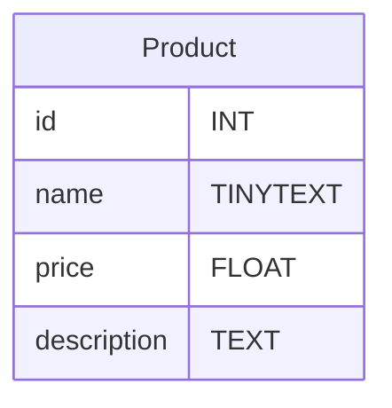
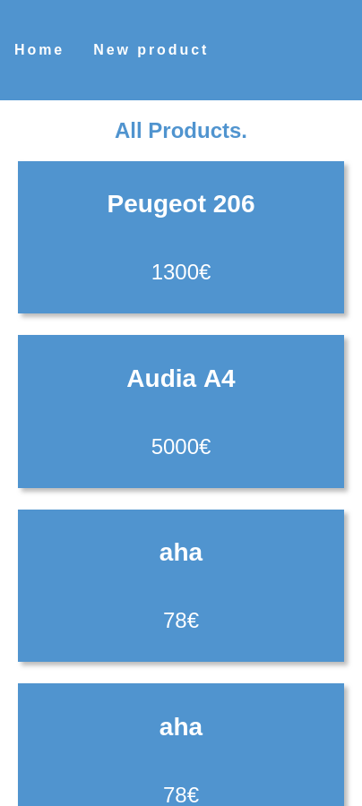
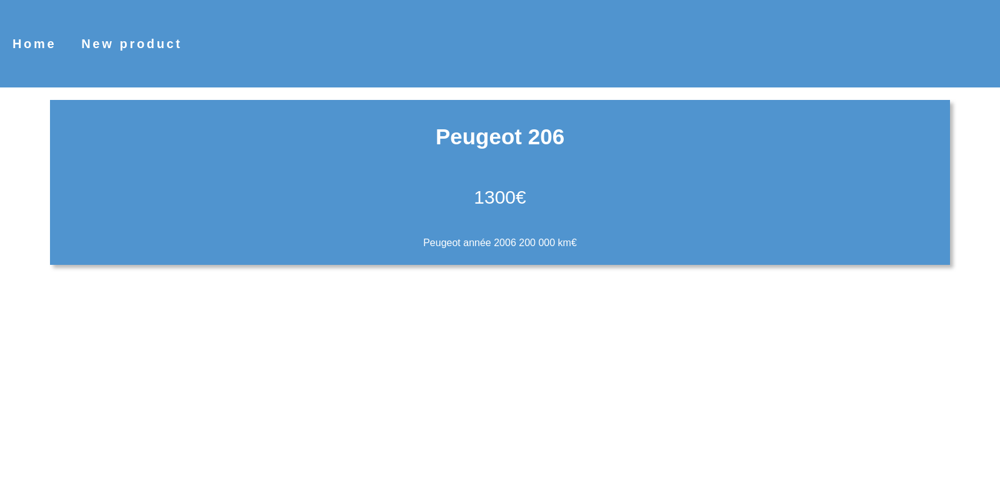

*CDA 16/01/2024 - Massinissa CHAOUCHI*
# Evaluation CRUD - Read et Create
## Avant de commencer
### Dans phpMyAdmin
1. Créez un BDD appelée `eval_bdd`.
2. Créer une table `Product` suivant ce diagramme :

3. Ajouter 2 produits dans la table pour vérifier que tout fonctionne.
> Attention id doit être une clé primaire.

### Dans VSCode
1. Ouvrez le container dans VSCode grâce à Remote Explorer

2. Ouvrez le dossier /var/html/www
3. Créer le dossier du projet nommé `eval`

## Objectif
Faire un CRUD, Read et Create sur la table `Product`.

## Cahier des charges
|Charges|Description|Contraintes|
|-|-|-|
| Page d'accueil | Créer une page qui affiche tout les produits sous la forme d'une grille 
| Page d'ajout de produit | Créer une page qui contient un formulaire de création de produit.| Des **messages** de **succès** et d'**erreurs** de champs doivent apparaitre. Le **nom** du produit doit faire **minimum 3 caractères**. Le **prix** **minimum** est **0€**. La **description** doit faire au **minimum 10 caractères**.
| Page de produit unique| Créer une page qui affiche un produit en fonction de l'id passé dans l'url. | Le nom des produits de la page d'accueil doivent rediriger sur cette page pour voir les détails du produit.

## Résultat

### *Accueil*

### **Ajout produit**

**Produit unique**

