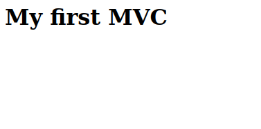

# Model View Controller en PHP
Le `Model View Controller` (MVC) est un design pattern de programmation qui permet d'organiser le code des applications web full-stack.

Le MVC divise le code en trois parties :
- **Le modèle**, il accède à la BDD et fournit des fonctions qui font abstractions du SQL.
- **La vue**, une page HTML qui ne fait qu'afficher des données.
- **Le contrôleur**, il fait le lien entre un modèle et une vue. On associe une URL à un contrôleur.


## Le flux d'éxecution du MVC
Le principe du MVC est simple :
- Tout les requêtes HTTP sont reçu par un seul et même fichier `index.php`.
- Ce dernier va ensuite appeller le bon `Controller` en fonction de l'URL.
- Le `Controller` va demander des données à un `Model` puis afficher une `View`. C'est la pierre angulaire du pattern MVC.


### Exemple - Afficher un produit :
- L'utilisateur tape : `localhost/produit/show/1`.
- Le fichier index.php reçoi l'URL.
- Il instancie le contrôleur `ProductController`
- La fonction `ProductController::show` est appelée
- Cette dernière appelle le modèle `ProductModel` et récupère le produit à l'id 1.
- Le contrôle fournit le produit à la vue HTML qui est affichée.

## Logique métier et code boilerplate
En informatique ont différencie le code en deux parties :
- **La logique métier** : c'est le code qui solutionne le besoin du projet. Pour une application de commande de pizza se sera : choisir ces aliments, choisir l'heure de livraison, rajouter des pizza en favoris.
- **Le code boilerplate** correspond au code que l'ont retrouve de façon récurrente dans beaucoup de projet : accéder à une BDD, valider des données, executer un controller en fonction de l'URL.

**Le design pattern MVC défini le code boilerplate d'une application web** et permet d'en accélerer le développement. 

Nous allons apprendre à coder un MVC en *"vanilla PHP"* c'est à dire uniquement avec PHP sans aucune extension ou framework. Plus tard vous utiliserez des frameworks comme Symfony ou Laravel qui vous fournissent tout le code *boilerplate* pour que vous n'ayez plus qu'à y ajouter votre logique métier.


##  Model
*Le Modèle à un accès direct à la base de donnée, il fournit des méthodes publiques simples d'utilisation pour épargner au développeur l'écriture des requêtes SQL.*

La création d'un modèle d'une table se fait en deux étapes : 
1. **La création d'une classe `Entity`** qui représente les **lignes** de la table.
2. **La création d'une classe `Model`** qui représente la **table**. Elle possède des méthodes publiques pour effectuer les actions `CRUD` sur la table : sélection d'une ou plusieurs entités , ajout, suppression et modification.

La classe `Model` va instancier des `Entity`, il est donc important de créer la classe `Entity` avant la classe `Model`. 

*Par exemple, si je veux récupérer une ligne de la table `Product` via son `id` je vais utiliser la méthode publique `Model::get(int $id)` en prenent soin de lui fournir l'id du produit recherché, la méthode me renverra une instance de la classe `Entity` qui contiendra toutes les informations de mon produit.*
> Un `modèle` est une représentation objet de la **table**.
> Une `entité` est une représentation objet d'une **ligne** de la table.

```
Les modèles sont contenu dans le dossier :
/app
 - /models
```

Voici un exemple de `Model` en PHP:
```php
class ProductModel{
    private PDO $bdd;
    private PDOStatement $addProduct;

    function __construct()
    {
        $this->bdd = new PDO("mysql:host=lamp-mysql;dbname=boutique","root","root");
        $this->addProduct = $this->bdd->prepare("INSERT INTO `Produit` (name,price,image) VALUES(:name,:price,:image);");
    }

    public function add(string $name, float $price,string $image) : void
    {
        $this->addProduct->bindValue("name",$name);
        $this->addProduct->bindValue("price",$price);
        $this->addProduct->bindValue("image",$image);
        $this->addProduct->execute();
    }
}

$productModel = new ProductModel();
$productModel->add("Air max taille 42",120.99,"/images/airmax.png");
echo "Un nouveau produit à été ajouté à la BDD regardez dans phpMyAdmin";
```

## View

Une vue contient la page HTML à afficher sur le navigateur du client. Elle ne fait qu'afficher les données que le contrôleur lui donne et n'a aucune conscience de la base de donnée.

C'est la partie la plus simple du modèle MVC car elle n'est composée que d'un seul fichier contenant du HTML et éventuellement un peu de CSS et de JavaScript.

> Une vue c'est simplement une page HTML qui sera appelée par un contrôleur.
```
Les vues sont contenu dans le dossier :
/app
 - /views
```

## Controller
Le `Controller` fait l'interface entre la `View` et le `Model`.

Le `Controller` est une classe est composée de méthodes appellées en fonction de l'URL tapée par le client.

La création d'un `Controller` se fait en plusieurs étapes :
- La création d'une classe `Controller`.
- L'ajout de méthodes publiques à la classe pour chaque url possibles.

Par exemple si les urls possibles de mon contrôleur sont :
```http
/product/add
/product/show
/product/delete
```

 J'ajoute trois méthodes publiques nommées :
 - ProductController::add()
 - ProductController::show()
 - ProductController::delete()

 Chaqu'une de ces méthodes appelera une vue et demandera éventuellement des données à un modèle.

## Exemple - Flux d'exécution d'un contrôleur
Par exemple si le client tape l'url :
```http
localhost/product/show/3
```
Le contrôleur `ProductController` appellera la méthode `show` avec comme paramètre `3`.

La méthode `show` va ensuite :
1. Utiliser un modèle pour récupérer un produit dans la BDD via son id.
2. Fournir le produit à la vue.
3. Afficher la vue.

*L'objectif d'un `Controller` c'est de faire correspondre l'url tapée par l'utilisateur à une méthode d'objet ce qui simplifie le développement de l'application et permet un code bien organisé.*

### Le routage
Habituellement en HTTP une URL ressemble à ça :
```http
localhost/single-product.php?id=3
```
En MVC l'URL ressemblera à ceci 
```http
localhost/product/show/3
```
Ce format permet de faire correspondre une méthode `ProductController::show` à l'url `/product/show` ce qui est très puissant en plus d'améliorer le réferencement Google du site.

Le soucis c'est que par défaut le serveur web apache interprète ce format comme une arborescence de dossier et nous renvoi une erreur 404 car aucun fichier nommé *3* n'existe.

Il nous faut donc modifier le comportement d'apache pour que les requêtes soit renvoyée au fichier index.php pour que ce dernier puisse appeler le bon `Controller` en fonction de l'url.

Ce principe s'appelle la la réecriture d'URL ou `URL Rewriting` et il sera obligatoire de modifier notre serveur apache pour appliquer ce nouveau comportement.

# Guide : Créer un architecture MVC
Nous allons créer pas à pas une architecture MVC.

## Plan d'action
Voici comment va se dérouler la suite du cours.
### I - Structure du projet
1. Créer la **structure** des dossiers du projet
2. Créer le **fichier index.php**
3. Mettre en place la **réécriture d'URL** pour que index.php reçoivent toutes les URLs à l'aide du fichier *.htaccess*
4. Créer la **classe App** qui sera le point de départ de notre application.

### II - Model
5. Créer un **modèle** de table SQL.

### III - Contrôleur et vue
6. **Créer un contrôleur et une vue.**
7. Tester le contrôleur dans App pour afficher une vue en fonction de valeurs rentrées en dur dans le code.
8. **Extraire** de l'**url**
    - le nom d'un **contrôleur**
    - le nom de la **méthode** 
    - les **paramètres**.
9. Tester mon controlleur avec ces valeurs extraites.

### IV - Routing
10. Créer une **classe Router** qui va instancier le bon contrôleur en fonction des valeurs extraites de l'url.
11. Tester mon application avec le Router
### V - Page d'accueil et erreur 404
12. Solidifier mon application avec
    - un **Contrôleur par défaut**, une page d'accueil
    - une **Contrôleur error 404**
### VI - Ajouter de nouvelles pages
13. Ajouter une nouvelle méthode au contrôleur
14. Ajouter un nouveau contrôleur.

## Pré-requis
- Un serveur LAMP

## I - Structure du projet
### Arboresence du projet
> La racine de notre projet est : `localhost/first_mvc` dans le dossier `/var/www/html/` du serveur LAMP.

> Notre projet sera une petite boutique en ligne de produit.

Un projet MVC est structuré en plusieurs dossiers :


*Arborescence d'un projet MVC*

- **/first_mvc**: la racine de notre projet
    - **/app** : contient tout notre codes source.
        - **/controllers** : contient les fichiers sources de nos classes `Controller`
        - **/core**: contient la class App qui est le point de départ denotre projet et tout ce qui est utile à travers toutes l'appli comme les constantes par exemple.
        - **/models** : contient les fichiers sources de nos classes `Model`.
        - **/views** : contient les fichiers sources de nos page HTML
    - **/public** : contient notre index.php et tout ce qui doit être accessible publiquement.
        - **/css** : contient TOUT nos fichiers CSS
        - **/js** : contient TOUT nos scripts JavaScript
        - **/images** : contient TOUTES les images

### **Pratique :**
1. Créer l'arborescence de dossier si dessus.
3. Créer un fichier nommé `.htaccess` à la racine du projet.
2. Créer un fichier `index.php` à la racine du dossier `/public` et placer le code : `<h1>My first MVC</h1>` à l'intérieur.

Le projet devrait maintenant ressembler à ceci :


> N'oubliez pas le `.` devant le nom du fichier `.htaccess`. C'est un fichier de configuration apache et sont ortographe doit être exact. Attention au fautes de frappe ;).

### Redirection des requêtes vers index.php et réécriture d'URL.
#### Explications
Pour rappel un MVC n'utilise pas le format habituel des requêtes HTTP.
```http
localhost/first_mvc/single-product.php?id=3
```
L'URI d'un lien MVC respecte le format `/controller_name/method/param` :
```http
localhost/first_mvc/controller_name/method/param
```
**Exemples :**
La méthode `ProductController::show()` est appelée lorsque cette route est reçu.
```http
localhost/first_mvc/product/show/3
```

La méthode `CategoryController::delete()` est appelée lorsque cette route est reçu.
```http
localhost/first_mvc/category/delete/3
```

Il faut donc effectuer une réécriture d'url en modifiant la configuration du serveur web apache. La modification d'appache se fait dans le fichier .htaccess à la racine du projet.

#### Pratique
Dans le fichier `.htaccess` écrivez ceci : 
```htaccess
RewriteEngine On
RewriteRule ^(?!public/)(.*) public/index.php
```
Rendez-vous sur localhost/first_mvc et vous devriez voir votre `h1` :



- `RewriteEngine On` : active le moteur de réécriture d'url.
- `RewriteRule` rajoute un rêgle de réécriture en faisant corresepondre une regex à un fichier php. Cette regle renvoi au fichier `public/index.php`.

La regex `^(?!public/)(.*)` matches toute url qui ne commence pas par `public/`.

**Par exemple :**

`product/show/1` sera renvoyer vers index.php mais `public/css/style.css` renvera comme d'habitude le fichier CSS.

`Regex` est un langage qui permet de chercher des occurences de texte dans un texte, pour ce faire il utilise une suite de caratères spéciaux. 

> Les regexs ne sont pas le sujet de ce cours.
> Plus d'info sur les regex ici : https://regexlearn.com/
 
> Si la requête HTTP précise `public/` cela signifie qu'il souhaite accéder aux images, aux css ou aux scripts JS et dans ce cas il ne faut pas le renvoyer à index.php mais bien lui donner la ressource qu'il demande.

### La classe App
La classe `App` est le point de départ de notre application rien ne se trouve en dehors de cette classe. Elle contient une méthode `static` nommée `start`.

Pour l'instant la méthode `start` affichera simplement un *"Hello World"* mais c'est ici que, plus tard, les urls seront lu et que les `Controller` seront appelés.

#### Pratique :
1. Dans le dossier `app/core/` créez un fichier appelé `App.php`.
2. A l'intérieur de ce fichier créer une classe nommée App et ajoutez lui une méthode public static qui echo `"App"`.
3. Appelez la méthode `App::start()` dans `index.php`.

*app/core/App.php*
```php
<?php
class App{
    public static function start(){
        echo "App";
    }
}
```
*public/index.php*
```php
<?php
require_once(__DIR__."/../app/core/App.php");
App::start();
```

Rendez-vous sur `localhost/first_mvc`, vous deveriez voir le texte *App* apparaître. Attention aux fautes de frappes dans le chemin du `require_once`!

> `../` signifie retour en arrière

> `__DIR__` en php est une constante qui contient le chemin vers le dossier actuel du fichier appelant. C'est très pratique pour ne pas se tromper dans le chemin du fichier et VSCode aide à l'autocompletion.

Maintenant que le point d'entrée du projet est mis en place (`App::start`) nous allons pouvoir rajouter les briques au fur et a mesure.

## II - Model
Commençont par créer un modèle, cela nous permettra d'accéder aux données de la BDD SQL et rendra le suite plus concrète.

Pour rappel un modèle est un classe qui permet via ses méthodes publiques d'accéder au données de la BDD.

L'objectif final sera de pouvoir écrire un code simple pour récupérer les données comme par exemple :
```php
$productModel = new ProductModel();
$products = $productModel->getAll();
```
Ici `$products` est un `array` qui contient tout les produits.

C'est parti.

> Avant de commencez assurez vous d'avoir une BDD avec une table nommée `Produit` avec quelque produit dedant.
>```mermaid
>erDiagram 
>Produit{
>    id INT
>    name TINYTEXT
>    price FLOAT
>    image TEXT
>}
>```

### La classe ProductModel
1. Dans le dossier `app/models/` ,créez un fichier nommée `ProductModel.php`.
2. Dans ce fichier ajoutez la classe `ProductModel`.

*app/models/ProductModel.php*
```php
class ProductModel{

}
```

## III - Contrôleur et vue
## IV - Routing
## V - Page d'accueil et erreur 404
## VI - Ajouter de nouvelles pages


<!-- 
### II - Model
5. Créer un **modèle** de table SQL.

### III - Contrôleur et vue
6. **Créer un contrôleur et une vue.**
7. Tester le contrôleur dans App pour afficher une vue en fonction de valeurs rentrées en dur dans le code.
8. **Extraire** de l'**url**
    - le nom d'un **contrôleur**
    - le nom de la **méthode** 
    - les **paramètres**.
9. Tester mon controlleur avec ces valeurs extraites.

### IV - Routing
10. Créer une **classe Router** qui va instancier le bon contrôleur en fonction des valeurs extraites de l'url.
11. Tester mon application avec le Router
### V - Page d'accueil et erreur 404
12. Solidifier mon application avec
    - un **Contrôleur par défaut**, une page d'accueil
    - une **Contrôleur error 404**
### VI - Ajouter de nouvelles pages
13. Ajouter une nouvelle méthode au contrôleur
14. Ajouter un nouveau contrôleur. -->


<!-- 
- Design pattern MVC
- Separation of concern
- Model (CRUD des Entity)
    - Gére la BDD
    - Une table est un model ex : UserModel
    - Une entité est une ligne de la table UserEntity
    - Un model possède des méthodes publique pour faire un CRUD et genere des entités si besoin
- Vue ( Page HTML)
    - Gère l'affichage
    - Une vue est une page HTML qui instancie un Controller
    - Une vue possède un route ("URL")
- Controller (Logique métier)
    - Relie le Model à la Vue
    - Controller Utilise les Model pour récupérer des données (souvent des Entité).
    - Il possède des méthodes et attributs publique accessible dans la vue
- Exemple de structure MVC Blog
    - index.php // stating point of the app
    - /models
        - /Category
            - CategoryModel.php
            - CategoryEntity.php
        - /Article
            - ArticleModel.php
            - ArticleEntity.php
    - /vues
        - /Home
            - HomeVue.php
            - HomeVue.css
            - HomeVue.js
        - /Blog
            - BlogVue.php
            - BlogVue.css
            - BlogVue.js
    - /controller
        - HomeController.php
        - BlogController.php -> ArticleModel


# Idée TP
- Blog Article
- Boutique en ligne
- User Login Logout space -->