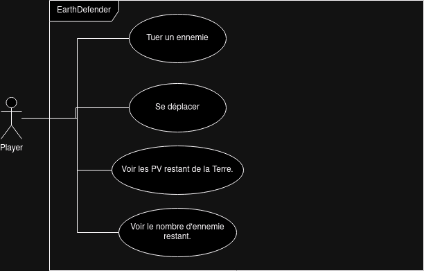
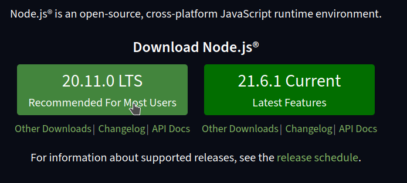

# La POO par l'exemple - EarthDefender

Pour apprendre la POO nous allons concevoir un petit jeu vidéo nommée EarthDefender.

## Concept du jeu
Ce jeu est une version simplifié de *SpaceInvader* où un petit vaisseau spacial détruit des aliens pour proteger la Terre.

Les aliens se déplacent vers la terre et lui font perdre des points de vie lors de leurs collision. 

Le joueur contrôle le vaisseau spacial, il se déplace latéralement. Il peut également tirer des missiles qui détruisent alors un alien lors de la collision.


## Use Case Diagramme
Voici le diagramme de cas d'utilisation de l'application.


## Technologies néccessaires

- TypeScript 
- HTML Canva

Cette application à besoin d'une haute intéractivité il nous faudra donc JavaScript, nous utiliserons également un Canva HTML pour afficher le jeu.

Nous utiliseront TypeScript plutôt que JavaScript pour sa syntaxe Orientée Objet. TypeScript néccessitera cependant de compiler le code en JavaScript.

> TypeScript est un surcouche de JavaScript développé par Microsoft, il renforce JavaScript elle lui rajoutant les types, c'est un langage moi permisif que JavaScript et il est obligatoire de le connaitre pour utiliser, à l'avenir, le framework Angular. Tout code TypeScript sera de toute façon au final tranformé en code JavaScript après la compilation.

## Cahier des charges
|Tache|Description|Contraintes|
|-|-|-|
| Créer le canva du jeu | Le HTML Canva est un rectangle qui prend presque tout l'écran | Il possède un fond d'écran similaire à celui de la maquette |
|Afficher le joueur| Afficher le joueur sur le HTML Canva. | Le joueur se trouve à quelque pixels du bord inférieur du canva.|
| Mouvement du joueur| Le joueur peut se déplacer de gauche à droite avec les touches 'Q' ou 'D'.|
| Apparition d'un Alien |Faire apparaitre un alien | L'alien avance tout droit vers le bas du canva.|
|Afficher la Terre | La terre possède 3 PV | Afficher les pv restant de la terre |
| Perte de pv de la terre | La terre perd 1 pv si un alien la touche |
| Mort du joueur | Le joueur meurt si un alien le touche. | Le jeu recommence |
| Tire du joueur| Le joueur tire des missiles qui détruise un alien au contact | Les missiles vont tout droit vers le haut de l'écran. La touche espace tire un missile. Le joueur peut tirer à une cadence maximum de 200ms |
| Vague d'aliens | Faire apparaitre de nombreux aliens qui arriveront petit à petit de façon aléotoire. |  Il n'y maximum que 10 aliens en jeu et le nombres d'alien tué est affiché en haut de l'écran. |
| Bonus SON Joueur | Emmettre un son au tire du joueur |
| Bonus SON musique | Faire tourner un musique en boucle en fond. |


# Pré-requis

# NPM
Le code TypeScript que nous écrivont n'est pas compréhensible du navigateur (il ne comprend que le JS), il nous faut donc installer le *TypeScript Compiler* (`tsc`), qui compile le code TypeScript en code JavaScript.

Pour installer le compilateur TypeScript nous utilisons le Node Package Manager (`NPM`), c'est le gestionnaire d'extension de JavaScript. NPM est inclu dans l'installation de NodeJS, il nous suffit donc d'installer NodeJS.

## Installer NodeJS et NPM sous Windows
Télécharger NodeJS Long term Support (LTS) ici : https://nodejs.org/en

> Long Term Support signifie que cette version de NodeJS est stable et toutes les failles sont corrigées pendant encore un moment. C'est donc une version fiable à utiliser pour la plupart des projets.

## Installer NodeJS et npm sous Linux
```bash
sudo apt install nodejs npm
```
## Installer NodeJS et npm sous Mac
Avec HomeBrew le gestionnaire de paquet MacOS :
```bash
brew install node
```
Ou à la main via le lien suivant : https://nodejs.org/en/download/

## Installer le compilateur TypeScript
Dans un invité de commande executez la commande suivante pour installer TypeScriptCompiler(tsc) :
```bash
npm install -g typescript
```
> `-g` signifie `global`, le compilateur TypeScript est donc disponible sur l'ensemble de votre ordinateur.
## Arborescence du projet
Dans VSCode créer un nouveau dossier pour votre projet nommé : `EarthDefender`. 

Ce dossier contient :
- un fichier `index.html`, la page d'accueil de votre jeu
- un dossier nommé `src`, il contiendra notre code TypeScript
- un dossier nommé `build`, il contiendra le code JavaScript compilé par TypeScript. Ce sera ce code qui sera importé par la balise `<script>` dans le index.html.
- un fichier nommé `tsconfig.json`, il dictera à TypeScript comment se comporter.

*Arborescence du projet EarthDefender*


Dans le dossier `src`, créez un fichier nommée `script.ts` et placez y le code suivant :

*src/script.ts*
```ts
let gameName : string = "EarthDefender !";
console.log(gameName);
```
> Vous remarquez qu'en TypeScript on peut préciser le type d'un variable. Ainsi si je fais une erreur et tente de mettre, par exemple, un `number` dans une `string`, le compilateur TypeScript me retournera une erreur.

## Configurer TypeScript

Nous avons écrit un peu de TypeScript. Avant de le complier, nous allons indiquer au compilateur TypeScript de placer les fichier compilées dans le dossier `build`.

Dans `tsconfig.json` écrivez le code suivant :

*tsconfig.json*
```json
{
    "compilerOptions": {
        "rootDir": "./src", // Les fichiers à compiler sont dans ./src
        "outDir": "./build",    // Les fichiers JavaScript compilés sont dans ./build
        "module": "ESNext"  // Le JavaScript généré lors de la compilation utilise la norme ECMAScript la plus récente.
    }
}
```

## Compiler mon TypeScript en JavaScript

Pour compiler, rendez-vous dans le dossier de votre projet avec une ligne de commande et tapez :
```bash
tsc
```
TypeScript va compiler votre code pour transformer le TypeScript en JavaScript. Le fichier `script.js` est à présent dans le dossier `build`, nous pouvons donc l'importer dans le fichier `index.html`.

*index.html*
```html
<!DOCTYPE html>
<html lang="fr">
<head>
    <meta charset="UTF-8">
    <meta name="viewport" content="width=device-width, initial-scale=1.0">
    <title>Earth Defender</title>
    
</head>
<body>
      
</body>
<script type="module" src="./build/script.js"></script>
</html>
```
> Vous remarquez l'utilisation du `type=module` sur la balise `<script>`. Il est obligatoire de préciser `type=module` car à l'avenir le fichier `script.js` importera des classes contenu dans d'autres fichiers JavaScript or ceci n'est possible que si le navigateur interprète le fichier `script.js` comme un module JavaScript.

Ouvrez votre projet dans le navigateur (j'utilise l'extension VSCode *Live Preview* ). Si tout c'est bien passé, il est écrit dans la console : `"Earth Defender !"`.

## Watch mode - Compiler lors de la sauvegarde
A chaque modification d'un fichier TypeScript il faut relancer la commande `tsc` pour recompiler le code en JavaScript, c'est génant.

Nous souhaitons donc voir TypeScript compiler notre code à chaque fois que l'on sauvegarde un fichier pour ne pas avoir à lancer le compilateur à la main à chaque modification.

Pour ceci rien de plus simple, il suffit de lancez le compilateur en mode watch.
```bash
tsc -w
```


Voilà ! A present TypeScript surveille nos fichiers et recompile le code à chaque modifications !


# Plan de cours temporaire
- Pré-requis
    - TypeScript
    - watch mode
- Class et Encaplusation : on créer les objets sans prendre en l'héritage ou quoi que ce soit, on créer un class App avec une méthode static `start` qui initialise le jeu et une méthode privé `loop` qui est la boucle d'évenement du jeu.
- Héritage : on syntétise les classes via des classes mère pour supprimer la duplication de code
- Polymorphisme : A voir mais je pense faire des fonctions de perte de pv à la signature similaire mais à l'implémentations differentes en fonction de l'objet ( La terre et le joueur peuvent provoqué un gameover alors que l'alien non).