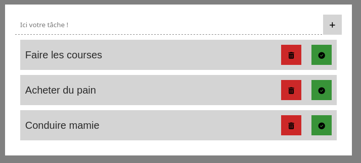

# Remise en route JavaScript
Créer les projets suivants en JavaScript.

## Compteur
Un bouton qui incrémente une valeur à chaque clic
### Pré-requis
- addEventListener et l'event click
- let compteur
- querySelector
- innerText

## Menu burger
Un icon burger qui affiche une menu par la droite de l'écran avec une animation slide-in.

### Pré-requis
- addEventListener et l'event click
- querySelector
- CSS Transition
- element.classList

## Une bannière de cookie
Une bannière de cookie qui disparait en fadeout quand l'utilisateur accepte les cookies.

### Pré-requis
- addEventListener et l'event click
- querySelector
- CSS Transition
- element.classList

## La TODO List
Une todo list qui permet d'ajouter des taches et de les supprimer.

### Pré-requis
- addEventListener et l'event change ou input
- querySelector
- La balise `<input type="text">`
- document.createElement
- element.appendChild 
