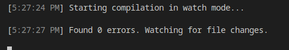
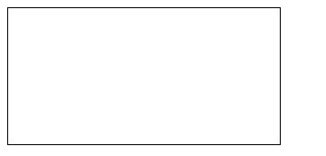

# La POO par l'exemple - EarthDefender

Pour apprendre la POO nous allons concevoir un petit jeu vidéo nommée EarthDefender.

## Concept du jeu
Ce jeu est une version simplifié de *SpaceInvader* où un petit vaisseau spacial détruit des aliens pour proteger la Terre.

Les aliens se déplacent vers la terre et lui font perdre des points de vie lors de leurs collision. 

Le joueur contrôle le vaisseau spacial, il se déplace latéralement. Il peut également tirer des missiles qui détruisent alors un alien lors de la collision.


Retrouvez toute les assets graphiques du projet via ce lien figma : https://www.figma.com/file/Th3KWNwiV7TtXDKNSMv6do/EarthDefender?type=design&node-id=0%3A1&mode=design&t=MUCNIKJfrDGeNUtj-1

## Use Case Diagramme
Voici le diagramme de cas d'utilisation de l'application.


## Technologies néccessaires

- TypeScript
- HTML Canva

Cette application à besoin d'une haute intéractivité il nous faudra donc JavaScript, nous utiliserons également un Canva HTML pour afficher le jeu.

Nous utiliseront TypeScript plutôt que JavaScript pour sa syntaxe Orientée Objet. TypeScript néccessitera cependant de compiler le code en JavaScript.

TypeScript est un surcouche de JavaScript développé par Microsoft, il renforce JavaScript elle lui rajoutant les types, c'est un langage moins permicif que JavaScript et il est obligatoire de le connaitre pour utiliser, à l'avenir, le framework Angular. Tout code TypeScript sera de toute façon au final tranformé en code JavaScript après la compilation.

> A l'origine TypeScript a été crée par Microsoft pour faciliter le développement des versions Web de la suite Office. Le premier programme développé en TypeScript est VSCode. Le développement de VSCode à permit à Microsoft de tester TypeScript en condition réel. Pour plus d'info je recommande ce documentaire sur les conditions de développement de TypeScript : https://www.youtube.com/watch?v=U6s2pdxebSo&t=2189s.

## Cahier des charges
|Tache|Description|Contraintes|
|-|-|-|
| Créer le canva du jeu | Le HTML Canva est un rectangle qui prend presque tout l'écran | Il possède un fond d'écran similaire à celui de la maquette |
|Afficher le joueur| Afficher le joueur sur le HTML Canva. | Le joueur se trouve à quelque pixels du bord inférieur du canva.|
| Mouvement du joueur| Le joueur peut se déplacer de gauche à droite avec les touches 'Q' ou 'D'.|
| Apparition d'un Alien |Faire apparaitre un alien | L'alien avance tout droit vers le bas du canva.|
|Afficher la Terre | La terre possède 3 PV | Afficher les pv restant de la terre |
| Perte de pv de la terre | La terre perd 1 pv si un alien la touche |
| Mort du joueur | Le joueur meurt si un alien le touche. | Le jeu recommence |
| Tire du joueur| Le joueur tire des missiles qui détruise un alien au contact | Les missiles vont tout droit vers le haut de l'écran. La touche espace tire un missile. Le joueur peut tirer à une cadence maximum de 200ms |
| Vague d'aliens | Faire apparaitre de nombreux aliens qui arriveront petit à petit de façon aléotoire. |  Il n'y maximum que 10 aliens en jeu et le nombres d'alien tué est affiché en haut de l'écran. |
| Bonus SON Joueur | Emmettre un son au tire du joueur |
| Bonus SON musique | Faire tourner un musique en boucle en fond. |


# Pré-requis

# NPM
Le code TypeScript que nous écrivont n'est pas compréhensible du navigateur (il ne comprend que le JS), il nous faut donc installer le *TypeScript Compiler* (`tsc`), qui compile le code TypeScript en code JavaScript.

Pour installer le compilateur TypeScript nous utilisons le Node Package Manager (`NPM`), c'est le gestionnaire d'extension de JavaScript. NPM est inclu dans l'installation de NodeJS, il nous suffit donc d'installer NodeJS.

## Installer NodeJS et NPM sous Windows
Télécharger NodeJS Long term Support (LTS) ici : https://nodejs.org/en

> Long Term Support signifie que cette version de NodeJS est stable et toutes les failles sont corrigées pendant encore un moment. C'est donc une version fiable à utiliser pour la plupart des projets.

## Installer NodeJS et npm sous Linux
```bash
sudo apt install nodejs npm
```
## Installer NodeJS et npm sous Mac
Avec HomeBrew le gestionnaire de paquet MacOS :
```bash
brew install node
```
Ou à la main via le lien suivant : https://nodejs.org/en/download/

## Installer le compilateur TypeScript
Dans un invité de commande executez la commande suivante pour installer TypeScriptCompiler(tsc) :
```bash
npm install -g typescript
```
> `-g` signifie `global`, le compilateur TypeScript est donc disponible sur l'ensemble de votre ordinateur.
## Arborescence du projet
Dans VSCode créer un nouveau dossier pour votre projet nommé : `EarthDefender`. 

Ce dossier contient :
- un fichier `index.html`, la page d'accueil de votre jeu
- un dossier nommé `src`, il contiendra notre code TypeScript
- un dossier nommé `build`, il contiendra le code JavaScript compilé par TypeScript. Ce sera ce code qui sera importé par la balise `<script>` dans le index.html.
- un fichier nommé `tsconfig.json`, il dictera à TypeScript comment se comporter.

*Arborescence du projet EarthDefender*


Dans le dossier `src`, créez un fichier nommée `script.ts` et placez y le code suivant :

*src/script.ts*
```ts
let gameName : string = "EarthDefender !";
console.log(gameName);
```
> Vous remarquez qu'en TypeScript on peut préciser le type d'un variable. Ainsi si je fais une erreur et tente de mettre, par exemple, un `number` dans une `string`, le compilateur TypeScript me retournera une erreur.

## Configurer TypeScript

Nous avons écrit un peu de TypeScript. Avant de le complier, nous allons indiquer au compilateur TypeScript de placer les fichiers compilés dans le dossier `build`.

Dans `tsconfig.json` écrivez le code suivant :

*tsconfig.json*
```json
{
    "compilerOptions": {
        "rootDir": "./src", // Les fichiers à compiler sont dans ./src
        "outDir": "./build",    // Les fichiers JavaScript compilés seront dans ./build
        "module": "ESNext"  /* Le JavaScript généré lors de la compilation utilise
         la norme ECMAScript la plus récente.*/
    }
}
```

> **Rappel : "module" : "ESNext"**
> Le nom de la norme qui défini la syntaxe et le comportement du langage JavaScript est ECMAScript. A l'heure où j'écrit ce cours nous somme à ECMAScript2024. 
>
> Dans tsconfig.json, **si le paramètre `module` prend la valeur `ESNext`, le compilateur compilera toujours le code dans le respect de la norme ECMAScript la plus récente.** En 2025 il utilisera donc la norme ECMAScript2025.
> - Tout la norme ECMAScript est définie ici : https://tc39.es/ecma262/, c'est ce document qui est utilisé par les concepteurs de navigateur web pour implementer JavaScript.
> - Plus de détail sur le fichier tsconfig.json ici : https://www.typescriptlang.org/docs/handbook/tsconfig-json.html

## Compiler mon TypeScript en JavaScript

Pour compiler, rendez-vous dans le dossier de votre projet avec une ligne de commande et tapez :
```bash
tsc
```
TypeScript va compiler votre code pour transformer le TypeScript en JavaScript. Le fichier `script.js` est à présent dans le dossier `build`, nous pouvons donc l'importer dans le fichier `index.html`.

*index.html*
```html
<!DOCTYPE html>
<html lang="fr">
<head>
    <meta charset="UTF-8">
    <meta name="viewport" content="width=device-width, initial-scale=1.0">
    <title>Earth Defender</title>
    
</head>
<body>
      
</body>
<script type="module" src="./build/script.js"></script>
</html>
```
> Vous remarquez l'utilisation du `type=module` sur la balise `<script>`. Il est obligatoire de préciser `type=module` car à l'avenir le fichier `script.js` importera des classes contenu dans d'autres fichiers JavaScript or ceci n'est possible que si le navigateur interprète le fichier `script.js` comme un module JavaScript.

Ouvrez votre projet dans le navigateur (j'utilise l'extension VSCode *Live Preview* ). Si tout c'est bien passé, il est écrit dans la console : `"Earth Defender !"`.

## Watch mode - Compiler lors de la sauvegarde
A chaque modification d'un fichier TypeScript il faut relancer la commande `tsc` pour recompiler le code en JavaScript, c'est génant.

Nous souhaitons donc voir TypeScript compiler notre code à chaque fois que l'on sauvegarde un fichier pour ne pas avoir à lancer le compilateur à la main à chaque modification.

Pour ceci rien de plus simple, il suffit de lancez le compilateur en mode watch.
```bash
tsc -w
```


Voilà ! A present TypeScript surveille nos fichiers et recompile le code à chaque modifications !

# Canva HTML
Avant de concevoir notre jeu grâce à la POO il convient de comprendre les bases de l'API Canvas. 

Un canvas HTML est une balise `<canvas>` qui permet de dessiner librement à l'interieur. L'intérieur d'un canvas fait exeption à la manière traditonnel d'afficher des éléments en HTML et par concequant le CSS ne vous sera d'occupe utilité à l'interieur du canva.

Tout les éléments interne au canva devront être dessiner en JavaScript.

Soit le fichier HTML suivant qui permet d'afficher un canvas vide à la bordure noire.
*index.html*
```html
<!DOCTYPE html>
<html>
<head>
    <style>
        canvas{
            border : black solid 1px;
        }
    </style>
</head>
<body>
    <canvas>

    </canvas>
</body>
<script type="module" src="./build/script.js"></script>
</html>
```
*Résultat*


Une fois ce code mit en place la suite du code se passera dans le dossier `src`.

## Initaliser le canva
Avant de pouvoir dessiner il faut recupérer ce que l'on nomme le *contexte de canvas* à savoir un objet qui contient des méthodes permettent de dessiner dans le canvas.
```ts
// Je récupère la balise nommée canvas
const canvas = document.querySelector("canvas");
// Je récupère le contexte du canvas
// pour pouvoir, à l'avenir, dessiner dedans.
const context = canvas.getContext("2d");
```
Pour finir l'initalisation du canvas nous allons définir sa taille comme etant de 900x500px.
```ts
const CANVAS_WIDTH = 900;
const CANVAS_HEIGHT = 500;

const canvas = document.querySelector("canvas");
const context = canvas.getContext("2d");

canvas.width = CANVAS_WIDTH;
canvas.height = CANVAS_HEIGHT;
```
Voilà s'en ai fini de l'initalisation du canvas! 

Nous avons le contexte qui nous permettra de dessiner et pour plus de comfort nous avons ajouté une bordure noire autour du canvas pour le voir facilement et également défini une taille à ce canvas (900x500).
## Définir la couleur de fond du canvas
La méthode context.fillRect permet de remplir une zone du canvas.
L'attribut context.fillStyle permet de définir la couleur utiliser par la méthode fillRect lors du remplissage.
```ts
context.fillStyle = "#141414";  // HexaDec. Gris foncé
context.fillRect(
    0,0,            // [x,y] supérieur gauche
    this.CANVAS_WIDTH,this.CANVAS_HEIGHT // [x,y] inférieur droit
);
```
Les coordonnées [x,y] d'un canvas démarre à [0,0] en haut à gauche du canvas, ont appel ceci l'origine. Ici la fonction fillRect à besoin des coordonnées supérieur gauche et inférieur droit de la zone à remplir. Nous lui fournissont donc l'origine du canvas et le coin inférieur droit pour remplir l'entièreté du canvas.

> Pour rappel, la largeur correspond à l'axe x (l'abscisse) et la hauteur correspond à l'axe y (l'ordonnée).
## Effacer le contenu du canvas
Pour effecer tout le contenu du canva ont utilise la méthode context.clearReact qui est similaire à fillRect dans ses paramètre et effacer tout ce qui se trouve dans entre les coordonnée fournit.
```ts
context.clearRect(0,0,CANVAS_WIDTH,CANVAS_HEIGHT);
```
## Afficher une image
La méthode context.drawImage() permet de déssiner une image dans le canvas. 
Pour se faire elle à d'un element HTMLImageElement et des coordonnées où dessiner l'image.

Un HTMLImageElement est récupérable via la méthode querySelector().

### Ajouter l'image dans le HTML
Dans le dossier `/public/images/` placer l'image suivant sous le nom `Alien.png`.

*/public/images/Alien.png*

> Cette image est également disponible depuis le lien figma du projet.

Dans le code HTML placez l'image comme d'habitude avec une balise `` mais en rajoutant l'attribut HTML hidden qui permet de cacher l'image.

*index.html*
```html
...
<body>
    
    <canvas>

    </canvas>
</body>
...
```

### Afficher l'image dans le canvas
```ts
const image : HTMLImageElement = document.querySelector(".alien");
```
## Déplacer une image
# Plan de cours temporaire
- Pré-requis
    - TypeScript
    - watch mode
- Canva HTML ( Sans OOP)
    - définir une couleur de fond
    - afficher une image
    - déplacer un objet.
        - update position
        - clear
        - draw
        - setInterval
        - User inputAxisX
- Class et Encaplusation : on créer les objets sans réfélchir à l'héritage, 
    - on créer un class App avec une méthode **public** start qui initialise le jeu et une méthode **privé** `gameLoop` qui est la boucle d'évenement du jeu. 
    - On crée une class Alien qui se déplace de haut en bas 
    - et ensuite on crée une class Player qui se deplace de droite à gauche en fonction de l'input du joueur.
    - Gestion de la collision via la méthode GameObject.collide et la modification de la méthode Game.gameLoop.
    - GameOver on player collide Alien 
- Héritage : on syntétise les classes via des classes mère pour supprimer la duplication de code
    - La classe GameObject
        - Polymorphisme : Les méthodes update, init et collide de la classe GameObject sont modifier par leurs enfants et donc passer de private à protected.
- Ajout des laser
    - Ajout de la classe Laser qui se deplace de haut en bas
    - Ajout d'un méthode shoot à Player qui instancie un Laser
    - On Laser collide Alien alien die
- Ajout de la terre, la classe Earth
    - pv
    - pv diminue on collide on Alien, and alien die
    - Game over si pv == 0
- Finitions
    - Game.win si alienCount == 0
    - Sound laser shoot
    - Musique de fond
- BONUS Exercices
    - Son de mort d'un alien
    - Ajout de bonus de vitesse qui tombe du ciel
    - Ajout de malus de vitesse qui tombe du ciel
