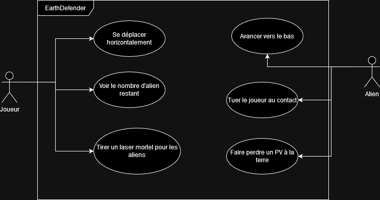
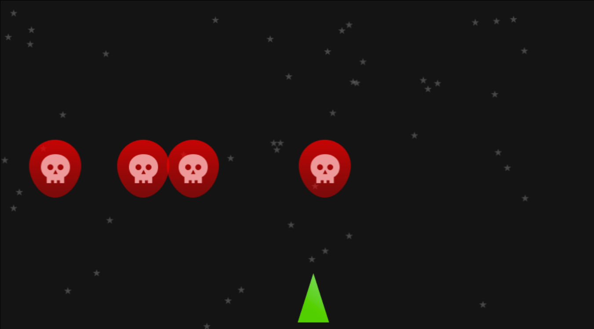
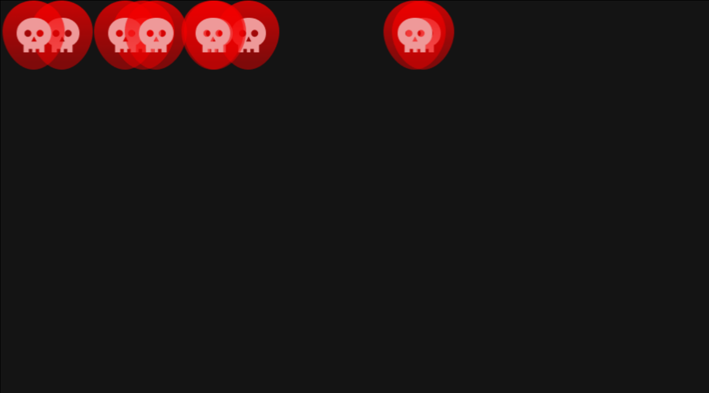

# La POO par l'exemple - EarthDefender

Pour apprendre la POO nous allons conçevoir un petit jeu vidéo nommé EarthDefender.

## Concept du jeu
Ce jeu est une version simplifiée de *SpaceInvader*, où un petit vaisseau spacial détruit des aliens pour proteger la Terre.

Les aliens se déplacent vers la terre et lui font perdre des points de vie lors de leurs collisions. 

Le joueur contrôle le vaisseau spacial, il se déplace latéralement. Il peut également tirer des missiles qui détruisent alors un alien lors de leurs collision.


Retrouvez toute les assets graphiques du projet via ce lien figma : https://www.figma.com/file/Th3KWNwiV7TtXDKNSMv6do/EarthDefender?type=design&node-id=0%3A1&mode=design&t=MUCNIKJfrDGeNUtj-1

## Use Case Diagramme
Voici le diagramme de cas d'utilisation de l'application.

## Technologies néccessaires

- TypeScript
- HTML Canva

Cette application web a besoin d'une haute intéractivité il nous faudra donc JavaScript, nous utiliserons également un Canva HTML pour afficher le jeu.

Nous utiliseront TypeScript plutôt que JavaScript pour sa syntaxe Orientée Objet. TypeScript néccessitera cependant de compiler le code en JavaScript.

TypeScript est un surcouche de JavaScript développé par Microsoft, il renforce JavaScript en lui rajoutant les types, c'est un langage moins permissif que JavaScript et il est obligatoire de le connaitre pour utiliser, à l'avenir, le framework Angular. Tout code TypeScript sera au final tranformé en code JavaScript après la compilation.

> A l'origine TypeScript a été crée par Microsoft pour faciliter le développement des versions Web de la suite Office. Le premier programme développé en TypeScript est VSCode. Le développement de VSCode à permis à Microsoft de tester TypeScript en condition réel. Pour plus d'info je recommande ce documentaire sur les conditions de développement de TypeScript : https://www.youtube.com/watch?v=U6s2pdxebSo&t=2189s.

## Cahier des charges
|Tache|Description|Contraintes|
|-|-|-|
| Créer le canva du jeu | Le HTML Canva est un rectangle qui prend presque tout l'écran | Il possède un fond d'écran similaire à celui de la maquette |
|Afficher le joueur| Afficher le joueur sur le HTML Canva. | Le joueur se trouve à quelque pixels du bord inférieur du canva.|
| Mouvement du joueur| Le joueur peut se déplacer de gauche à droite avec les touches 'Q' ou 'D'.|
| Apparition d'un Alien |Faire apparaitre un alien | L'alien avance tout droit vers le bas du canva.|
|Afficher la Terre | La terre possède 3 PV | Afficher les pv restant de la terre |
| Perte de pv de la terre | La terre perd 1 pv si un alien la touche |
| Mort du joueur | Le joueur meurt si un alien le touche. | Le jeu recommence |
| Tir du joueur| Le joueur tir des missiles qui détruisent un alien au contact | Les missiles vont tout droit vers le haut de l'écran. La touche espace tir un missile. Le joueur peut tirer à une cadence maximum de 200ms |
| Vague d'aliens | Faire apparaitre de nombreux aliens qui arriveront petit à petit de façon aléotoire. |  Il n'y maximum que 10 aliens en jeu et le nombres d'alien tué est affiché en haut de l'écran. |
| Bonus SON Joueur | Emmettre un son au tir du joueur |
| Bonus SON musique | Faire tourner une musique en boucle en fond. |


# Pré-requis

# NPM
Le code TypeScript que nous écrivont n'est pas compréhensible du navigateur (il ne comprend que le JS), il nous faut donc installer le *TypeScript Compiler* (`tsc`), qui compile le code TypeScript en code JavaScript.

Pour installer le compilateur TypeScript nous utilisons le Node Package Manager (`NPM`), c'est le gestionnaire d'extension de JavaScript. NPM est inclu dans l'installation de NodeJS, il nous suffit donc d'installer NodeJS.

## Installer NodeJS et NPM sous Windows
Télécharger NodeJS Long term Support (LTS) ici : https://nodejs.org/en

> Long Term Support signifie que cette version de NodeJS est stable et toutes les failles seront corrigées pendant encore un moment. C'est donc une version fiable à utiliser pour la plupart des projets.

## Installer NodeJS et npm sous Linux
```bash
apt install nodejs npm
```
## Installer NodeJS et npm sous Mac
Avec HomeBrew le gestionnaire de paquet MacOS :
```bash
brew install node
```
Ou bien via une application fenêtrée via le lien suivant : https://nodejs.org/en/download/

## Installer le compilateur TypeScript
Dans un invité de commande, executez la commande suivante pour installer *TypeScriptCompiler* (tsc) :
```bash
npm install -g typescript
```
> `-g` signifie `global`, le compilateur TypeScript est donc disponible sur l'ensemble de votre ordinateur; peu importe le dossier dans lequel vous vous trouverez.
## Arborescence du projet
Dans VSCode créer un nouveau dossier pour votre projet nommé : `EarthDefender`. 

Ce dossier contient :
- un fichier `index.html`, la page d'accueil de votre jeu
- un dossier nommé `src`, il contiendra notre code TypeScript
- un dossier nommé `build`, il contiendra le code JavaScript généré par TypeScriptCompiler. Ce sera ce code qui sera importé par la balise `<script>` dans le fichier `index.html`.
- un fichier nommé `tsconfig.json`, il dictera à TypeScriptCompiler comment se comporter.
- le dossier `public` contiendra nos medias : images, sons.

*Arborescence du projet EarthDefender*


Dans le dossier `src`, créez un fichier nommée `script.ts` et placez y le code suivant :

*src/script.ts*
```ts
let gameName : string = "EarthDefender!";
console.log(gameName);
```
> Vous remarquez qu'en TypeScript on peut préciser le type d'une variable. Ainsi si je fais une erreur et tente de mettre, par exemple, un `number` dans une `string`, le compilateur TypeScript me retournera une erreur.

## Configurer *TypeScriptCompiler*

Nous avons écrit un peu de TypeScript. Avant de le complier, nous allons indiquer au compilateur TypeScript de placer les fichiers compilés dans le dossier `build`.

Dans `tsconfig.json` écrivez le code suivant :

*tsconfig.json*
```json
{
    "compilerOptions": {
        "rootDir": "./src", // Les fichiers à compiler sont dans ./src
        "outDir": "./build",    // Les fichiers JavaScript compilés seront dans ./build
        "module": "ESNext"  /* Le JavaScript généré lors de la compilation utilise
         la norme ECMAScript la plus récente.*/
    }
}
```

> ### **Rappel : "module" : "ESNext"**
> Le nom de la norme qui défini la syntaxe et le comportement du langage JavaScript est ECMAScript. A l'heure où j'écrit ce cours nous somme à ECMAScript2024. 
>
> Dans `tsconfig.json`, **si le paramètre `module` prend la valeur `ESNext`, le compilateur compilera toujours le code dans le respect de la norme ECMAScript la plus récente.** En 2025 il utilisera donc la norme ECMAScript2025.
> - Tout la norme ECMAScript est définie ici : https://tc39.es/ecma262/, c'est ce document qui est utilisé par les concepteurs de navigateur web pour implementer JavaScript.
> - Plus de détail sur le fichier `tsconfig.json` ici : https://www.typescriptlang.org/docs/handbook/tsconfig-json.html

## Compiler mon code TypeScript en JavaScript

Pour compiler, rendez-vous à la racine du projet et tapez cette ligne de commande :
```bash
tsc
```
TypeScript va compiler votre code pour transformer le TypeScript en JavaScript. Un fichier `script.js` est apparu dans le dossier `build`, nous pouvons donc l'importer dans le fichier `index.html`.

*index.html*
```html
<!DOCTYPE html>
<html lang="fr">
<head>
    <meta charset="UTF-8">
    <meta name="viewport" content="width=device-width, initial-scale=1.0">
    <title>Earth Defender</title>
    
</head>
<body>
      
</body>
<script type="module" src="./build/script.js"></script>
</html>
```
> #### Pourquoi type="module"
> Vous remarquez l'utilisation du `type=module` sur la balise `<script>`. Il est obligatoire de préciser `type=module` car à l'avenir le fichier `script.js` importera des classes contenu dans d'autres fichiers JavaScript or ceci n'est possible que si le navigateur interprète le fichier `script.js` comme un module JavaScript.

Ouvrez votre projet dans le navigateur (j'utilise l'extension VSCode *Live Preview* en tant que serveur web). Si tout c'est bien passé, il est écrit dans la console : `"Earth Defender!"`.

## Watch mode - Compiler lors de la sauvegarde
A chaque modification d'un fichier TypeScript il faut relancer la commande `tsc` pour recompiler le code en JavaScript; c'est génant.

Nous souhaitons donc voir TypeScript compiler notre code à chaque fois que l'on sauvegarde un fichier pour ne pas avoir à lancer le compilateur à la main à chaque modification.

Pour ceci, rien de plus simple, il suffit de lancez le compilateur en mode *watch*.
```bash
tsc -w
```


Voilà ! A present TypeScript surveille nos fichiers et recompile le code à chaque modifications !

# Canva HTML
Avant de concevoir notre jeu grâce à la POO il convient de comprendre les bases de l'API Canvas. 

Un canvas HTML est une balise HTML (`<canvas>`) qui permet de dessiner librement des formes à l'intérieur. L'intérieur d'un canvas fait exeption à la manière traditonnel d'afficher des éléments en HTML et par conséquant le CSS ne vous sera d'aucune utilité à l'interieur du canva.

Tout les éléments interne au canva devront être dessiné en JavaScript.

Soit le fichier HTML suivant qui permet d'afficher un canvas vide a la bordure noire :

*index.html*
```html
<!DOCTYPE html>
<html>
<head>
    <style>
        canvas{
            border : black solid 1px;
        }
    </style>
</head>
<body>
    <canvas>

    </canvas>
</body>
<script type="module" src="./build/script.js"></script>
</html>
```
*Résultat*


Une fois ce code HTML mis en place, la suite du code se passera en TypeScript dans le dossier `src`.

## Initaliser le canva
Avant de pouvoir dessiner il faut recupérer ce que l'on nomme le *contexte de canvas*. C'est un objet qui contient des fonctions permettant de dessiner dans le canvas.
```ts
// Je récupère la balise nommée canvas
const canvas = document.querySelector("canvas");
// Je récupère le contexte du canvas
// pour pouvoir, à l'avenir, dessiner dedans.
const context = canvas.getContext("2d");
```
Pour finir l'initalisation du canvas nous allons définir sa taille comme étant de *900x500px*.
```ts
const CANVAS_WIDTH = 900;
const CANVAS_HEIGHT = 500;

const canvas = document.querySelector("canvas");
const context = canvas.getContext("2d");

canvas.width = CANVAS_WIDTH;
canvas.height = CANVAS_HEIGHT;
```
Voilà c'en ai fini de l'initalisation du canvas! 

Nous avons le contexte qui nous permettra de dessiner, nous avons ajouté une bordure noire autour du canvas pour le voir facilement et également défini une taille à ce canvas (900x500).

## Définir la couleur de fond du canvas
La méthode `context.fillRect` permet de colorier une zone du canvas.
L'attribut `context.fillStyle` permet de définir la couleur utilisée par la méthode `fillRect` lors du remplissage.
```ts
context.fillStyle = "#141414";  // HexaDecimal Gris foncé
context.fillRect(
    0,0,            // [x,y] supérieur gauche
    CANVAS_WIDTH,CANVAS_HEIGHT // [x,y] inférieur droit
);
```
Les coordonnées [x,y] d'un canvas démarre à [0,0] en haut à gauche du canvas, ont appel ceci l'origine. 

Ici la fonction `fillRect` à besoin des coordonnées supérieur gauche et inférieur droit de la zone à remplir. Nous lui fournissont donc l'origine du canvas et le coin inférieur droit pour remplir l'entièreté du canvas.

> Pour rappel, la largeur correspond à l'axe x (l'abscisse) et la hauteur correspond à l'axe y (l'ordonnée).
## Effacer le contenu du canvas
Pour effacer tout le contenu du canvas ont utilise la méthode `context.clearReact` qui est similaire à `fillRect` dans ses paramètres mais efface tout ce qui se trouve entre les coordonnée fournis.
```ts
context.clearRect(0,0,CANVAS_WIDTH,CANVAS_HEIGHT);
```
## Afficher une image
La méthode `context.drawImage()` permet de dessiner une image dans le canvas. 

Pour se faire elle à besoin : 
- d'un élément `HTMLImageElement` ( une balise ``)
- des coordonnées où dessiner l'image x et y

Un `HTMLImageElement` est récupérable via la méthode `querySelector()`.

### Ajouter l'image dans le HTML
Dans le dossier `/public/images/` placer l'image suivant sous le nom `Alien.png`.

*/public/images/Alien.png*

> Cette image est également disponible depuis le lien figma du projet.

Dans le code HTML placez l'image, comme d'habitude, avec une balise `` mais en rajoutant l'attribut HTML `hidden` qui permet de cacher l'image.

*index.html*
```html
...
<body>
    
    <canvas>

    </canvas>
</body>
...
```

### Afficher l'image dans le canvas
L'affichage d'une image se fait via la fonction `drawImage`. 

La fonction `drawImage` prend 4 paramètres :
- une balise image
- la position x
- la position y
- la largeur de l'image en pixel
- la hauteur de l'image en pixel

```ts

// Je récupère une image qui à pour classe alien
// querySelector renvoie un Objet de la classe HTMLElement
// Je précise HTMLImageElement en tant que type de la variable image 
// pour transtyper la classe HTMLElement en un classe fille HTMLImageElement
const image : HTMLImageElement = document.querySelector("img.alien");

let position = {
    x : 0,
    y : 0
};

// J'attend que toutes les images soit chargées
window.onload = ()=>{
    // Je l'affiche
    context.drawImage(
        image,
        position.x,  
        position.y,
        image.width,
        image.height
    );
}
```

Voilà un alien est affiché en haut à gauche du canvas !

## Attendre le chargement de tout les assets
Le navigateur charge les ressources de façon asyncrone et peut parfois charger le script avant l'image se qui fait que l'image ne s'affiche pas dans le canvas.

Pour corrigé ça nous utilisont la fonction window.onload qui s'execute quand toutes les ressources on bien chargé.

Au fur et a mesure que l'application va grandrir de nombreuses ressources (sons, images) devront être chargé et pour s'assurer que toutes seront bien charger nous allons placer notre programme dans une grande fonction main qui est appelée au chargement de la page (window.onload).

Notre code TypeScript est donc comme ceci :

```ts
window.onload = main;

function main(){
    const CANVAS_WIDTH = 900;
    const CANVAS_HEIGHT = 500;
    
    const canvas = document.querySelector("canvas");
    const context = canvas.getContext("2d");
    
    canvas.width = CANVAS_WIDTH;
    canvas.height = CANVAS_HEIGHT;
    
    context.fillStyle = "#141414";  // HexaDecimal Gris foncé
    context.fillRect(
        0,0,            // [x,y] supérieur gauche
        CANVAS_WIDTH,CANVAS_HEIGHT // [x,y] inférieur droit
    );
    
    const image : HTMLImageElement = document.querySelector("img.alien");
    let position = {
        x : 0,
        y : 0
    };
    context.drawImage(
        image,
        position.x,  
        position.y,
        image.width,
        image.height
    );
}
```

Tout code devra être écrit dans la fonction main pour s'assurer qu'il soit bien chargé après le chargements des assets.

**Pour le reste du TP partez du principe que tout le code est dans la fonction `main`**

## Déplacer une image
Nous souhaitons faire se déplacer l'alien vers le bas de l'écran.

Il nous faut donc augementer la valeur de sa position Y (Verticale) petit à petit, disont par exemple à une vitesse de 1px/10ms.

## Exercice 1, déplacer un alien vers le bas: 
### Objectif
Déplacer l'alien vers le bas à une vitesse de 1px/10ms.

### Pré-requis : 
- `setInterval()`, la fonction vous permet d'exécuter du code toutes les 10ms.
- La fonction `context.clearRect()` pour effacer tout ce qu'il y a l'écran.
- La fonction `context.fillRect()` pour redessiner la couleur de fond.
- La fonction `context.drawImage()` pour redessiner l'alien tout les 10ms.

> Faite attention à l'ordre dans lequel vous faite les actions de dessin comme `drawImage`, `fillRect`. Le canvas fonctionne par couche et si vous appelez `fillRect` après avoir appelez `drawImage` vous recouverez votre alien par la couleur de fond.

### Correction :
<pre>


attention spoil ;)


</pre>
> Je rappel que ce code se trouve dans la fonction `main`.

```ts
const CANVAS_WIDTH = 900;
const CANVAS_HEIGHT = 500;

const canvas = document.querySelector("canvas");
const context = canvas.getContext("2d");

canvas.width = CANVAS_WIDTH;
canvas.height = CANVAS_HEIGHT;

const alienImg : HTMLImageElement = document.querySelector("img.alien");

let alienPos = {
    x : 0,
    y : 0
};

setInterval(()=>{
    // Clear context
    context.clearRect(0,0,CANVAS_WIDTH,CANVAS_HEIGHT);
    // Draw back background color
    context.fillStyle = "#141414";
    context.fillRect(0,0,CANVAS_WIDTH,CANVAS_HEIGHT);

    // Draw alien
    context.drawImage(
        alienImg,
        alienPos.x,  
        alienPos.y,
        alienImg.width,
        alienImg.height
    );
    // Move the alien for the next loop
    alienPos.y+=1;
},10); 
```

## Déplacer le joueur avec les touches du clavier
L'alien fonctionne plutôt bien; il faut maintenant apprendre à gérer les inputs utilisateur.

## Exercice 2 : déplacer un joueur
### Objectif

*Player.png : sprite dispo sur le lien figma.*


Le joueur se trouve en bas au centre du canvas.

Il ne se déplace que horizontalement en fonction des *inputs* du clavier de l'utilisateur.

Si le joueur appui :
- sur `Q` le joueur va à gauche 
- sur `D` le joueur va à droite

Sa vitesse de déplacement est de 10px par cycle de jeu.

Un cycle de jeu étant un appel de la fontion callback de `setInterval`.

### Pré-requis
- le même `setInterval` qui déplace l'alien permet de mettre à jour l'affichage et la position du joueur.
- les événements `keydown` et `keyup` et la fonction `addEventListener` pour gérer l'appuie sur `Q` et `D`.

### Conseils
Utilisez les constantes `CANVAS_WIDTH` et `CANVAS_HEIGHT` pour placer le joueur en bas au centre du canvas.
```ts
const playerPos = {
    x : CANVAS_WIDTH/2,
    y : CANVAS_HEIGHT - 100
};
```

Le joueur se déplace sur l'axe X. Si vous incrémentez la position x du joueur il ira donc à droite.
```ts
playerPos.x+=10;      // le joueur va à droite
```
Si vous la décrementé il ira à gauche.
```ts
playerPos.x+=-10;      // le joueur va à gauche
```

L'astuce c'est de définir une variable nommé direction qui peut avoir pour valeurs 0,1 ou -1 et de la multiplier à la vitesse de 10px du joueur.
```ts
let direction = 1;
playerPos.x+=10*direction;      // Droite
```
```ts
let direction = -1;
playerPos.x+=10*direction;      // Gauche
```
```ts
let direction = 0;
playerPos.x+=10*direction;      // Immobile
```
Il vous reste maintenant juste à tirez parti des événements `keydown` et `keyup` pour définir la valeur de la variable direction.

#### Créer des types avec TypeScript
La variable `direction` est un `number` certe mais elle ne possède que 3 valeurs possible.
Je peux donc créer un type `Direction` spécifique à la direction.
```ts
type Direction = 1 | 0 | -1 ;
```
Je peux ensuite m'en servir pour créer un variable direction.
```ts
let direction : Direction = 0;
direction = 1; // OK
direction = 0.7;  // ERROR
// TypeERROR value : O.7 cannot be assign to type Direction
```
Si je tente d'affecter une valeur invalide a `direction` le TypeScriptCompiler me renverra une erreur de type.


### Correction 
<pre>


spoil


</pre>

```ts
// Typescript permet de créer des types à partir des types primitif du langage JavaScript.
type Direction = 0 | 1 | -1;
// Le type Direction ne peut avoir comme valeurs exlusivement 0, 1 ou -1.

const playerImg : HTMLImageElement = document.querySelector("img.player");
const playerPos = {
    x : CANVAS_WIDTH/2,
    y : CANVAS_HEIGHT - 100
};
let direction : Direction = 0;

// Game event loop -------------------------//
setInterval(()=>{
    // Clear context
    context.clearRect(0,0,CANVAS_WIDTH,CANVAS_HEIGHT);
    // Draw back background color
    context.fillStyle = "#141414";
    context.fillRect(0,0,CANVAS_WIDTH,CANVAS_HEIGHT);

    /* Draw and move alien
    * ...
    */

    // Draw and move Player
    context.drawImage(
        playerImg,
        playerPos.x,  
        playerPos.y,
        playerImg.width,
        playerImg.height
    );
    // Move the player depending on the direction pressed by 
    // the player
    playerPos.x+=10*direction;
},10);

// Input Handling--------------------------------//
// Key Down
document.addEventListener("keydown",(event)=>{
    switch (event.key) {
        // Go right
        case "d":
        case "D":
            direction = 1;
            break;
        // Go left
        case "q":
        case "Q":
            direction = -1;
            break;
        default:
            break;
    }
});

// Key Released
document.addEventListener("keyup",(event)=>{
    switch (event.key) {
        // Player Stops
        case "d":
        case "D":
        case "q":
        case "Q":
            direction = 0;
        break;

        default:
            break;
    }
});
```

Notre `setInterval` commence à se remplir, on appel cette boucle : la boucle d'évenement. Elle est présente dans tout les moteurs de jeu et permet de rafraichir l'affichage. Ici notre boucle tourne toute les 10ms donc théoriquement à 100fps.

Vous connaissez à present les bases de l'api canvas.

## TP Earth Defender, première essai sans POO

Avant de commencer à utiliser la programmation orientée objet pour crée notre jeu testons d'abord la solidité du code procédural utilisé plus haut.

## Exercice 3 :

### Aliens
Faites apparaitre 4 aliens chacun à une position aléatoire. Chaque aliens se déplace tout droit vers le bas du canvas.

### Joueur
Faire se déplacer le joueur de gauche à droite

### Stars
Faire apparaitre des étoiles à des positions aléatoires.

### Résultat



### Pré-requis :
- L'image d'un étoile dispo sur la maquette figma.
- `Math.random()`
- Le code ci-dessous :
```ts
window.onload = main;

function main(){
    // Canvas initalisation----------------//
    const CANVAS_WIDTH = 900;
    const CANVAS_HEIGHT = 500;

    const canvas = document.querySelector("canvas");
    const context = canvas.getContext("2d");

    canvas.width = CANVAS_WIDTH;
    canvas.height = CANVAS_HEIGHT;

    type Direction = 0 | 1 | -1;
    let direction : Direction = 0;


    // Game event loop -------------------------//
    setInterval(()=>{
        
        // Clear context
        context.clearRect(0,0,CANVAS_WIDTH,CANVAS_HEIGHT);
        // Draw back background color
        context.fillStyle = "#141414";
        context.fillRect(0,0,CANVAS_WIDTH,CANVAS_HEIGHT);
        
        // Draw 50 random stars 
        // use a for loop
        // Code here ...

        // Draw and move random aliens
        // Code here ...


        // Draw and move Player
        // Code here ...

    },10);

    // Input Handling--------------------------------//
    // Key Down
    document.addEventListener("keydown",(event)=>{
        switch (event.key) {
            // Go right
            case "d":
            case "D":
                direction = 1;
                break;
            // Go left
            case "q":
            case "Q":
                direction = -1;
                break;
            default:
                break;
        }
    });

    // Key Released
    document.addEventListener("keyup",(event)=>{
        switch (event.key) {
            // Player Stops
            case "d":
            case "D":
            case "q":
            case "Q":
                direction = 0;
            break;

            default:
                break;
        }
    });
}
```

```html
<!DOCTYPE html>
<html lang="fr">
<head>
    <meta charset="UTF-8">
    <meta name="viewport" content="width=device-width, initial-scale=1.0">
    <title>Document</title>
    <style>
        canvas{
            border : black 1px solid;
        }
    </style>
    
</head>
<body>
    
    
    
    <canvas></canvas>
</body>
<script type="module" src="./build/script.js"></script>
</html>
```

### Correction exercice 3
```ts
window.onload = main;

function main(){
    // Canavas initalisation----------------//
    const CANVAS_WIDTH = 900;
    const CANVAS_HEIGHT = 500;

    const canvas = document.querySelector("canvas");
    const context = canvas.getContext("2d");

    canvas.width = CANVAS_WIDTH;
    canvas.height = CANVAS_HEIGHT;

    type Direction = 0 | 1 | -1;
    let direction : Direction = 0;

    const alienPosition1 = {
        x : Math.random()*500,
        y : 0
    };
    const alienPosition2 = {
        x : Math.random()*500,
        y : 0
    };
    const alienPosition3 = {
        x : Math.random()*500,
        y : 0
    };
    const alienPosition4 = {
        x : Math.random()*500,
        y : 0
    };
    const alienImage : HTMLImageElement = document.querySelector("img.alien");  

    const playerImage : HTMLImageElement = document.querySelector("img.player");
    const playerPosition = {
        x : CANVAS_WIDTH/2,
        y : CANVAS_HEIGHT-playerImage.height-10
    };
    const starImage : HTMLImageElement = document.querySelector("img.star");

        

    // Game event loop -------------------------//
    setInterval(()=>{
        
        // Clear context
        context.clearRect(0,0,CANVAS_WIDTH,CANVAS_HEIGHT);
        // Draw back background color
        context.fillStyle = "#141414";
        context.fillRect(0,0,CANVAS_WIDTH,CANVAS_HEIGHT);
        
        // Draw random stars
        // Code here ...
        for (let i = 0; i < 50; i++) {   
            context.drawImage(
                starImage,
                Math.random()*CANVAS_WIDTH,
                Math.random()*CANVAS_HEIGHT,
                starImage.width,
                starImage.height
            );
        }
        

        // Draw and move random aliens
        // Code here ...
        context.drawImage(
            alienImage,
            alienPosition1.x,
            alienPosition1.y,
            alienImage.width,
            alienImage.height
        )
        context.drawImage(
            alienImage,
            alienPosition2.x,
            alienPosition2.y,
            alienImage.width,
            alienImage.height
        )
        context.drawImage(
            alienImage,
            alienPosition3.x,
            alienPosition3.y,
            alienImage.width,
            alienImage.height
        )
        context.drawImage(
            alienImage,
            alienPosition4.x,
            alienPosition4.y,
            alienImage.width,
            alienImage.height
        )
        alienPosition1.y+=1;
        alienPosition2.y+=1;
        alienPosition3.y+=1;
        alienPosition4.y+=1;


        // Draw and move Player
        // Code here ...
        context.drawImage(
            playerImage,
            playerPosition.x,
            playerPosition.y,
            playerImage.width,
            playerImage.height,
        )
        // Move player
        playerPosition.x+=direction*10;

    },10);

    // Input Handling--------------------------------//
    // Key Down
    document.addEventListener("keydown",(event)=>{
        switch (event.key) {
            // Go right
            case "d":
            case "D":
                direction = 1;
                break;
            // Go left
            case "q":
            case "Q":
                direction = -1;
                break;
            default:
                break;
        }
    });

    // Key Released
    document.addEventListener("keyup",(event)=>{
        switch (event.key) {
            // Player Stops
            case "d":
            case "D":
            case "q":
            case "Q":
                direction = 0;
            break;

            default:
                break;
        }
    });
}
```

# Nous avons besoin d'objets
Vous l'avez remarquez, faire apparaitre deux ou trois personnages différent et utiliser des variables globales pour les déplacer est faisable sans POO. Mais dès que plusieurs instances d'un personnage comme l'alien ou les étoiles doivent apparaitres plusieurs fois tout se complexifie et **les variables globales se multiplies.**


## Modifier deux personnages similaire
Un soucis se pose lorsqu'il faut afficher plusieurs personnages similaires.

Comme des aliens par exemples.

```ts
const alienImage : HTMLImageElement = document.querySelector("img.alien");

let alienPosition1 = {
    x : 0,
    y : 0
};
let alienPosition2 = {
    x : 10,
    y : 20
};
let alienPosition3 = {
    x : 10,
    y : 20
};
```
Je me retrouve avec autant de variables globales que d'aliens. Et ce nombres ne fera que grandir au fur et à mesure que le jeu grandit.

Pire encore si l'on ne connais pas à l'avance le nombre de personnages comme pour les étoiles ou les lasers tirés par le joueur; impossible de créer des variables globales dans ce cas il faut donc utiliser une boucle *for* et donc, une fois crée, il est impossible d'accéder à nouveaux à ces objets locaux à la boucle *for*.

Il faudrait un moyen de créer des personnages de façon dynamique pour pouvoir avoir autant de variables personnages que l'on souhaite. On pourrait appeler ces personnages des *GameObjects*.

Pour les créer il nous faudrait un genre de fonction de construction de *GameObject*.

Ceci est faisable en TypeScript grâce au classe et au interface.

## La programmation orientée objet

Une classe représente un patron d'objet reproduisible et un interface représente une structure de données.

GameObject est une classe qui possède une fonction de construction qui défini ses variables.

`Position` est un interface qui défini x et y comme variables internes.

> Les interface et les type dynamique sont plutot similaire en TypeScript à la différence qu'un type représente une union de type primaires et un interface une structure d'objet.

### Une classe GameObject

```ts

class GameObject{
    image : HTMLImageElement;
    position : Position;
    constructor(image : HTMLImageElement,position : Position){
        this.image = image;
        this.position = position;
    }
}
interface Position{
    x : number,
    y : number
};
```

Je peux me servir de ces deux structures de données pour fabriquer autant de gameObject que je veux :

```ts
const alienImage : HTMLImageElement = document.querySelector("img.alien");
const alien = new GameObject(alienImage, {x:0,y:0});
context.drawImage(
    alien.image,
    alien.position.x,  
    alien.position.y,
    alien.image.width,
    alien.image.height
);
```

Les variables contenu dans un objet sont appelées attributs de l'objet.

*image et position sont des attributs de la classe GameObject.*

### Le dynamisme des objets

Si j'ai besoin de créer des aliens de façon dynamique, il suffit de faire une boucle *for* pour les créer et de les placer dans un array.

```ts
const nbAliens : number = 10;
const alienImage : HTMLImageElement = document.querySelector("img.alien");

const aliens : GameObject[] = [];

for(let i = 0; i<nbAliens; i++){
    aliens.push(new GameObject(alienImage));
}
```

Je peux ensuite les afficher dans le *setInterval* via une autre boucle for.

```ts
for(alien of aliens){
    context.drawImage(
        alien.image,
        alien.position.x,  
        alien.position.y,
        alien.image.width,
        alien.image.height
    );
}
```

Code complet :

```ts
window.onload = main;

function main(){
    // Canvas initialisation----------------//
    const CANVAS_WIDTH = 900;
    const CANVAS_HEIGHT = 500;

    const canvas = document.querySelector("canvas");
    const context = canvas.getContext("2d");

    canvas.width = CANVAS_WIDTH;
    canvas.height = CANVAS_HEIGHT;

    type Direction = 0 | 1 | -1;
    let direction : Direction = 0;

    const nbAliens : number = 10;
    const alienImage : HTMLImageElement = document.querySelector("img.alien");

    const aliens : GameObject[] = [];

    for(let i = 0; i<nbAliens; i++){
        aliens.push( new GameObject(alienImage,{ x:0, y:0 }) );
    }

    // Game event loop -------------------------//
    setInterval(()=>{
        // Clear context
        context.clearRect(0,0,CANVAS_WIDTH,CANVAS_HEIGHT);
        // Draw back background color
        context.fillStyle = "#141414";
        context.fillRect(0,0,CANVAS_WIDTH,CANVAS_HEIGHT);
        
        for(const alien of aliens){
            context.drawImage(
                alien.image,
                alien.position.x,  
                alien.position.y,
                alien.image.width,
                alien.image.height
            );
        }
    
    },10);
}
class GameObject{
    image : HTMLImageElement;
    position : Position;
    constructor(image : HTMLImageElement,position : Position){
        this.image = image;
        this.position = position;
    }
}
interface Position{
    x : number,
    y : number
};
```
### Les paramètre d'un constructeur
L'avantage d'un constucteur c'est la possibilité de définir des valeurs différente à chaque attributs d'objet.

Par exemple rendre la position de chaque alien aléatoire.

```ts
for(let i = 0; i<nbAliens; i++){
    aliens.push(new GameObject(
        alienImage,
        { 
            x : Math.random()*500, 
            y:0 
        }
    ));
}
```


J'ai réussi à rendre dynamique la position des aliens mais je peux encore aller plus loin en rendant dynamique le déplacement de ces aliens.

Précédemment nous déplaçions un alien via l'incrémentation de sa position dans le `setInterval`.
```ts
// Move the alien for the next loop
alienPos.y+=1;
```

Cette **action** était écrite directement dans le `setInterval` et était donc la responsabilité de `setInterval`.

Nous pouvons définir les actions que la classe GameObject est capable d'effectuer via l'ajout de fonctions (appelées méthodes ) dans la classe.

Le GameObject peut bouger grâce à la méthode move().

```ts
class GameObject{
    image : HTMLImageElement;
    position : Position;
    constructor(image : HTMLImageElement,position : Position){
        this.image = image;
        // Par défaut le gameObject est en haut à droite.
        this.position = position;
    }
    move(){
        this.position.y+=1;
    }
}
```
On appel la méthode dans le `setInterval` pour que l'alien bouge de 1px toute les 10ms.
```ts
setInterval(()=>{
    // Clear context
    context.clearRect(0,0,CANVAS_WIDTH,CANVAS_HEIGHT);
    // Draw background color
    context.fillStyle = "#141414";
    context.fillRect(0,0,CANVAS_WIDTH,CANVAS_HEIGHT);
    
    for(const alien of aliens){
        context.drawImage(
            alien.image,
            alien.position.x,  
            alien.position.y,
            alien.image.width,
            alien.image.height
        );
        alien.move();
    }
},10);
```

## Conclusion

- Nous avons appréhendé l'api *canvas* qui permet de dessiner des images et de les faire bouger grâce à l'utilisation de `setInterval`.
- Nous avons crée de nombreux gameObjects et sommes venu à la conclusion qu'il etait très pénible de travailler avec des variables globales.
- Nous avons donc fabriqué une classe `GameObject` qui permet de créer des objets. La classe contient toutes la logique d'un gameObject comme : sa position, son image, la façon dont il ce déplace.
- Les variables d'un objet sont appelées attributs.
- Les fonctions d'un objet sont appelées méthodes
- Un objet est réponsable de ses attributs et implémente des fonctions pour les modifier; comme la fonction `GameObject.move()` par exemple.

**C'est la fin de ce TP.**

Dans le prochain nous reprendrons la création du jeu de zéro en tirant parti de toute la puissance de l'orientée objet pour créer un jeu complet : de l'affichage d'un joueur à la gestion de la collision en passant par le tir et l'écoute d'événement utilisateur. Tout ceci grâce à la programmation orientée objet !
