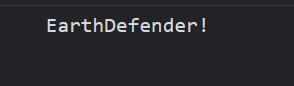
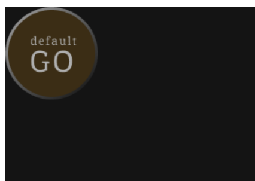
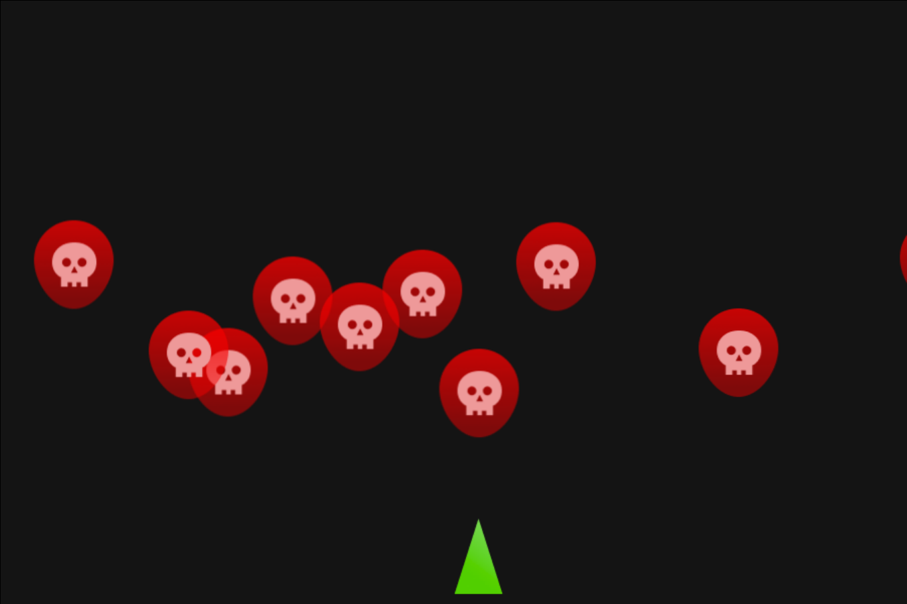

# La POO par l'exemple - EarthDefender

Pour apprendre la POO nous allons conçevoir un petit jeu vidéo nommée *EarthDefender*.


## Pré-requis
- Avoir fini le TP 1 sur HTML Canvas et *EarthDefender* sans POO

## Concept du jeu
Ce jeu est une version simplifié de *SpaceInvader* où un petit vaisseau spacial détruit des aliens pour proteger la Terre.

Les aliens se déplacent vers la terre et lui font perdre des points de vie lors de leurs collisions. 

Le joueur contrôle le vaisseau spacial, il se déplace latéralement. Il peut également tirer des missiles qui détruisent alors un alien lors de la collision.


Retrouvez toute les assets graphiques du projet via ce lien figma : https://www.figma.com/file/Th3KWNwiV7TtXDKNSMv6do/EarthDefender?type=design&node-id=0%3A1&mode=design&t=MUCNIKJfrDGeNUtj-1

## Use Case Diagramme
Voici le diagramme de cas d'utilisation de l'application.


## Technologies néccessaires

- NPM
- TypeScript
- HTML Canva

Cette application à besoin d'une haute intéractivité il nous faudra donc JavaScript, nous utiliserons également un Canva HTML pour afficher le jeu.

Nous utiliseront TypeScript plutôt que JavaScript pour sa syntaxe Orientée Objet. TypeScript néccessitera cependant de compiler le code en JavaScript.

TypeScript est un surcouche de JavaScript développé par Microsoft, il renforce JavaScript en lui rajoutant les types, c'est un langage moins permissif que JavaScript et il est obligatoire de le connaitre pour utiliser, à l'avenir, le framework Angular. Tout code TypeScript sera de toute façon au final tranformé en code JavaScript après la compilation.

> A l'origine TypeScript a été crée par Microsoft pour faciliter le développement des versions Web de la suite Office. Le premier programme développé en TypeScript est VSCode. Le développement de VSCode a permis à Microsoft de tester TypeScript en condition réel. Pour plus d'info je recommande ce documentaire sur les conditions de développement de TypeScript : https://www.youtube.com/watch?v=U6s2pdxebSo&t=2189s.

## Cahier des charges
|Tache|Description|Contraintes|
|-|-|-|
| Créer le canva du jeu | Le HTML Canva est un rectangle qui prend presque tout l'écran | Il possède un fond d'écran similaire à celui de la maquette |
|Afficher le joueur| Afficher le joueur sur le HTML Canva. | Le joueur se trouve à quelque pixels du bord inférieur du canva.|
| Mouvement du joueur| Le joueur peut se déplacer de gauche à droite avec les touches 'Q' ou 'D'.|
| Apparition d'un Alien |Faire apparaitre un alien | L'alien avance tout droit vers le bas du canva.|
|Afficher la Terre | La terre possède 3 PV | Afficher les pv restant de la terre |
| Perte de pv de la terre | La terre perd 1 pv si un alien la touche |
| Mort du joueur | Le joueur meurt si un alien le touche. | Le jeu recommence |
| Tir du joueur| Le joueur tir des missiles qui détruisent un alien au contact | Les missiles vont tout droit vers le haut de l'écran. La touche espace tir un missile. Le joueur peut tirer à une cadence maximum de 200ms |
| Vague d'aliens | Faire apparaitre de nombreux aliens qui arriveront petit à petit de façon aléotoire. |  Il n'y maximum que 10 aliens en jeu et le nombres d'alien tué est affiché en haut de l'écran. |
| Bonus SON Joueur | Emmettre un son au tir du joueur |
| Bonus SON musique | Faire tourner une musique en boucle en fond. |

## Mise en place du projet

### Logiciel pré-requis
Installation de TypeScript Compiler
```bash
npm install -g typescript
```
### Arborsecence

> Le sequelette du projet est disponible ici : https://github.com/CHAOUCHI/earth_defender
>```bash
>git clone https://github.com/CHAOUCHI/earth_defender
>```


- `build` contient le code JS compilé
- `src` contient notre code TypeScript (TS)
- `public` contient les assets : images, sons.
- `index.html` la page d'accueil du site.
- `tsconfig.json` configure le compilateur TS

### tsconfig.json
```json
{
    "compilerOptions": {
        "rootDir": "./src",
        "outDir": "./build",
        "module": "ESNext"
    }
}
```
### Compiler le TS
Dans un fichier */src/script.ts*
```ts
const gameName : string = "EarthDefender!";
console.log(gameName);
```
Dans un fichier */index.html*
```html
<!DOCTYPE html>
<html lang="fr">
<head>
    <meta charset="UTF-8">
    <meta name="viewport" content="width=device-width, initial-scale=1.0">
    <title>Earth Defender</title>
    <style>
        canvas{
            border : 1px solid black;
        }
    </style>
</head>
<body>
    <canvas>

    </canvas>
</body>
<script type="module" src="./build/script.js"></script>
</html>
```

Lancez le compilateur TypeScript en *watchmode* avec la commande :
```bash
tsc -w
```
> Il faut être à la racine du dossier au même niveau que le fichier *tsconfig.json*.

*Résultat dans la console du navigateur*


Si vous avez le message dans la console tout roule !

## Partie 1 - Initialisation du programme

### Chapitre 1 - Afficher le jeu
Créez un dossier nommé `Classes` dans `src`, il contiendra toutes nos classes.

Le point d'entrée de l'application est la classe Game.

#### Exercice 1 - Implémenter le constructeur de la classe Game

Dans le constructeur de la classe Game :
- Initialiser le canvas HTML pour qu'il possède un context 2D en tant qu'attribut privé de la classe
- Utilisez les attribut privées CANVAS_WIDTH et CANVAS_HEIGHT pour définir la taille du canvas.

> N'oubliez pas, on accède au attribut d'une classe avec `this.`.
> Exemple
> ```ts
> this.CANVAS_WIDTH
>```

*/src/Classes/Game.ts*
```ts
export class Game{

    private context : CanvasRenderingContext2D;
    public readonly CANVAS_WIDTH : number = 900;
    public readonly CANVAS_HEIGHT : number = 600;
    
    constructor(){
        // Init Game canvas
        // Codez ici ...


    }
}
```

##### Solution Exercie 1
https://github.com/CHAOUCHI/EarthDefender_Exercice1


J'importe ensuite la classe Game pour instancier une partie dans le fichier script.ts.

*src/script.ts*
```ts
import {Game} from "./Classes/Game.js";

const game = new Game();
```
> Pour éviter les soucis de type de fichier lors de l'import des scripts par le navigateur, précisez bien `Game.js` et non `Game.ts` dans l'import.
> Ce sera le nom final du script après compilation et c'est de ce nom dont le navigateur aura besoin.

La méthode `Game.start()` lancera le jeu c'est donc dans cette méthode que nous allons, pour l'instant, colorier le fond du jeu.

J'ajoute la méthode `Game.start()`.

#### Exercice 2 - Colorier le fond du canvas
Coloriez le fond du canvas dans la méthode `Game.start()`.

Utilisez le code hexa : `#141414` comme couleur.

*src/Classes/Game.ts*
```ts
export class Game{
    // Public attributs
    
    // Private attributs
    private context : CanvasRenderingContext2D;
    public readonly CANVAS_WIDTH : number = 900;
    public readonly CANVAS_HEIGHT : number = 600;
    
    constructor(){
        // Init Game canvas
        const canvas : HTMLCanvasElement = document.querySelector("canvas");
        canvas.height = this.CANVAS_HEIGHT;
        canvas.width = this.CANVAS_WIDTH;
        this.context = canvas.getContext("2d");
    }

    // Public methods

    public start() : void{
        //Codez ici ...

    }
}
```
##### Solution Exercice 2
https://github.com/CHAOUCHI/EarthDefender_Exercice2

Et je l'appel dans `script.ts` pour lancer le jeu.

*src/script.ts*
```ts
import {Game} from "./Classes/Game.js";

const game = new Game();
game.start();
```

*Résultat :  un canvas noir*


### Chapitre 2 - Créer et afficher un GameObject
Nous allons maintenant afficher notre premier GameObject à l'écran.

Nous allons avoir besoin d'image pour nos `GameObjects`.
Vous pouvez donc copier les assets graphiques qui se trouve dans le lien figma dans un dossier `/public/assets/images`.
Voici une image par défaut pour les GameObject

*DefaultGameObject.png*


> Si vous utilisez le sequelette de l'appli vous avez d'office tout les assets inclus.

Importez l'image dans le fichier index.html

*index.html*
```html
<!DOCTYPE html>
<html lang="fr">
<head>
    <meta charset="UTF-8">
    <meta name="viewport" content="width=device-width, initial-scale=1.0">
    <title>Earth Defender</title>
    <style>
        canvas{
            border : 1px solid black;
        }
    </style>
</head>
<body>
    
    <canvas>

    </canvas>
</body>
<script type="module" src="./build/script.js"></script>
</html>
```

#### Attendre le chargement des images

Le jeu doit se lancer une fois toutes les images chargées.
Il faut donc attendre le chargement de la page avec la fonction `window.onload` avant de démarrer le jeu.

*/src/script.ts*
```ts
import {Game} from "./Classes/Game.js";

window.onload = ()=>{
    const game = new Game();
    game.start();
}
```

#### Créer un GameObject

En POO tout doit être une classe. Chaque classe à sa propre résponsiabilité. Game s'occupe de l'affichage correcte du Jeu et de ses éléments. La classe GameObject quant a elle s'occupe d'un GameObject : sa position, son image, sa vie.

Dans un dossier */src/Classes/GameObjects* créez un fichier nommé *GameObject.ts*

*src/Classes/GameObjects/GameObject.ts*
```ts
export class GameObject{

    constructor(){
    }
}
```

#### La position d'un GameObject
La position d'un GameObject est défini par deux number x et y.
Créez donc un interface Position qui possède deux attributs x et y;

*/src/Classes/Position.ts*
```ts
export interface Position{
    x : number;
    y : number;
}
```

Ajoutez ensuite une position à notre GameObject.

*/src/Classes/GameObjects/GameObject.ts*
```ts
import { Position } from "../Position.js";

export class GameObject{
    
    private position : Position;
    
    constructor(){
        this.position = {
            x : 0,
            y : 0
        };
    }
}
```

En POO la chose la plus important est l'encapsulation. Les attributs d'une classe sont privés et pourront éventuellement être modifiés via des méthodes publiques *getter* et *setter*.

#### L'image d'un GameObject

> Assurez vous qu'une balise image avec pour id *asset_default* existe dans le index.html

Notre jeu contiendra de nombreux assets graphique. En POO chaque classe a sa propre responsabilité; il faut donc créer une classe `Assets` qui gère les assets graphiques.

*/src/Classes/Assets.ts*
```ts
export class Assets{
    public static getDefaultImage(){
        const image : HTMLImageElement = document.querySelector("img#asset_default");
        if(image == null){
            throw Error("No assets found");
        }
        return image;
    }
}
```
> Notez que nous provoquons une erreur si l'image n'est pas trouvée. La bonne pratique veux que l'on privilégie `throw` en cas d'erreur plutôt qu'une valeur de retour comme `null` ou `false`.

> Assets n'est qu'une facade pour récupérer des données à l'inverse de GameObject qui représente un élément du jeu. Je ne vais donc jamais directement instancier la classe Assets, ses méthodes sont donc *static*.
> Une méthode static est accéssible directement en tant qu'attribut de la classe. Pas besoin donc de l'instancier avec `new`.

Une fois la fonction *getter* ajoutée je peux m'en servir dans le constructeur de `GameObject`.

```ts
import { Assets } from "../Assets.js";
import { Position } from "../Position.js";

export class GameObject{
    
    private position : Position;
    private image : HTMLImageElement;
    
    constructor(){
        this.position = {
            x : 0,
            y : 0
        };
        this.image = Assets.getDefaultImage();
    }
}
```
#### Affichage du GameObject
Pour afficher le `GameObject` je veux ajouter une méthode `draw` à la classe `Game` qui utilise la méthode `context.drawImage()`.

J'ai besoin d'une image et de la position du GameObject pour dessiner un GameObject dans le canvas. Seulement ces données sont privées. Je vais donc créer des *getter* dans la classe GameObject.

```ts
import { Assets } from "../Assets.js";
import { Position } from "../Position.js";

export class GameObject{
    
    private position : Position;
    private image : HTMLImageElement;
    
    constructor(){
        this.position = {
            x : 0,
            y : 0
        };
        this.image = Assets.getDefaultImage();
    }

    // Getter d'image et de position
    public getImage() : HTMLImageElement{
        return this.image;
    }
    public getPosition() : Position{
        return this.position;
    }
}
```

J'ajoute ensuite la méthode `Game.draw` pour dessiner un GameObject.

Elle prend  en paramètre un GameObject et le dessine avec la méthode `context.drawImage()` :

##### Exercice 3 - Dessiner un GameObject
Completez la méthode Game.draw() en utilisant `this.context.drawImage()` pour dessiner le `GameObject` passé en paramètre de la méthode.

```ts
import { GameObject } from "./GameObjects/GameObject.js";

export class Game{
    // Public attributs
    
    // Private attributs
    private context : CanvasRenderingContext2D;
    public readonly CANVAS_WIDTH : number = 900;
    public readonly CANVAS_HEIGHT : number = 600;
    
    constructor(){
        // Init Game canvas
        const canvas : HTMLCanvasElement = document.querySelector("canvas");
        canvas.height = this.CANVAS_HEIGHT;
        canvas.width = this.CANVAS_WIDTH;
        this.context = canvas.getContext("2d");
    }

    // Public methods

    public start() : void{
        // Clear context
        this.context.clearRect(0,0,this.CANVAS_WIDTH,this.CANVAS_HEIGHT);
        this.context.fillStyle = "#141414";
        this.context.fillRect(0,0,this.CANVAS_WIDTH,this.CANVAS_HEIGHT);
    }

    //  La fonction draw qui affiche un gameObject
    private draw(gameObject : GameObject){
        // Codez ici
        // ...
    }
}
```
##### Solution Exercice 3
https://github.com/CHAOUCHI/EarthDefender_Exercice3

Il ne me reste plus qu'à utiliser cette méthode dans la méthode `Game.start()`.

```ts
public start() : void{
        // Clear context
        this.context.clearRect(0,0,this.CANVAS_WIDTH,this.CANVAS_HEIGHT);
        this.context.fillStyle = "#141414";
        this.context.fillRect(0,0,this.CANVAS_WIDTH,this.CANVAS_HEIGHT);

        // J'instancie un GameObject
        const gameObject = new GameObject();
        // Je le déssine
        this.draw(gameObject);
}
```

*Résultat un beau game object*


## Partie 2 - La boucle d'événement
La boucle d'événement est une fonction qui est appelée en boucle à un certain interval de temps.

Elle contiendra toute les actions qui doivent perdurer tout au long du jeu comme les déplacements, les inputs et les collisions.

Chaque tour de la boucle est une `frame` de jeu.

### Chapitre 3 - La boucle d'événement
Pour l'instant nous allons simplement afficher un `console.log()` en boucle toute les 10ms (soit 100fps).

Ajoutez la méthode privée `loop()` dans la classe Game.
```ts
private loop(){
    setInterval(()=>{
        console.log("Frame!");
    },10);
    // 1frame/10ms ---> 100frames/1000ms ---> 100frames/1s
}
```
Puis appelez la dans `Game.start()` :
```ts
import { GameObject } from "./GameObjects/GameObject.js";

export class Game{
    // Public attributs
    
    // Private attributs
    private context : CanvasRenderingContext2D;
    public readonly CANVAS_WIDTH : number = 900;
    public readonly CANVAS_HEIGHT : number = 600;
    
    constructor(){
        // Init Game canvas
        const canvas : HTMLCanvasElement = document.querySelector("canvas");
        canvas.height = this.CANVAS_HEIGHT;
        canvas.width = this.CANVAS_WIDTH;
        this.context = canvas.getContext("2d");
    }

    // Public methods
    public start() : void{
        // Clear context
        this.context.clearRect(0,0,this.CANVAS_WIDTH,this.CANVAS_HEIGHT);
        this.context.fillStyle = "#141414";
        this.context.fillRect(0,0,this.CANVAS_WIDTH,this.CANVAS_HEIGHT);

        const gameObject = new GameObject();
        this.draw(gameObject);
        
        
        // Start the game loop
        this.loop();
    
    
    }
    
    private draw(gameObject : GameObject){
        this.context.drawImage(
            gameObject.getImage(),
            gameObject.getPosition().x,
            gameObject.getPosition().y,
            gameObject.getImage().width,
            gameObject.getImage().height
        );
    }

    private loop(){
        setInterval(()=>{
            console.log("Frame!");
        },10); 
        // 1frame/10ms ---> 100frames/1000ms ---> 100frames/1s
    }
}
```

### Chapitre 4 - Afficher le joueur
Le joueur est un `GameObject`. Seulement à l'avenir nous aurons de nombreux autres `GameObject` comme des Aliens, des Laser, etc.

Il nous faut donc créer un classe `Player` qui est une spécialisation de la classe `GameObject`. Elle possèdera toutes les capacitées spécifique au `Player` sans pour autant définir celles des autres `GameObjects`.

#### L'asset image du Player
Ajoutez l'asset dans le `index.html` et ajoutez un *getter* dans la classe `Assets`.
```html
<!DOCTYPE html>
<html lang="fr">
<head>
    <meta charset="UTF-8">
    <meta name="viewport" content="width=device-width, initial-scale=1.0">
    <title>Earth Defender</title>
    <style>
        canvas{
            border : 1px solid black;
        }
    </style>
</head>
<body>
    
    
    <canvas>

    </canvas>
</body>
<script type="module" src="./build/script.js"></script>
</html>
```

##### Exercice 4 - la méthode getPlayerImage()
Ajoutez une autre méthode static à la classe `Assets` qui renvoie l'image `Player.png`.

*/src/Classes/Assets.ts*
```ts
export class Assets{
    public static getDefaultImage() : HTMLImageElement{
        const image : HTMLImageElement = document.querySelector("img#asset_default");
        if(image == null){
            throw Error("No assets found");
        }
        return image;
    }
    // Ajout du getter d'asset player
    public static getPlayerImage() : HTMLImageElement{
        // Codez ici ...


    }
}
```

##### Solution Exercice 4
https://github.com/CHAOUCHI/EarthDefender_Exercice4

#### Fournir le jeu au GameObject
Les `GameObjects` auront parfois besoin d'infos venant du jeu comme la taille du canvas par exemple.

Il faut donc modifier le constructeur de `GameObject` pour qu'il prennent en paramètre l'instance de `Game`.

*/src/Classes/GamesObjets/GameObject.ts*
```ts
private game : Game;
constructor(game : Game){
    this.position = {
        x : 0,
        y : 0
    };
    this.image = Assets.getDefaultImage();
    this.game = game;
}
```

Et je lui rajoute un *getter* public pour que les `GameObjects` puissent accéder au `Game`.

```ts
public getGame() : Game{
    return this.game;
}
```

Je rajoute également les *setters* de position et d'image pour que la classe fille `Player` définisse sa propre image et sa propre position.

> En effet un attribut privé est privé même de ses enfants.

Classe complète :
```ts
import { Assets } from "../Assets.js";
import { Game } from "../Game.js";
import { Position } from "../Position.js";

export class GameObject{
    
    private position : Position;
    private image : HTMLImageElement;
    private game : Game;
    constructor(game : Game){
        this.position = {
            x : 0,
            y : 0
        };
        this.image = Assets.getDefaultImage();
        this.game = game;
    }

    public getImage() : HTMLImageElement{
        return this.image;
    }
    public getPosition() : Position{
        return this.position;
    }
    public getGame() : Game{
        return this.game;
    }
    public setImage(image : HTMLImageElement){
        this.image = image;
    }
    public setPosition(position : Position){
        this.position = position;
    }
}
```

#### La classe Player hérite de GameObject
Pour créer la classe `Player` à partir de la classe `GameObject` nous allons la faire hériter de `GameObject` avec le mot clé `extends`;
```ts
import { GameObject } from "./GameObject.js";

export class Player extends GameObject{
}
```

Nous voulons que le `Player` puissent gérer indépendement son initialisation (image, position).

Pour ceci la classe `GameObject` va lui fournir une méthode auquel lui seul aura accès. Une méthode `protected`.

> Les méthodes `protected` sont des méthodes accéssibles uniquement de la classe mère et de ses enfants.

Dans la classe `GameObject` ajoutez une méthode `protected start()` :

*/src/Classes/GameObjects/GameObject.ts*
```ts
protected start(){ }
```
J'appel ensuite cette méthode dans le constructeur.
```ts
constructor(game : Game){
    this.position = {
        x : 0,
        y : 0
    };
    this.image = Assets.getDefaultImage();
    this.game = game;
    // J'appel start
    this.start();
}
```
Je laisse la méthode `start` vide car se sera à une classe fille comme `Player`, `Alien` ou `Laser` de la remplir avec n'importe quelle actions qu'elles voudra effectuer.

Dans le cas de Player, il veut définir sa propre image et sa position en bas au centre de l'écran.

Je remplis (j'implémente) donc la méthode `start` dans la Player.

##### Exercice 5 - Positioner le joueur
Grâce à la méthode GameObject.setPosition() et au constante CANVAS.WIDTH et CANVAS_HEIGHT positionez le joueur au centre bas du canvas à 10px du bord.

```ts
import { Assets } from "../Assets.js";
import { GameObject } from "./GameObject.js";

export class Player extends GameObject{
    protected start(): void {
        this.setImage(Assets.getPlayerImage());
        // Codez ici ....


    }
}
```

##### Solution Exercice 5
https://github.com/CHAOUCHI/EarthDefender_Exercice5

#### Dessiner le joueur 
De la même façon que j'ai dessiné un `GameObject` par défaut tout à l'heure je créer un `Player` dans la méthode `Game.start()`.

#### Exercice 6 - Dessiner le joueur
Complétez le code ci-dessous pour déssiner le joueur.

Le `player` est un attribut privée de la classe `Game`.

```ts
private player : Player;
public start() : void{
        this.context.clearRect(0,0,this.CANVAS_WIDTH,this.CANVAS_HEIGHT);
        this.context.fillStyle = "#141414";
        this.context.fillRect(0,0,this.CANVAS_WIDTH,this.CANVAS_HEIGHT);

        // J'instancie le Player avec new
        // codez ici..

        // Je le dessine avec this.draw
        // codez ici..

    }
```
#### Solution Exercice 6
https://github.com/CHAOUCHI/EarthDefender_Exercice6

### Chapitre 5 - Déplacer le joueur
Pour déplacer le joueur je dois :
- Modifier la position du joueur à chaque *frame* dans la boucle d'événement.
- Redessiner le joueur à chaque *frame* de la boucle d'évenement

#### Effectuer une action à chaque frame
Nous voulons donner au `Player` la liberté de mettre à jour sa position à chaque *frame* du jeu.

Pour ceci nous allons, comme pour `GameObject.start()`, créer une méthode `protected` nommée `GameObject.update()` qui sera appelée à chaque frame dans le `setInterval()`.

*Dans GameObject.ts*
```ts
protected update(){}
```

Il faut appeler cette méthode dans le `setInterval` de la méthode `Game.loop()`. 
La méthode `GameObject.update()` étant `protected` il nous faut ajouter un méthode publique pour y accéder depuis `Game`.
```ts
protected update(){}
public callUpdate(){
    this.update();
}
```

Nous pouvons ensuite appeler la méthode `callUpdate` à chaque frame.

```ts
    private loop(){
        setInterval(()=>{
            console.log("Frame!");
            
            this.player.callUpdate();

        },10); // 1frame/10ms ---> 100frames/1000ms ---> 100frames/1s
    }
```

La méthode `GameObject.update` permet maintenant à n'importe quel `GameObject` d'effectuer des actions à chaque frame.

C'est une partie centrale de notre jeu.

#### Exercice 7 - Déplacer le joueur

Déplaçez le joueur de *10px* par *frame* dans la méthode `GameObject.update()`.

```ts
import { Assets } from "../Assets.js";
import { GameObject } from "./GameObject.js";

export class Player extends GameObject{
    private speed : number = 10;

    protected start(): void {
        this.setImage(Assets.getPlayerImage());
        this.setPosition({
            x : this.getGame().CANVAS_WIDTH/2,
            y : this.getGame().CANVAS_HEIGHT - this.getImage().height - 10
        });
    }
    protected update(): void {
        // Codez ici ...


    }
}
```

#### Solution Exercice 7
https://github.com/CHAOUCHI/EarthDefender_Exercice7

La position du joueur est maintenant mise à jour à chaque *frame*.

*Mais le joueur n'est pas redessiné à chaque frame*.

Il faut donc le faire :

*/src/Classes/Games.ts*
```ts
private loop(){
    setInterval(()=>{
        console.log("Frame!");
        // J'efface la frame précedente.
        this.context.clearRect(0,0,this.CANVAS_WIDTH,this.CANVAS_HEIGHT);
        this.context.fillStyle = "#141414";
        this.context.fillRect(0,0,this.CANVAS_WIDTH,this.CANVAS_HEIGHT);
        
        //  Je redessine le joueur à chaque frame
        this.draw(this.player);

        // Je met à jour le joueur
        this.player.callUpdate();

    },10); // 1frame/10ms ---> 100frames/1000ms ---> 100frames/1s
}
```
Le joueur devrait à présent se déplacer tout seul vers la droite de l'écran.

### Chapitre 6 - Lire les inputs du clavier
#### Exercice 8 - Lire les inputs du clavier
Au même titre que la classe `Assets` s'occupe des images la classe `Input` s'occupe des entrées du clavier.

Dans la méthode `Input.listen()` réagisez au événements `keydown` et `keyup` pour définir la valeur de axisX.

- Si le joueur n'appuie sur aucune touche **axisX est égal à 0**
- Si le joueur appuie sur `d` ou `D` **axisX est égal à 1**
- Si le joueur appuie sur `q` ou `Q` **axisX est égal à -1**

*/src/Classes/Input.ts*
```ts
export class Input{
    private static axisX : Direction = 0;
    public static getAxisX(){
        return this.axisX;
    }
    public static listen(){
        // Codez ici ...


    }
}

type Direction = 0 | 1 | -1;
```

#### Solution Exercice 8
https://github.com/CHAOUCHI/EarthDefender_Exercice8

Il faut maintenant écouter les *inputs*.

J'appel la méthode `Input.listen()` dans la méthode `Game.start()` pour écouter les input clavier du joueur.
```ts
 // Public methods
    public start() : void{
        // Clear context
        this.context.clearRect(0,0,this.CANVAS_WIDTH,this.CANVAS_HEIGHT);
        this.context.fillStyle = "#141414";
        this.context.fillRect(0,0,this.CANVAS_WIDTH,this.CANVAS_HEIGHT);

        this.player = new Player(this);
        this.draw(this.player);

        // Listen to input
        Input.listen();
        // Start game loop
        this.loop();
    }
```

#### Exercice 9 - Utilisez l'axisX pour déplacer le Player

La méthode `Input.getAxisX()` permet de savoir si le joueur va à gauche ou à droite via une `Direction` (0, 1 ou -1).

- 0 signifie immobile
- -1, la gauche
- 1, la droite

Je peux multiplier cette direction par la vitesse de déplacement du joueur pour le faire bouger à droite ou à gauche.
> Un canvas HTML possède deux axes X et Y avec pour origine 0,0 en haut à gauche.


***Déplacez le joueur en fonction des *inputs* du clavier grâce à la méthode `Input.getAxis()`.***

*/src/Classes/GameObjects/Player.ts*
```ts
import { Assets } from "../Assets.js";
import { Input } from "../Input.js";
import { GameObject } from "./GameObject.js";

export class Player extends GameObject{
    private speed : number = 10;

    protected start(): void {
        this.setImage(Assets.getPlayerImage());
        this.setPosition({
            x : this.getGame().CANVAS_WIDTH/2,
            y : this.getGame().CANVAS_HEIGHT - this.getImage().height - 10
        });
    }
    protected update(): void {
        // Codez ici ...


    }
}
```

#### Solution Exercice 9
https://github.com/CHAOUCHI/EarthDefender_Exercice9

Le joueur devrait maintenant être capable de bouger de gauche à droite en fonction des *inputs* du clavier.

## Partie 3 - Une infinité de GameObjects !
Nous avons presque fini de mettre en place les bases de notre jeu.

### Chapitre 7 - Ajouter les aliens
Nous avons une joueur qui se déplace, il nous manque maintenant une horde d'Alien qui fonce sur lui.

Pour faire apparaitre ces aliens il va falloir :
- Coder un alien via la classe `Alien`. Elle hérite de `GameObject`.
- Faire apparaitre un `Alien` qui fonce vers le bas du canvas.
- Définir le nombre d'alien via un attribut privée de la classe `Game`.
- Créer un tableau de `GameObject` et ajouter le joueur et les aliens dedans
- Parcourir le tableau de `GameObject` à chaque frame : mettre à jour et redessiner tout les `GameObject` (player et aliens compris) : utilisez `Game.draw() et GameObject.callupdate()`

#### Coder un Alien
Pour commencez il faut coder un Alien qui descend vers le bas du canvas à chaque frame.

> N'oubliez pas d'ajouter l'asset `Alien.png` dans `index.html` et donc un nouveau getter dans la classe `Assets`.

##### Exercice 10 - Position aléatoire et mouvement de l'Alien

```ts
import { Assets } from "../Assets.js"
import { GameObject } from "./GameObject.js"

export class Alien extends GameObject{
    private speed : number = 1;

    protected start(): void {
        // Définissez l'image de l'alien
        // Codez ici ...


        // Faite le apparaitre à une position aléatoire dans le canvas
        // Codez ici ...


    }

    protected update(): void {
        // Faite avancer l'alien vers le bas du Canvas
        // Codez ici ...   
        
        
    }
}
```

##### Solution Exercice 10
https://github.com/CHAOUCHI/EarthDefender_Exercice10

#### Faire apparaitre un alien dans le jeu
Pour faire appariatre un `GameObject` dans le jeu il faut
- L'instancier dans `Game.start()` en créant un nouvelle attribut privé.
- Le dessiner dans `Game.loop()` avec `Game.draw()` pour qu'il reste affiché à l'écran.
- Le mettre à jour dans `Game.loop()` avec `GameObject.callUpdate()` pour le faire se déplacer.

Ajoutez un attirbut privé dans la classe Game pour l'alien.
```ts
private alien : Alien;
```
Instanciez et dessinez l'Alien dans `Game.start()`
```ts
    // Public methods
    public start() : void{
        // Clear context
        this.context.clearRect(0,0,this.CANVAS_WIDTH,this.CANVAS_HEIGHT);
        this.context.fillStyle = "#141414";
        this.context.fillRect(0,0,this.CANVAS_WIDTH,this.CANVAS_HEIGHT);

        this.player = new Player(this);
        this.draw(this.player);

        // Instanciation de l'alien
        this.alien = new Alien(this);
        this.draw(this.alien);

        // Listen to input
        Input.listen();
        // Start game loop
        this.loop();
    }
```

Mettez à jour l'alien en appelant sa méthode `callUpdate()` dans `Game.loop()` et redessinez le avec la méthode `Game.draw()`.

```ts
    private loop(){
        setInterval(()=>{
            console.log("Frame!");
            // Clear context
            this.context.clearRect(0,0,this.CANVAS_WIDTH,this.CANVAS_HEIGHT);
            this.context.fillStyle = "#141414";
            this.context.fillRect(0,0,this.CANVAS_WIDTH,this.CANVAS_HEIGHT);

            this.player.callUpdate();
            this.draw(this.player);
            
            this.alien.callUpdate();
            this.draw(this.alien);

        },10); 
    }
```

La classe `Game` finale :
```ts
import { Alien } from "./GameObjects/Alien.js";
import { GameObject } from "./GameObjects/GameObject.js";
import { Player } from "./GameObjects/Player.js";
import { Input } from "./Input.js";

export class Game{
    // Public attributs
    public readonly CANVAS_WIDTH : number = 900;
    public readonly CANVAS_HEIGHT : number = 600;
    
    // Private attributs
    private context : CanvasRenderingContext2D;
    private player : Player;
    private alien : Alien;
    
    constructor(){
        // Init Game canvas
        const canvas : HTMLCanvasElement = document.querySelector("canvas");
        canvas.height = this.CANVAS_HEIGHT;
        canvas.width = this.CANVAS_WIDTH;
        this.context = canvas.getContext("2d");
    }

    public start() : void{
        // Clear context
        this.context.clearRect(0,0,this.CANVAS_WIDTH,this.CANVAS_HEIGHT);
        this.context.fillStyle = "#141414";
        this.context.fillRect(0,0,this.CANVAS_WIDTH,this.CANVAS_HEIGHT);

        this.player = new Player(this);
        this.draw(this.player);

        this.alien = new Alien(this);
        this.draw(this.alien);

        // Listen to input
        Input.listen();
        // Start game loop
        this.loop();
    }
    
    private draw(gameObject : GameObject){
        this.context.drawImage(
            gameObject.getImage(),
            gameObject.getPosition().x,
            gameObject.getPosition().y,
            gameObject.getImage().width,
            gameObject.getImage().height
        );
    }

    private loop(){
        setInterval(()=>{
            console.log("Frame!");
            // Clear context
            this.context.clearRect(0,0,this.CANVAS_WIDTH,this.CANVAS_HEIGHT);
            this.context.fillStyle = "#141414";
            this.context.fillRect(0,0,this.CANVAS_WIDTH,this.CANVAS_HEIGHT);

            this.player.callUpdate();
            this.draw(this.player);
            
            this.alien.callUpdate();
            this.draw(this.alien);

        },10); 
    }
}
```

#### Faire apparaitre plusieurs Aliens
Nous commençons à être à l'aise avec la création de `GameObject`.

Il est temps d'en faire apparaitre plusieurs.

Au lieu de créer un attribut privé pour chaque `GameObject` nous allons créer un tableau de `GameObject` dans la classe `Game`.

```ts
export class Game{
    // Public attributs
    
    // Private attributs
    private context : CanvasRenderingContext2D;
    public readonly CANVAS_WIDTH : number = 900;
    public readonly CANVAS_HEIGHT : number = 600;

    private player : Player;
    // Ajoutez un tableau vide de GameObject
    private gameObjects : GameObject[] = [];

    // ...
}
```

Pour rajouter un `GameObject` dans le tableau des `GameObjects` il suffit de faire un `gameObjects.push()`.

Nous allons créer une méthode pour ça. La méthode `Game.instanciate()`

Dans la classe `Game` ajoutez :
```ts
public instanciate(gameObject : GameObject) : void{
    this.gameObjects.push(gameObject);
}
```

Pour redessiner tout les `GameObjects` à chaque *frame* il faut parcourir le tableau dans la boucle d'événement.

Il faut également appeler la méthode `GameObject.callUpdate()` pour mettre à jour les `GameObjects`.


##### Exercice 11 - Parcourir les `GameObjects`
```ts
private loop(){
        setInterval(()=>{
            console.log("Frame!");
            // Clear context
            this.context.clearRect(0,0,this.CANVAS_WIDTH,this.CANVAS_HEIGHT);
            this.context.fillStyle = "#141414";
            this.context.fillRect(0,0,this.CANVAS_WIDTH,this.CANVAS_HEIGHT);
            
            // Pour chaque gameObjects
            // Mettez les à jour et redessiné les
            // Codez ici ..

        },10); 
    }
```

##### Solution Exercice 11
https://github.com/CHAOUCHI/EarthDefender_Exercice11

Tout les `GameObject` doivent être contenu dans le tableau de `GameObjects` pour être détectés par la boucle d'événement, il nous faut donc mettre à jour le code de la fonction `Game.start()` pour rajouter notre `player` dans ce tableau.

```ts
    // Public methods
    public start() : void{
        // Clear context
        this.context.clearRect(0,0,this.CANVAS_WIDTH,this.CANVAS_HEIGHT);
        this.context.fillStyle = "#141414";
        this.context.fillRect(0,0,this.CANVAS_WIDTH,this.CANVAS_HEIGHT);

        this.player = new Player(this);
        // J'aoute le player au tableau de GameObject
        this.instanciate(this.player);

        // Listen to input
        Input.listen();
        // Start game loop
        this.loop();
    }
```


Je défini le nombre d'aliens en tant qu'attribut privé de Game.
```ts
private nbAliens : number = 10;
```
Enfin nous pouvons instancier plusieurs `Aliens` via une boucle *for*.

##### Exercice 12 - Instancier les 10 aliens 
Instacier 10 aliens dans le tableaux de gameObjects à l'aide de la méthode `Game.instantiate()`.
```ts
public start() : void{
    // Clear context
    this.context.clearRect(0,0,this.CANVAS_WIDTH,this.CANVAS_HEIGHT);
    this.context.fillStyle = "#141414";
    this.context.fillRect(0,0,this.CANVAS_WIDTH,this.CANVAS_HEIGHT);

    this.player = new Player(this);
    this.instanciate(this.player)

    // Instancier 10 aliens 
    // Codez ici ...

    // Listen to input
    Input.listen();
    // Start game loop
    this.loop();
}
```
#####  Solution Exercice 12
https://github.com/CHAOUCHI/EarthDefender_Exercice12

*Résultat une vague aléatoire d'aliens*



*Classe `Game` finale :*
```ts
import { Alien } from "./GameObjects/Alien.js";
import { GameObject } from "./GameObjects/GameObject.js";
import { Player } from "./GameObjects/Player.js";
import { Input } from "./Input.js";

export class Game{
    // Public attributs
    public readonly CANVAS_WIDTH : number = 900;
    public readonly CANVAS_HEIGHT : number = 600;
    
    // Private attributs
    private context : CanvasRenderingContext2D;
    private nbAliens : number = 10;
    private player : Player;
    private gameObjects : GameObject[] = [];
    
    constructor(){
        // Init Game canvas
        const canvas : HTMLCanvasElement = document.querySelector("canvas");
        canvas.height = this.CANVAS_HEIGHT;
        canvas.width = this.CANVAS_WIDTH;
        this.context = canvas.getContext("2d");
    }

    public start() : void{
        // Clear context
        this.context.clearRect(0,0,this.CANVAS_WIDTH,this.CANVAS_HEIGHT);
        this.context.fillStyle = "#141414";
        this.context.fillRect(0,0,this.CANVAS_WIDTH,this.CANVAS_HEIGHT);
    
        this.player = new Player(this);
        this.instanciate(this.player)
    
        for (let i = 0; i < this.nbAliens; i++) {
            this.instanciate(new Alien(this));
        }
    
        // Listen to input
        Input.listen();
        // Start game loop
        this.loop();
    }
    public instanciate(gameObject : GameObject) : void{
        this.gameObjects.push(gameObject);
    }   
    
    private draw(gameObject : GameObject){
        this.context.drawImage(
            gameObject.getImage(),
            gameObject.getPosition().x,
            gameObject.getPosition().y,
            gameObject.getImage().width,
            gameObject.getImage().height
        );
    }

    private loop(){
        setInterval(()=>{
            console.log("Frame!");
            // Clear context
            this.context.clearRect(0,0,this.CANVAS_WIDTH,this.CANVAS_HEIGHT);
            this.context.fillStyle = "#141414";
            this.context.fillRect(0,0,this.CANVAS_WIDTH,this.CANVAS_HEIGHT);
            
            this.gameObjects.forEach(go=>{
                go.callUpdate();
                this.draw(go);
            });

        },10); 
    }
}
```

### Chapitre 8 - Ajouter les étoiles
Il faut maintenant ajoutez des étoiles dans le fond pour la déco.

Pour ce faire suivez la même procédure que pour faire apparaitre plusieurs `Aliens`.

1 - Faire apparaitre des étoiles statiques en fond de façon aléatoire.
2 - Faire descendre les étoiles vers le bas et repositionées les en haut du canvas quand elle dépasses de l'écran. Ainsi nous auront l'impression qu'elles défiles sous le joueur.

##### Exercice 13 - Instancier des étoiles
Pour cette exercice vous devez êtres plus autonome. Il vous faudra créer la classe `Star` par vous-même de A à Z.

***Créez une classe `Star` qui hérite de `GameObject` et instanciez 100 étoiles dans le jeu.***

- Un `Star` à une position aléatoire dans le canvas
- Une `Star` défile lentement vers le bas du canvas
- Quand une `Star` dépasse le bord inférieur du canvas elle reviens en haut du canvas (position Y).
- La classe `Star` se trouve dans le fichier : */src/Classes/GameObjects/Star.ts*

*Prenez bien le temps de faire cet exercice il est plus dur et très important pour votre apprentissage de la POO.*

<pre>


</pre>
##### Solution Exercice 13
https://github.com/CHAOUCHI/EarthDefender_Exercice13

*/src/Game.ts*
```ts
import { Alien } from "./GameObjects/Alien.js";
import { GameObject } from "./GameObjects/GameObject.js";
import { Player } from "./GameObjects/Player.js";
import { Star } from "./GameObjects/Star.js";
import { Input } from "./Input.js";

export class Game{
    // Public attributs
    public readonly CANVAS_WIDTH : number = 900;
    public readonly CANVAS_HEIGHT : number = 600;
    
    // Private attributs
    private context : CanvasRenderingContext2D;
    private nbAliens : number = 10;


    private player : Player;
    private gameObjects : GameObject[] = [];
    
    constructor(){
        // Init Game canvas
        const canvas : HTMLCanvasElement = document.querySelector("canvas");
        canvas.height = this.CANVAS_HEIGHT;
        canvas.width = this.CANVAS_WIDTH;
        this.context = canvas.getContext("2d");
    }

    public start() : void{
        // Clear context
        this.context.clearRect(0,0,this.CANVAS_WIDTH,this.CANVAS_HEIGHT);
        this.context.fillStyle = "#141414";
        this.context.fillRect(0,0,this.CANVAS_WIDTH,this.CANVAS_HEIGHT);
    
        this.player = new Player(this);
        this.instanciate(this.player)
    
        for (let i = 0; i < this.nbAliens; i++) {
            this.instanciate(new Alien(this));
        }


        /**
         * Instanciation des Stars
         */
        for (let i = 0; i < 100; i++) {
            this.instanciate(new Star(this));
        }


        
        // Listen to input
        Input.listen();
        // Start game loop
        this.loop();
    }
    public instanciate(gameObject : GameObject) : void{
        this.gameObjects.push(gameObject);
    }   
    
    private draw(gameObject : GameObject){
        this.context.drawImage(
            gameObject.getImage(),
            gameObject.getPosition().x,
            gameObject.getPosition().y,
            gameObject.getImage().width,
            gameObject.getImage().height
        );
    }

    private loop(){
        setInterval(()=>{
            console.log("Frame!");
            // Clear context
            this.context.clearRect(0,0,this.CANVAS_WIDTH,this.CANVAS_HEIGHT);
            this.context.fillStyle = "#141414";
            this.context.fillRect(0,0,this.CANVAS_WIDTH,this.CANVAS_HEIGHT);
            
            this.gameObjects.forEach(go=>{
                go.callUpdate();
                this.draw(go);
            });

        },10); 
    }
}
```

## Partie 4 - Aïe, ça fait mal. Les collisions.

### Chapitre 9 - Détecter les collisions entre GameObject
Pour détecter la collision il faut savoir si un `GameObject` est en contact avec un autre.

Dans la boucle d'événement, j'ai actuellement une boucle *for* qui dessine tout les `GameObjects`.

```ts
private loop(){
        setInterval(()=>{
            // Clear context
            this.context.clearRect(0,0,this.CANVAS_WIDTH,this.CANVAS_HEIGHT);
            this.context.fillStyle = "#141414";
            this.context.fillRect(0,0,this.CANVAS_WIDTH,this.CANVAS_HEIGHT);
            
            this.gameObjects.forEach(go=>{
                go.callUpdate();
                this.draw(go);
            })
        },10); 
    }
```

Pour commencer on peut vérifier si un alien touche un joueur.
```ts
private loop(){
    setInterval(()=>{
        // Clear context
        this.context.clearRect(0,0,this.CANVAS_WIDTH,this.CANVAS_HEIGHT);
        this.context.fillStyle = "#141414";
        this.context.fillRect(0,0,this.CANVAS_WIDTH,this.CANVAS_HEIGHT);
        
        this.gameObjects.forEach(go=>{
            go.callUpdate();
            this.draw(go);
            // Je dois donc crée une méthode overlap ...
            if(go instanceof Alien  && this.player.overlap(go)){ 
                console.log("Alien touch player");
            }
        })

    },10); 
}
```

Il me faut donc une méthode publique de la classe `GameObject` qui renvoi `true` si le `GameObject` passé en paramètre touche le `GameObject` appelant.

#### Exercice 14

Implémentez la méthode `GameObject.overlap()` qui permet de vérifier si un `GameObject` en touche un autre.

```ts
import { Assets } from "../Assets.js";
import { Game } from "../Game.js";
import { Position } from "../Position.js";

export class GameObject{
    
    private position : Position;
    private image : HTMLImageElement;
    private game : Game;
    constructor(game : Game){
        this.position = {
            x : 0,
            y : 0
        };
        this.image = Assets.getDefaultImage();
        this.game = game;
        this.start();
    }
    protected start(){}
    protected update(){}
    public callUpdate(){
        this.update();
    }

    /**
     * Check is the other GameObject collide this GameObject
     */
    public overlap(other : GameObject) : boolean{
        // Codez ici ...
    }


    public getImage() : HTMLImageElement{
        return this.image;
    }
    public getPosition() : Position{
        return this.position;
    }
    public getGame() : Game{
        return this.game;
    }
    public setImage(image : HTMLImageElement){
        this.image = image;
    }
    public setPosition(position : Position){
        this.position = position;
    }
}
```

#### Solution Exercice 14
Ceci est la solution, dans un répo GITHUB privé. Quand vous avez trouvé appelez moi et je vous passerai contributeur pour pouvoir la voir. 😈
https://github.com/CHAOUCHI/EarthDefender_Exercice-14

### Chapitre 10 - Faire réagir un GameObject à la collision avec un autre GameObject
Dans le code précedent nous avons réagit à la collision entre un player et n'importe quel Alien.
Le seul soucis c'est que le code est inscrit un dur dans la boucé d'évenement. Cela signifie que si a l'avenir je veux rajouter la collision entre un Alien et la terre ou entre une Laser et un Alien je vais devoir emcombrer ma fonction Game.loop de code spécifique à chaque classe de GameObject.

La façon de réagir à une collision est la résponsabilité de la classe GameObject pas de la classe Game.

```ts
private loop(){
        setInterval(()=>{
            // Clear context
            this.context.clearRect(0,0,this.CANVAS_WIDTH,this.CANVAS_HEIGHT);
            this.context.fillStyle = "#141414";
            this.context.fillRect(0,0,this.CANVAS_WIDTH,this.CANVAS_HEIGHT);
            
            this.gameObjects.forEach(go=>{
                go.callUpdate();
                this.draw(go);
                
                this.gameObjects.forEach(other=>{
                    // Si le gameObject overlap un gameObject qui n'est pas lui même
                    if(other != go  && go.overlap(other)){
                        console.log("Deux GameObject différent se touches");
                        go.callCollide(other); // J'appel la méthode collide de mon GameObject
                    }
                })
            })
        },10); 
}
```

#### Exercice 15
1. Mettez en place une méthode `protected` `GameObject.collide` dans la classe `GameObject` puis implémentez la dans la classe `Alien` pour écrire "Miam Miam" dans la console quand il touche le joueur.

2. Affichez un message *GameOver!* via un `alert()` quand l'alien mange le joueur.

3. Implémentez une méthode public `Game.over()` qui effectue le gameover (alert puis rechargement de la page) et utilisez cette méthode lorsque l'alien mange le player à la place du `alert()` écrit en dur dans `Player.collide()`.

#### Solution Exercice 15
https://github.com/CHAOUCHI/EarthDefender_Exercice15

### Chapitre 11 - Tirer un `Laser`.

Pour tirer un laser nous allons avoir besoin de la position de joueur dans une futur classe Laser.

Ajoutez donc un getter de Player dans Game.

*class Game*
```ts
public getPlayer() : Player{
        return this.player;
}
```

Nous avons également besoin d'une méthode qui detruit un `gameObject`, c'est à dire qui le retire du tableau.

#### Exercice 16 - Detruire un gameObject

Supprimez gameObject du tableau de gameObjects à l'appel de `Game.destroy()`
*class Game*
```ts
public destroy(gameObject : GameObject) : void{
    // Codez ici ...
    // Supprimer gameObject du tableau de gameObjects

}
```

#### Solution Exercice 16
https://github.com/CHAOUCHI/EarthDefender_Exercice-16

#### Exercice 17 - Tirez !
Créez un laser :
- Il apparait devant le player
- Il parcours l'écran de bas en haut tout droit
- Il détruit un Alien quand il le touche
- Il est détruit quand il sort du canvas
- Il apparait quand le joueur appuie sur la touche espace.
- pour finir faite en sorte que le joueur ne puissent pas tirer une infinité de laser quand il maintient espace.

#### Solution Exercice 17
https://github.com/CHAOUCHI/EarthDefender-Exercice17

### Chapitre 12 - Améliorer le Gameplay
