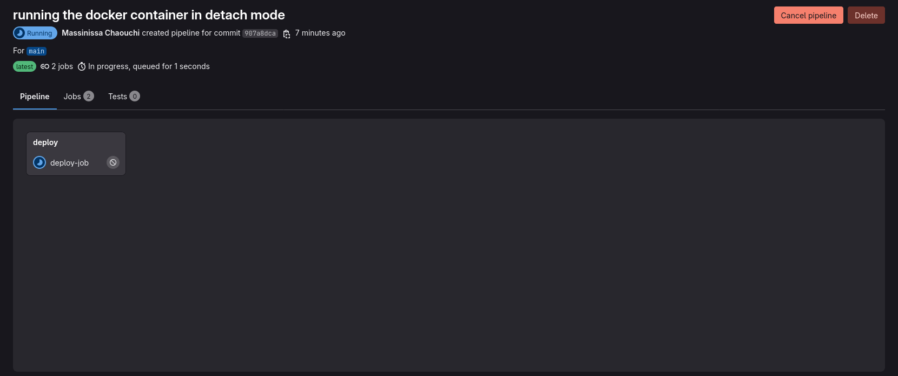
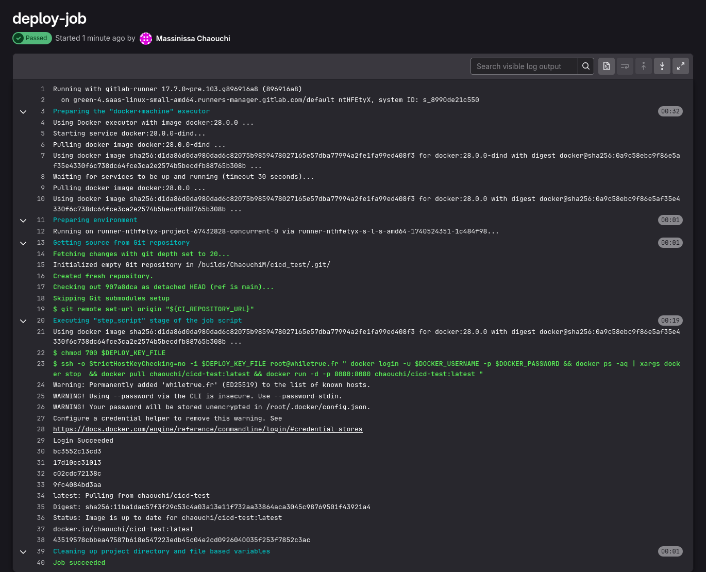

# Hello World GitLab Pipeline CI/CD

La pipeline GitLab permet d’automatiquement le transférer tous les fichiers de votre repo dans un conteneur Docker, il construit ensuite pour nous de petites VM contenant ce conteneur. 

Ces petits containers sont appelés **JOB**.

Dans ces jobs vous écrivez des commandes linux qui vérifies si tout va bien après un git push.

- Est-ce que le code compile ? `gcc main.c`
- Est-ce que l'application arrive a se lancer ? `./a.out` ou `node app.js`
- Est-ce qu’un client peut s’y connecter ? `curl`

Toutes ces questions, les développeurs se les posent à chaque git push. C’est donc le rôle de la pipeline d’aider le développeur à automatiser ces tâches en fabriquant des jobs pour chaque questions.

> Attention cependant ces VM ont des config matérielles très faible et ne conviennent donc pas pour la production. Il vous faudra tout de même payer un serveur pour faire tourner le conteneur final et rendre disponible notre application aux clients. 

> Une VM ubuntu pour une application web simple peut couter, par exemple, un peu plus de dix euros par mois sur Hostinger ou OVH et il suffit d'un simple acces ssh pour effectue un docker pull puis docker run a distance dans un job.

## Créer un projet gitlab

1. Créer une nouveau projet vide nommé web-cicd
2. Cloner le projet
```
git clone <url>
```

## L'application 

Dans le fichier **app.js**, ecrivez le code suivant.

```js
console.log("Hello je suis nodejs et j'ai bien démarré ! :)");

const http  = require("http");

http.createServer((req,res)=>{
    
    res.write("Hi client !\n");
    
    res.end();
}).listen(8080);
```

## Créer la pipeline - .gitlab-ci.yml

1. Créer un fichier nommé excatement **.gitlab-ci.yml**

2. Ecrire un job qui affiche bonjour dans le fichier.

*.gilab-ci.yml*
```
hello-job:
  image : alpine:latest
  script:
    - echo "Bonjour"
```

## Lancer la pipeline - git push
Faite un git Puch pour mettre en ligne le fichier gitlab-ci.yml.

La présence d'un nouveau commit sur la branche main va donc lancer la pipeline GitLab.

Notre Pipeline ne contient qu'un seul job qui run une image alpine et affiche ensuite bonjour avec la commande linux echo.

1. Faite un git push, pour provoquer le job : `hello-job`. 
2. Allez sur la page d'accueil de votre répo et observé l'avancé de la pipeline en cliquant sur l'icone de chargement bleu.

> Les captures d'écran suivante ne sont pas représentatif du job écrit plus haut

**Au départ l'icone de chargement de la pipeline est bleu**


**Si tout se passe bien l'icone passe au vert**


**Ici vous pouvez voir l'évolution de votre job**


**Et si vous cliquez dessus le détail des actions faites par la VM du job et les erreurs en cas de problèmes**


## *Si tout se passe bien il y a écrit Job succeeded*

Si un problème surviens lisez bien l'erreur affichée.


## Modifier le job pour tester le lancement du serveur

*.gilab-ci.yml*
```
start-job:
  image : node:latest
  script:
    - node app.js
```