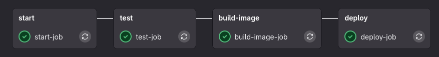

# Découper les jobs en pluiseurs étapes (stages)

## Pré-requis
- Le répo et la pipeline hello world fonctionnel avec un seul job 

## Les stages
Actuellement notre pipeline ne fait rien d'utile et ne vérifie aucune question/besoin que le dev se posent lors de la mise en prod ?

1. Est ce que le serveur se lance ?
2. Si il se lance est ce qu'il peut recvoir une requete sans soucis ?
3. Build et push ma docker image pour rendre mon application accéssible


### Résultat attendu
Au final j'aurais une pipeline CI/CD fait de plusieurs étapes (stages).



Au terme des deux prochain TP vous saurez mettre en place une pipeline CI/CD pour que un simple `git push` mette à jour votre application.

> Voici le projet final avec une Pipeline CI/CD fonctionnel y compris le d: https://gitlab.com/ChaouchiM/cicd_test/

> Le stage deploy neccessite un server Linux accéssibl en SSH et sera décrit dans le TP suivant (Deployement)

## - Stage 1 - start le serveur
Par défaut un job est dans un stage nommé `test`.

Donné lui un nom en le définissant dans un stage.

```bash
stages:
  - start

start-job:
  stage : start
  image : node
  script:
    - echo "Start the server !"
    - node app.js &
```

> `&` permet de lancer le programme en tache de fond pour ne pas bloquer le job à l'infini. 


## - Stage 2 - tester le serveur 
Pour tester le fonctionnement du serveur j'utilise le programme Linux curl qui fait une requete HTTP et j'attend 2 secondes le temps que le serveur se lance bien avant de faire la requete.

Je crée donc un deuxième stage. J'ai donc **deux carrés(stages) qui apparaissent dans ma pipeline**

```
stages:
  - start
  - test

start-job:
  stage : start
  image : node
  script:
    - echo "Start the server !"
    - node app.js &    

test-job:
  stage : test
  image : node
  script:
    - node app.js &
    - sleep 2
    - echo "Start testing the http server..."
    - curl http://localhost:8080/
```
## - Stage 3 - build l'image docker du server

Faite un Dockerfile qui 
  1. expose le port 8080
  2. Lance le programme app.js avec node en ENTRYPOINT
### Build
Jusqu'à maintenant, tous nos tests se faisaient dans un conteneur nodeJS à partir de l'image `node`. Seulement, il faut maintenant *build* notre Dockerfile. Il nous faut donc la commande `docker`. 

L'image utilisée pour le 3eme job est donc une image de docker version *28.0.0*. Ainsi Nous avons accès à la commande `docker build`. Pour Build notre Dockerfile.

> Attention utilisé bien une version fixe de docker et pas latest. La documentation ne garanti de fonctionnement stable sur le tag latest.

```
stages:
  - start
  - test
  - build-image

start-job:
  stage : start
  image : node
  script:
    - echo "Start the server !"
    - node app.js &    

test-job:
  stage : test
  image : node
  script:
    - node app.js &
    - sleep 2
    - echo "Start testing the http server..."
    - curl http://localhost:8080/

build-image-job:
  stage : build-image
  image : docker:28.0.0
  script:
    - docker build --tag chaouchi/cicd-test .
```

1. Faite un git push et testé la pipeline de nouveau.

### Login et push
Maintenant que notre image docker est bien build, il nous faut non connecter (*login*) à docker hub depuis la pipeline pour pouvoir *push* l'image en ligne. 

Par la suite, pour le déploiement, il nous suffira donc de *pull* l'image précédemment *push* pendant cette pipeline pour ensuite exécuter la commande `docker run`. 

Le déploiement et l'execution de la commande `docker run` sur notre server depuis la pipeline sera détaillé dans le TP suivant (nous utiliserons le ssh pour envoyer des commandes linux au sevreur qui heberge notre application docker). 

***Ici, nous nous contentons simplement d'automatiser la mise en ligne sur docker hub de notre application. Ce qui est déjà pas mal. Car ainsi, n'importe qui peut lancer notre application avec la commande `docker run`. ***


La pipeline suivante ajoute les lignes login et push dans le job build.

#### Pré-requis - les variables

Pour me connecté à docker hub j'ai besoin du :
- nom d'utilisateur
- du mot de passe

Se sont des informations ensible je ne vais donc pas les écrire en dur dans le fichier *.gitlab-ci.yml*.

Rendez vous dans dans `Settings>CI/CD>Variables` pour créer deux variables DOCKER_USERNAME et DOCKER_PASSWORD.

> Attention à rendre le password masqué dans le logs en cochant la case lors de la création de la variable.

Les variables sont ensuite accéssible en les préfixant d'un `$` dans le fichier *.gitlab-ci.yml*

```
stages:
  - start
  - test
  - build-image

start-job:
  stage : start
  image : node
  script:
    - echo "Start the server !"
    - node app.js &    

test-job:
  stage : test
  image : node
  script:
    - node app.js &
    - sleep 2
    - echo "Start testing the http server..."
    - curl http://localhost:8080/

build-image-job:
  stage : build-image
  image : docker:28.0.0
  services:
    - docker:28.0.0-dind
  script:
    - docker login -u $DOCKER_USERNAME -p $DOCKER_PASSWORD
    - docker build --tag chaouchi/cicd-test .
    - docker push chaouchi/cicd-test:latest
```

> Attention à bien vous login **AVANT** de push.
> N'oubliez pas le `.` à la fin du docker build

### Docker in Docker DinD et services

Vous avez sans doute remarqué la présence de la ligne `services`. 

#### Qu'est ce qu'un service ?
Un service est un conteneur docker qui tourne en parallèle de l'image décrite dans le champs `image`. 

Par exemple, ici, j'ai un conteneur `docker:28.0.0` et un conteneur `docker:28.0.0-dind` qui sont lancés en même temps. 

Le conteneur `docker:28.0.0-dind` contient le paramétrage nécessaire au fonctionnement des commandes `docker login` et `docker push`. Il est donc obligatoire de les fournir en plus de l'image `docker:28.0.0`.

> En résumé, les services permettent d'accéder aux commandes de plusieurs conteneurs différents. De façon complètement transparente pour les scripts écrits dans l'attribut `script`. Si à l'avenir vous avez besoin, par exemple, d'une commande présente dans une autre image que celle qui se trouve etre l'envrionnement d'exeution de votre application n'hésitez pas à placer cette seconde image dans l'attribut `services` pour rendre disponible les commandes de cette deuxième image dans l'attribut `script` du job.