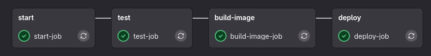

# Pipeline CI CD et la dockerisation

## Ressources :

- https://www.youtube.com/watch?v=qP8kir2GUgo
- https://docs.gitlab.com/topics/build_your_application/

Une pipeline CI/ CD est une suite de scripts de test effectués automatiquement après chaque git push (commit sur la branche main).

Le CI/CD permet d'automatiser la mise en production d'une application et s'assurer qu'elle fonctionne bien après un git push (compilation,executer ou bundler).

- **CI : Continious Integration**. L'intégration continu est une façon de coder qui permet de push des changements régulièrement sans avoir peur de casser son application à chaque fois. A chaque push une suite de test appelés jobs sont executés et si un test(job) échoue les dev en sont notifié par mail.

- **CD : Continious Deploiement**. Complémentaire à la CI mais automatise et simplifie également la mise en production de l'application le plus souvent grâce à l'uniformisation de l'environnement d'execution de notre applications grâce à Docker.

- **Docker** : Envrionnement d'execution Linux léger et reproduisible. Les programmes executés par Docker sont appelés container et vivent chacun dans un *file system* linux isolé du reste de l'hôte ( le server ou votre pc en local).

- **Docker Hub** :  Store d'application( containers ) docker mis en ligne publiquement sur le site Docker Hub. Vous mettrez en ligne vos applications dessus pour facilement les déployer sur le serveur.

