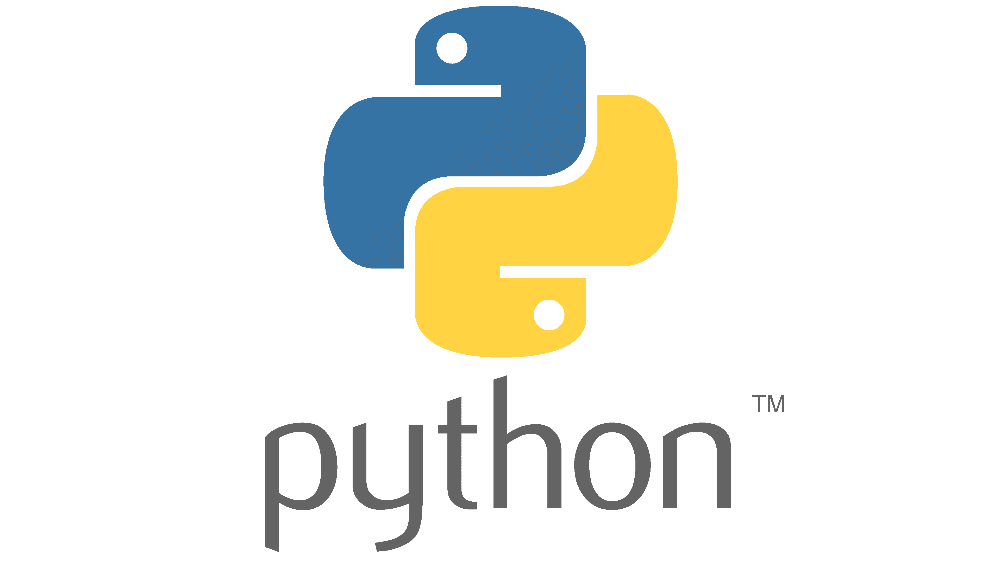

# PyGameZero
PyGame Zero est une version simpliste de la bibliotèque python PyGame.

Python est un langage de programmation généraliste interprété.




> Un langage interprété n'as pas besoin de compilateur, le fichier source va etre lu ligne par ligne par un programme qui va directemenr executer le code sans généré de fichier binaire.


L'interpréteur python est codé en langage C, ce qui fait de python une surcouche plus rapide à utiliser que le C. Cette simplicité ce paye par un gros écart de performances entre un script python et un programme en C compilé ( le C ayant des perforamances bien meilleures ).

## Installer l'interpréteur python et PyGamezero

```bash
sudo apt install python3
sudo apt install pip
sudo apt install python3-pgzero
```

## Hello World Python
Dans un fichier `app.py` écrivez le code suivant :

```python
prenom = "Massinissa"
print("Hello",prenom,"ca va ?")
```
Lancez le avec la commande `python3`.
```bash
python3 app.py
```

## Hello World Pygame
Dans un fichier `app.py` écrivez le code suivant, il permet d'afficher une fenêtre rouge.

*app.py*
```python
WIDTH = 300
HEIGHT = 300

def draw():
    screen.fill((128, 0, 0))
```

### Lancer l'application
L'application se lance avec le programme `pgzrun`, installé précedement :

```bash
pgzrun app.py
```

> pgzrun n'est qu'un script simplifié pour lancer le script `app.py`.
> Habituellement on lance les scripts python avec la commande :
>```bash
>python3 app.py
>```


## Getting started
Que se soit en python ou dans un autre langage toute les bibliotèques ont de la documentation pour apprendre à s'en servir.

Faite donc le Getting started de PyGameZero pour apprendre les bases de PGZ :

https://pgzero-french.readthedocs.io/fr/latest/introduction.html

## Références de documentation
Retrouvez-ici la liste de tout les objets et fonction disponible dans pygame zero :
https://pgzero-french.readthedocs.io/fr/latest/builtins.html

## Mini - Projets

1. Projet Loup : Créez un jeu ou deux joueurs s'affrontes l'un avec les flèches du clavier l'autre avec `zqsd`. Les joueurs jouent au loup. Si le joueur Loup touche le joueur Humain le jeu s'arrete.

2. Projet Pong : Deux raquettes une balle deux joueurs. L'objectif, faire passer la raquette derriere l'écran de l'adersaire.

3. Projet Flappy Bird : Le projet le plus difficile, faite un flappy bird avec des obstacles qui se déplaces de droite à gauche pour simuler le "scrolling" du niveau.

### Bonus : ReLOADED
Si vous avez fini un projet agrémentez le avec par exemple : 
- Un score
- Un timer
- Des musiques et du sons
- Des bonus de vie ou de vitesses
- ...