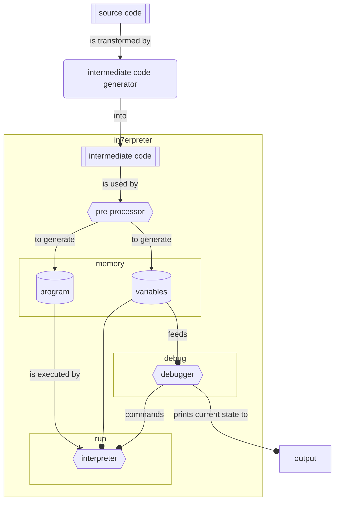

# IN7erpreter

## Summary
The aim of this project is to create an interpreter for intermediate code. The interpreter is written in Ada and is able to execute a program written in the intermediate code language, and display the state of the program at each step of the execution.

This report describes the architecture of the interpreter, the main choices made, the main algorithms and data types, the testing process, the difficulties encountered and the solutions adopted, the organization of the group, as well as a technical and individual assessment.

[[_TOC_]]

## General architecture



## Conception

Variable's addresses are represented on 16 bits, which means that an address can take a value between ```0``` and ```2 ** 16 - 1``` (i.e. ```65535```). Each memory block is 64 bit wide.

### Types

We have chosen to use mainly the Unsigned_64 type from the standard Ada library. This type is a 64-bit unsigned integer. We used this type because it is the most universal for our needs and provides a cleaner way of building our interpreter. It can be used to represent any type of data and we can easily convert and manipulate it with the bit operations provided by the standard Ada library.

In this way, we have just one Unsigned_64 array to represent the interpreter's memory. This array is indexed by the variable and instruction addresses (also represented by Unsigned_64, but limited to 2**16 addresses). The interpreter can then easily access the data it needs using the address of the variable or instruction it wants to access.

### Instructions

The program loaded in memory contains five types of instructions: `ARITHMETIC`, `GOTO`, `IF_GOTO`, `READ` and `WRITE`. The determination of the type lies in the first three bits of the `OP_CODE` field.

The datagrams of these instructions are detailed below. The first row desribe the bit fields and the second row what is included in these fields.

#### ARITHMETIC

Poorly named "*arithmetic*" instructions always begin with ```100```.
There are two types of arithmetic instructions : arithmetic and logical/comparison operators.

##### res <- varA op varB

> ```RESULT <- OPERAND_1 OP_CODE OPERAND_2```

|63 .. 48|47 .. 32|31 .. 16|15 .. 0|
|:---:|:---:|:---:|:---:|
|OP_CODE|RESULT|OPERAND_1|OPERAND_2|

> Examples:
> ```i <- varA * varB```
> ```j <- 2 - varC```

##### res <- varA

This variation corresponds to a classic assignation from a variable to another, which is represented in memory by a addition between ```VARIABLE``` and ```0```.

> ```RESULT <- VARIABLE```
> is equivalent to
> ```RESULT <- VARIABLE + 0```

|63 .. 48|47 .. 32|31 .. 16|15 .. 0|
|:---:|:---:|:---:|:---:|
|+|RESULT|0|VARIABLE|

> Examples:
> ```i <- varA```
> ```j <- 161803```

#### GOTO

All Goto instructions (GOTO and IF_GOTO) always begin with ```001```.
The field ```PC_DST``` contains a signed value representing the relative offset to PC. 

For example if the following instruction is located at line 77:
> ```GOTO 6```
The next instruction to be interpreted is located at line ```77 - 6 = 71```.

Using a relative offset doubles the number of instructions in a potential later case where a program is not limited to ```MAX_NB_INSTRUCTIONS = 65535```.

The following datagram describe the typical GOTO instruction:

|63 .. 48|47 .. 32|31 .. 0|
|:---:|:---:|:---:|
|```0x2000```|```0x0000```|```PC_DST```|

#### IF_GOTO

IF_GOTO instructions always begin with ```010```.
The field ```COND``` contains the address of the boolean variable representing the condition of the IF control structure. As for the GOTO instruction, the field ```PC_DST``` contains a signed value representing the relative offset to PC. See [GOTO](#goto) for more information.

The following datagram describe the typical IF_GOTO instruction:

|63 .. 48|47 .. 32|31 .. 0|
|:---:|:---:|:---:|
|```0x4000```|```COND```|```PC_DST```|

#### NULL

The `NULL` instruction is an instruction that does nothing.
All bits of the instruction are set to `0`.

#### EXIT

The `EXIT` instruction stops the execution of the program.
All bits of the instruction are set to `1`.

### List of all OP_CODEs

|OPERATION|Intermediate code symbol|OP_CODE|
|:---|:---:|:---|
|NULL|`NULL`|`0000000000000000`|
|GOTO|`GOTO`|`001_0000000000000`|
|IF_GOTO|`IF`|`010_0000000000000`|
|Add|`+`|`100_00_000_00000000`|
|Substract|`-`|`100_00_001_00000000`|
|Multiply|`*`|`100_00_010_00000000`|
|Divide|`/`|`100_00_011_00000000`|
|Lower than|`<`|`100_10_000_00000000`|
|Lower or equal to|`<=`|`100_10_001_00000000`|
|Greater than|`>`|`100_10_010_00000000`|
|Greater of equal to|`>=`|`100_10_011_00000000`|
|Equal to|`=`|`100_10_100_00000000`|
|Not equal to|`/=`|`100_10_101_00000000`|
|Logical OR|`OR`|`100_11_000_00000000`|
|Logical AND|`AND`|`100_11_001_00000000`|
|Read|`READ`|`101_0000000000000`|
|Write|`WRITE`|`110_0000000000000`|
|EXIT|`EXIT`|`1111111111111111`|

## Organisation

We have chosen to use the Agile method for the development of our project. We have therefore divided the project into several sprints of one week each. Each sprint is divided into several tasks that are assigned to each member of the group. During first week, we have defined the architecture of the project and started to make the refinement of the project together, in order to have a common vision of the project and be able to divide the tasks then.

We used the GitLab platform to manage our project. We have also created a GitLab CI pipeline to automatically build the project and run the tests for each new feature added to the project. This allowed us to quickly detect errors and to be able to correct them as soon as possible.

Once the refinment and specification of the project was done, we decided to split the work between the Pre-processor and the Interpreter. The Pre-processor was assigned to Amazir and the Interpreter to Lucas. Rest of the tasks were assigned to both of us.

## Review

### Technical review

In the current state of the project, the following features are implemented and working:
- Given a raw text file, containing a program written in intermediate language, the pre-processor is able to:
    - Create a representation in memory of all variables declared in the file;
    - Translate this intermediate code in a list of instructions, represented in memory by unsigned 64 bits integers.
- Given a program representation generated by the pre-processor, the interpreter is able to execute the program, instruction by instruction.
- Additionnally, if the main program is run with `-d` option, a debugger is enabled, and produce a view of all tracked variables during the execution of the program.
- For now, the types handled by this project are integers, booleans, characters.
- Operations implemented are arithmetic, comparison and read and write instructions. A comprehensive list of all implemented operations can be found [here](#list-of-all-op_codes).

NOTE : Tables have not been fully implemented, without a stable behaviour. It was then decided not to include this feature in the current release of the project. Although, an example of a program using tables can be found in the example directory under the name `sort_table.ic`.

### Individual review

#### Amazir

The most important skill this project taught me is to not dive straight into the code as soon as the general design is drawn, like I used to do during my technical degree. Taking my time is probably my biggest weakness, but I truely realized (I mean, empirically) something valuable, i.e. that allocating enough time and resources to refining and pondering solutions might be the best way to develop a software.

The most difficult aspect of the realisation of this project was to adapt the refinement to the specificities of the Ada language. I mostly struggled with types, and realised that, even in low level languages that I know very well, like C, most of the conversions were implicitly done. Ada doesn’t allow to let the compiler implicitly handle type conversions, which ultimately forced me to become more aware of what I wanted the program to do, and how I expected it to do it.

Additionnally, since I have been sick for a whole week, it has been very difficult for me to keep up the pace at the end. That is why arrays are not implemented in the final version.

Speaking of Ada, I assume most of the choices (custom types to represent more accurately the semantics of what were variables supposed to be, putting sub-programs into a bigger one to reduce the size of the code when the sub-program is used in only one procedure or function, etc.) may not be the best choices. I assume that a deeper knowledge of Ada would have allowed me to have a better view of how things should have been designed and implemented.


#### Lucas

The project was very interesting and taught me a lot about the Ada language and especially about the right way to develop a project using the refinement method and writing robust code.
I also learned a lot about how to properly test a program and the importance of spending a lot of time refining the project and writing specifications before starting to code.

I think the main difficulty with this project was not to go too far with the refinement, as there are choices to be made based on the programming language used and its rules, which is very difficult to consider during refinement.