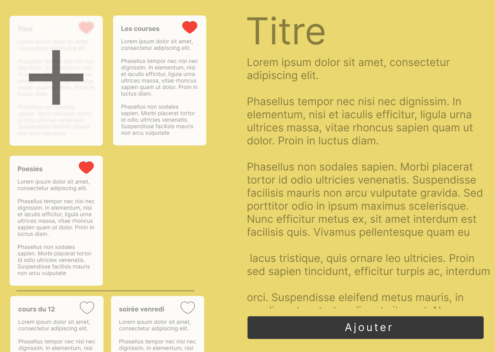

# Projets React
Ces projets ont pour but de faire grandir votre capacité à concevoir une application de A à Z. Vous avez carte blanche quand à la structure du code, faites vos erreurs, trouvez vos solutions vous pourrez ensuite comparer avec la correction une fois le projet fini.

***Posez moi autant de question que néccessaires sur le fonctionnement final du projet, un bon développeur sait prendre le temps de poser beaucoup de question au client pour ne pas se tromper dans la direction du projet et risquer de delivrer une application inutile au client.***

## Notes
Un application de *Notes* comme sur le téléphone.

### Fonctionnalités
- Ajouter une note
- Liker une note pour la faire remonter en haut de la liste.
- Les notes sont affichées de la plus récente à la plus ancienne.

### Persistance des données
Les notes sont sauvegardées dans une BDD, je recommande l'utilisation du localStorage qui va stocker des données JSON.

### Maquette

La **maquette figma** pour les assets si besoin : https://www.figma.com/file/mnOEKBuxya4zjrNexYax7c/Notes?type=design&node-id=5%3A116&mode=design&t=pzzvJCeDlZLKMmwB-1

La **maquette interactive** pour vous faire une idée : https://www.figma.com/proto/mnOEKBuxya4zjrNexYax7c/Notes?type=design&node-id=5-116&t=CfX4OnKn1Gj9jVjp-1&scaling=contain&page-id=0%3A1&starting-point-node-id=5%3A2&mode=design

### Objectifs bonus
- Ajoutez une barre de recherche pour filtrer les notes visibles et faciliter l'expérience utilisateur.
- En plus du système de *like* qui permet de trier les notes en 2 parties, ajouter un système de *#tag* à cocher à la *vinted* qui permettent de trier ses notes par catégories.
- utiliser le module `react-router` pour pouvoir passer de l'ajout de note à la liste de note et ainsi avoir un interface responsive pour téléphone. Sur téléphone il n'y à pas la place d'afficher la liste des notes ET le forumlaire d'ajout /modification des notes.

Graphiquement vous êtes libre d'implementer ces options comme bon vous semble. Cependant n'hesitez pas à m'appeler si vous ne vous sentez pas une âme d'artiste et que l'inspriation vous manque ;).

