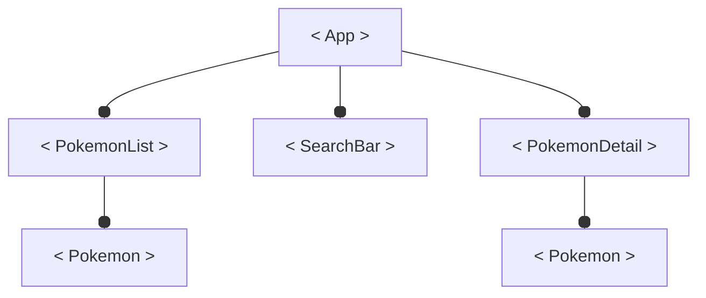

# Introduction à React 
React JS est une bibliotèque JavaScript qui permet de créer des interfaces utilisateur (UI) réactive.

Un interface réactif est un interface qui se met à jour automatiquement lors du changement de son contenu, comme le résultat d'une recherche qui s'affiche lorsque l'utilisateur tape au clavier ou encore le nombre de produits du panier qui augmente lorsque l'on clique sur `+`.

Il est déjà possible de créer des UI réactive en pure JS mais c'est une action qui demande beaucoup de ligne de code pour quelque chose de finalement fondamentale.

## Différence entre du JavaScript Pure et ReactJS
### JS Pure
Prenons pour exemple la mise à jour du nombre d'article d'un panier en JS pure.

*index.html*
```html
<h1>Ma boutique</h1>
<div>
    <p>Adidas taille 42</p>
    <p>Nombre de produit : <span id="nb_produit"></span></p>
    <button id="add_btn">Ajouter au panier</button>
</div>
```

*script.js*
```js
// Je récupère les balises
const nbProduitTag = document.querySelector("#nb_produit");
const addButton = document.querySelector("#add_btn");

// J'initialise le compteur
let compteur = 0;
// Je met à jour l'affichage du compteur dans la balise
nbProduitTag.innerText = compteur;

addButton.onclick = ()=>{
    // J'incrémente le compteur
    compteur++;
    // Je met à jour l'affichage
    nbProduitTag.innerText = compteur;
}
```

### React JS

`React` vous permet de créer vos propre balises HTML appelées `composant`.

*HTML*
```jsx
<h1>Ma boutique</h1>
<Produit />
```

script.js
```jsx
import { useState } from "react";

function Produit(){
    // Je créer une variable compteur et une fonction setCompteur qui la modifie
    const [compteur,setCompteur] = useState(0); // par défaut compteur = 0
    
    function addProduct(){
        setCompteur(compteur+1);
    }
    
    // Je renvoi le HTML final de mon composant
    return (
        <div>
            <p>Adidas taille 42</p>
            <p>Nombre de produit : {compteur}</p>
            <button onClick={addProduct}>Ajouter au panier</button>
        </div>
    );
}
```

Dans le contexte d'une application complète la syntaxe React est beaucoup plus courte et à l'avantage de contenir le code HTML et JS traitant du produit au même endroit. Vous remarquerez que React met également à jour le nombre de produit de votre balise `<p>` sans jamais vous demandez d'ecrire le moindre `querySelector`, `innerText` ou `createElement` etc. Tout se met à jour gràace la fonction `setCompteur`.

***Grâce à React plus besoin de manipuler le DOM, React le fait pour vous.***

### Difficultés d'utilisation de React
React est une bibliotèque JavaScript moderne et utilise donc certaines syntaxes qui vous sont probablement étrangères.

*Je recommande la lecture de la MDN.*

#### import from
La grande majoritiée des projets JavaScript modernes divisent leurs codes en plusieurs fichiers JS, appelées `module`, grâce à la syntaxe `import  from "module" `.

Ici j'importe la fonction `useState` depuis le module JavaScript `react`.
```js
import { useState } from "react";
```
J'utilise également le `destructuring assignement` qui permet d'extraire une méthode d'un objet. Le module `"react"` exporte un objet mais nous n'importons que la méthode `useState` de cet objet.
#### Destructuring assignement
> Plus d'info sur le `destructuring assignement` sur le guide de la MDN : https://developer.mozilla.org/en-US/docs/Web/JavaScript/Reference/Operators/Destructuring_assignment

En JS je peux utiliser le `destructuring assignement` pour déclarer des variables à partir du contenu d'un array.

```js
const fruits = ["pomme","banane","poire"];
const [apple,banana] = fruits;

console.log(apple);     // => "pomme"
console.log(fruits[0]);     // => "pomme"

console.log(banana);    // => "banane"
console.log(fruits[1]);     // => "banane"
```

La fonction `useState` renvoi un array, dites vous que la syntaxe :
```js
const [compteur,setCompteur] = useState(0);
```
peut également s'ecrire :
```js
const stateInfos = useState(0);
const compteur = stateInfos[0];
const setCompteur = stateInfos[1];
```
Cette syntaxe est particulièrement longue, ont préfère donc utiliser le `destructuring assignement`.

Vous vous habiturez rapidement à ces nouvelles syntaxes et sachez quelles ne sont pas spécifiques à `React` mais au langage JavaScript. Apprenez les donc bien car TOUT les frameworks JS utilise, à un moment donnée, `import` ou le `destructuring assignement`.

## Pré-requis à React 
### JSX, du HTML dans le JavaScript ?!
La plupart du temps en React vous allez écrire du JSX, c'est à dire un genre de HTML directement dans JavaScript.

```jsx
import { useState } from "react";

function Hello(){
    const prenom = "Rémi";
    // Ceci est du JSX, du HTML dans le JavaScript.
    return <h1>Hello {prenom}</h1>; 
}
```

Le JSX permet d'éviter d'écrire ceci :
```js
import { useState, createElement } from "react";

function Hello(){
    const prenom = "Rémi";
    // Sans le JSX le code est moins clair
    return createElement("h1",{},`Hello ${prenom}`); 
}
```
Concretement à la compilation le JSX va remplacer le code JSX par des fonctions createElement tout simplement.

Le JSX n'est pas du JavaScript il faut donc le compiler en JavaScript. Pas de panique tout ceci se configure tout seul grâce à un outil utilisé dans énormement de projet JavaScript moderne `Vite`.

### Vite 
https://vitejs.dev/

Vite est un bundler JavaScript, concrètement c'est un programme qui va lire votre code JavaScript, JXS ou encore TypeScript et le compiler en un code optimisé pour les navigateurs.

Vite vous fournit également un serveur web local de développement donc pas besoin de WAMP, XAMPP ou autre.

Pour créer un projet react avec vite il vous faut :
1. Installer NPM (NodePackageManager)
2. Taper une commande pour créer un projet JavaScript pré configuré pour React.
3. Taper une commande pour lancer le serveur web 
4. Commencez à coder :)

> Vite peut très facilement être dockerisé via une image docker de node et un port binding du port (-p).

## Créer un projet React avec Vite.
### 1. Installer NodeJS
#### Windows
Téléchargez `node` ici : https://nodejs.org/

#### Mac
```bash
brew install node
```

#### Linux (Debian / Ubuntu)
```bash
apt install nodejs npm
```
> Attention cepandant apt n'utilise pas la dernière version de nodejs, pour l'avoir il rajouter le dépot à votre machine linux avant de l'installer. 
> Voir les instructions d'installation ici : https://github.com/nodesource/distributions?tab=readme-ov-file#using-ubuntu

### 2. Créez le projet avec Vite
Dans votre dossier de travail.
```bash
npm create vite
```
Répondez au question de configuration comme ceci.


### 3. Ouvrez le projet dans VSCode
Vite vous à créez une application exemple dans le dossier `my-app` (le nom que vous avez donnez au projet).

**Ouvrez ce dossier dans VSCode.**


- **`/public`, contiendra vos images**, vidéos ou audio. Toute choses qui néccessite un accès publique, comme l'attribut `src` de la balise `` par exemple, doit être dans le dossier `public`.
- **`/src`, contient tout votre code.** C'est ici que vous travaillerez la majorité du temps.
- **`index.html`, la page d'accueil du site.** C'est le pointde départ de votre application.
- **`.eslintrc.cjs`**, est un fichier de configuration qui aide à repèrer des bugs dans votre appli. Vous pouvez ignorer ce fichier.
- **`.gitignore`**, défini les dossier ignorer par git.
- **`package.json`** et **`package-lock.json`**, gère les dépendances de npm installées avec `npm install`.
- **`vite.config.js`**, configure `Vite` pour fonctionner sans encombre avec `React`.

### 4. Lancez le serveur web localhost
Ouvrez un terminal dans votre projet VSCode et tapez :
```bash
npm install # Installation des dépendances du projet
npm run dev # Lancement du serveur web localhost
```
- `npm install` installe les éventuelles dépendances du projet. 
- **`npm run dev` lance un serveur web** pour votre projet et vous forunit l'adresse ip du serveur, habituellement `localhost:XXXX`.
> Une fois `npm install` effectuée, vous n'aurez pas besoin de la relancer la prochaine fois.

Lorsque vous voyez ce message votre projet est prêt et disponible via l'adresse localhost fournit par vite.


<strong style="font-size:30px">C'est fait !</strong>

### "Ca marche pas !" En cas de soucis.
Si vous n'arrivez pas à faire fonctionner les commandes ci-dessus, voici le résumé, vous pouvez les copiez-coller. ;)

Dans votre dossier de travail ouvrez un terminal et tapez :
```bash
npm create vite@latest my-app -- --template react
cd my-app
npm install
npm run dev
```

## Un premier pas sur React
React s'occupe exlusivement de l'UI et pour se faire il va créer un DOM virtuel qu'il copiera dans le véritable DOM de votre application quand un rafrachissement est neccessaires.

React à donc besoin d'un point d'entrée dans votre page html pour fonctionner, une balise d'origine dans laquelle toute l'arborescence de l'application React se trouvera.

### Hello World
1. Supprimer tout le contenu du dossier `/src`.
2. Dans le dossier `/src`, créez un fichier nommée `main.jsx`, ce fichier est le point d'entrée de notre application.
3. Dans le fichier `src/main.jsx ` écrivez un hello world.

*/src/main.jsx*
```jsx
console.log("Hello Main");
```

4. Dans le fichier */index.html* vérifiez que le fichier */src/main.jsx* est bien importé.

*/index.html*
```html
<!doctype html>
<html lang="fr">
  <head>
    <meta charset="UTF-8" />
    <meta name="viewport" content="width=device-width, initial-scale=1.0" />
    <title>My App</title>
  </head>
  <body>
    <div id="root"></div>
    <!-- J'importe main.jsx dans le html -->
    <script type="module" src="/src/main.jsx"></script>
  </body>
</html>
```

5. Ouvrez la console du navigateur, vous devriez y voir le message `"Hello Main"`.

> ***Extension .jsx dans la balise `<script>`*** 
>```html 
><script type="module" src="/src/main.jsx"></script>
>```
>`.jsx` est une extension inconnu des navigateur web mais `Vite` compile notre code en JavaScript à chaque sauvegarde donc tout va bien. Au final le code source sera importé sera en `.js`. :)

### Votre premier composant React.
Tout fonctionne, il est temps de créer notre premier composant React.

Un composant est la brique élementaire de React, vous pouvez imaginez les composant React comme des nouvelles balise HTML sur mesure que vous codez en JavaScript(plus précisement en jsx).

1. Verifier la présence d'une balise `<div>` avec pour id `root` dans le `index.html`. C'est dans cette balise que React place les composants que vous codez.

*/index.html*
```html
<!doctype html>
<html lang="fr">
  <head>
    <meta charset="UTF-8" />
    <meta name="viewport" content="width=device-width, initial-scale=1.0" />
    <title>My App</title>
  </head>
  <body>
    <!-- Une balise vide avec pour id root -->
    <!-- C'st cette balise que React remplira avec les composants que vous  coderez -->
    <div id="root"></div>
    <script type="module" src="/src/main.jsx"></script>
  </body>
</html>

```

Dans le fichier /src/main.jsx.

2. Utilisez la méthode ReactDOM.createRoot() pour créer un composant React lié à la balise `div.root`.
*/src/main.jsx*
```jsx
import React from "react";
import ReactDOM from "react-dom/client";

const root = ReactDOM.createRoot(document.querySelector("#root"));
```

3. Affichez le composant avec la méthode render.
*/src/main.jsx*
```jsx
import React from "react";
import ReactDOM from "react-dom/client";

const root = ReactDOM.createRoot(document.querySelector("#root"));
/* Affichage du composant root  */
root.render(<h1>Hello World</h1>);
```
Ce code affiche(render) le composant root dans la balise #root. Le contenu du composant root est un simple h1 Hello World.


Ce code est le point de départ de tout projet React. Il vous paraitera plus clair plus tard mais vous n'avez pour l'instant pas d'interet à comprendre le processus plus que les explications fournit plus haut.

#### En résumé
1. La méthode ReactDOM.createRoot permet de créer un composant React lié à une véritable balise HTML.
2. La méthode render permet d'afficher le composant.
3. La méthode render prend en paramètre du JSX, soit le HTML à afficher.

C'est la seul fois ou nous utiliseront createRoot pour créer un element React toute la suite ce fera en JSX.

### L'encapsulation des composants
Pour l'instant toute votre application est un simple `<h1>`, évidemment le code va grossir et nous voulons donc encapluser tout notre code React dans un composant appelé **`<App />`**.

1. Dans le fichier main.jsx créez une fonction App() qui renvoi un `<h1>` entant que JSX.

*src/main.jsx*
```jsx
// à la suite du code précédent...

function App(){
    return <h1> Hello World</h1>;
}
```
Ceci est un composant fonctionnel, c'est à dire un composant React créer dans une fonction. C'est sous cette forme que la majorité de votre code React sera écrit.

2. Affichez le composant `App` dans la fonction `root.render()`.

```jsx
import React from "react";
import ReactDOM from "react-dom/client";

const root = ReactDOM.createRoot(document.querySelector("#root"));

root.render(<App/>);  // Afficher le nouveau composant App

function App(){
    return <h1> Hello World</h1>;
}
```

Le composant nouvellement crée est affichez en tant que point de départ de notre appli dans la balise *#root*.
Pour améliorer la clareté du code, JSX nous permet d'écrire le composant App comme du HTML.
```jsx
root.render(<App/>);
```
En réalité le code suivant donnerait le même résultat.
```js
root.render(App()); // Même résultat mais moins explicite.
```

### Syntaxe du JSX
Le JSX permet d'écrire du pseudo HTML contenant du HTML classique et les nouveaux composants fonctionels que vous créez. Sa syntaxe est très simple.

De base JSX permet s'implement d'ecrire du bon vieux HTML.
```jsx
function App(){
    return <p>Je suis un paragraphe</p>;
}
```
Si vous avez besoin d'ecrire des **balises** sur **plusieurs lignes** il faut mettre tout votre **JSX dans une balise div et entre parentèses**.
```jsx
function App(){
    return (
     <div>
        <h1>Titre</h1>
        
        <p>Je suis un paragraphe</p>
    </div>
    );
}
```
Un composant ne peut renvoyez au final qu'une seul et unique balise voilà pourquoi j'encapsule le tout dans une balise `<div>`.

> **Attention !** Remarquez que la balise `` est une balise orpheline en JSX il **OBLIGATOIRE de finir les balises orpheline par un slash / .**

#### Executer du JavaScript dans du JSX
JSX permet d'exectuer du JavaScript dans le JSX, pour se faire il faut placer le JS entre accolades.

Ici j'affiche une variable dans mon JSX.
```tsx
function App(){
    const name = "Massinissa";
    return <h1>Bonjour {name}</h1>;
}
```
Je peux mettre n'importe quel JavaScript entre les accolades même si, pour des raisons de clarté, ont préfère effectuer le maximum de traitement JS en dehors du JSX.
```tsx
function App(){
    const name = "Massinissa";
    const birth = new Date("12-31-1999");
    return <h1>Bonjour {name} tu as {2024 - birth.getFullYear()} ans</h1>;
}
```
On préfère extraire la logique du JSX comme ceci.
```tsx
function App(){
    const name = "Massinissa";
    const birth = new Date("12-31-1999");
    const age = 2024 - birth.getFullYear();
    return <h1>Bonjour {name} tu as {age} ans</h1>;
}
```
#### Afficher le contenu d'un array JavaScript dans du JSX
Un grand classique de la manipulation de DOM c'est l'affichage du contenu d'un array via une boucle for.

Avec JSX, on peut simplement passer un array entre accolades pour qu'il affiche tout le contenu de l'array.

Prenons un tableau d'élèves à afficher dans une liste.
```tsx
function App(){
    const eleves = ["Mathieu","Arnaud","Cléo","François"];
    return (
        <div>
            <h1>La liste des éleves</h1>
            {eleves}
        </div>
    );
}
```


Pour chaque élève il faut créer une balise `<li>` contenant le nom. Cette action est réalisable facilement avec un `map()`.
```tsx
function App(){
    const eleves = ["Mathieu","Arnaud","Cléo","François"];
    const elevesElements = eleves.map( eleve => <li>{eleve}</li> );
    return (
        <div>
            <h1>La liste des éleves</h1>
            <ul>
                {elevesElements}
            </ul>
        </div>
    );
}
```


> #### **Rappel `Array.prototype.map()`**
> La méthode `Array.prototype.map()` permet de transformer un tableau en un nouveau tableau composés des valeurs de retour de la fonction callback passée en paramètre. Si vous devez modifier tout le contenu d'un tableau sans en changer le nombre d'éléments c'est un `map()` qu'il vous faut.
> https://developer.mozilla.org/fr/docs/Web/JavaScript/Reference/Global_Objects/Array/map

La constante `elevesElements` est un array de composant React, le JSX ne fait que parcourir le tableau et afficher chaque composants dans l'ordre.

*Mapper* est array JavaScript en un nouveau array de composants est une actions très commune en React. En situation réel ce tableau d'élèves pourrait très bien venir d'une base de données ou d'une API par exemple. 

On peut d'ailleurs supprimer la constante `elevesElements` et placer le `map()` dans le JSX directement.

```jsx
function App(){
    const eleves = ["Mathieu","Arnaud","Cléo","François"];
    return (
        <div>
            <h1>La liste des élèves</h1>
            <ul>
                {eleves.map( eleve => <li>{eleve}</li> )}
            </ul>
        </div>
    );
}
```

### Exercice 1 - La moyenne de Maxime
Affichez la liste des notes de Maxime et la moyenne de ses notes.
> **Astuce** : vous pouvez utilisez la fonction **Array.prototype.reduce()**.
```jsx
function App(){
    const notes = [20,10,11,7,13];
    return (
        <div>
            <h1>La moyenne de Maxime </h1>
            <h2>Notes :</h2>
            <ul>

            </ul>
            <p>Moyenne générale : </p>
        </div>
    );
}
```

***Attention correction juste en dessous !***
<pre>


</pre>
#### Correction Exercice 1 - La moyenne de Maxime
```jsx
function App(){
    const notes = [20,10,11,7,13];
    const average = notes.reduce((sum,note)=>sum+note) / notes.length;
    return (
        <div>
            <h1>La moyenne de Maxime </h1>
            <h2>Notes :</h2>
            <ul>
                {notes.map( note => <li>{note} / 20</li> )}
            </ul>
            <p>Moyenne générale : {average}</p>
        </div>
    );
}
```
`Arrap.prototype.reduce()` est à utiliser dans le cas où vous voulez récuperez une seul valeur à partir d'un tableau. Ici par exemple à partir du tableau de note je veux en récupérer la somme.

Le même résultat est obtenable à partir d'une variable tampon et une boucle for classique sur le tableau de notes. 

```jsx
function App(){
    const notes = [20,10,11,7,13];
    // -- Equivalent de la fonction reduce ---
    let sum = 0;  // la variable tampon qui contient la somme des notes
    for (let i = 0; i < notes.length; i++) {
        sum+= notes[i];        
    }
    // ---------
    const average = sum/notes.length;
    return (
        <div>
            <h1>La moyenne de Maxime </h1>
            <h2>Notes :</h2>
            <ul>
                {notes.map( note => <li>{note} / 20</li> )}
            </ul>
            <p>Moyenne générale : {average}</p>
        </div>
    );
}
```

Les méthodes map, reduce et filter sont à connaitre sur le bout des doigts pour écrire du JavaScript plus concis. 

### Exercice 2 - La liste des élèves
Affichez la liste des élèves, pour chaque élève, affichez son prénom et sa classe.
```jsx
function App(){
    let eleves = [
        { name : "Massinissa", grade : "4eme" },
        { name : "Arnaud", grade : "3eme" },
        { name : "Cléo", grade : "3eme" },
        { name : "Louis", grade : "6eme" },
    ];
    return (
        <div>
            // Codez ici ...
        </div>
    );
}
```

***Attention correction juste en dessous !***

<pre>


</pre>

#### Correction Exercice 2 - La liste des élèves
```tsx
function App(){
    let eleves = [
        { name : "Massinissa", grade : "4eme" },
        { name : "Arnaud", grade : "3eme" },
        { name : "Cléo", grade : "3eme" },
        { name : "Louis", grade : "6eme" },
    ];
    const elevesElements = eleves.map((eleve)=>{
        return (
            <div>
                <h2>{eleve.name}</h2>
                <p>{eleve.grade}</p>
            </div>
        );
    });
    return (
        <div>
            {elevesElements}
        </div>
    );
}
```

## Les composants
La conception d'une application React commence toujours par le découpage de la maquette en composants.

Une application est composée de plusieurs blocs imbriqués les uns dans les autres. Le développement d'une application avec React consiste à la création de tout ces blocs pour pouvoir, au final, assembler toute l'application.

Ces briques d'éléments graphique s'appelle des composant et pour le moment vous n'avez créer qu'un seul composant : le composant racine `<App/>`.

Les composants étant imbriqué il sont organisés en arborescence. Le composant App est le composant racine, il est obligatoire.

Prenons par exemple la maquette d'un pokedex. Selon vous, combien contient elle de composants **différents** ?


J'en compte 4 différents.

Le composant `<Pokemon>` qui est utilisé dans la liste de pokemons et pour indiquer l'évolution du pokemon.
.png)

Le composant `<PokemonList>` qui liste tout les pokemons existant dans un menu défilable.
.png)

Le composant `<SearchBar>` qui permet de rechercher un pokemon.
.png)

Le composant `<PokemonDetail>` qui affiche les informations d'un pokemon (nom, id, image, types et évolution) lorsque que l'utilisateur clique sur un `<Pokemon>` ou recherche un pokemon avec la `<SearchBar>`.
.png)

Une fois les différents composant identifiés ont remarque une arboresence qui se dessine.

.png)

## Créer un composant
La création d'un composant doit se faire dans un fichier à part qui porte le nom du composant.

Placez le composant racine `<App>` dans un autre fichier nommé App.jsx.
```jsx
function App(){
    return (
        <h1>Hello App</h1>
    );
}
```
Exportez le avec le mot-clé `export`.
```jsx
export function App(){
    return (
        <h1>Hello App</h1>
    )
}
```
Importez la fonction App dans le fichier main.jsx.
```jsx
import React from "react";
import ReactDOM from "react-dom/client";

import {App} from "./App";      // Import du composant App

const root = ReactDOM.createRoot(document.querySelector("#root"));
root.render(<App/>);            // Appel du composant App
```
Au minimum un composant est une fonction qui renvoi du JSX.
```jsx
function NomDuComposant(){
    /**
     * Code éventuel
     * */
    return (
        // JSX
    );
}
```
```jsx
function Eleve()
{
    const prenom = "Massinissa";
    const nom = "CHAOUCHI";
    const age = 24;
    return (
        <div>
            <h2>{nom}</h2>
            <p>{prenom}</p>
            <p>{age} ans</p>
        </div>
    );
}
```

### Affichage conditionnel
Avec un opérateur ternaire il est possible d'afficher du JSX sous condition. C'est une opération très commune pour, par exemple, afficher le stock d'un produit ou un bouton *"se connecter"* si l'utilisateur n'est pas connecté.

*/src/eleve.jsx*
```jsx
export function Eleve()
{
    const prenom = "Massinissa";
    const nom = "CHAOUCHI";
    const age = 24;
    return (
        <div>
            <h2>{nom}</h2>
            <p>{prenom}</p>
            <p>{age} ans</p>
            <p>{ age>=18 ? "Majeur" : "Mineur" }</p>
        </div>
    );
}
```

## Props 
Les props sont les attributs paramètrables des composants JSX que vous créez.

L'interet des composants est la modularitée, un composant à pour objectif d'etre reutilisé dans des contextes différent et se doit donc d'être paramètrable.

Les props d'un composant sont défini en paramètre de sa fonction et ont défini leurs valeurs à l'appel du composant à la manière du HTML.

```jsx
export function Eleve({prenom, nom, age})
{
    return (
        <div>
            <h2>{nom}</h2>
            <p>{prenom}</p>
            <p>{age} ans</p>
            <p>{ age>=18 ? "Majeur" : "Mineur" }</p>
        </div>
    );
}
```

```jsx
import {Eleve} from "./Eleve";
export function App(){
    return (
        <Eleve prenom="Massinissa" nom="CHAOUCHI" age={24}/>
        <Eleve prenom="Louis" nom="BERGER" age={25}/>
    );
}
```
Le JSX utilise une syntaxe proche de celle des attributs HTML mais en réalité le JSX passe simplement un objet en paramètre de la fonction.

Ces deux lignes produisent le même résultat.
```jsx
<Eleve prenom="Massinissa" nom="CHAOUCHI" age={24}/>
Eleve({
    prenom : "Massinissa",
    nom : "CHAOUCHI",
    age : 24
});
```

> Etant donné que la fonction prend un objet en paramètre il est faut utiliser le `destructuring assingement` pour accéder au props dans la fonction.
>```jsx
>export function Eleve({prenom, nom, age})
>```

# Event
Pour réagir à un évennement React vous fournit tout un ensemble de props auquel on affecte une fonction callback.

```jsx
export function Clicker(){
    function handleClick(){
        alert("Click !");
    }
    return <button onClick={handleClick}>Click me !</button>
}
```
> Je dois placer ma fonction entre accolades pour que JSX l'interprète comme du JavaScript.

Le nom des props est analogue au nom des événmments HTML, pré-fixé d'un `on`, le tout en *camelCase*.

Voir tout les événements possible : https://www.w3schools.com/jsref/dom_obj_event.asp

## State
Les states sont les données dynamique que le composant affiche. Quand vous changez la valeur d'un state, React va rafraichir l'affichage du composant.

La création d'un state se fait grâce à la fonction `useState()` du module `react`. Il faut donc l'importer dans le fichier du composant.

```jsx
import { useState } from "react";
```

Un state est composé de deux élements :
- une constante pour lire le state
- une fonction pour modifier le state

La plupart du temps les states seront modifiés lors d'un événement.

Par exemple ici j'incrémente un compteur quand je clique sur un bouton.
```jsx
import { useState } from "react";
export function Counter(){
    /**
     * Je crée un nouveau state.
     * J'accéde au state via la variable compteur.
     * Je modifie le state via la fonction setCompteur
     * */
    const [compteur, setCompteur] = useState(0);

    function handleClick(){
        setCompteur(compteur+1);
    }

    return (
        <button onClick={handleClick}>{compteur}</button>
    );
}
```

## Initialiser un state
La valeur de départ du state est passée en paramètre de la fonction `useState`.

```jsx
// Le compteur est initialisé à la valeur 0.
const [compteur, setCompteur] = useState(0);
```
Cette valeur de départ peut être de n'importe quel type JavaScript.
```jsx
const [compteur, setCompteur] = useState(0);    // number
const [product, setProduct] = useState(new Product(...));    // object
const [comments, setComments] = useState([]);    // array
```

## Modifier un state
La modification d'un *state* se fait via la fonction setter. `useState` vous passe la référence de cette fonction et vous choisiez son nom lors du *destructuring assignement*.
```jsx
// La reference de la fonction setter est placée dans la constante setCompteur.
const [compteur, setCompteur] = useState(0);
```
Le cas le plus commun de la modification d'un state est en réaction à un événement : clic, recherche, entrées clavier.

Par exemple ici je raconte une "blague à papa" quand je clic sur un bouton.
```jsx
import { useState } from "react";
export function DadJoke(){
    // J'initialise la blague
    const [joke,setJoke] = useState("Attend je réflechis...");

    function tellJoke(){
        const headers = new Headers();
        headers.append("Accept","text/plain");

        fetch("https://icanhazdadjoke.com",{ headers })
        .then(res => res.text())
        .then(joke => setJoke(joke)); // Je modifie la blague
    }

    return (
        <div>
            <p>{joke}</p>
            <button onClick={tellJoke}>Dire la blague</button>
        </div>
    );
}
```

Il est interdit de modifier directement la constante `compteur` car c'est la méthode `setCompteur` qui va déclancher le rafrachissement de la page.
C'est d'ailleurs pour ça que l'on précise que `compteur` est une constante et non une variable via le mot clé `const`.

Attention également `setState` viens remplacer complèment l'ancienne valeur de state et ne fait rien du tout si la nouvelle valeur est égal à l'ancienne. Le problème c'est que la valeur d'un array ou d'un objet, même après modification, ne change jamais; un objet est une reference et même en modifiant le contenu la référence reste la même et donc pour React rien n'à changé.

La solution est de toujours fournir une copie de l'objet via l'opérateur `...` qui permet de cloner.
*/src/App.jsx*
```jsx
export function App(){
    return (
        <div>
            <h1>Hello App</h1>
            <UserProfil name="Manu" lastName="CHAO"/>
        </div>
    );
}

```
*/src/UserProfil.jsx*
```jsx
import { useState } from "react";
export function UserProfil({name,lastName}){
    // J'initialise la blague
    const [user,setUser] = useState({name, lastName});
    
    function onChangeName(event){
        const newName = event.target.value;
        setUser({...user, name : newName});
    }
    function onChangeLastName(event){
        const newLastName = event.target.value;
        setUser({...user, lastName : newLastName});
    }

    return (
        <div>
            <h2>{user.name}</h2>
            <h2>{user.lastName}</h2>
            <input onChange={onChangeName} value={user.name}/>
            <input onChange={onChangeLastName} value={user.lastName}/>
        </div>
    );
}
```

### Boucle infini avec un setState
`setState` déclance un nouveau rendu du composant.
Si vous utilisez un `setState` sans aucune condition (if, event) une boucle infini va se produire car `setState` va déclancher un nouveau rendu se qui va appeler `setState` se qui va déclancher un nouveau rendu, etc.

Par exemple si vous voulez effectuer un fetch dès le debut de vie de votre composant sans attendre le clic sur le bouton. L'erreur serait d'appeler tellJoke directement dans la fonction DadJoke.

```jsx
import { useState } from "react";
export function DadJoke(){
    const [joke,setJoke] = useState("Attend je réflechis...");

    function tellJoke(){
        const headers = new Headers();
        headers.append("Accept","text/plain");

        fetch("https://icanhazdadjoke.com",{ headers })
        .then(res => res.text())
        .then(joke => setJoke(joke));
    }

    // ATTENTION !
    // J'appelle tellJoke pour espérer afficher une blague à l'initialisation du composant.
    tellJoke();
    return (
        <div>
            <p>{joke}</p>
            <button onClick={tellJoke}>Dire la blague</button>
        </div>
    );
}
```
Un state doit toujours être modifier de façon conditionnel, le plus souvent, lors d'un événement utilisateur. Le rendu ne doit jamais appeler setState par défaut.
# useEffect, initialiser un composant
`useEffect` est une fonction très puissante qui permet d'éxecuter du code uniquement lorsque certain states changent. **Egalement `useEffect` s'excute toujours une fois avant le premier rendu.**

Si vous n'avez vraiment pas le choix et que l'ajout d'une prop est inenvisagable, la fonction `useEffect` est une solution, cependant notez bien que les développeurs de React conseil de ne l'utiliser quand dernier recours et que React à été pensez pour initialiser les composants grâce aux props.

`useEffect` prend deux paramètres :
- la fonction callback à éxécuter,
- un tableau des *states* qui déclanche la fonction callback lors de leurs changement.


Dans notre cas nous ne souhaitons pas voir useEffect se declancher en fonction d'un state mais uniquement lors du premier rendu, il faut donc passer en deuxième paramètre un tableau vide.

```jsx
useEffect(()=>{
    tellJoke();
,[]);
```
> Attention à ne pas oublier le tableau en second paramètre, sinon useEffect s'execute sans condition et donc à l'infini.


## Projet Pokemon
Dans ce projet vous allez apprendre à :
- créer des composants
- fournir des paramètres au composants en tant que `props`
- imbriqué des composants ensemble
- réagir au événement du navigateur
- gérer les données variable grâce au principe de `state`.


## Projet Pokedex
- Arborescence de composants
  - Maquette, diviser un écran en plusieurs composants
  - Les composants parents et enfant et le composant racine App
  - PokemonList
  - ...


# Plan de formation
- Presentation
- On code un compteur pour apprendre les bases (component, state ,props event)
- On code un pokedex ensemble
- Il code au choix :
    - la version evolué du Pokedex
    - Todo list
    - autres à voir
    - Pimp my pizza