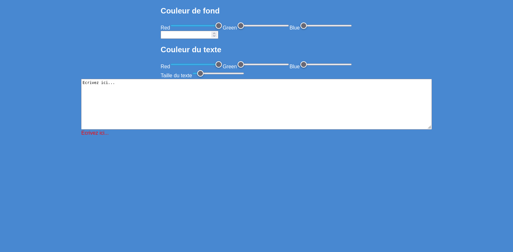
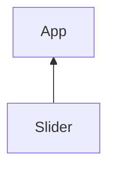
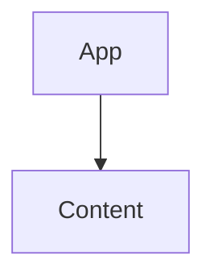

# TP Skyblog
Nous allons créer un mini constructeur de blog type skyblog.

# Rendu final


# I - Le composant Content
Le composant Content contient la zone d'input utilisateur et une balise div.
Voici le HTML de notre composant Content
```jsx
export function Content(){

    return (
        <div>
            <textarea cols="150" rows="10" ></textarea>
            <div>
            </div>
        </div>
    )
}
```
## Le state content, pour modifier le contenu.
Je veux que le texte tapé dans le `textarea` modifie le innerHTML de la balise div.
Il faut donc crée un state `content`, il contient le texte tapé par l'utilisateur.
Par défaut la zone de texte contient l'état content.

```jsx
import { useState } from "react";

export function Content(){
    const [content,setContent] = useState("Ecrivez ici...");

    return (
        <div>
            <textarea cols="150" rows="10" defaultValue={content}></textarea>
            <div>
            </div>
        </div>
    )
}
```
## L'évenement change du `<textarea>` et innerHTML
L'évenement `change` se déclanche sur `<textarea>` à chaque tape du clavier. Je met donc à jour l'état content en fonction de l'évenement `change`.

L'état content met ensuite à jour le contenu innerHTML de la balise `<div></div>`.

React permet de réagir à un évenement en précisant une prop du nom de l'évenement préfixé de "on". 

```jsx
import { useState } from "react";

export function Content(){
    const [content,setContent] = useState("Ecrivez ici...");

    function changeContent(event){
        setContent(event.target.value);
    }
    return (
        <div>
            <textarea onChange={changeContent} cols="150" rows="10" defaultValue={content}></textarea>
            <div dangerouslySetInnerHTML={ {__html: content} }>
            </div>
        </div>
    )
}
```
> J'utilise la prop *dangerouslySetInnerHTML* qui permet de définir le innerHTML d'une balise. Attention, comme son nom l'indique, modifier le innerHTML peut être dangereux et amener à des injections de code malicieux.

Un objet `event` est fournit dans la fonction `changeContent` affectée à la prop `onChange`.
```jsx
<textarea onChange={changeContent} cols="150" rows="10" defaultValue={content}></textarea>
```
Cette event contient la valeur du `<textarea>` qui me permet de mettre à jour le state `content`.
```jsx
function changeContent(event){
    setContent(event.target.value);
}
```
> **Attention !** 
> Il ne faut JAMAIS écrire `onChange={changeContent()}`.
> Les parentèses `()` vont appeler la fonction `changeContent` directement et affecter sa valeur de retour à onChange.
> Nous ne souhaitons pas appeler la fonction instantanement, mais la mettre de coté pour qu'elle s'execute quand l'événement change apparait.

## Affichage du composant Content dans App.
Mon composant est prêt, je l'affiche donc dans le composant racine `<App />`.

```jsx
import { useState } from "react";
import { Content } from "./Content";    // J'importe le composant Content

export function App()
{
    
    return (
        <div>
            <Content />
        </div>
    )
}
```

> N'oubliez pas d'importer le composant Content.

## Ajout du style CSS 
Dans un fichier App.css ajoutez ce style qui permet simplement "d'embellir" notre application.
```css
body{
    margin: 0px;
}

.app{
    min-height: 100vh;
    
    display: flex;
    flex-direction: column;
    justify-content: flex-start;
    align-items: center;
    
    font-family: Arial, Helvetica, sans-serif;
    color:white;
    background-color: rgb(72, 136, 209);
}
```

Ensuite importez le fichier App.css dans App.jsx et ajoutez la classe css app au div racine de App.
```jsx
import "./App.css";                 // J'importe le CSS
import { useState } from "react";
import { Content } from "./Content";    
export function App()
{
    
    return (
        <div className="app">
            <Content />
        </div>
    )
}
```
# Le composant Slider
Nous souhaitons modifier le style CSS du composant `<Content>` via un composant `<Slider>`.

Slider fournira à App la valeur séléctionnée par l'utilisateur à chaque fois qu'il bouge le slider, cette valeur peut être la taille du texte ou encore l'interlignage.


L'objectif, c'est de modifier le style de la balise div du `<Content>`, il faut donc faire passer la donnée du Slider à App, puis de App à Content pour en modifier le style de la `<div>`.



## Le HTML
Le composant Slider est un simple input range.
```js
export function Slider(){
    return (
        <div>
            <label>
                <input type="range" defaultValue={10}/>
            </label>
        </div>
    )
}
```
On le fait apparaitre dans App.
```jsx
import { useState } from "react";
import { Slider } from "./Slider";
import { Content } from "./Content";

export function App(){

    return (
        <div>
            <Slider />
            <Content/>
        </div>
    )
}
```

## Fonction updateTextSize
Le composant App va ensuite fournir une fonction au Slider.

Cette fonction pourra modifier la taille du texte du content.
Pour l'instant elle ne fait que récupérer la donnée avant de l'afficher dans un console.log.

```jsx
import { useState } from "react";
import { Slider } from "./Slider";
import { Content } from "./Content";

export function App(){
    
    function updateTextSize(newValue){
        console.log(newValue);
    }

    return (
        <div>
            <Slider onValueChange={updateTextSize}/>
            <Content />
        </div>
    )
}
```

Slider doit appeler la fonction quand le textarea change et placer la value du `input:range` (newValue) en paramètre.

```jsx
export function Slider({onValueChange}){

    function updateValue(event){
        // Appel de la fonction fournit par app
        onValueChange(event.target.value);  
    }

    return (
        <div>
            <label>
                Range
                <input type="range" onInput={updateValue}  defaultValue={10}/>
            </label>
        </div>
    )
}
```

Vu que la fonction `onValueChange` apparatient à App, App a accès à la valeur passée en paramètre et en profite pour faire des choses avec cette valeur.

Pour l'instant il ne fait qu'un simple `console.log()` de la valeur du input.

```js
function updateTextSize(newValue){
    console.log(newValue);
}
```

Pour plus de flexibilité je rajoute au composant quelques props :
- name, le nom du label
- min et max du input

```jsx

export function Slider({name="Range",onValueChange,min=0,max=100}){

    function updateValue(event){
        onValueChange(event.target.value);
    }

    return (
        <div>
            <label>
                {name}
                <input type="range" onInput={updateValue} min={min} max={max} defaultValue={10}/>
            </label>
        </div>
    )
}
```
Je modifie l'appel du composant Slider dans App.

```jsx
import { useState } from "react";
import { Slider } from "./Slider";
import { Content } from "./Content";

export function App(){
    
    function updateTextSize(newValue){
        console.log(newValue);
    }

    return (
        <div>
            <Slider name="Taille du texte" min={0} max={100} onValueChange={updateTextSize}/>
            <Content />
        </div>
    )
}
```
Voilà, mon composant Slider est pret à être utilisé autant de fois que néccessaire dans mon application.

## Modifier le style du content

Je veux modifier la taille du texte du Content en fonction de la valeur fournit par le Slider.

> Rappelez vous la valeur du slider est disponible en paramètre de la fonction updateTextSize.

Tout d'abord je passe un état `styleContent` en tant que prop à Content.
Par défaut cette état défini le texte en rouge.
```jsx
import { useState } from "react";
import { Slider } from "./Slider";
import { Content } from "./Content";

export function App(){
    
    // Le style défini le texte en rouge par défaut.
    const [styleContent,setStyleContent] = useState({ color : "rgba(255,0,0,1)"});
    
    function updateTextSize(newSize){
        console.log(newSize);
    }

    return (
        <div>
            <Slider name="Taille du texte" onValueChange={updateTextSize}/>
            <Content style={styleContent}/>
        </div>
    )
}
```

Le composant Content va se servir de sa nouvelle prop `style` pour définir le style de la `<div>` qui affiche le contenu.

```jsx
import { useState } from "react";

export function Content({style})    // Une nouvelle prop est disponible !
{
    const [content,setContent] = useState("<h1>Content</h1>");

    function changeContent(event){
        setContent(event.target.value);
    }
    return (
        <div>
            <textarea onChange={changeContent} cols="150" rows="10" defaultValue={content}></textarea>

            <div style={style} dangerouslySetInnerHTML={{__html:content}}>
            </div>
        </div>
    )
}
```

Vous devriez à présent avoir le texte en rouge.

## Modification du style en fonction du Slider

La modification de la taille du texte se fait dans la fonction `updateTextSize`. Je modifie donc l'état `styleContent` à cet endroit.

```jsx
import { useState } from "react";
import { Slider } from "./Slider";
import { Content } from "./Content";

export function App(){
    
    // Le style défini le texte en rouge par défaut.
    const [styleContent,setStyleContent] = useState({ color : "rgba(255,0,0,1)"});
    
    function updateTextSize(newSize){
        setStyleContent({
                ...styleContent,    // Je conserver les autres styles
                fontSize : `${newSize}px`  // J'ajoute le nouveau
            })
    }

    return (
        <div>
            <Slider name="Taille du texte" onValueChange={updateTextSize}/>
            <Content style={styleContent}/>
        </div>
    )
}
```

Bravo, vous avez réussi à modifier dynamiquement le style du contenu !

## Activité, ajoutez des options à notre constructeur de page.
Notre constructeur de page est capable de modifier la taille d'un texte.

L'objectif est de pouvoir le faire évoluer fonctionnalité après fonctionnalité.

Je vais vous assiter dans l'ajout d'une nouvelle fonctionnalité, vous devrez ensuite ajouter les nouvelles features de votre applications par vous même.

### Modifier l'interlettrage
L'ajout d'une nouvelle fonctionnalité se fait toujours de la même manière.

1. Création d'une fonction qui modifie le style voulu dans App, ici l'interlettrage.(Comme la fait précedemment la fonction *updateTextSize*)
2. Ajout d'un nouveau composant pour récupérer l'entrée utilisateur, un Slider, ColorPicker ou autre. Peut importe tant qu'il renvoi la bonne valeur dans une fonction passé en prop.
3. Branchement de la fonction de modification du style avec la prop `onValueChange`.

#### Création de la fonction updateInterlettrage
Dans App ajoutez la fonction `updateInterlettrage` et branchez la à la prop `onValueChange` d'un nouveau composant `<Slide />`.

```jsx
import { useState } from "react";
import { Slider } from "./Slider";
import { Content } from "./Content";
import "./App.css";

export function App(){
    
    const [styleContent,setStyleContent] = useState({ color : "rgba(255,0,0,1)"});

    function updateTextSize(newSize){
        setStyleContent({
            ...styleContent,
            fontSize : `${newSize}px`
        });
    }

    // Nouvelle fonctionnalité
    function updateInterlettrage(newValue){
        setStyleContent({
            ...styleContent,
            letterSpacing : `${newValue}px`
        });
    }

    return (
        <div className="app">
            <div>
                <Slider name="Taille du texte" onValueChange={updateTextSize}/>
            </div>
            <div>
                <Slider name="Interlettrage" onValueChange={updateInterlettrage}/>
            </div>
            <Content style={styleContent}/>
            
        </div>
    )
}
```

Voilà l'intérêt des composants React. Nous avons crée le composant Slider une fois et nous pouvons très facilement le réutiliser.

## Exercice 1 - Padding
Ajouter un Slider qui permet de modifier le padding du contenu.

## Exercice 2 - Couleur du texte
Ajouter un Color Picker qui permet de modifier la couleur du texte.

> Attention, ici le slider n'est pas suffisant il faut utiliser un ColorPicker construit précedemment pour fournir un objet RGB à App via la fonction onValueChange.

A la place d'une simple valeur passée en paramètre comme pour un slider il faut envoyer un objet contenant les valeurs red,green,blue.

Code du ColorPicker :
```jsx
import { useEffect, useState } from "react"

export function ColorPicker({onValueChange}){
    const [red,setRed] = useState(255);
    const [green,setBlue] = useState(0);
    const [blue,setGreen] = useState(0);

    function updateRed(event){
        setRed(event.target.value);
    }
    function updateBlue(event){
        setBlue(event.target.value);
    }
    function updateGreen(event){
        setGreen(event.target.value);
    }

    // Quand un des states red,green ou blue change...
    useEffect(()=>{
        // J'envoie un objet RGB à App via la fonction onValueChange
        onValueChange({
            red : red,
            green : green,
            blue : blue
        });
    },[red,green,blue]);

    return (
        <div >
            <label>Red
                <input type="range" onInput={updateRed} max="255" defaultValue={red}/>
            </label>

            <label>Green
                <input type="range" onInput={updateBlue} max="255" defaultValue={green}/>
            </label>

            <label>Blue
                <input type="range" onInput={updateGreen} max="255" defaultValue={blue}/>
            </label>
        </div>
    )
}
```

### useEffect effectuer une action si un ou plusieurs states changes.
`useEffect` est une fonction qui permet de définir ce qui se passe si un ou plusieurs states changes.

Ici si un states red, green ou blue change, j'execute la fonction onValueChange pour en informer le composant App.
```jsx
    // Quand un des states red,green ou blue change...
    useEffect(()=>{
        // J'envoie un objet RGB à App via la fonction onValueChange
        onValueChange({
            red : red,
            green : green,
            blue : blue
        });
    },[red,green,blue]);    // Je précise la liste des states à écouter dans un tableau.
```

## Exercice 3 - Background color
A partir du ColorPicker crée précedemment, mettez en place la modification de la background color du contenu.

## Exercice 4 - Border Radius
Ajouter un Slider qui permet de modfiier le border radius du contenu.
