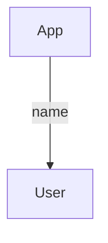

# Fiche rappel react
React permet de créer des application web interactive très rapidement.
Les basiques de react sont :
- Les composants
- Les states
- les props
- Passer des données entre enfants et parents.

## Composants
Un composant est une fonction qui renvoi du HTML.

Il se déclare dans un fichier à part comme ceci.

```jsx
export function MonComposant(){
    return (
        <div>
            <h1>Hello component</h1>
        </div>
    )
}
```

Et s'appel dans un autre composant comme le composant App par exemple de cette manière.
```jsx
import { MonComposant } from "./MonComposant.jsx";

export function App() {

  return (
    <div>
        <MonComposant />
    </div>
  )
}
```

## Props
Je peut parametrer un composant via des propriétés appelées props.
```jsx
import { User } from "./User.jsx";

export function App() {

  return (
    <div>
        <User nom="Louis"/>
    </div>
  )
}
```

```jsx
export function User({nom}){
    return (
        <div>
            <h1>Hello {nom}</h1>
        </div>
    )
}
```

## Evenement
Je peux réagir à un évenement grâce au set de props fournit par React. Comme onClick, onSumbit, onChange onScroll.
```jsx
export function User({nom}){
    return (
        <div>
            <h1>Hello {nom}</h1>
            <button onClick={console.log("Coucou")}>Dire bonjour</button>
        </div>
    )
}
```

## State
Si j'ai besoin d'afficher quelque chose de variables j'utilise un êtat ou *state*.
Les states sont crées avec la fonction useState() qui prend en paramètre la valeur de départ de l'état.
Un etat est dans la grande majorité des cas modifié lors d'un événement.

```jsx
export function User({nom}){
    const [name,setName] = useState(nom);   // Je défini un state name
    function changeName(event){
        const newName = event.target.value;
        setName(newName);   // Je modifier le state quand l'event change apparait
    }
    return (
        <div>
            <input onChange={changeName}/>
            <h1>Hello {name}</h1>
        </div>
    )
}
```

## Faire circuler l'information  dans l'application
Quand vous concevez une application React, réfléchissez toujours a l'arboresence du projet et au chemin que peux parcourir les données.

Parfois un enfant a besoin de données de son parent, parfois c'est le parent que à besoin de récolter des données generé par l'enfant.

### Parent vers Enfant

Si j'ai une information à donner à un enfant je la passe simplement en props.
```jsx
import { User } from "./User.jsx";

export function App() {

  return (
    <div>
        <User nom="Louis"/>
    </div>
  )
}
```

```jsx
export function User({nom}){
    return (
        <div>
            <h1>Hello {nom}</h1>
        </div>
    )
}
```

### Enfant vers Parent

Pour qu'un enfant puisse partager une donnée au parent il faut que le parent, lui fournisse une fonction que le client appellera en placent la donnée en paramètre.

```jsx
import { User } from "./User.jsx";

export function App() {

    function onTyping(text){
        // La donnée du composant User est accessible dans cette fonction
        console.log(text);  
    }

    return (
        <div>
            <User onTyping={onTyping}/>
        </div>
    )
}
```

```jsx
export function User({onTyping}){

    function handleChange(event){
        // J'appelle onTyping et lui fournit la valeur du input
        onTyping(event.target.value);   
    }

    return (
        <div>
            <input type="text" onChange={handleChange}/>
        </div>
    )
}
```

Cette manip peut être pertubante car en soit l'enfant n'envoie pas de donnée au parent à proprement parlé. C'est enfaite le parent qui lui donne la capacité d'executer une fonction dont le comportement est implémenté dans App.
