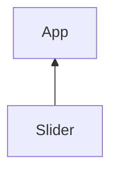

# TP Skyblog
Nous allons créer un mini constructeur de blog type skyblog.

# Rendu final

# I - Afficher le texte tapé par l'utilisateur
Créez le composant Content, il contient une zone de texte qui modifie le contenu d'une balise `<p>`.

Par défaut cette zone de texte contient l'état content.

L'état content permettra de mettre à jour le contenu de la balise `<pre><pre>` quand l'utilisateur écrit.
```jsx
import { useState } from "react";

export function Content(){
    const [content,setContent] = useState("Ecrivez ici...");
    return (
        <div>
            <textarea cols="30" rows="10" defaultValue={content}></textarea>
            <pre>
                {content}
            </pre>
        </div>
    )
}
```
Lorsque l'utilisateur ecrit dans la zone de texte, je met à jour l'état content.

L'état content met ensuite à jour le contenu de la balise `<pre></pre>`.

L'évenement `change` se declanche sur `<textarea>` à chaque tape du clavier.

React permet de réagir à un évenement en précisant une prop du nom de l'évenement préfixé de "on".

```jsx
import { useState } from "react";

export function Content(){
    const [content,setContent] = useState("Ecrivez ici...");

    function changeContent(event){
        setContent(event.target.value);
    }
    return (
        <div>
            <textarea onChange={changeContent} cols="30" rows="10" defaultValue={content}></textarea>
            <pre>
                {content}
            </pre>
        </div>
    )
}
```
Un objet `event` est fournit dans la fonction `changeContent` affectée à `onChange`.
```jsx
<textarea onChange={changeContent} cols="30" rows="10" defaultValue={content}></textarea>
```
> **Attention !** 
> Il ne faut JAMAIS écrire `onChange={changeContent()}`.
> Les parentèses `()` vont appeler la fonction `changeContent` directement et affecter sa valeur de retour à onChange.
> Nous ne souhaitons pas appeler la fonction instantanement mais la mettre de coté pour qu'elle s'execute quand l'événement change apparait.

Je récupère la balise `textarea` via l'attribut `target`.

Puis la valeur de cette zone de texte via l'attribut value.
```jsx
function changeContent(event){
    setContent(event.target.value);     // Le texte écrit par l'utilisateur
}
```

Mon composant est prêt, je l'affiche donc dans le composant racine `<App />`.

```jsx
import { useState } from "react";
import { Content } from "./Content";    // J'importe le composant Content

export function App(){
    
    return (
        <div>
            <Content />
        </div>
    )
}
```

> N'oubliez pas d'importer le composant Content.

# Un composant Slider
Nous souhaitons modifier le style CSS du composant `<Content>` via un composant `<Slider>`.

Slider fournira à App la valeur séléctionné par l'utilisateur à chaque fois qu'il bouge le slider.


L'information doit passer de Slider à App pour recendre dans Content.


```js
export function Slider(){
    return (
        <div>
            <label>
                <input type="range" defaultValue={10}/>
            </label>
        </div>
    )
}
```


```jsx
import { useState } from "react";
import { Slider } from "./Slider";
import { Content } from "./Content";

export function App(){

    return (
        <div>
            <Slider />
            <Content/>
        </div>
    )
}
```
Le composant App va donc fournir une fonction a appeler à Slider.

```jsx
import { useState } from "react";
import { Slider } from "./Slider";
import { Content } from "./Content";

export function App(){
    
    function updateTextSize(newValue){
        console.log(newValue);
    }

    return (
        <div>
            <Slider onValueChange={updateTextSize}/>
            <Content style={styleContent}/>
        </div>
    )
}
```
Slider appel la fonction quand l'input change et place la value du input:range en paramètre.

```jsx
export function Slider({onValueChange}){

    function updateValue(event){
        onValueChange(event.target.value);
    }

    return (
        <div>
            <label>
                Range
                <input type="range" onInput={updateValue}  defaultValue={10}/>
            </label>
        </div>
    )
}
```

Vu que la fonction apparatient à App, App va avoir accès à la valeur passée en paramètre et va pouvoir en profiter pour faire des choses avec cette valeur.

Pour l'instant il ne fait qu'un simple console.log() de la valeur du input.

```js
    function updateTextSize(newValue){
        console.log(newValue);
    }
```

Pour plus de flexibilité je rajoute au composant quelque props :
- name, le nom du label
- min et max du input

```jsx

export function Slider({name="Range",onValueChange,min=0,max=100}){

    function updateValue(event){
        onValueChange(event.target.value);
    }

    return (
        <div>
            <label>
                {name}
                <input type="range" onInput={updateValue} min={min} max={max} defaultValue={10}/>
            </label>
        </div>
    )
}
```

Voilà mon composant Slider est pret à être utilisé autant de fois que néccessaires dans mon application.

## Modifier le style du content

Je veux modifier la taille du texte du Content en fonction de la valeur fournit par le Slider.

J'ai donc besoin d'un etat style à passer au composant Content.

```jsx
import { useState } from "react";
import { Slider } from "./Slider";
import { Content } from "./Content";

export function App(){
    
    const [styleContent,setStyleContent] = useState({ color : "rgba(255,0,0,1)"});
    
    function updateTextSize(newSize){
        setStyleContent({
            ...styleContent,
            fontSize : `${newSize}px`
        });
    }

    return (
        <div>
            <Slider name="Taille du texte" onValueChange={updateTextSize}/>
            <Content style={styleContent}/>
        </div>
    )
}
```

```jsx
import { useState } from "react";
import { ColorPicker } from "./ColorPicker";
import { Slider } from "./Slider";
import { Content } from "./Content";

export function App(){
    
    const [styleContent,setStyleContent] = useState({ color : "rgba(255,0,0,1)"});
    
    function updateTextSize(newSize){
        setStyleContent({
            ...styleContent,
            fontSize : `${newSize}px`
        });
    }

    return (
        <div>
            <Slider name="Taille du texte" onValueChange={updateTextSize}/>
            <Content style={styleContent}/>
        </div>
    )
}
```