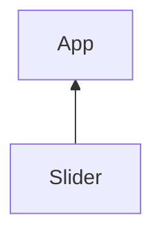
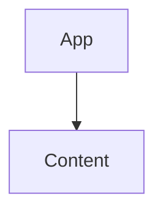

# TP Skyblog
Nous allons créer un mini constructeur de blog type skyblog.

# Rendu final

# I - Afficher le texte tapé par l'utilisateur
Créez le composant Content, il contient une zone de texte qui modifie le contenu d'une balise `<div>`.

Le contenu tapé par l'utilisateur est contenu dans l'etat content.

Par défaut cette zone de texte contient l'état content.

L'état content permettra de mettre à jour le contenu de la balise `<div><div>` quand l'utilisateur écrit.

```jsx
import { useState } from "react";

export function Content(){
    const [content,setContent] = useState("Ecrivez ici...");

    return (
        <div>
            <textarea cols="150" rows="10" defaultValue={content}></textarea>
            <div style={style} dangerouslySetInnerHTML={{__html:content}}>
            </div>
        </div>
    )
}
```
Lorsque l'utilisateur écrit dans la zone de texte, je met à jour l'état content.

L'état content met ensuite à jour le contenu de la balise `<div></div>`.

L'évenement `change` se déclanche sur `<textarea>` à chaque tape du clavier.

React permet de réagir à un évenement en précisant une prop du nom de l'évenement préfixé de "on".

```jsx
import { useState } from "react";

export function Content(){
    const [content,setContent] = useState("Ecrivez ici...");

    function changeContent(event){
        setContent(event.target.value);
    }
    return (
        <div>
            <textarea onChange={changeContent} cols="150" rows="10" defaultValue={content}></textarea>
            <div dangerouslySetInnerHTML={ {__html: "<h1>Hello</h1>"} }>
            </div>
        </div>
    )
}
```

> J'utilise la prop dangerouslySetInnerHTML qui permet de définir le innerHTML d'une balise. Attention, comme son nom l'indique, modifier le innerHTML peut être dangereux et amener à des injections de code malicieux.

Un objet `event` est fournit dans la fonction `changeContent` affectée à la prop `onChange`.
```jsx
<textarea onChange={changeContent} cols="150" rows="10" defaultValue={content}></textarea>
```
> **Attention !** 
> Il ne faut JAMAIS écrire `onChange={changeContent()}`.
> Les parentèses `()` vont appeler la fonction `changeContent` directement et affecter sa valeur de retour à onChange.
> Nous ne souhaitons pas appeler la fonction instantanement, mais la mettre de coté pour qu'elle s'execute quand l'événement change apparait.

Je récupère la balise `textarea` via l'attribut `target`.

Puis la valeur de cette zone de texte via l'attribut value.
```jsx
function changeContent(event){
    setContent(event.target.value);     // Le texte écrit par l'utilisateur
}
```

Mon composant est prêt, je l'affiche donc dans le composant racine `<App />`.

```jsx
import { useState } from "react";
import { Content } from "./Content";    // J'importe le composant Content

export function App()
{
    
    return (
        <div>
            <Content />
        </div>
    )
}
```

> N'oubliez pas d'importer le composant Content.

## Ajout du style CSS 

# Un composant Slider
Nous souhaitons modifier le style CSS du composant `<Content>` via un composant `<Slider>`.

Slider fournira à App la valeur séléctionné par l'utilisateur à chaque fois qu'il bouge le slider, ces valeurs pouront être la taille du texte, des images ou encore l'interlignage.


L'information doit passer de Slider à App puis redescendre dans Content pour en modifier le style.



Le composant Slider est un simple input range.
```js
export function Slider(){
    return (
        <div>
            <label>
                <input type="range" defaultValue={10}/>
            </label>
        </div>
    )
}
```
On le fait apparaitre dans App.
```jsx
import { useState } from "react";
import { Slider } from "./Slider";
import { Content } from "./Content";

export function App(){

    return (
        <div>
            <Slider />
            <Content/>
        </div>
    )
}
```

Le composant App va ensuite fournir une fonction à Slider.

Cette fonction pourra modifier la taille du texte du content.

```jsx
import { useState } from "react";
import { Slider } from "./Slider";
import { Content } from "./Content";

export function App(){
    
    function updateTextSize(newValue){
        console.log(newValue);
    }

    return (
        <div>
            <Slider onValueChange={updateTextSize}/>
            <Content />
        </div>
    )
}
```

Slider appel la fonction quand l'input change et place la value du `input:range` en paramètre.

```jsx
export function Slider({onValueChange}){

    function updateValue(event){
        onValueChange(event.target.value);
    }

    return (
        <div>
            <label>
                Range
                <input type="range" onInput={updateValue}  defaultValue={10}/>
            </label>
        </div>
    )
}
```

Vu que la fonction `onValueChange` apparatient à App, App va avoir accès à la valeur passée en paramètre et va pouvoir en profiter pour faire des choses avec cette valeur.

Pour l'instant il ne fait qu'un simple `console.log()` de la valeur du input.

```js
function updateTextSize(newValue){
    console.log(newValue);
}
```

Pour plus de flexibilité je rajoute au composant quelques props :
- name, le nom du label
- min et max du input

```jsx

export function Slider({name="Range",onValueChange,min=0,max=100}){

    function updateValue(event){
        onValueChange(event.target.value);
    }

    return (
        <div>
            <label>
                {name}
                <input type="range" onInput={updateValue} min={min} max={max} defaultValue={10}/>
            </label>
        </div>
    )
}
```

Voilà mon composant Slider est pret à être utilisé autant de fois que néccessaires dans mon application.

## Modifier le style du content

Je veux modifier la taille du texte du Content en fonction de la valeur fournit par le Slider.

> Rappelez vous la valeur du slider est disponible en paramètre de la fonction updateTextSize.

Tout d'abord je passe un état `styleContent` en tant que prop à Content.
Par défaut cette état défini le texte en rouge.
```jsx
import { useState } from "react";
import { Slider } from "./Slider";
import { Content } from "./Content";

export function App(){
    
    // Le style défini le texte en rouge par défaut.
    const [styleContent,setStyleContent] = useState({ color : "rgba(255,0,0,1)"});
    
    function updateTextSize(newSize){
        console.log(newSize);
    }

    return (
        <div>
            <Slider name="Taille du texte" onValueChange={updateTextSize}/>
            <Content style={styleContent}/>
        </div>
    )
}
```

Le composant Content va se servir de la prop `style` pour définir le style de la `<div>` qui affiche le contenu.

```jsx
import { useState } from "react";

export function Content({style})
{
    const [content,setContent] = useState("<h1>Content</h1>");

    function changeContent(event){
        setContent(event.target.value);
    }
    return (
        <div>
            <textarea onChange={changeContent} cols="150" rows="10" defaultValue={content}></textarea>

            <div style={style} dangerouslySetInnerHTML={{__html:content}}>
            </div>
        </div>
    )
}
```

Vous devriez a présent avoir le texte en rouge.

// Insert image red text result

La modification de la taille du texte se fait dans la fonction `updateTextSize`. Je modifier donc l'état styleContent à cet endroit.

```jsx
import { useState } from "react";
import { Slider } from "./Slider";
import { Content } from "./Content";

export function App(){
    
    // Le style défini le texte en rouge par défaut.
    const [styleContent,setStyleContent] = useState({ color : "rgba(255,0,0,1)"});
    
    function updateTextSize(newSize){
        setStyleContent({
                ...styleContent,
                fontSize : newSize
            })
    }

    return (
        <div>
            <Slider name="Taille du texte" onValueChange={updateTextSize}/>
            <Content style={styleContent}/>
        </div>
    )
}
```

Bravo, vous avez réussi à modifier dynamiquement le style du contenu !

## Activité, ajouter des options à notre constructeur de page.
Notre constructeur de page est capable de modifier la taille d'un texte.

L'objectif est de pouvoir le faire évoluer fonctionnalité après fonctionnalité.

Je vais vous assiter dans l'ajout d'une nouvelle fonctionnalité, vous devrez ensuite ajouter les nouvelles feature de votre applications par vous vous même.

### Modifier l'interlettrage
L'ajout d'une nouvelle fonctionnalité se fait toujours de la même manière.

1. Création d'un fonction qui modifier le style voulu dans App, ici l'interlettrage.
2. Ajout d'un nouveau composant pour récupérer l'entrée utilisateur, un Slider, ColorPicker ou autre. Peut importe tant qu'il renvoi la bonne valeur dans une fonction passé en prop.
3. Branchement de la fonction de modification du style avec la prop `onValueChange`.

#### Création de la fonction updateInterlettrage
Dans App ajouter la fonction updateInterlettrage et branchez la à la fonction onValueChange d'un nouveau composant `<Slide />`.

```jsx
import { useState } from "react";
import { ColorPicker } from "./ColorPicker";
import { Slider } from "./Slider";
import { Content } from "./Content";
import "./App.css";

export function App(){
    
    const [styleContent,setStyleContent] = useState({ color : "rgba(255,0,0,1)"});

    function updateTextSize(newSize){
        setStyleContent({
            ...styleContent,
            fontSize : `${newSize}px`
        });
    }

    // Nouvelle fonctionnalité
    function updateInterlettrage(newValue){
        setStyleContent({
            ...styleContent,
            letterSpacing : `${newValue}px`
        });
    }

    return (
        <div className="app">
            <div>
                <Slider name="Taille du texte" onValueChange={updateTextSize}/>
            </div>
            <div>
                <Slider name="Interlettrage" onValueChange={updateInterlettrage}/>
            </div>
            <Content style={styleContent}/>
            
        </div>
    )
}
```

Voilà l'intêret des composants React. Nous avons crée le composant Slider une fois et nous pouvons très facilement le réutiliser.


## Exercice 1 - Padding
Ajouter un Slider qui permet de modifier le padding du contenu.

## Exercice 2 - Couleur du texte
Ajouter un Color Picker qui permet de modifier la couleur du texte.

> Attention, ici le slider n'est pas suffisant il faut utiliser un ColorPicker construit precedemment pour fournir un objet RGB à App via la fonction onValueChange.

A la place d'une simple valeur passée en paramètre comme pour un slider il faut envoyer un objet contenant les valeurs red,green,blue.


Code du ColorPicker :
```jsx
import { useEffect, useState } from "react"

export function ColorPicker({onValueChange}){
    const [red,setRed] = useState(255);
    const [green,setBlue] = useState(0);
    const [blue,setGreen] = useState(0);

    function updateRed(event){
        setRed(event.target.value);
    }
    function updateBlue(event){
        setBlue(event.target.value);
    }
    function updateGreen(event){
        setGreen(event.target.value);
    }

    // Quand un des states red,green ou blue change...
    useEffect(()=>{
        // J'envoie un objet RGB à App via la fonction onValueChange
        onValueChange({
            red : red,
            green : green,
            blue : blue
        });
    },[red,green,blue]);

    return (
        <div >
            <label>Red
                <input type="range" onInput={updateRed} max="255" defaultValue={red}/>
            </label>

            <label>Green
                <input type="range" onInput={updateBlue} max="255" defaultValue={green}/>
            </label>

            <label>Blue
                <input type="range" onInput={updateGreen} max="255" defaultValue={blue}/>
            </label>
        </div>
    )
}
```

### useEffect effectuer une action si un ou plusieurs etats changes.
useEffect est une fonction qui permet de définir ce qui se passe si un ou plusieurs states changes.


Ici si les states red, green ou blue change j'execute la fonction onValueChange ou en informé le composant App.
```jsx
    // Quand un des states red,green ou blue change...
    useEffect(()=>{
        // J'envoie un objet RGB à App via la fonction onValueChange
        onValueChange({
            red : red,
            green : green,
            blue : blue
        });
    },[red,green,blue]);    // Je précise la liste des states dans un tableau.
```

## Exercice 3 - Background color
A partir du ColorPicker crée précedemment, mettez en place la modification de la background color du contenu.

## Exercice 4 - Border Radius
Ajouter un Slider qui permet de modfiier le border radius du contenu.

## Exercice 5 - Padding
Ajouter un Slider qui modifie le padding du contenu.
