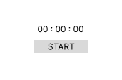

# Activité Chronomètre
Objectif : Créer un chronomètre qui démarre au clic sur un bouton START.


## Pré-requis :
- Date
```js
// Récupérer le temps à un instant T.
const t0 = Date.now();  // Temps en millisecondes
const date = new Date(Date.now() - t0); // Delta de temps
```
- setTimeout
- useState

# Correction
<pre>


plus bas...
attention no spoil


</pre>

*App.jsx*
```jsx
import { useState } from "react"

export function App(){

    const [isRunning,setIsRunning] = useState(false);
    const [t0,setTZero] = useState(0);
    const [date,setDate] = useState(new Date(0));
    
    function start(){
        setTZero(Date.now());
        setIsRunning(true);
    }
    
    setTimeout(()=>{
        if(isRunning){
            setDate(new Date(Date.now() - t0));
        }   
    },1000)

    
    return (
        <div>
            <p>{date.getHours()} : {date.getMinutes()} {date.getSeconds()}</p>
            <button onClick={start}>START</button>
        </div>
    )
}
```