# SQL - Le Langage SQL
Lorsque que vous accédez à un serveur MySQL vous avez un invité de commande similaire à celui ci,
```sql
mysql>
```
Pour la suite du cours j'ometterai l'écriture du prompt `mysql>` lors de la rédaction de requête.

# Documentations
- Réference exhaustive de MySQL et SQL: https://dev.mysql.com/doc/refman/8.0/en/sql-statements.html
- La doc w3schools pour trouvez une infos rapidement : https://www.w3schools.com/sql/default.asp
- sql.sh pour trouver une infos rapidement et avec plus de contexte **en français**: https://sql.sh/
# Un tour du SQL
Ici vous retrouverez un inventaire rapide des requêtes les plus importantes du langage SQL. Il en existe bien d'autres très importantes mais celle-ci représentes les bases du SQL.

> Par convention en SQL les mots en MAJUSCULE sont les mots réservés du langage.

Pour la suite du tour nous prendrons comme exemple une boutique de vente en ligne de chaussures nommée : *shoe-shop.com*.
## CREATE DATABASE - Créer un base de donnée
**Syntaxe :**
```sql
CREATE DATABASE database_name;
```
**Exemple :**
```sql
CREATE DATABASE shoe_shop;
```
Cette base de donnée contiendra les tables de l'entiéreté de la boutique en ligne.

> Une requête SQL fini par un point-virgule : **;**

### Lister les databases existantes.
**Syntaxe:**
```sql
SHOW DATABASES;
```

## USE - Accèder à la base de donnée
`USE` permet d'accéder à une base de donnée pour ensuite y créer,modifier ou supprimer des tables.
#### **Cette requête est obligatoire pour le fonctionnement des requêtes suivantes !**
**Syntaxe :**

```sql
USE database_name;
```
**Exemple :**
```sql
USE shoe_shop;
```
## CREATE TABLE - Créer une table de donnée
Une table de donnée est défini par des colonnes et chaque colonne est défini par un nom et un type de donnée SQL.

**Un résumé des types de données les plus commun** ici : https://www.w3schools.com/sql/sql_datatypes.asp
Pour des infos exhaustives sur les types de données SQL : https://dev.mysql.com/doc/refman/8.0/en/data-types.html.


**Syntaxe :**
```sql
CREATE TABLE table_name (
    column_name1 datatype,
    column_name2 datatype,
    column_name3 datatype,
    ...
    );
```
**Exemple :**
```sql
CREATE TABLE category(
    id INT PRIMARY KEY AUTO_INCREMENT,
    name TINYTEXT,
    description TEXT
);
```
**Résultat :**
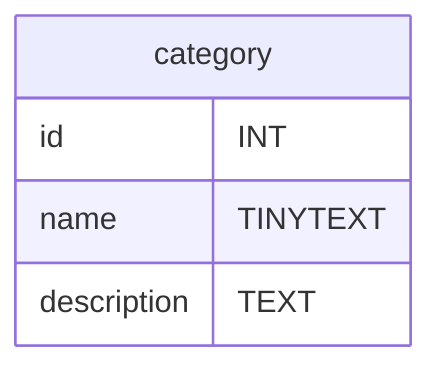
- `INT` signifie integer soit **un nombre entier**, c'est le type de la colonne `id`.
- `TINYTEXT` **est un texte de 255 caractères maximum**, c'est le type de la colonne `name`.
- `TEXT` **est un texte de 65 535 caractères maximum**, c'est le type de la colonne `description`.
- `PRIMARY KEY` **défini la colonne id comme etant l'identifiant unique des catégories ou *clé primaire*.** La majorité des tables SQL possèdes une colonne `id` en tant que clé primaire, cela simplifie l'accès au élements et permet la mise en relation de table.
- `AUTO_INCREMENT` **défini automatiquement l'id d'un nouvelle élement** en incrementant de +1 par rapport à l'id du dernière élement crée.

> Un caratère est habituellement stocké dans 1 octet et `TEXT` peut contenir 65 535 octets, il est bon à savoir qu'un emoji peut parfois prendre 3 ou 4 octets en mémoire.


### Clé primaire et clé étrangère
Les élements d'une table SQL sont identifiés par leurs clé primaire, cette clé est un `INT` défini grâce à la commande `PRIMARY KEY`. Une clé primaire peut être réferencé dans la colonne d'une autre table si les deux tables sont liés, on appelle cela une clé étrangère.

Par exemple un produit contiendra l'id de sa catégorie.

#### **Création de la table produits :**
Un produit référence la catégorie auquel il appartient grâce à une clé étrangère et la commande `FOREIGN KEY`

```sql
CREATE TABLE product(
    id INT PRIMARY KEY AUTO_INCREMENT,
    name TINYTEXT,
    description TEXT,
    price FLOAT,
    categoryId INT,
    FOREIGN KEY (categoryId) REFERENCES category(id)
    );
```
> Notez que la syntaxe est différente de `PRIMARY KEY`, il faut d'abord définir la colonne puis la définir en tant que clé étrangère.

## **Ajout d'un élement: INSERT INTO**
Pour ajouter une ligne dans une table il faut utiliser la commande `INSERT INTO`.
**Syntaxe :**
```sql
INSERT INTO table_name (columnName1,columnName2,...) VALUES(
    value1,
    value2,
    ...
);
```
**Exemple, ajouter une categorie :**
```sql
INSERT INTO category (name,description) VALUES(
    "Sneakers",
    "Baskets sneakers Femme homme pour toute la famille!",
);
```
Une nouvelle catégorie à été ajoutée à la table de catégorie.

On peut maintenant ajouter un produit :

**Exemple, ajouter un produit :**

Je repère l'id de la catégorie "sneakers" pour y rajouter des Adidias stansmith.
```sql
mysql> SELECT id,name from category;
+----+----------+
| id | name     |
+----+----------+
|  1 | sneakers | # La catégorie "sneakers" a pour clé primaire 1
+----+----------+
1 row in set (0,00 sec)
```

**J'ajoute un produit :**
```sql
INSERT INTO product (name,description,price,categoryId) VALUES(
    "Adidas stansmith 42",
    "Blabla",
    99.99,
    1       # Je fournis 1 en temps que clé étrangère
);
Query OK, 1 row affected (0,02 sec)
```
> **Attention !**  Un produit à besoin d'une catégorie pour être inséré, il faut donc bien créer une catégorie avant de créer un produit !
>Si j'avais écrit 5 en tant que clé étrangère alors qu'aucune categorie n'a 5 comme id, SQL m'aurait renvoyé une erreur.

## DESCRIBE, connaitre la structure d'une table
Pour connaitre les colonnes d'une table, utilisez la commande `DESCRIBE`
**Syntaxe :**
```sql
DESCRIBE table_name;
```
**Exemple :**
```sql
DESCRIBE category;
```

## INSERT INTO
Pour rajouter une nouvelle ligne à une table utilisez la commande `INSERT INTO`
**Syntaxe :**
```sql
INSERT INTO table_name (column_name1,column_name2) VALUES (
    column_value1,
    column_value2
    );
```
**Exemple :**
```sql
INSERT INTO category (name,description) VALUES (
    "sneakers",
    "Chaussures unisexe pour la vie quotidienne."
    );
```
> La colonne `id` est `AUTO_INCREMENT`, c'est MySQL qui défini sa valeur il ne faut donc pas la fournir à la création.

## SELECT ... FROM
Selectionner certaine colonnes d'une table.
```sql
SELECT name,description FROM category;
```
Selectionner toutes les colonnes.
```sql
SELECT * FROM category;
```
> Notez bien que l'on parle de *selection* et pas d'*affichage*, SQL n'à pas vocation à afficher quoi que soit. Au final les données seront envoyées dans un `Array` PHP, JavaScript ou autre puis éventuellement affichées dans le front-end.
### AS - Alias, selectionner plus qu'une simple colonne
Il est possible de construire des resultats plus fin grace au alias.
```sql
SELECT CONCAT(name,",",description) AS complete_text FROM category;
+------------------------------------------------------+
|                   complete_text                      |
+------------------------------------------------------+
| sneakers,Chaussures unisexe pour la vie quotidienne. |
+------------------------------------------------------+
1 row in set (0,00 sec)
```
> `CONCAT()` est une fonction SQL qui concatène les chaines de caractère entre elle, à la différence de JavaScript on ne peut pas juste utiliser un **+**, le **+** etant réservé à l'addition.

### Jointure - JOIN
La docuementation de W3Schools pour toutes les infos sur `JOIN` : https://www.w3schools.com/sql/sql_join.asp

Vous pouvez utiliser `JOIN` pour effectuer une jointure entre deux tables et sortir un résultat qui dépend des données des deux tables.
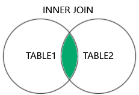
*Image provenant du site w3schools*
**Syntaxe**
```sql
SELECT ... FROM table1 INNER JOIN table2 ON table1.column = table2.column;
```

**Exemple**
Soit une table d'utilisateurs `client` et une table de commandes `order`.
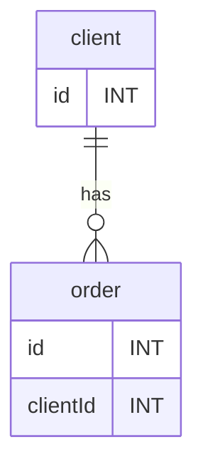
**Je selectionne tout les clients qui on une commande.**
```sql
SELECT * FROM client INNER JOIN order ON client.id = order.clientId;
```

## Filtrer la sélection avec les conditions
### WHERE
`WHERE` est en quelque sorte le `if` du SQL.
```sql
# Test egalité
SELECT * FROM category WHERE name = "sneakers"; 
SELECT * FROM category WHERE id = 1;

# ET Logique
SELECT * FROM product WHERE price > 10 AND price < 50;
# OU Logique
SELECT * FROM product WHERE price < 10 OR price > 50;

# Test selon un pattern
SELECT * FROM category WHERE name LIKE "s%"; # name commence par 's'
SELECT * FROM category WHERE name LIKE "%s"; # name fini par 's'
SELECT * FROM category WHERE description LIKE "%vie%"; # name contient 'vie'
```
On peut imaginer utiliser `LIKE` pour la requête d'une barre de recherche par exemple, plus d'info ici : https://www.w3schools.com/mysql/mysql_like.asp.

### ORDER BY
Toutes les catégories dans l'ordre alphabétique
```sql
SELECT * FROM category ORDER BY name; 
```

Toutes les catégories dans l'ordre anti-alphabétique
```sql
SELECT * FROM category ORDER BY name DESC; 
```

Tout les produits du moins chère au plus chère.
```sql
SELECT * FROM product ORDER BY price;
```

### LIMIT
Selectionne les 50 premières lignes de la table `product`.
```sql
SELECT * FROM product LIMIT 50;
```

## DELETE - Supprimer une ligne
```sql
DELETE FROM category WHERE id = 2;
```
> Rechercher un élément via son `id` permettra d'ecrire des requêtes HTTP comme celle ci :
>**Récuperer le produit qui a pour id 2.**
>```http
>GET https://shoe-shoes.com/product/2 HTTP/1.1
>```
>**Supprimer le produit qui a pour id 4.**
>```http
>DELETE https://shoe-shoes.com/product/4 HTTP/1.1
>```
> 

## UPDATE - modifier une ligne
**Syntaxe :**
```sql
UPDATE table_name SET column_name = new_value WHERE some_column = some_value;
```
**Exemple :**
```sql
UPDATE category SET description = "Sneakers faites à Limoges !" WHERE name = "sneakers";
```
### Incrémentation d'une colonne
Comme dans les langages de programmation le SQL me permet d'effecter des incrementations ou 
## TRUNCATE TABLE, vider une table
Vide tout le contenu d'une table sans la supprimer de la base.
**Exemple :**
```sql
TRUNCATE TABLE table_name;
```
**Exemple :**
```sql
TRUNCATE TABLE category;
```
## DROP TABLE, supprimer un table !
**Syntaxe :**
```sql
DROP TABLE table_name;
```
**Exemple :**
```sql
DROP TABLE category;
```
> **ATTENTION !** DROP TABLE supprime completement le contenu et la strucutre de la table ! Il n'en restera rien.

## ALTER TABLE, modifier la structure d'une table.
`ALTER` permet de rajouter, modifier ou supprimer une colonne d'une table.
Voir la doc W3S : https://www.w3schools.com/mysql/mysql_alter.asp

**Syntaxe :**
```sql
ALTER TABLE table_name ALTER_OPTION ...;
```
`ALTER_OPTION` peut être :
- `ADD`
- `DROP`
- `MODIFIY COLUMN`
### Ajouter une colonne
**Syntaxe :**
```sql
ALTER TABLE table_name ADD column_name datatype;
```
**Exemple :**
```sql
ALTER TABLE product ADD short_description TINYTEXT;
```

### Supprimer une colonne
**Syntaxe :**
```sql
ALTER TABLE table_name DROP column_name;
```
**Exemple :**
```sql
ALTER TABLE category DROP description;
```

### Modifier le type d'une colonne
```sql
ALTER TABLE table_name MODIFY COLUMN column_name datatype;
```
```sql
ALTER TABLE product MODIFY COLUMN short_description TEXT;
```

# Structurer sa BDD SQL
Structurer sa base de données SQL se fait en plusieurs étapes 
- Définir les actions CRUD de la base
- Definir les tables principales de la base
- Définir les relations entres le table
- Ecrire les requêtes SQL pour créer les tables.

# Comprendre les BDD grâce au opérations CRUD.
Le **CRUD** (**C**reate, **R**ead, **U**pdate, **D**elete) désigne les quatre catégories d'opérations élementaires pour la persitance des données.

Le CRUD c'est :
- **Create**, *créer* une table, une base ou inserer une ligne dans une table sont des actions de **création**.
- **Read**, *lire* le contenu d'une table, la structure d'une table ou récupérer des données sont des actions de **lecture**.
- **Update**, *mettre à jour* le contenu d'une table, changer la structure d'une table, ajouter une nouvelle colonne, change le type de donnée d'une colonne, modifier une ligne de la table. Ce sont des actions de **modifications**.
- **Delete**, *supprimer* une table, une base, une ligne, une colonne. Ce sont des actions de **suppression**.

Lorsque vous concevez la partie persitance des données d'une logiciel vous devez identifier les différentes actions neccessaires sur votre base et dans quelle catégorie CRUD elles se situes pour en déduire votre BDD.

Pour une boutique en ligne on aurait par exemple : 
|Action|Type d'action(CRUD)|Requête SQL|
|-|-|-|
|Voir la page produit   |Read   |SELECT FROM    |
|Ajouter un produit     |Create |INSERT INTO    |
|Modifier un produit    |Update |UPDATE SET     |
|Changer un produit de catégorie|Update|UPDATE SET|
|Supprimer un produit   |Delete |DELETE FROM    |
||||
|Voir une catégorie     |Read   |SELECT FROM    |
|Ajouter une categorie  |Create |INSERT INTO    |
|Supprimer une categorie|Delete |DELETE FROM    |
|Modifier une categorie |Update |UPDATE SET     |

> Les actions défini dans le tableau plus haut sont défini à partir d'un diagramme de cas d'utilisateur UML.

Une fois les actions définis on repère les différentes tables principales de notre base de données. 
Pour shoe-shop.com les tables `category` et `product` auquelles on rajoute les clés primaires et les colonnes spécifique à chaque tables.
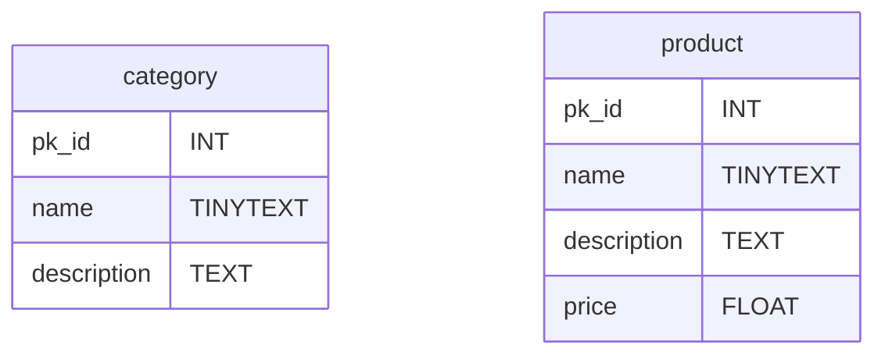
# Relations entre les tables
Une fois la structure élementaires des tables défini il faut réflechir au relations entre les tables.
> La structure élementaire d'une table ce sont la colonne clé primaire et les colonnes inérente à l'entité representé par la table (un produit, une catégorie, une voiture).

Les relations entre les tables SQL sont défini par les liaisons entre les clés primaires et clés étrangères, il existe 3 types de liaisons :
- **One to Many**, Un élement est référencé dans plusieurs élements d'une autre table. Une categorie est referencé dans plusieurs produits de la table product.
- **One to One**, un élement est référencé dans un seul et unique element d'une autre table. Un utilisateur est référencé dans un seul et unique element de la table panier ou encore un citoyen n'est referencé dans un seul et unique element de la table carte_vitale.
- **Many to Many**, ce n'est pas une liaison mais un ensemble de deux liaisons. Quand deux table sont lié via une liaison one to many dans les deux sens alors on à une liaison Many to Many. Une catégorie peut évidement avoir plusieurs produit mais mon produit peut avoir plusieurs catégorie.

> Dans les cas des liaisons One to Many et One to One les tables sont connectés dans l'autre sens par une liaisons One to One.

Les relations entre les tables sont théoriques et leurs applications en langage SQL permet de les créer, nous verrons la manière de mettre en place ces liaisons en SQL plus tard.

## Diagrame d'entitié relations des relations
Pour representer les relations entre les tables on utilise un diagramme UML dit d'entité relation (ER).
> Une entité c'est simplement un élément de la table.

Voici à quoi ressemble un diagramme ER.
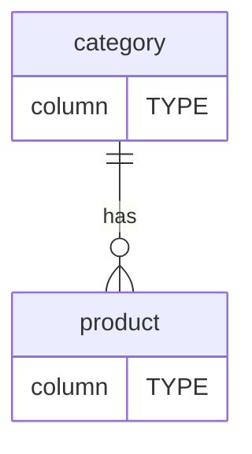
Les deux table sont relié par une ligne qui défini la relation de la table `category` envers la table `product` et de la table `product` envers la table `category`.
Le mot du centre est un verbe que l'on place pour donner un "sens humain" au lien qui est fait entre ces deux tables.

On lit  : **" One category has `Zero` or `Many` products"**.
On lit aussi : **"One product has `One` category"**.

>La lecture commence toujours par "One ..."
### Les symboles
|Value|Image|
|-|-|
|`One`||
|`Many`||
|`Zero`||
|`One ou Zero`||
|`Zero ou Many`||
|`One ou Many`||

> #### **Attention !**
> Ne confondez pas le symbole `One`(double barre) avec le mot One de la phrase : "**One** to Many" ou "**One** to One". Le mot **One** est toujours présent dans la description d'une liaison.
Le schéma represente une liaison `One to Many` de `category` vers `product`. Mais le symbole `One` (double barre) ne change rien à la phrase **One to Many**.
> **Imaginez les liaisons comme des harpons le symbole qui compte est au bout du harpon pas au début !**
>```mermaid
>erDiagram
>    category ||--o{ product : contient
>    category {
>        column TYPE
>    }
>    product {
>        column TYPE
>    }
>```
> Dans le schéma suivant j'ai toujours une liaison One category to `Many` product alors que le symbole `One` été remplacé par le symbole `Many`.
>```mermaid
>erDiagram
>    category }|--o{ product : contient
>    category {
>        column TYPE
>    }
>    product {
>        column TYPE
>    }
>```
>
### One to Many
La clé étrangère est sur la table ciblé par le symbole`Many`, ici la table `product`.
*One `category` has `Many` `product`.*
*One `product` has `One` `category`.*
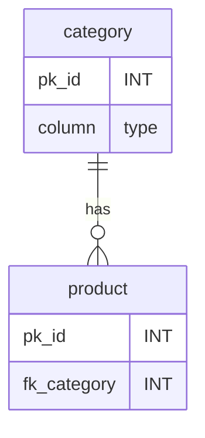
#### Implémentation
Soit la table category : 
```sql
mysql> DESCRIBE category;
+-------------+----------+------+-----+---------+----------------+
| Field       | Type     | Null | Key | Default | Extra          |
+-------------+----------+------+-----+---------+----------------+
| id          | int      | NO   | PRI | NULL    | auto_increment |
| name        | tinytext | YES  |     | NULL    |                |
| description | text     | YES  |     | NULL    |                |
+-------------+----------+------+-----+---------+----------------+
3 rows in set (0,00 sec)
```
A la création de la table `product` il vous faut définir une colonne comme étant une clé étrangère de la table `category`.
```sql
CREATE TABLE product(
    id INT PRIMARY KEY AUTO_INCREMENT,
    name TEXT,
    price FLOAT,
    fk_category INT,
    FOREIGN KEY (fk_category) REFERENCES category(id)
);
```

### One to One 

La clé étrangère doit être sur la table ciblé par `One` et elle doit être `UNIQUE`, la clé primaire est déjà par défaut unique.
*One `user` has `One` `cart`.*
*One `cart` has `One` `user`.*

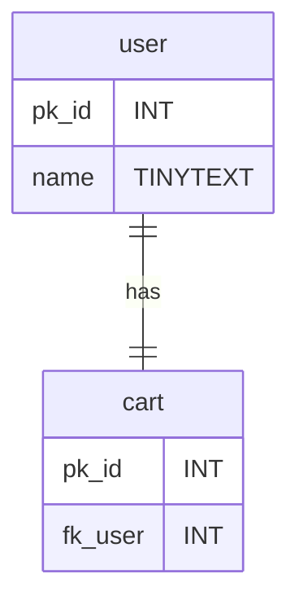
#### Implémentation
```sql
CREATE TABLE user(
    pk_id INT PRIMARY KEY AUTO_INCREMENT,
    name TINYTEXT
);
CREATE TABLE cart(
    pk_id  INT PRIMARY KEY AUTO_INCREMENT,
    fk_user INT UNIQUE,
    FOREIGN KEY (fk_user) REFERENCES user(pk_id)
);
```
Chaque element de la colonne `cart.fk_user` doit etre `UNIQUE` donc il ne pourra jamais avoir deux paniers qui réferences le même utilisateur. ;)

### Many to Many
Pour effectuer une relation `Many to Many`, une troisème table doit être crée elle contient : 
- une `primary key`
- la `clé étrangère` de la table A 
- la `clé étrangère` de la table B.

Imaginons qu'un produit ai plusieurs categories.
*One `category` has `Many` `product`.*
*One `product` has `Many` `category`.*

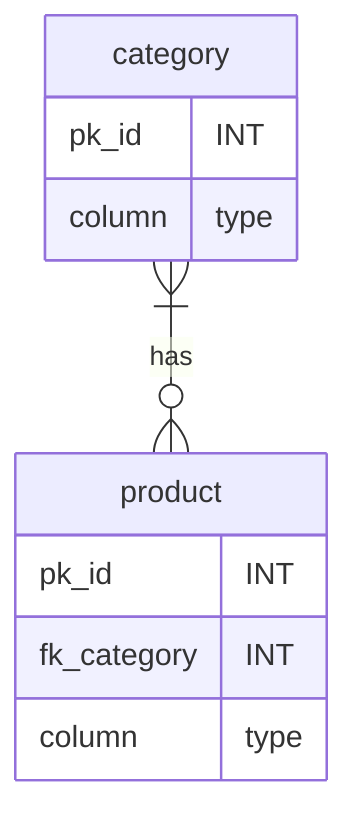
#### Problématique
Mon produit devrait maintenant avoir plusieurs catégories, donc plusieurs `clés étrangères` ? C'est impossible car on sais qu'une `clé étrangère` ne peut contenir qu'une une `clé primaire` !

**Mon produit ne poura donc jamais contenir les clés étrangère de plusieurs catégorie !?**

#### La solution
 Une troisème table qui encaissera les liaisons `One to Many` des deux tables ou **chaque ligne contient la clé étrangère d'un produit et la clé étrangère d'une catégorie**.
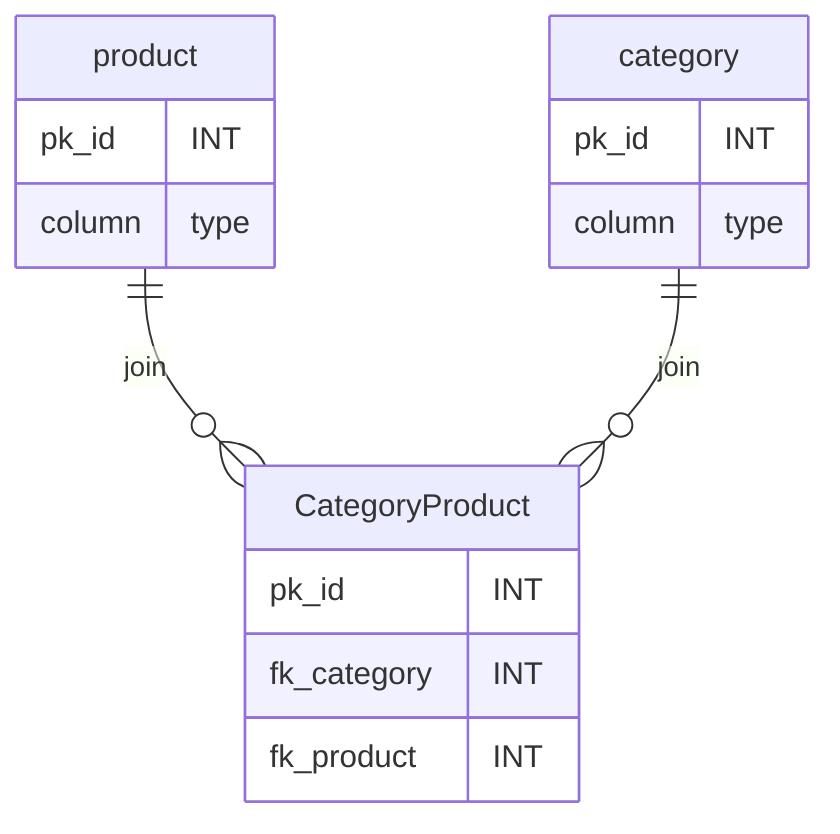
> `fk_` singifie FOREIGN KEY
> `pk_` singifie PRIMARY KEY


#### La table de jointure.
La troisème table est appelé table de jointure.
Une table de jointure est une table qui ne represente pas une entité réel de notre application mais sert simplement à mettre en place la liaison `Many to Many`, voyez cela comme une "table utilitaire".

Une table de jointure doit contenir le moins de chose possible elle n'a pas vocation à faire plus que joindre deux tables.
Elle possède comme colonnes minimales :
- **Une `clé etrangère`** de la table A : *fk_category*
- **Une `clé étrangère`** de la table B : *fk_product*


**La `clé primaire`** n'est pas présente en tant que colonne mais simplement en tant que contrainte. Elle sera composée des deux clés étrangères pour rendre chaque lignes unique et éviter les doublons.

>Par convention les tables de jointure on comme nom le nom des deux tables concaténées en CamelCase.

Pour les tables `category` et `product`  la table s'appelle `CategoryProduct` :
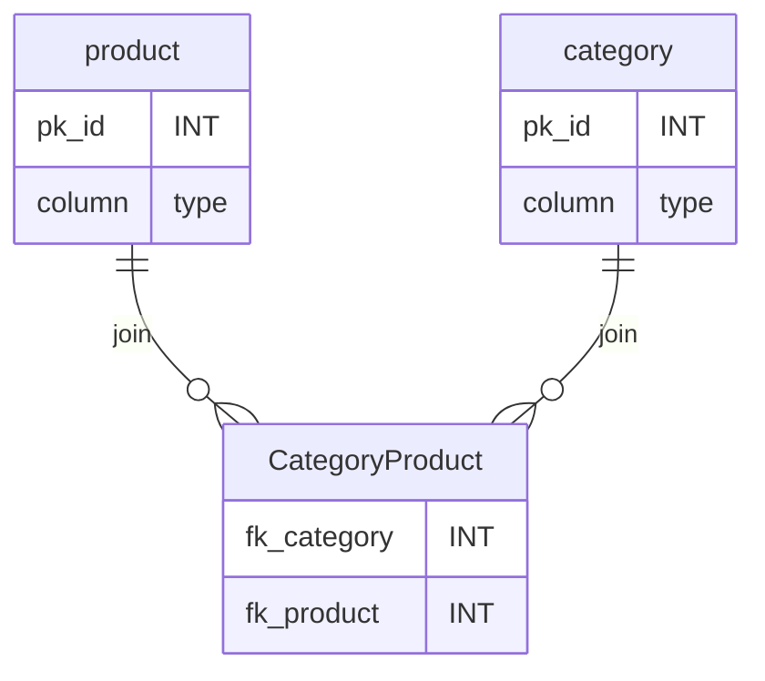
#### Implémentation Many to Many
```sql
CREATE TABLE category(
    pk_id INT PRIMARY KEY AUTO_INCREMENT,
    name TINYTEXT
);
CREATE TABLE product(
    pk_id  INT PRIMARY KEY AUTO_INCREMENT,
    name TINYTEXT,
    price FLOAT
);
CREATE TABLE CategoryProduct(
    fk_category INT,
    fk_product INT,
    PRIMARY KEY (fk_category,fk_product)
    FOREIGN KEY (fk_category) REFERENCES category(pk_id)
    FOREIGN KEY (fk_product) REFERENCES product(pk_id)
);
```
> Notez la présence de deux `FOREIGN KEY` dans la table de jointure et la disparition de `FOREIGN KEY` dans la table `product`.
#### Ajouter un produit à une catégorie 
Pour rajouter un produit à une catégorie il suffit d'inserer une nouvelle entrée dans la table CategoryProduct avec l'id du produit concerné et de la categorie dont il fait maintenant partie avec `INSERT INTO`.

**Exemple**
```sql
mysql> SELECT * FROM product;
+-------+------------------------+-------+
| pk_id | name                   | price |
+-------+------------------------+-------+
|     1 | Talon Clarks taille 36 |    60 |
+-------+------------------------+-------+
1 row in set (0,00 sec)

mysql> SELECT * FROM category;
+-------+-------+
| pk_id | name  |
+-------+-------+
|     1 | talon |
+-------+-------+
1 row in set (0,00 sec)

mysql> DESCRIBE CategoryProduct;
+-------------+------+------+-----+---------+----------------+
| Field       | Type | Null | Key | Default | Extra          |
+-------------+------+------+-----+---------+----------------+
| fk_category | int  | YES  | MUL | NULL    |                |
| fk_product  | int  | YES  | MUL | NULL    |                |
+-------------+------+------+-----+---------+----------------+
3 rows in set (0,01 sec)
```
Je rajoute un produit dans une catégorie.
```sql
mysql> INSERT INTO CategoryProduct (fk_category,fk_product) VALUES (
    -> 1,
    -> 1
    -> );
Query OK, 1 row affected (0,01 sec)
```

#### Effectuer la requête `SELECT` pour une table de jointure.
Une fois que l'on a compris la liaison **Many to Many** et la nécessité d'une table de jointure, une question se pose.
*"Maintenant que les clés étrangères sont dans une troisième table, comment est ce que je vais pouvoir récupérer, par exemple, tous les produits d'une certaine catégorie ?"*

Nous devons récupérer les données d'une table A (Product) en fonction des données d'une autre table (CategoryProduct).

**La solution ?**

``INNER JOIN``

**Exemple Many to Many :**
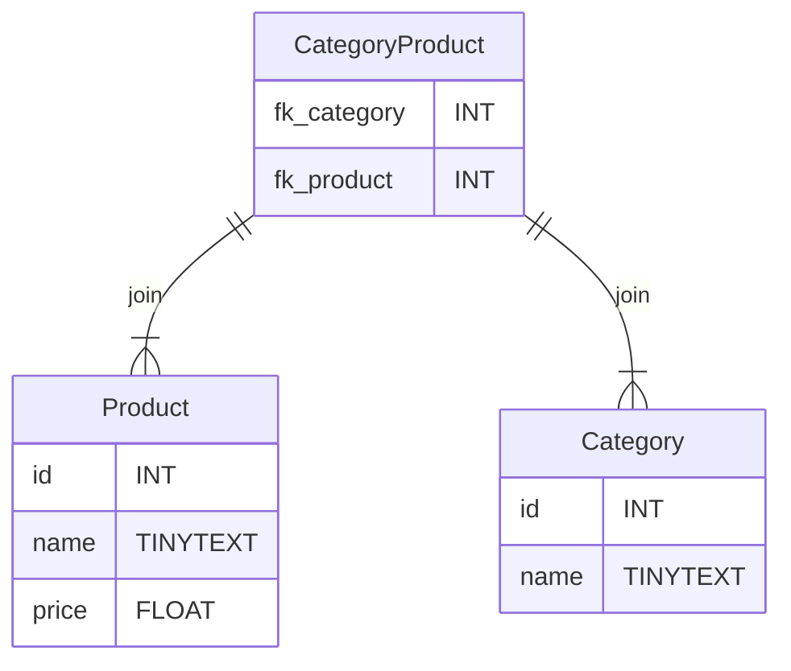
Dans la table `Produit` nous avons :
```sql
SELECT * FROM `Product`;
```
|id|name|price|
|-|-|-|
1	|air max	                   |     100	
2	|Botte de ski taille 43	      |  150	
3	|puma sport 2022	          |      144	
4	|converse all stars taille 42|	60	
5	|UGG Femme taille 38	      |    130	

Dans la table `Category` nous avons :
```sql
SELECT * FROM `Category`;
```
|id|name|
|-|-|
|id	|name	
|1	|Sneakers	
|2	|Bottes	

Dans la table de jointure `CategoryProduct` :
```sql
> SELECT * FROM `CategoryProduct`;
```
|fk_category|fk_product|
|-|-|
|1	|1	
|2	|2	
|1	|3	
|1	|4	
|2	|5	
> `fk_category` : 1 représente les *sneakers*
> `fk_category` : 2 représente les *bottes*
#### Solution :
Pour récupérer tout les produits qui ont pour catégorie *sneakers* (1) :
```sql
SELECT 
    name,
    price,
    CategoryProduct.fk_category as categoryId 
FROM Product 
INNER JOIN CategoryProduct ON
    CategoryProduct.fk_category = 1 
    AND 
    Product.id = CategoryProduct.fk_product;
```
Résultat :
|name|price|categoryId
|-|-|-|
|name	|price	|1
|air max	|100|1	
|puma sport 2022	|144	|1
|converse all stars taille 42	|60	|1

> `INNER JOIN` permet de sélectionner les colonnes de plusieurs tables et de filtrer les lignes grâce à `ON`. Dites vous que `ON` est un peu comme un `if` en programmation.

> INNER JOIN nous a permis de créer une condition qui utilise la table de jointure `CategoryProduct` et la table `Product`.

> **Méthode :**
> Quand vous devez récupérez des données et qu'une liaison `Many to Many` rentre en compte.
> 1. Commencez par `SELECT` la table qui vous intéresse :
>``` 
>SELECT ... FROM Product 
>```
>
>2. Puis filtrez les lignes avec `INNER JOIN` et le mot clé `ON` à la manière d'un `if` en programmation.
>```sql
>INNER JOIN CategoryProduct ON
>CategoryProduct.fk_category=1
>AND 
>Product.id=CategoryProduct.fk_product;
>```

#### Pour aller plus loin
Pour aller plus loin, je peux même utiliser un alias et une requête imbriquée pour récupérer le nom de la catégorie dans la foulée et éviter de devoir envoyer plusieurs requêtes.
*Voir requête imbriquée : https://sql.sh/cours/sous-requete*
```sql
SELECT 
    name,
    price,
    (SELECT name FROM Category WHERE id = 1) as categoryName,
    CategoryProduct.fk_category as categoryId 
FROM Product 
INNER JOIN CategoryProduct ON 
    CategoryProduct.fk_category=1 
    AND 
    Product.id=CategoryProduct.fk_product; 
```

## La cardinalité
La cardinalité c'est le nombres de liens possibles d'une table à une autre. Elle permet de choisi entre les choisirs quelque symbole utiliser dans notre diagramme d'entité relation.

Définir la cardinalité de deux tables ce fait en deux étapes :
1. Connaitre la cardinalité de la table A vers la table B :
    - Combien de lien un element de A peut avoir au maximum vers une element de B ?
    - Combien de lien un element de A peut avoir au minimum vers une un element de B ?
    - Quelle liaison cela donne t-il : One to One ou One to Many ?
2. Dans l'autre sens il faut maintenant connaitre la cardinalité de la table B vers la table A :
    - Combien de lien un element de B peut avoir au maximum vers une element de A ?
    - Combien de lien un element de B peut avoir au minimum vers une un element de A ?
    - Quelle liaison cela donne t-il : One to One ou One to Many ?
3. La liaison qui contien Many est la liaison qui défini la relation entre les table.
    - Si il y a deux One to One alors la relation est One to One.
    - Si il y a un et uniquement un One to Many alors la relation est One to Many.
    - Si il y a deux One to Many alors la relation est Many to Many.


**Exemple :**
Voici les tables `product` et `category` où chaque produit ne peut avoir qu'une seule catégorie et chaque catégorie peut etre lié à une infinité de produit.

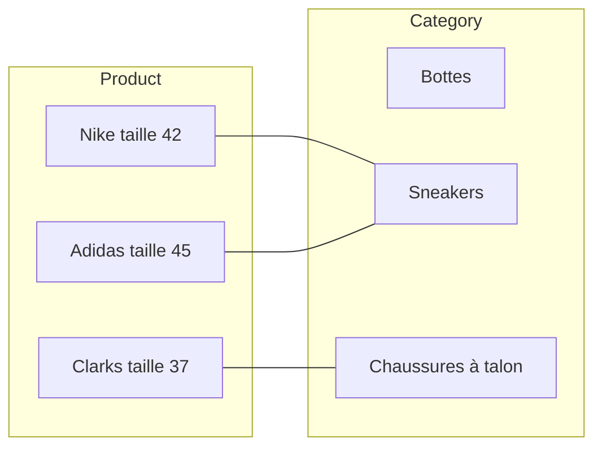

1. Connaitre la cardinalité de la table `produit` vers la table `categorie` :
    - Combien de lien un produit peut avoir au maximum vers une categorie ?
    **Réponse : 1.**
    - Combien de lien un produit peut avoir au minimum vers une categorie ?
    **Réponse : 1.**
    - Quelle liaison cela donne t-il : One to One ou One to Many ?
    **Réponse : One to `One` car on a un produit pour une categorie.**
2. Dans l'autre sens il faut maintant connaitre la cardinalité de la categorie vers la produit :
    - Combien de lien une categorie peut avoir au maximum vers un produit ?
    **Réponse : N (une nombre entier positif infini)**
    - Combien de lien une categorie peut avoir au minimum vers un produit ?
    **Réponse : 0**
    - Quelle liaison cela donne t-il : One to One ou One to Many ?
    **Réponse : One to `Many`** car il peut y avoir entre O et N produits donc plusieurs (many) produits.

3. **La relation de `product` vers `category` est donc One to Many**.

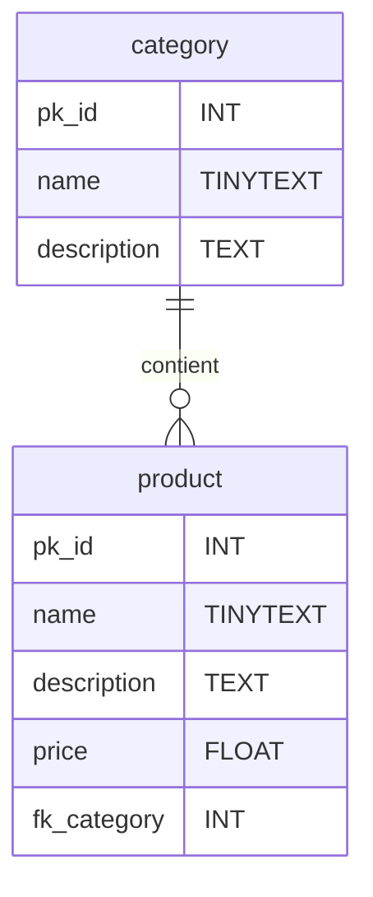
>- un barre vertical **|** signifie `one`, 
>- un cercle **O** signifie `zéro`,
>- la fourche **{** `Many` ou `N`
>- deux barre vérticale **||** signifie exclusivement `one`.


# Transcation SQL
En SQL par défaut toute requête envoyé est irréversible, il est possible de changer ça avec les commandes `START TRANSACTION`, `COMMIT`, `ROLLBACK`.

Une transaction permet d'envoyer des requêtes puis de les valider avec `COMMIT` ou de les annuler avec `ROLLBACK`.

```sql
mysql> START TRANSACTION;

mysql> ROLLBACK; # Toutes les requêtes faites depuis START sont annulées.

mysql> COMMIT; # Applique définitivement les requêtes faites depuis le START.
```

## Fonction SQL
En SQL il existe des fonctions inclues dans le langage pour effectuer des actions comme : la moyenne, la concaténation, la somme, l'arrondi à l'entité suppérieur etc...
Vous trouverez une liste des fonctions disponible pour MySQL ici : https://www.w3schools.com/sql/sql_ref_mysql.asp

Voici les plus communes : 
- `SUM(val1,val2,val3, ...) `: la somme de plusieurs valeurs.
- `AVG(val1,val2,val3, ...)` : La moyenne ou *average* de plusieurs valueurs.
- `COUNT(column_name)` : dans un SELECT renvoi le nombre d'élément plutot que la colonne.
- `CONCAT(text1,text2,...)` : Concaténe les textes entre eux.

## Idée TP
- Exercices à partir d'une BDD à importer
- TP Shoe_shoes : Diagramme de cas d'utilisation fournis (travail de groupe de 3 avec rendu de projet séparés)
    - CRUD
    - définir les tables
    - définir les relation entre les tables
    - Créer la base et la tester
    - OBJECTIF - Application PHP  MVC 
    - OBJECTIF - Application PHP  API REST
- TP Pokedex : Diagramme de cas d'utilisation à faire à partir d'un entretien (travail de groupe de 3 avec rendu de projet séparés)
    - CRUD
    - définir les tables
    - définir les realtions entre les tables
    - Créer la base et la tester
    - OBJECTIF - Application PHP  MVC 
    - OBJECTIF - Application PHP  API REST
