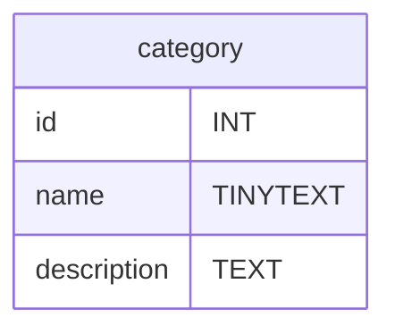
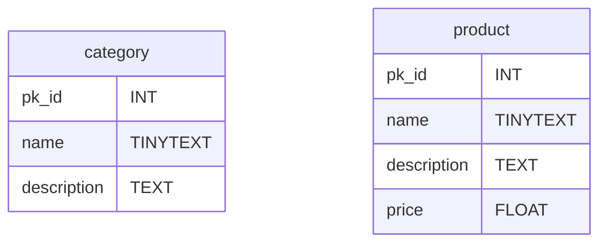
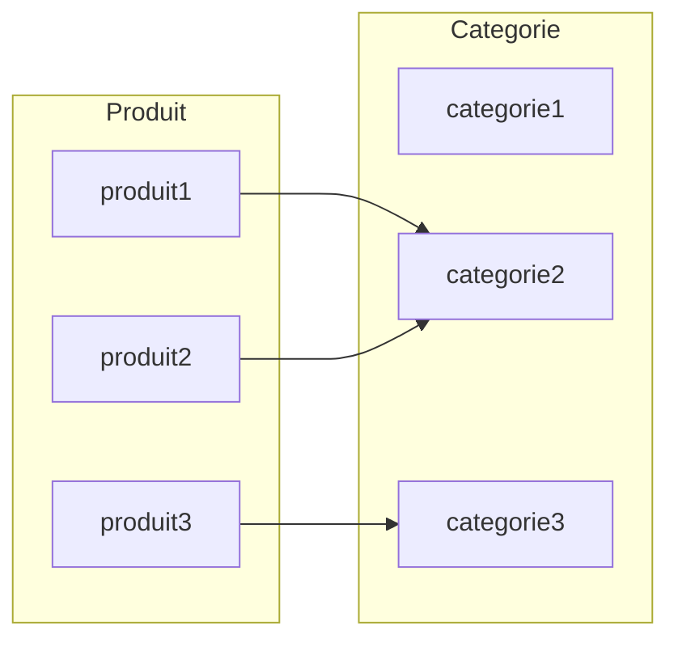
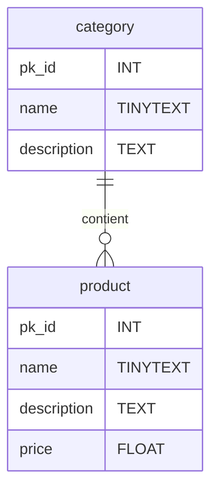

# SQL - Le Langage SQL
Une fois que vous avez accès à un serveur mysql vous devait avoir un invité de commande pour ecrire vos requête SQL similaire à celui ci :
```sql
mysql>
```
Pour la suite du cours j'ometterai l'ecrirture du prompt `mysql>`.
# Un tour du SQL
Ici vous retrouvez un inventaire rapide des requêtes les plus importantes du langage SQL. Il en existe bien d'autres très importantes mais celle représente les bases à avoir pour accèder à vos tables SQL.

> Par convention en SQL les mots en MAJUSCULE sont les mots réservés du langage.

Pour la suite du tour nous prendrons comme exemple une boutique de vente en ligne de chaussures nommée : *shoe-shop.com*.
## CREATE DATABASE - Créer un base de donnée
**Syntaxe :**
```sql
CREATE DATABASE database_name;
```
**Exemple :**
```sql
CREATE DATABASE shoe_shop;
```
Cette base de donnée contiendra les tables de l'entiéreté de la boutique en ligne.

### Lister les databases;
**Syntaxe:**
```sql
SHOW DATABASES;
```

## USE Accèder à la base de donnée
`USE` permet d'accéder à une base de donnée pour ensuite y créer,modifier ou supprimer des tables.
#### **Cette requête est obligatoire pour le fonctionnement des requêtes suivantes !**
```sql
USE shoe_shop;
```
## CREATE TABLE - Créer une table de donnée
Une table de donnée est défini par des colonnes et chaque colonne est défini par un nom et un type de donnée SQL.
Plus d'infos sur les types de données SQL ici : https://dev.mysql.com/doc/refman/8.0/en/data-types.html.

Egalement **un résumé des types de données les plus commun** ici : https://www.w3schools.com/sql/sql_datatypes.asp

**Syntaxe :**
```sql
CREATE TABLE table_name (
    column_name1 datatype,
    column_name2 datatype,
    column_name3 datatype,
    ...
    );
```
**Exemple :**
```sql
CREATE TABLE category(
    id INT PRIMARY KEY AUTO_INCREMENT,
    name TINYTEXT,
    description TEXT,
);
```
> `INT` signifie integer soit un nombre entier c'est le type de la colonne `id`.

> `PRIMARY KEY AUTO_INCREMENT` défini la colonne id comme etant l'identifiant des catégorie, chaque categorie possède un identifiant numérique unique. La majorité des tables SQL force leurs elements à avoir un identifiant unique. Celà simplifie l'accès au element et permet la mise en relation de table.

**Résultat :**


### Clé primaire et clé étrangère
Les élement d'une table SQL sont identifiés par leurs clé primaire cette clé est un INT défini grâce à la commande `PRIMARY KEY`.
Une clé primaire peut être réferencé dans la colonnes d'une autre table si les deux tables sont liés, on appel celà une clé étrangère.

**Création de la table produits :**
```sql
CREATE TABLE product(
    id INT PRIMARY KEY AUTO_INCREMENT,
    name TINYTEXT,
    description TEXT,
    price FLOAT,
    categoryId INT,
    FOREIGN KEY (categoryId) REFERENCES category(id)
    );
```
**Ajout d'un élement:**
```sql
mysql> SELECT id,name from category;
+----+----------+
| id | name     |
+----+----------+
|  1 | sneakers | # La catégorie "sneakers" a pour clé primaire 1
+----+----------+
1 row in set (0,00 sec)

mysql> INSERT INTO product (name,description,price,categoryId) VALUES(
    "Adidas stansmith 42",
    "Blabla",
    99.99,
    1       # Je fournis 1 en temps que clé étrangère
);
Query OK, 1 row affected (0,02 sec)
```
> Si j'avais écrit 5 en tant que clé étrangère alors qu'aucune categorie n'a 5 comme id, SQL m'aurait renvoyé une erreur.

## DESCRIBE, connaitre la structure d'une table
**Syntaxe :**
```sql
DESCRIBE table_name;
```
**Exemple :**
```sql
DESCRIBE category;
```

## INSERT INTO

```sql
INSERT INTO category (name,description) VALUES (
    "sneakers",
    "Chaussures unisexe pour la vie quotidien."
    );
```
> La colonne `id` est `AUTO_INCREMENT`, c'est MySQL qui défini sa valeur il ne faut donc pas la fournir à la création.

## SELECT ... FROM
Selectionner certaine colonnes d'une table.
```sql
SELECT name,description FROM category;
```
Selectionner toutes les colonnes.
```sql
SELECT * FROM category;
```
> Notez bien que l'on parle de *selection* et pas d'*affichage*, SQL n'à pas vocation à afficher quoi que soit. Au final les données seront envoyées dans un `Array` PHP, JavaScript ou autre puis éventuellement affichées dans le front-end.

## Filtrer la selection avec les conditions
### WHERE
```sql
# Test egalité
SELECT * FROM category WHERE name = "sneakers"; 
SELECT * FROM category WHERE id = 1;

# ET Logique
SELECT * FROM product WHERE price > 10 AND price < 50;

# Test selon un pattern
SELECT * FROM category WHERE name LIKE "s%"; # name commence par 's'
SELECT * FROM category WHERE name LIKE "%s"; # name fini par 's'
SELECT * FROM category WHERE description LIKE "%vie%"; # name contient 'vie'
```
On peut imaginer utiliser `LIKE` pour la requête d'une barre de recherche par exemple, plus d'info ici : https://www.w3schools.com/mysql/mysql_like.asp.

### ORDER BY
Toutes les catégories dans l'ordre alphabétique
```sql
SELECT * FROM category ORDER BY name; 
```

Toutes les catégories dans l'ordre anti-alphabétique
```sql
SELECT * FROM category ORDER BY name DESC; 
```

### LIMIT
Selectionne les 10 premières lignes.
```sql
SELECT * FROM category LIMIT 10;
```

## DELETE
```sql
DELETE FROM category WHERE id = 2;
```

## UPDATE
```sql
UPDATE category SET name="Chaussure sneakers" WHERE name="sneakers";
```
## TRUNCATE TABLE, vider une table
```sql
TRUNCATE TABLE category;
```
## DROP TABLE, supprimer un table !
```sql
DROP TABLE category;
```
> **ATTENTION !** DROP TABLE supprime completement le contenu et la strucutre de la table ! Il n'en restera rien.

## ALTER TABLE, modifier la strucutre d'une table.
`ALTER` permet de rajouter, modifier ou supprimer une colonne d'une table.
Voir la doc W3S : https://www.w3schools.com/mysql/mysql_alter.asp
SYntaxe : 
```sql
ALTER TABLE table_name ALTER_OPTION ...;
```
### Ajouter une colonne
**Syntaxe :**
```sql
ALTER TABLE table_name ADD column_name datatype;
```
**Exemple :**
```sql
ALTER TABLE product ADD short_description TINYTEXT;
```

### Supprimer une colonne
**Syntaxe :**
```sql
ALTER TABLE table_name DROP column_name;
```
**Exemple :**
```sql
ALTER TABLE category DROP description;
```

### Modifier le type d'une colonne
```sql
ALTER TABLE table_name MODIFY COLUMN column_name datatype;
```
```sql
ALTER TABLE product MODIFY COLUMN short_description TEXT;
```

# Comprendre les BDD grâce au opérations CRUD.
Le **CRUD** (**C**reate, **R**ead, **U**pdate, **D**elete) désigne les quatre catégories d'opérations élementaire pour la persitance des données.

Le CRUD c'est :
- **Create**, *créer* une table, une base, inserer une ligne dans une table sont des actions de création.
- **Read**, *lire* le contenu d'une table, la structure d'une table, récupérer des données sont des actions de lecture.
- **Update**, *mettre à jour* le contenu d'une table, changer la structure d'une table, ajouter une nouvelle colonne, change le type de donnée d'une colonne, modifier une ligne de la table. Ce sont des actions de modifications.
- **Delete**, *supprimer* une table, une base, une ligne, une colonne. Ce sont des actions de suppression.

Lorsque vous convenez la patie persitance des données d'une logiciel vous devez identifier les différentes actions neccessaire sur votre base et dans quelle catégorie CRUD elle se situe pour en déduire votre BDD.

Pour une boutique en ligne on aurait par exemple : 
|Action|Type d'action(CRUD)|Requête SQL|
|-|-|-|
|Voir la page produit   |Read   |SELECT FROM    |
|Ajouter un produit     |Create |INSERT INTO    |
|Modifier un produit    |Update |UPDATE SET     |
|Changer un produit de catégorie|Update|UPDATE SET|
|Supprimer un produit   |Delete |DELETE FROM    |
||||
|Voir une catégorie     |Read   |SELECT FROM    |
|Ajouter une categorie  |Create |INSERT INTO    |
|Supprimer une categorie|Delete |DELETE FROM    |
|Modifier une categorie |Update |UPDATE SET     |

> Les actions défini dans le tableau plus haut sont défini à partir d'un diagramme de cas d'utilisateur UML.

Une fois les actions définis on repère les différentes tables principales de notre base de données. 
Pour shoe-shop.com les tables `category` et `product` auquelles on rajoute les clés primaires et les colonnes spécifique à chaque tables.

# Relations entre les tables
Une fois la structure élementaires des tables défini il faut réflechir au relations en les tables.
> La structure élementaire c'est : les colonnes inérente à l'entité representé par la table (un produit, une catégorie, une voiture) et une clé primaire.

Les relations entre les tables SQL sont défini par les liaisons entre les clés primaires et clés étrangères, il existe 3 types de liaisons :
- **One to Many**, une clé primaire est présente dans la clé étrangère de plusieurs ligne d'une même table. Par exemple la clé primaire d'une catégorie peut être présente dans la clé étrangère de plusieurs ligne de la table product. *One primary key for many foreigner key.*
- **One to One**, une clé primaire est présente dans la clé étrangère d'une seul et unique ligne d'une autre table. Par exemple une table de client dont la clé primaire est présente dans une table de panier_client. Il n'existe qu'un seul panier par client et un seul client par panier. Pour pouvoir réaliser une liaison One to One il suffit de rajouter l'attribut `UNIQUE` à la clé étrangère. *One primary key for one foreigner key*
- **Many to Many**, c'est en quelque sorte une liaisons one to many dans les deux sens. Par exemple si notre produit peut avoir plusieurs catégories on à : plusieurs catégorie pour un produit et un produit pour plusieurs catégorie. Cette liaisons et un peu plus complexe et neccessite une troisième table appelée table de jointure pour être mise en place.

## La cardinalité
La cardinalité c'est le nombres de liens possibles d'une table à une autre.
**Exemple :**
Une table product et category ou chaque produit ne peut avoir qu'une seul catégorie et chaque catégorie peut etre lié à une infinité de produit.

La table produit à une cardinalité vers la table category de 1. C'est à dire que 1 produit ne peut avoir qu'une seul lien vers une seul catégorie.



La table category à une cardinalité de [0,N] ou N est un nombre entier potensiellement infini. C'est à dire que 1 category ne peut avoir entre 0 et N liens avec des produits.

La cardinalité permet de toruver quelle liaisons SQL utilisé pour nos tables. Ici on à donc,
- une liaison one product to one cateogry 
- une liaison zero category to Many product.
En SQL il faut donc utiliser la liaison One  to Many, on ne prend pas en compte le cas où aucune categorie n'est relié à un produit.

<!-- 
Les cardinalités sont des nombres qui précise les liaisons entre les tables. Elle sont définie via la question suivante, *"Une entité **verbe** combien de l'autre entitié et vis-versa ?"* où on remplace **verbe** par l'action qui lie les tables comme : à, contient, possède, fabrique, est, loue.

Par exemple
- Un produit contient combien de catégories ? Un produit contient **une** catégorie.
- Une catégorie contient combien de produits ? Une catégorie contient **zero ou plusieurs** produits.
Les tables produits et categorie ont donc une cardinalité de (1)---(0,N)où N represente une nombres indéfini de produit.

|caridinalité|symbole|
|-|-|
|(0,1)|\|o|
|(1)|\|\||
|(0,N)|o{|
|(1,N)|\|{|

Voici la cardinalités des tables category et product. 


En partant de la table category le schéma ce lis comme ceci : 
1. Une category
2. contient
3. 0 à N product o{

En partant de la table product le schéma ce lis comme ceci : 
1. Une product
2. contient
3. 1 category || -->
## Liaisons One to Many 
C'est la liaison la plus commune, j'ai une ligne est référence dans plusieurs lignes d'une autre table.


## Liaisons Many to Many
Plusieurs catégorie pour plusieurs Produits
## Liaisons One to One
1 Client pour 1 bon de commande
# TODO
- Relations entre les tables
    - Liaisons One to Many
    - Liaisons One to One
    - Liaisons Many to Many
- Transition
- Autentification MySQL
- UML Diagram

## Idée TP
- Exercices à partir d'une BDD à importer
- TP Shoe_shoes : Diagramme de cas d'utilisation fournis (travail de groupe de 3 avec rendu de projet séparés)
    - CRUD
    - définir les tables
    - définir les relation entre les tables
    - Créer la base et la tester
    - OBJECTIF - Application PHP  MVC 
    - OBJECTIF - Application PHP  API REST
- TP Pokedex : Diagramme de cas d'utilisation à faire à partir d'un entretien (travail de groupe de 3 avec rendu de projet séparés)
    - CRUD
    - définir les tables
    - définir les realtions entre les tables
    - Créer la base et la tester
    - OBJECTIF - Application PHP  MVC 
    - OBJECTIF - Application PHP  API REST
