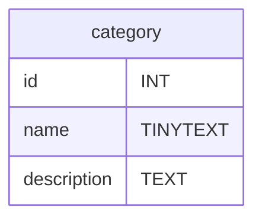
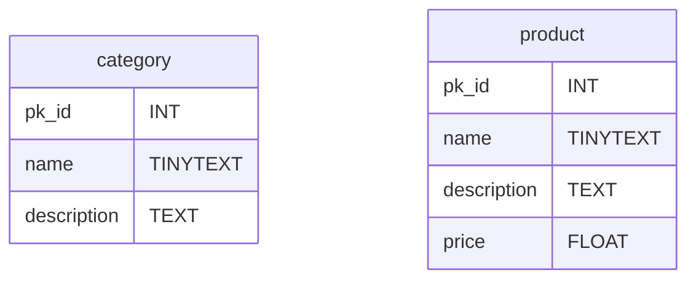
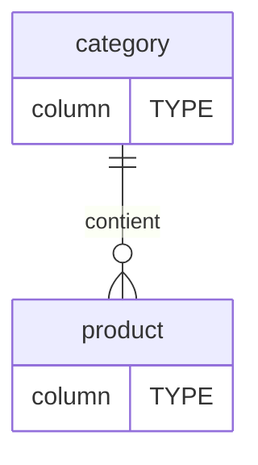
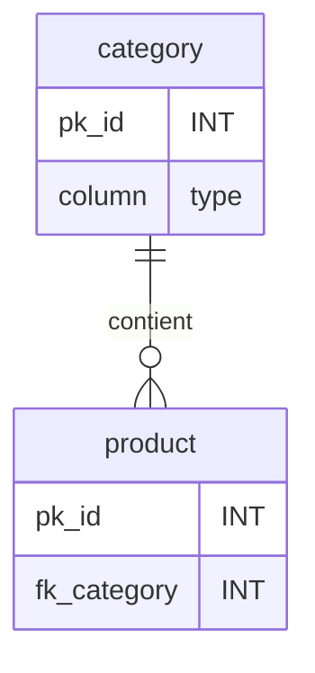
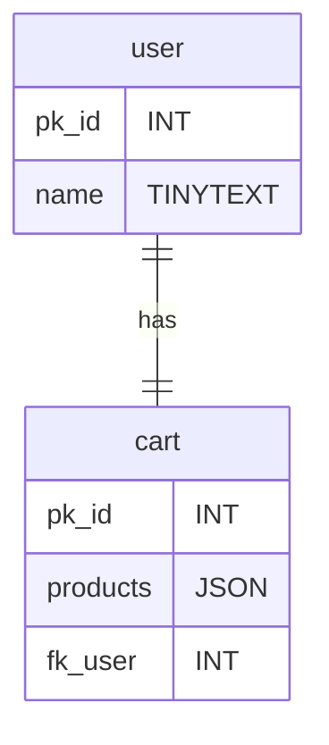
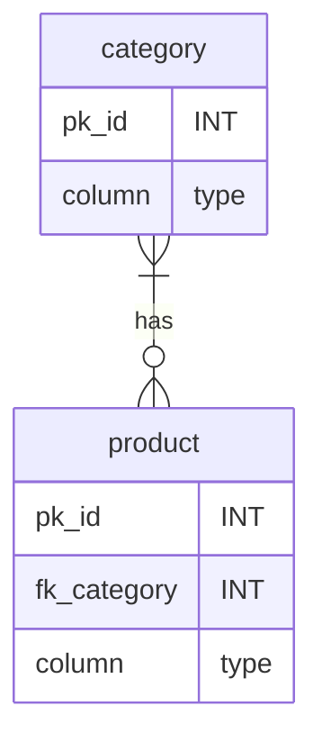
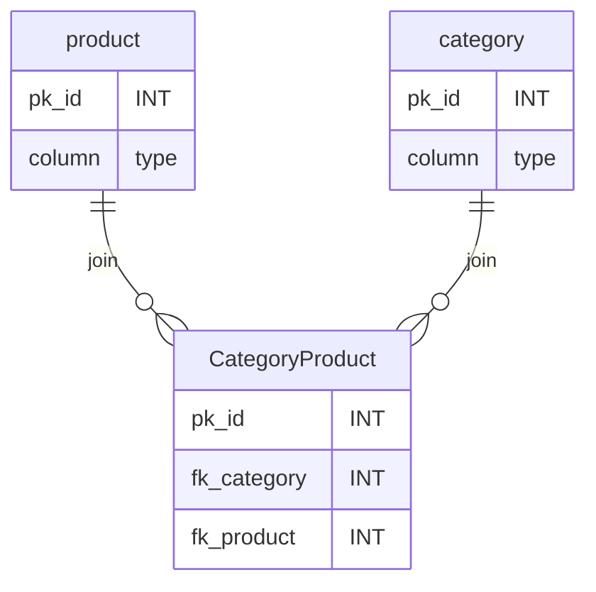
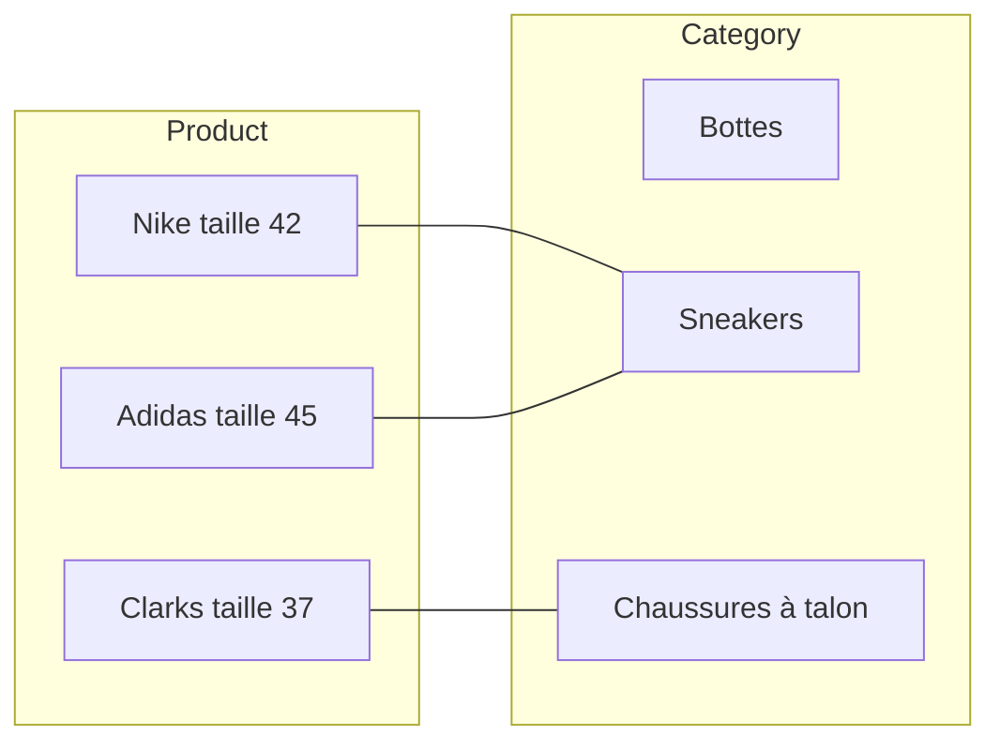
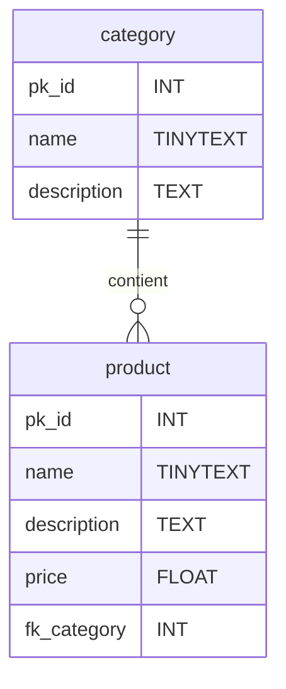

# SQL - Le Langage SQL
Lorsque que vous accédé à un serveur MySQL vous avez un invité de commande similaire à celui ci,
```sql
mysql>
```
Pour la suite du cours j'ometterai l'écriture du prompt `mysql>`.
# Un tour du SQL
Ici vous retrouverez un inventaire rapide des requêtes les plus importantes du langage SQL. Il en existe bien d'autres très importantes mais celle-ci représente les bases du SQL.

> Par convention en SQL les mots en MAJUSCULE sont les mots réservés du langage.

Pour la suite du tour nous prendrons comme exemple une boutique de vente en ligne de chaussures nommée : *shoe-shop.com*.
## CREATE DATABASE - Créer un base de donnée
**Syntaxe :**
```sql
CREATE DATABASE database_name;
```
**Exemple :**
```sql
CREATE DATABASE shoe_shop;
```
Cette base de donnée contiendra les tables de l'entiéreté de la boutique en ligne.

### Lister les databases;
**Syntaxe:**
```sql
SHOW DATABASES;
```

## USE Accèder à la base de donnée
`USE` permet d'accéder à une base de donnée pour ensuite y créer,modifier ou supprimer des tables.
#### **Cette requête est obligatoire pour le fonctionnement des requêtes suivantes !**
```sql
USE shoe_shop;
```
## CREATE TABLE - Créer une table de donnée
Une table de donnée est défini par des colonnes et chaque colonne est défini par un nom et un type de donnée SQL.
Plus d'infos sur les types de données SQL ici : https://dev.mysql.com/doc/refman/8.0/en/data-types.html.

Egalement **un résumé des types de données les plus commun** ici : https://www.w3schools.com/sql/sql_datatypes.asp

**Syntaxe :**
```sql
CREATE TABLE table_name (
    column_name1 datatype,
    column_name2 datatype,
    column_name3 datatype,
    ...
    );
```
**Exemple :**
```sql
CREATE TABLE category(
    id INT PRIMARY KEY AUTO_INCREMENT,
    name TINYTEXT,
    description TEXT,
);
```
> `INT` signifi integer soit un nombre entier, c'est le type de la colonne `id`.

`PRIMARY KEY AUTO_INCREMENT` défini la colonne id comme etant l'identifiant unique des catégories. La majorité des tables SQL force leurs élements à avoir un identifiant unique. Celà simplifie l'accès au élement et permet la mise en relation de table. 

**Résultat :**


### Clé primaire et clé étrangère
Les élement d'une table SQL sont identifiés par leurs clé primaire cette clé est un `INT` défini grâce à la commande `PRIMARY KEY`.
Une clé primaire peut être réferencé dans la colonnes d'une autre table si les deux tables sont liés, on appel celà une clé étrangère.

**Création de la table produits :**
Les produit référence la catégorie auquel il appartiennent grâce à une clé étrangère.

```sql
CREATE TABLE product(
    id INT PRIMARY KEY AUTO_INCREMENT,
    name TINYTEXT,
    description TEXT,
    price FLOAT,
    categoryId INT,
    FOREIGN KEY (categoryId) REFERENCES category(id)
    );
```


**Ajout d'un élement:**
```sql
mysql> SELECT id,name from category;
+----+----------+
| id | name     |
+----+----------+
|  1 | sneakers | # La catégorie "sneakers" a pour clé primaire 1
+----+----------+
1 row in set (0,00 sec)

mysql> INSERT INTO product (name,description,price,categoryId) VALUES(
    "Adidas stansmith 42",
    "Blabla",
    99.99,
    1       # Je fournis 1 en temps que clé étrangère
);
Query OK, 1 row affected (0,02 sec)
```
> Si j'avais écrit 5 en tant que clé étrangère alors qu'aucune categorie n'a 5 comme id, SQL m'aurait renvoyé une erreur.

## DESCRIBE, connaitre la structure d'une table
Pour savoir de quelles colonnes une table est faite utilisez la commande `DESCRIBE TABLE ...`
**Syntaxe :**
```sql
DESCRIBE table_name;
```
**Exemple :**
```sql
DESCRIBE category;
```

## INSERT INTO
Pour rajouter une ligne à ue table utilisez la commande `INSERT INTO ...`
**Syntaxe :**
```sql
INSERT INTO table_name (column_name1,column_name2) VALUES (
    column_value1,
    column_value2,
    );
```
**Exemple :**
```sql
INSERT INTO category (name,description) VALUES (
    "sneakers",
    "Chaussures unisexe pour la vie quotidien."
    );
```
> La colonne `id` est `AUTO_INCREMENT`, c'est MySQL qui défini sa valeur il ne faut donc pas la fournir à la création.

## SELECT ... FROM
Selectionner certaine colonnes d'une table.
```sql
SELECT name,description FROM category;
```
Selectionner toutes les colonnes.
```sql
SELECT * FROM category;
```
> Notez bien que l'on parle de *selection* et pas d'*affichage*, SQL n'à pas vocation à afficher quoi que soit. Au final les données seront envoyées dans un `Array` PHP, JavaScript ou autre puis éventuellement affichées dans le front-end.

## Filtrer la sélection avec les conditions
### WHERE
```sql
# Test egalité
SELECT * FROM category WHERE name = "sneakers"; 
SELECT * FROM category WHERE id = 1;

# ET Logique
SELECT * FROM product WHERE price > 10 AND price < 50;
# OU Logique
SELECT * FROM product WHERE price < 10 OR price > 50;

# Test selon un pattern
SELECT * FROM category WHERE name LIKE "s%"; # name commence par 's'
SELECT * FROM category WHERE name LIKE "%s"; # name fini par 's'
SELECT * FROM category WHERE description LIKE "%vie%"; # name contient 'vie'
```
On peut imaginer utiliser `LIKE` pour la requête d'une barre de recherche par exemple, plus d'info ici : https://www.w3schools.com/mysql/mysql_like.asp.

### ORDER BY
Toutes les catégories dans l'ordre alphabétique
```sql
SELECT * FROM category ORDER BY name; 
```

Toutes les catégories dans l'ordre anti-alphabétique
```sql
SELECT * FROM category ORDER BY name DESC; 
```

### LIMIT
Selectionne les 10 premières lignes.
```sql
SELECT * FROM category LIMIT 10;
```

## DELETE - Supprimer une ligne
```sql
DELETE FROM category WHERE id = 2;
```

## UPDATE - modifier une ligne
```sql
UPDATE category SET name="Chaussure sneakers" WHERE name="sneakers";
```
## TRUNCATE TABLE, vider une table
Vide tout le contenu de la table category et conserve la table.
```sql
TRUNCATE TABLE category;
```
## DROP TABLE, supprimer un table !
```sql
DROP TABLE category;
```
> **ATTENTION !** DROP TABLE supprime completement le contenu et la strucutre de la table ! Il n'en restera rien.

## ALTER TABLE, modifier la structure d'une table.
`ALTER` permet de rajouter, modifier ou supprimer une colonne d'une table.
Voir la doc W3S : https://www.w3schools.com/mysql/mysql_alter.asp

**Syntaxe :**
```sql
ALTER TABLE table_name ALTER_OPTION ...;
```
### Ajouter une colonne
**Syntaxe :**
```sql
ALTER TABLE table_name ADD column_name datatype;
```
**Exemple :**
```sql
ALTER TABLE product ADD short_description TINYTEXT;
```

### Supprimer une colonne
**Syntaxe :**
```sql
ALTER TABLE table_name DROP column_name;
```
**Exemple :**
```sql
ALTER TABLE category DROP description;
```

### Modifier le type d'une colonne
```sql
ALTER TABLE table_name MODIFY COLUMN column_name datatype;
```
```sql
ALTER TABLE product MODIFY COLUMN short_description TEXT;
```

# Comprendre les BDD grâce au opérations CRUD.
Le **CRUD** (**C**reate, **R**ead, **U**pdate, **D**elete) désigne les quatre catégories d'opérations élementaire pour la persitance des données.

Le CRUD c'est :
- **Create**, *créer* une table, une base, inserer une ligne dans une table sont des actions de création.
- **Read**, *lire* le contenu d'une table, la structure d'une table, récupérer des données sont des actions de lecture.
- **Update**, *mettre à jour* le contenu d'une table, changer la structure d'une table, ajouter une nouvelle colonne, change le type de donnée d'une colonne, modifier une ligne de la table. Ce sont des actions de modifications.
- **Delete**, *supprimer* une table, une base, une ligne, une colonne. Ce sont des actions de suppression.

Lorsque vous convenez la patie persitance des données d'une logiciel vous devez identifier les différentes actions neccessaire sur votre base et dans quelle catégorie CRUD elle se situe pour en déduire votre BDD.

Pour une boutique en ligne on aurait par exemple : 
|Action|Type d'action(CRUD)|Requête SQL|
|-|-|-|
|Voir la page produit   |Read   |SELECT FROM    |
|Ajouter un produit     |Create |INSERT INTO    |
|Modifier un produit    |Update |UPDATE SET     |
|Changer un produit de catégorie|Update|UPDATE SET|
|Supprimer un produit   |Delete |DELETE FROM    |
||||
|Voir une catégorie     |Read   |SELECT FROM    |
|Ajouter une categorie  |Create |INSERT INTO    |
|Supprimer une categorie|Delete |DELETE FROM    |
|Modifier une categorie |Update |UPDATE SET     |

> Les actions défini dans le tableau plus haut sont défini à partir d'un diagramme de cas d'utilisateur UML.

Une fois les actions définis on repère les différentes tables principales de notre base de données. 
Pour shoe-shop.com les tables `category` et `product` auquelles on rajoute les clés primaires et les colonnes spécifique à chaque tables.

# Relations entre les tables
Une fois la structure élementaires des tables défini il faut réflechir au relations entre les tables.
> La structure élementaire d'une table ce sont la colonne clé primaire et les colonnes inérente à l'entité representé par la table (un produit, une catégorie, une voiture).

Les relations entre les tables SQL sont défini par les liaisons entre les clés primaires et clés étrangères, il existe 3 types de liaisons :
- **One to Many**, Un élement est référencé dans plusieurs élements d'une autre table. Un categorie est referencé dans plusieurs produits de la table product.
- **One to One**, un élement est référencé dans un seul et unique element d'une autre table. Un utilisateur est référencé dans un seul et unique element de la table panier ou encore un citoyen n'est referencé dans un seul et unique element de la table carte_vitale.
- **Many to Many**, ce n'est pas une liaison mais un ensemble de deux liaisons. Quand deux table sont lié via une liaison one to many dans les deux sens alors on à une liaison Many to Many.

> Dans les cas des liaisons One to Many et One to One les tables sont connectés dans l'autre sens par une liaisons One to One.

Les relations entre les tables sont théoriques et leurs applications en langage SQL permet de les créer, nous verrons la manière de mettre en place ces liaisons en SQL plus tard.

## Diagrame d'entitié relations des relations
Pour representé les relations entre les tables on utilise un diagramme UML dit d'entité relation (ER).
> Une entité c'est simplement un element de la table.

Voici à quoi ressemble un diagramme ER.

Les deux table sont relié par une ligne qui défini la relation de la table category envers la table product et de la table product envers la table category.
Le mot du centre est un verbe que l'on place pour préseide le lien qui est fait entre ces deux tables.

On lit  : **" One category contient `Zero` or `Many` product"**.
On lit aussi : **"One product contient `One` category"**.

>La lecture commence toujours par "One ..."
### Les symboles
|Value|Image|
|-|-|
|`One`||
|`Many`||
|`Zero`||
|`One ou Zero`||
|`Zero ou Many`||
|`One ou Many`||

> #### **Attention !**
> Ne confondez pas le symbole `One` avec le début de phrase One. Le premier One est toujours là et ne viens pas d'un symbole.
>```mermaid
>erDiagram
>    category ||--o{ product : contient
>    category {
>        column TYPE
>    }
>    product {
>        column TYPE
>    }
>```
>Dans ce schéma je dis : One product contient One category même si le symbole collé à la table product est `Zero ou Many`, c'est une erreur courante dans la lecture de diagramme mais la phrase commence toujours par One ... peut importe le symbole après la table.
> **Imaginez les liaisons comme des harpons le symbole qui compte est au bout du harpon pas au début !**
>
### One to Many
La clé étrangère sur la table ciblé par le symbole`Many`, ici la table product.

#### Implémentation
Soit la table category : 
```sql
mysql> describe category;
+-------------+----------+------+-----+---------+----------------+
| Field       | Type     | Null | Key | Default | Extra          |
+-------------+----------+------+-----+---------+----------------+
| id          | int      | NO   | PRI | NULL    | auto_increment |
| name        | tinytext | YES  |     | NULL    |                |
| description | text     | YES  |     | NULL    |                |
+-------------+----------+------+-----+---------+----------------+
3 rows in set (0,00 sec)
```
A la création de la table product il vous faut définir un colonne comme étant une clé étrangère de la table categorie.
```sql
CREATE TABLE product(
    id INT PRIMARY KEY AUTO_INCREMENT,
    name TEXT,
    price FLOAT,
    fk_category INT,
    FOREIGN KEY (fk_category) REFERENCES category(id)
);
```

### One to One 
La clé étrangère soit être sur la table ciblé par `One` et elle doit être `UNIQUE`, la clé primaire est déjà par défaut unique.

#### Implémentation
```sql
CREATE TABLE user(
    pk_id INT PRIMARY KEY AUTO_INCREMENT,
    name TINYTEXT
);
CREATE TABLE cart(
    pk_id  INT PRIMARY KEY AUTO_INCREMENT,
    products JSON,
    fk_user INT UNIQUE,
    FOREIGN KEY (fk_user) REFERENCES user(pk_id)
);
```
Chaque element de la colonne cart.fk_user doit etre `UNIQUE` donc il ne pourra jamais avoir deux paniers qui réferences le même utilisateur. ;)

### Many to Many
Pour effectuer une relation Many to Many, une troisème table doit être créer elle contient : une primary key, la clé étrangère de la table A et la clé étrangère de la table B.

Imaginons qu'un produit ai plusieurs categories.

> Rappel en SQL peut importe que le cardinal soit [0...N] ou [1...N] c'est un liaison `Many`.

Comment faire car un clé étrangère ne peut contenir qu'une seul clé primaire et mon produit doit maintenant en contenir plusieurs.
Il nous faut une troisème table.

#### La table de jointure.
Une table de jointure est une table qui ne represente pas une entité réel concrete de notre application mais sert simplement à mettre en place la liaison Many to Many, voyez cela comme une table "utilitaire".

Une table de jointure doit contenir le moins de chose possible elle n'a pas vocation à faire plus que joindre deux table.
Elle possède comme colonnes minimales :
- Une clé primaire, comme toute table SQL.
- Une clé etrangère de la table A
- une clé étrange de la table B.

>Par convention les tables de jointure on pour nom le nom des deux tables concaténés en CamelCase.

Pour les tables category et product :

#### Implémentation Many to Many
```sql
CREATE TABLE category(
    pk_id INT PRIMARY KEY AUTO_INCREMENT,
    name TINYTEXT
);
CREATE TABLE product(
    pk_id  INT PRIMARY KEY AUTO_INCREMENT,
    name TINYTEXT,
    price FLOAT
);
CREATE TABLE CategoryProduct(
    pk_id  INT PRIMARY KEY AUTO_INCREMENT,
    fk_category INT,
    fk_product INT,
    FOREIGN KEY (fk_category) REFERENCES category(pk_id)
    FOREIGN KEY (fk_product) REFERENCES product(pk_id)
);
```
#### Ajouter un produit à une catégorie 
Pour rajouter un produit à une catégorie il suffit d'inserer une nouvelle entrée dans la table CategoryProduct avec l'id du produit concerné et de la categorie dont il fait maintenant partie avec `INSERT INTO`.


## La cardinalité
La cardinalité c'est le nombres de liens possibles d'une table à une autre. Elle permet de choisi entre les choisirs quelque symbole utiliser dans notre diagramme d'entité relation.

Définir la cardinalité de deux tables ce fait en deux étapes :
1. Connaitre la cardinalité de la table A vers la table B :
    - Combien de lien un element de A peut avoir au maximum vers une element de B ?
    - Combien de lien un element de A peut avoir au minimum vers une un element de B ?
    - Quelle liaison cela donne t-il : One to One ou One to Many ?
2. Dans l'autre sens il faut maintant connaitre la cardinalité de la table B vers la table A :
    - Combien de lien un element de B peut avoir au maximum vers une element de A ?
    - Combien de lien un element de B peut avoir au minimum vers une un element de A ?
    - Quelle liaison cela donne t-il : One to One ou One to Many ?
3. La liaison qui contien Many est la liaison qui défini la relation entre les table.
    - Si il y a deux One to One alors la relation est One to One.
    - Si il y a un et uniquement un One to Many alors la relation est One to Many.
    - Si il y a deux One to Many alors la relation est Many to Many.


**Exemple :**
Voici les tables `product` et `category` où chaque produit ne peut avoir qu'une seule catégorie et chaque catégorie peut etre lié à une infinité de produit.



1. Connaitre la cardinalité de la table `produit` vers la table `categorie` :
    - Combien de lien un produit peut avoir au maximum vers une categorie ?
    **Réponse : 1.**
    - Combien de lien un produit peut avoir au minimum vers une categorie ?
    **Réponse : 1.**
    - Quelle liaison cela donne t-il : One to One ou One to Many ?
    **Réponse : One to `One` car on a un produit pour une categorie.**
2. Dans l'autre sens il faut maintant connaitre la cardinalité de la categorie vers la produit :
    - Combien de lien une categorie peut avoir au maximum vers un produit ?
    **Réponse : N (une nombre entier positif infini)**
    - Combien de lien une categorie peut avoir au minimum vers un produit ?
    **Réponse : 0**
    - Quelle liaison cela donne t-il : One to One ou One to Many ?
    **Réponse : One to `Many`** car il peut y avoir entre O et N produits donc plusieurs (many) produits.

3. **La relation de `product` vers `category` est donc One to Many**.


>- un barre vertical **|** signifie `one`, 
>- un cercle **O** signifie `zéro`,
>- la fourche **{** `Many` ou `N`
>- deux barre vérticale **||** signifie exclusivement `one`.


# Transcation SQL
En SQL par défaut toute requête envoyé est irréversible, il est possible de changer sa avec les commande `START TRANSACTION`, `COMMIT`, `ROLLBACK`.
```sql
mysql> START TRANSACTION; # Toutes les requêtes après START sont temporaires.

mysql> ROLLBACK; # Toutes les requêtes faites depuis START sont annulées.

mysql> COMMIT; # Applique définitivement les requêtes faites depuis le START.
```

## Idée TP
- Exercices à partir d'une BDD à importer
- TP Shoe_shoes : Diagramme de cas d'utilisation fournis (travail de groupe de 3 avec rendu de projet séparés)
    - CRUD
    - définir les tables
    - définir les relation entre les tables
    - Créer la base et la tester
    - OBJECTIF - Application PHP  MVC 
    - OBJECTIF - Application PHP  API REST
- TP Pokedex : Diagramme de cas d'utilisation à faire à partir d'un entretien (travail de groupe de 3 avec rendu de projet séparés)
    - CRUD
    - définir les tables
    - définir les realtions entre les tables
    - Créer la base et la tester
    - OBJECTIF - Application PHP  MVC 
    - OBJECTIF - Application PHP  API REST
