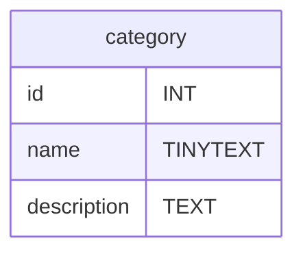

# SQL - Le Langage SQL
Une fois que vous avez accès à un serveur mysql vous devait avoir un invité de commande pour ecrire vos requête SQL similaire à celui ci :
```sql
mysql>
```
Pour la suite du cours j'ometterai l'ecrirture du prompt `mysql>`.
# Un tour du SQL
Ici vous retrouvez un inventaire rapide des requêtes les plus importantes du langage SQL. Il en existe bien d'autres très importantes mais celle représente les bases à avoir pour accèder à vos tables SQL.

> Par convention en SQL les mots en MAJUSCULE sont les mots réservés du langage.

Pour la suite du tour nous prendrons comme exemple une boutique de vente en ligne de chaussures nommée : *shoe-shop.com*.
## CREATE DATABASE - Créer un base de donnée

```sql
CREATE DATABASE database_name;
```
```sql
CREATE DATABASE shoe_shop;
```
Cette base de donnée contiendra les tables de l'entiéreté de la boutique en ligne.

### Lister les databases;
```sql
SHOW DATABASES;
```

## USE Accèder à la base de donnée
`USE` permet d'accéder à une base de donnée pour ensuite y créer,modifier ou supprimer des tables.
#### **Cette requête est obligatoire pour le fonctionnement des requêtes suivantes !**
```sql
USE shoe_shop
```
## CREATE TABLE - Créer une table de donnée
Une table de donnée est défini par des colonnes et chaque colonne est défini par un nom et un type de donnée SQL.
Plus d'infos sur les types de données SQL ici : https://dev.mysql.com/doc/refman/8.0/en/data-types.html.

Egalement **un résumé des types de données les plus commun** ici : https://www.w3schools.com/sql/sql_datatypes.asp

**Syntaxe :**
```sql
CREATE TABLE table_name (
    column_name1 datatype,
    column_name2 datatype,
    column_name3 datatype,
    ...
    );
```
**Exemple :**
```sql
CREATE TABLE category(
    id INT PRIMARY KEY AUTO_INCREMENT,
    name TINYTEXT,
    description TEXT,
);
```
> `INT` signifie integer soit un nombre entier c'est le type de la colonne `id`.

> `PRIMARY KEY AUTO_INCREMENT` défini la colonne id comme etant l'identifiant des catégorie, chaque categorie possède un identifiant numérique unique. La majorité des tables SQL force leurs elements à avoir un identifiant unique. Celà simplifie l'accès au element et permet la mise en relation de table.

**Résultat :**

<!-- ```sql
CREATE TABLE product (
    id INT PRIMARY KEY AUTO_INCREMENT,
    name TINYTEXT,
    description TEXT,
    price FLOAT(5,2),
    category INT FOREIGN KEY,
    ...
    );
``` -->

## DESCRIBE, connaitre la structure d'une table
```sql
DESCRIBE category;
```

## INSERT INTO

```sql
INSERT INTO category (name,description) VALUES ("sneakers","Chaussures unisexe pour la vie quotidien.");
```

## SELECT FROM
Selectionner certaine colonnes d'une table.
```sql
SELECT name,description FROM category;
```
Selectionner toutes les colonnes.
```sql
SELECT * FROM category;
```
> Notez bien que l'on parle de *selection* et pas d'*affichage*, SQL n'à pas vocation à afficher quoi que soit. Au final les données seront envoyées dans un `Array` PHP, JavaScript ou autre puis éventuellement affichées dans le front-end.

## Filtrer la selection avec les conditions
### WHERE
```sql
SELECT * FROM category WHERE name = "sneakers"; 
SELECT * FROM category WHERE id = 1;
SELECT * FROM category WHERE name LIKE "s%"; # name commence par 's'
SELECT * FROM category WHERE name LIKE "%s"; # name fini par 's'
SELECT * FROM category WHERE description LIKE "%vie%"; # name contient 'vie'
```
On peut imaginer utiliser `LIKE` pour la requête d'une barre de recherche par exemple, plus d'info ici : https://www.w3schools.com/mysql/mysql_like.asp.

### ORDER BY
Toutes les catégories dans l'ordre alphabétique
```sql
SELECT * FROM category ORDER BY name; 
```

Toutes les catégories dans l'ordre anti-alphabétique
```sql
SELECT * FROM category ORDER BY name DESC; 
```

### LIMIT
Selectionne les 10 premières lignes.
```sql
SELECT * FROM category LIMIT 10;
```

## DELETE
```sql
DELETE FROM category WHERE id = 2;
```

## UPDATE
```sql
UPDATE category SET name="Chaussure sneakers" WHERE name="sneakers";
```
## TRUNCATE TABLE, vider une table
```sql
TRUNCATE TABLE category;
```
## DROP TABLE, supprimer un table !
```sql
DROP TABLE category;
```
> **ATTENTION !** DROP TABLE supprime completement le contenu et la strucutre de la table ! Il n'en restera rien.

## ALTER TABLE, modifier la strucutre d'une table.
Voir la doc W3S : https://www.w3schools.com/mysql/mysql_alter.asp

# TODO
- Les PRIMARY KEY
- Create - Ecriture
- Read - Lecture
- Update - Ecriture
- Delete - Ecriture
- Relations entre les tables
    - Liaisons One to Many
    - Liaisons One to One
    - Liaisons Many to Many
- Transition
- Autentification MySQL
- UML Diagram