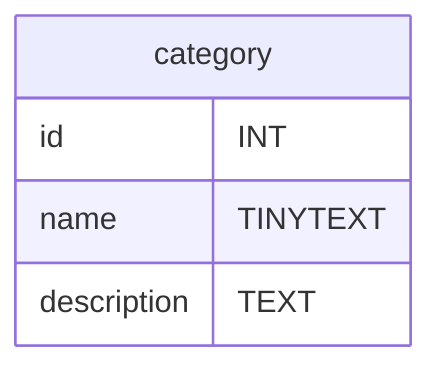

# SQL - Le Langage SQL
Une fois que vous avez accès à un serveur mysql vous devait avoir un invité de commande pour ecrire vos requête SQL similaire à celui ci :
```sql
mysql>
```
Pour la suite du cours j'ometterai l'ecrirture du prompt `mysql>`.
# Un tour du SQL
Ici vous retrouvez un inventaire rapide des requêtes les plus importantes du langage SQL. Il en existe bien d'autres très importantes mais celle représente les bases à avoir pour accèder à vos tables SQL.

> Par convention en SQL les mots en MAJUSCULE sont les mots réservés du langage.

Pour la suite du tour nous prendrons comme exemple une boutique de vente en ligne de chaussures nommée : *shoe-shop.com*.
## CREATE DATABASE - Créer un base de donnée

```sql
CREATE DATABASE database_name;
```
```sql
CREATE DATABASE shoe_shop;
```
Cette base de donnée contiendra les tables de l'entiéreté de la boutique en ligne.

## CREATE TABLE - Créer une table de donnée
Une table de donnée est défini par des colonnes et chaque colonne est défini par un type SQL.
Plus d'infos sur les types de données SQL : https://dev.mysql.com/doc/refman/8.0/en/data-types.html
**Syntaxe :**
```sql
CREATE TABLE table_name (
    column_name1 datatype,
    column_name2 datatype,
    column_name3 datatype,
    ...
    );
```
**Exemple :**
```sql
CREATE TABLE category(
    id INT PRIMARY KEY AUTO_INCREMENT,
    name TINYTEXT,
    description TEXT,
);
```
**Résultat :**

> PRIMARY KEY défini la colonne id comme etant l'identifiant des catégorie
<!-- ```sql
CREATE TABLE product (
    id INT PRIMARY KEY AUTO_INCREMENT,
    name TINYTEXT,
    description TEXT,
    price FLOAT(5,2),
    category INT FOREIGN KEY,
    ...
    );
``` -->


# TODO
- Un tour du SQL avec MYSQL
    - CREATE DATABASE
    - USE
    - CREATE TABLE
    - DESCRIBE
    - INSERT INTO
    - SELECT FROM WHERE ORDER BY LIMIT
    - DELETE FROM 
    - UPDATE TABLE
    - DROP TABLE
    - TRUNCATE TABLE
    - ALTER TABLE
- Les PRIMARY KEY
- Create - Ecriture
- Read - Lecture
- Update - Ecriture
- Delete - Ecriture
- Relations entre les tables
    - Liaisons One to Many
    - Liaisons One to One
    - Liaisons Many to Many
- Transition
- Autentification MySQL
- UML Diagram